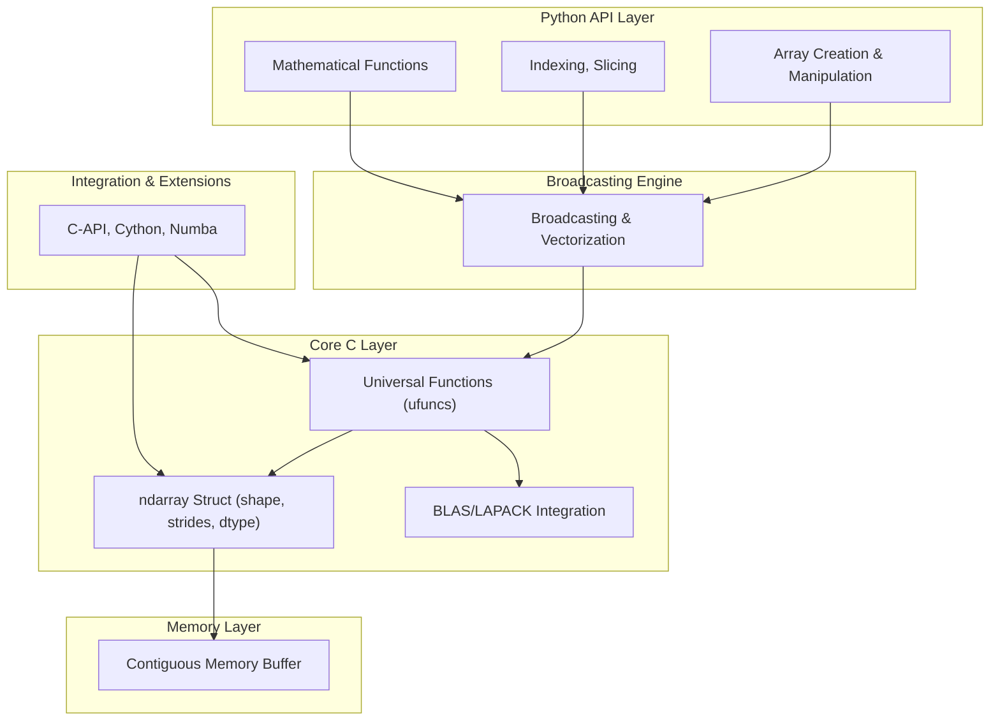

# Table of Contents (TOC) for the NumPy Book

---

## Part 1: Introduction and Core Concepts

- **1.1 What is NumPy? History and Purpose**
    
- **1.2 NumPy Architecture and Design Philosophy**
    
- **1.3 How NumPy Works Under the Hood**
    
- **1.4 Memory Layout: Contiguous Arrays and Strides**
    
- **1.5 Broadcasting and Vectorization Explained**
    
- **1.6 Why NumPy is Fast and Efficient**
    
- **1.7 Alternatives to NumPy**
    
- **1.8 Building a Mini-NumPy from Scratch (Concept & Code)**
    

---

## Part 2: NumPy Functions & Syntax Cheat Sheet

- **2.1 Creating Arrays: Different Methods**
    
- **2.2 Array Indexing, Slicing, and Iteration**
    
- **2.3 Array Manipulation: Reshape, Transpose, Flatten**
    
- **2.4 Mathematical Operations: Universal Functions (ufuncs)**
    
- **2.5 Linear Algebra Functions (dot, cross, svd, eig)**
    
- **2.6 Random Module Overview and Examples**
    
- **2.7 Common Mistakes and Pitfalls**
    

---

## Part 3: Applications & Use Cases

- **3.1 Vector and Matrix Algebra**
    
- **3.2 Calculus and Numerical Integration**
    
- **3.3 Statistics with NumPy**
    
- **3.4 Scientific Computing: Physics Simulations**
    
- **3.5 Data Preprocessing in Machine Learning**
    
- **3.6 Deep Learning Basics with NumPy**
    
- **3.7 Integrating NumPy with Pandas, SciPy, and Matplotlib**
    

---

## Part 4: Mathematics Behind NumPy Functions

- **4.1 Matrix Multiplication: Theory and Implementation**
    
- **4.2 Singular Value Decomposition (SVD) Explained**
    
- **4.3 Fourier Transforms and FFT**
    
- **4.4 Random Number Generation: Distributions & Properties**
    
- **4.5 Deriving Broadcasting Rules Mathematically**
    

---

## Part 5: Visualization and Animations

- **5.1 Visualizing 1D, 2D, and 3D Arrays**
    
- **5.2 Creating Animated 3×3×3 Cubes**
    
- **5.3 Visualizing Matrix Multiplication and Dot Products**
    
- **5.4 Broadcasting Visualization**
    
- **5.5 Tools: Matplotlib, Plotly, Mayavi, VTK**
    

---

## Part 6: Demo Projects

- **6.1 Streamlit UI for Interactive NumPy Exploration**
    
- **6.2 Matrix Transformations Visualizer**
    
- **6.3 Deep Learning Operations Demo (Convolutions, PCA)**
    
- **6.4 Simulated Physics Experiment (Projectile Motion)**
    
- **6.5 Complete Code, Notebooks, and Web App**
    

---

## Part 7: Appendices and Extras

- **7.1 Memory Management and Garbage Collection**
    
- **7.2 Using BLAS/LAPACK for Performance**
    
- **7.3 Extending NumPy with Cython and C**
    
- **7.4 GPU Acceleration Alternatives**
    
- **7.5 Exercises and Quizzes**
    
Perfect! Here’s **Section 1.1** in Markdown format to start your book:

---

# 1.1 What is NumPy? History and Purpose

## Introduction

NumPy (Numerical Python) is the foundational package for numerical computing in Python. It provides powerful n-dimensional array objects, tools for integrating C/C++ and Fortran code, and useful linear algebra, Fourier transform, and random number capabilities.

## History

- **2005:** NumPy was created by Travis Oliphant by combining features of two earlier libraries — Numeric and Numarray — to create a single, robust package.
    
- Since then, it has become the **de facto standard** for scientific computing in Python.
    
- Most modern scientific libraries (e.g., SciPy, Pandas, scikit-learn, TensorFlow, PyTorch) are built on top of or interoperable with NumPy.
    

## Purpose

- Provide a **fast, efficient, and flexible array object** (`ndarray`) for numerical data.
    
- Enable **vectorized operations** — performing element-wise computations without explicit Python loops.
    
- Facilitate easy integration with low-level languages like C for performance-critical tasks.
    
- Serve as a **building block for scientific computing, data science, and machine learning**.
    

## Key Features

- Homogeneous, **fixed-type multidimensional arrays**
    
- Extensive collection of **mathematical functions** optimized in C
    
- **Broadcasting:** performing operations on arrays of different shapes
    
- Tools for **linear algebra, Fourier transforms, random sampling**
    
- Integration with **Python’s ecosystem of scientific tools**
    

## Why Learn NumPy?

Understanding NumPy is critical for:

- Efficient data manipulation and numerical computing
    
- Scientific research and simulation
    
- Machine learning data preprocessing and tensor operations
    
- Leveraging the Python scientific stack effectively
    
---

# 1.2 NumPy Architecture and Design Philosophy (Detailed)

## Introduction

NumPy is more than just a library — it’s a carefully engineered system optimized for high-performance numerical computing. Its architecture enables both **low-level memory efficiency** and **high-level user-friendly APIs**.

---

## 1. Core Data Structure: The `ndarray`

### What is `ndarray`?

- A fixed-type multidimensional array.
    
- Stores data in a **contiguous (or sometimes strided) block of memory**.
    
- Supports arbitrary dimensions (1D vectors, 2D matrices, 3D tensors, and beyond).
    

### Internal Representation

An `ndarray` consists of:

|Attribute|Description|
|---|---|
|`data`|Pointer to the raw memory buffer storing elements (e.g., bytes representing floats or ints)|
|`shape`|Tuple specifying the size along each dimension, e.g., `(3, 4, 5)`|
|`strides`|Tuple of byte steps to move in memory when traversing each dimension|
|`dtype`|Data type descriptor (e.g., `float64`, `int32`)|
|`ndim`|Number of dimensions|
|`flags`|Memory layout info, e.g., whether it’s C-contiguous or Fortran-contiguous|

---

### Memory Layout & Strides Explained

**Memory Layout** determines how array elements are stored and accessed in memory.

- **C-contiguous:** Last axis varies fastest (row-major).
    
- **Fortran-contiguous:** First axis varies fastest (column-major).
    

**Strides** represent how many bytes to jump to move to the next element along each dimension.

**Example:**

```python
import numpy as np

a = np.arange(12).reshape((3, 4))
print(f"Shape: {a.shape}")     # (3, 4)
print(f"Strides: {a.strides}") # (32, 8) on a 64-bit system (4*8 bytes per row)
```

**Interpretation:**

- To move one row down, jump 32 bytes.
    
- To move one column right, jump 8 bytes.
    

This allows NumPy to interpret the flat memory buffer as a multidimensional array efficiently.

---

### Views and Copies

- **Views:** Slicing or reshaping often returns views sharing the same data buffer without copying memory.
    
- **Copies:** Explicit copying (`.copy()`) duplicates data, which is more expensive.
    

---

## 2. Universal Functions (ufuncs)

### What are ufuncs?

- Vectorized functions that apply element-wise operations.
    
- Examples: `np.add`, `np.sin`, `np.sqrt`, `np.dot` (binary).
    
- Implemented in **C** for performance.
    

### How do ufuncs work?

- Operate directly on the raw data buffer.
    
- Leverage **SIMD (Single Instruction, Multiple Data)** CPU instructions when available.
    
- Use broadcasting rules to apply operations on arrays with different shapes.
    

### Example:

```python
import numpy as np

a = np.array([1, 2, 3])
b = np.array([4, 5, 6])

c = np.add(a, b)  # [5, 7, 9]
```

---

## 3. Broadcasting: The Magic of Shape Compatibility

### What is broadcasting?

Allows NumPy to perform arithmetic on arrays of different shapes without explicit replication.

### Broadcasting Rules (simplified):

1. If arrays differ in their number of dimensions, prepend 1 to the shape of the smaller array.
    
2. For each dimension, sizes must be equal or one must be 1.
    
3. Dimensions with size 1 are stretched to match the other array.
    

### How broadcasting is implemented:

- NumPy adjusts the `strides` of dimensions with size 1 to zero, effectively reading the same element multiple times without copying data.
    

### Example:

```python
a = np.array([[1], [2], [3]])  # Shape (3,1)
b = np.array([10, 20, 30])     # Shape (3,)

print(a + b)  # Broadcasting b to shape (3,3)
```

---

## 4. Performance Considerations and Efficiency

### Why is NumPy so fast?

|Feature|Description|
|---|---|
|**Contiguous memory**|Better CPU cache utilization|
|**Fixed data types**|Avoids Python object overhead|
|**Vectorized operations**|Avoid Python loops, use compiled code|
|**SIMD instructions**|Use CPU vector units for parallel ops|
|**Broadcasting**|Avoid explicit memory copies|
|**Linkage to optimized BLAS/LAPACK**|Linear algebra routines run on fast native libraries|

### BLAS and LAPACK Libraries

- Low-level optimized libraries for linear algebra.
    
- Examples: OpenBLAS, Intel MKL, Apple Accelerate.
    
- Provide routines for matrix multiplication, eigenvalue decompositions, etc.
    
- NumPy uses these under the hood for performance-critical operations.
    

---

## 5. Integration Layer & Extensibility

### How does NumPy interface with C/C++/Fortran?

- **C-API:** NumPy exposes a C API for extensions and embedding.
    
- **Cython & Numba:** Allow writing Python-like code that compiles to fast C, using NumPy arrays.
    
- **Custom ufuncs:** Developers can write their own ufuncs in C for speed.
    

---

## 6. High-Level APIs on Low-Level Foundations

- While the core is in C, Python API provides easy-to-use interfaces.
    
- Supports advanced indexing, masked arrays, structured arrays.
    
- Enables seamless chaining of operations in data science pipelines.
    

---

## Visual Diagram: NumPy Architecture Layers (Mermaid Chart)



---

### How to interpret this diagram:

- The **Python API Layer** provides user-friendly functions for array creation, indexing, and math operations.
    
- These functions funnel into the **Broadcasting Engine**, which manages shape compatibility and vectorization.
    
- The **Core C Layer** includes the `ndarray` structure and fast compiled ufuncs.
    
- The **Memory Layer** handles raw contiguous data storage.
    
- **Integration & Extensions** allow external C/C++ code and accelerated Python extensions (Cython/Numba) to interface directly with core data structures and functions.
    

---

## Summary Table: ndarray Internal Attributes

|Attribute|Description|Example|
|---|---|---|
|`data`|Raw memory pointer|`0x7ffebc0a2b40`|
|`shape`|Tuple of dimension sizes|`(3, 4, 5)`|
|`strides`|Byte steps between elements|`(160, 40, 8)`|
|`dtype`|Data type of elements|`float64`|
|`ndim`|Number of dimensions|`3`|
|`flags`|Memory layout flags|`C_CONTIGUOUS`, etc.|

---


# 1.3 How NumPy Works Under the Hood

---

## Introduction

In this section, we explore the **internal implementation details** of NumPy, focusing on its core C codebase, memory management, and performance optimizations. Understanding this will help you grasp why NumPy is both powerful and efficient.

---

## 1. NumPy’s C Core: `ndarray` Implementation

- The heart of NumPy is written in **C** for speed.
    
- The `ndarray` struct is implemented in C in the `arrayobject.c` source file.
    
- It holds pointers to the data buffer, shape, strides, and dtype info.
    
- C functions perform operations like array creation, indexing, and reshaping.
    

### Key features:

- Reference counting for memory management.
    
- Support for views and base objects to avoid unnecessary data copies.
    
- Efficient iteration using **iterators** implemented in C (`nditer`).
    

---

## 2. Memory Management

---

### Contiguous Memory Allocation

- Arrays are stored in **contiguous memory blocks** to optimize CPU cache usage.
    
- Memory is allocated using standard C allocators or specialized allocators for alignment.
    
- Supports **strided access**, enabling views without copying data.
    

### Garbage Collection & Reference Counting

- Python’s reference counting tracks array usage.
    
- When no references remain, NumPy deallocates memory automatically.
    
- Cyclic references can be handled by Python’s garbage collector if needed.
    

---

## 3. Universal Functions (ufuncs) Internals

---

- ufuncs are implemented as **C functions** with a well-defined calling convention.
    
- They operate on raw pointers to data buffers.
    
- Support multiple data types via **function dispatch tables**.
    
- Employ **loop unrolling** and **SIMD vectorization** for speed.
    

### ufunc loop example:

- For addition on floats:
    
    - A tight C loop increments pointers through arrays applying the addition.
        
    - Loop termination and stride steps carefully managed.
        

---

## 4. Broadcasting Mechanism Implementation

---

- Broadcasting is implemented by adjusting **stride values** during iteration.
    
- When a dimension size is 1, the stride for that axis is set to 0, causing the same data to be reused.
    
- The iteration logic in ufuncs respects these strides, enabling seamless broadcasting.
    

---

## 5. BLAS/LAPACK Integration

---

- NumPy delegates many linear algebra operations to **highly optimized BLAS/LAPACK** libraries.
    
- These are typically **vendor-specific** (Intel MKL, OpenBLAS).
    
- The connection is via C wrappers that call the appropriate library function based on dtype.
    
- This offloads heavy matrix computations to fast, hardware-optimized routines.
    

---

## 6. Extending NumPy with Cython and Numba

---

- Cython allows you to write Python-like code that compiles to C and interfaces efficiently with NumPy arrays.
    
- Numba uses JIT compilation to accelerate Python code using LLVM backend.
    
- Both tools bypass Python’s interpreter overhead, giving near-C performance with familiar syntax.
    

---

## 7. Example: Building a Mini-NumPy Array in Python

```python
class MiniArray:
    def __init__(self, data, shape):
        self.data = data
        self.shape = shape
        self.size = 1
        for s in shape:
            self.size *= s
        self.strides = self._calc_strides(shape)
    
    def _calc_strides(self, shape):
        strides = []
        stride = 1
        for dim in reversed(shape):
            strides.insert(0, stride)
            stride *= dim
        return tuple(strides)

    def __getitem__(self, idx):
        # Simplified indexing for 1D and 2D only
        if isinstance(idx, int):
            return self.data[idx]
        elif isinstance(idx, tuple):
            pos = idx[0]*self.strides[0] + idx[1]*self.strides[1]
            return self.data[pos]
        else:
            raise IndexError("Unsupported index")
```

- This mini implementation demonstrates how shape and strides define data access.
    

---

## Summary Table: Key Under-the-Hood Components

|Component|Role/Description|
|---|---|
|`ndarray` C Struct|Core array object holding metadata & data|
|Memory Buffer|Raw contiguous data storage|
|ufunc C Kernels|Fast element-wise operation implementations|
|Broadcasting Logic|Stride manipulation to enable shape compatibility|
|BLAS/LAPACK Bindings|Optimized linear algebra backend|
|Iterators (`nditer`)|Efficient C iteration over arrays|

---

## Introduction

NumPy achieves its high performance by combining **low-level C implementations**, **efficient memory management**, and **hardware acceleration**. This section explores:

- The internal data structure (`ndarray`)
    
- Memory layout and CPU cache friendliness
    
- Vectorized computation and SIMD acceleration
    
- Broadcasting internals
    
- Interaction with optimized BLAS/LAPACK libraries
    
- Memory management and object lifetimes
    
- Extensions through JIT compilers and GPU libraries
    

---

## 1. Internal Data Structure: The `ndarray`

The `ndarray` is a C struct that represents a multidimensional array.

```c
typedef struct {
    PyObject_HEAD
    char *data;             // Pointer to contiguous raw data buffer
    int ndim;               // Number of dimensions
    npy_intp *shape;        // Size of each dimension
    npy_intp *strides;      // Byte steps to traverse each dimension
    PyObject *base;         // Base object (for views)
    PyArray_Descr *descr;   // Data type descriptor (e.g., float64)
    int flags;              // Memory layout info and writeability
} PyArrayObject;
```

- **`data`** points to the raw contiguous memory storing the array elements.
    
- **`shape`** defines array dimensions (e.g., `(3, 4, 5)`).
    
- **`strides`** specify byte offsets needed to move between elements along each axis.
    
- **`base`** references the original array for views, preventing premature deallocation.
    
- **`descr`** defines data type and size.
    

---

## 2. Memory Layout & CPU Efficiency

### Contiguous Memory

- Arrays are stored as contiguous blocks in **C-contiguous order** (row-major).
    
- Contiguity enables CPU cache lines to fetch sequential data efficiently.
    

### Strides & Views

- **Strides** allow different views on the same data buffer by adjusting byte jumps.
    
- Slicing or reshaping creates views by manipulating strides without copying data.
    

### Cache & Alignment

- Data is aligned to CPU cache lines (usually 64 bytes).
    
- Cache-friendly layout reduces CPU cache misses and improves throughput.
    

---

## 3. Vectorized Computation & SIMD

### SIMD (Single Instruction Multiple Data)

- NumPy uses **ufuncs** implemented in C that leverage SIMD instructions like SSE, AVX, or NEON.
    
- SIMD allows parallel processing of multiple data points per CPU cycle.
    

### Benefits

- Drastically improves performance for arithmetic and logical operations.
    
- Reduces CPU cycles and power usage.
    

---

## 4. Broadcasting Mechanism

Broadcasting expands smaller arrays to larger shapes by:

- Setting strides for broadcasted dimensions to zero.
    
- Reusing the same memory location for these dimensions.
    
- Allowing operations without extra memory allocation.
    

---

## 5. BLAS/LAPACK Integration

- Linear algebra functions use optimized libraries like **Intel MKL**, **OpenBLAS**, or **Apple Accelerate**.
    
- These libraries support multi-threading and hardware-specific optimizations.
    
- NumPy dynamically links to the best available backend.
    

---

## 6. Memory Management & Lifetimes

- NumPy arrays are Python objects with **reference counting**.
    
- Views keep references to their base arrays to avoid premature memory release.
    
- Memory is freed when reference counts drop to zero.
    

---

## 7. Extensions: JIT Compilers & GPUs

- **Numba** and **Cython** accelerate array computations by compiling Python code to machine code.
    
- GPU-accelerated libraries like **CuPy** provide NumPy-compatible APIs on CUDA hardware.
    
- PyTorch and TensorFlow tensors offer GPU acceleration alternatives.
    

---

## 8. Flow Diagram: From Python to Hardware

```mermaid
flowchart TD
    User[User Python Code] --> PythonAPI[NumPy Python API]
    PythonAPI --> ShapeCheck[Shape & Type Validation]
    ShapeCheck --> Broadcast[Broadcasting Engine]
    Broadcast --> Ufunc[Universal Function (ufunc) Execution]
    Ufunc --> MemoryAccess[Access Data Buffers with Strides]
    MemoryAccess --> SIMD[CPU SIMD Instructions]
    Ufunc --> BLAS[BLAS/LAPACK Calls (Linear Algebra)]
    SIMD --> Cache[CPU Cache & Prefetching]
    BLAS --> Cache
    Cache --> ResultMemory[Write Results to Memory]
    ResultMemory --> PythonAPI
    PythonAPI --> User
```

---

## 9. Memory Layout Diagram

```mermaid
graph TD
    subgraph Memory_Buffer [Contiguous Memory Buffer]
        data0[data[0]]
        data1[data[1]]
        data2[data[2]]
        data3[data[3]]
        data4[data[4]]
        data5[data[5]]
        data6[data[6]]
    end
    subgraph View [Array View]
        idx00((0,0))
        idx01((0,1))
        idx10((1,0))
        idx11((1,1))
    end
    idx00 --> data0
    idx01 --> data1
    idx10 --> data3
    idx11 --> data4
```

---

## Summary Table

|Layer|Description|Hardware/Software Component|
|---|---|---|
|Python API|User interface and input validation|Python Interpreter|
|Broadcasting & Vectorization|Shape adjustment and stride management|NumPy C code|
|ufunc Kernels|Fast, compiled element-wise operations|C code + SIMD|
|Memory Buffer|Contiguous or strided data|CPU Cache friendly memory|
|BLAS/LAPACK|Optimized linear algebra|MKL, OpenBLAS, multi-threaded CPUs|
|Memory Management|Reference counting and lifetime control|Python GC, NumPy internals|
|Extensions|JIT compiling, GPU acceleration|Numba, CuPy, LLVM, CUDA|


---

# 2. NumPy Functionality & Syntax

---

## 2.1 Creating Arrays

NumPy arrays can be created in several ways:

### From Python lists or tuples

```python
import numpy as np

a = np.array([1, 2, 3])
b = np.array([[1, 2], [3, 4]])
```

### Using built-in functions

- `np.zeros(shape)` — array of zeros
    
- `np.ones(shape)` — array of ones
    
- `np.eye(n)` — identity matrix
    
- `np.arange(start, stop, step)` — evenly spaced values
    
- `np.linspace(start, stop, num)` — evenly spaced numbers over an interval
    
- `np.random.rand(shape)` — random numbers in [0, 1)
    

Example:

```python
z = np.zeros((3, 3))
o = np.ones((2, 4))
i = np.eye(3)
r = np.random.rand(4, 5)
```

---

## 2.2 Array Attributes

Each ndarray has several important attributes:

|Attribute|Description|
|---|---|
|`ndarray.shape`|Tuple of array dimensions|
|`ndarray.size`|Total number of elements|
|`ndarray.ndim`|Number of dimensions|
|`ndarray.dtype`|Data type of array elements|
|`ndarray.itemsize`|Size in bytes of each element|
|`ndarray.strides`|Number of bytes to step in each dimension|

Example:

```python
a = np.array([[1, 2, 3], [4, 5, 6]])
print(a.shape)    # (2, 3)
print(a.size)     # 6
print(a.ndim)     # 2
print(a.dtype)    # int64 (platform dependent)
print(a.strides)  # e.g., (24, 8)
```

---

## 2.3 Indexing, Slicing, and Iterating

### Indexing

Access single elements:

```python
a[0, 1]   # Element at row 0, column 1
```

### Slicing

Extract subarrays:

```python
a[:, 1:3]   # All rows, columns 1 to 2
```

### Boolean Indexing

Filter elements:

```python
a[a > 3]   # Elements greater than 3
```

### Iterating

```python
for row in a:
    print(row)
```

---

## 2.4 Array Manipulation

- **Reshape:** Change shape without changing data.
    

```python
a.reshape(3, 2)
```

- **Flatten:** Return 1D array.
    

```python
a.flatten()
```

- **Transpose:** Swap axes.
    

```python
a.T
```

- **Concatenate:** Combine arrays.
    

```python
np.concatenate([a, b], axis=0)
```

- **Split:** Split array into subarrays.
    

```python
np.split(a, 2)
```

---

## 2.5 Universal Functions (ufuncs)

NumPy provides many vectorized element-wise functions:

|Function|Description|Example|
|---|---|---|
|`np.add`|Element-wise addition|`np.add(a, b)`|
|`np.subtract`|Element-wise subtraction|`np.subtract(a, b)`|
|`np.multiply`|Element-wise multiply|`np.multiply(a, b)`|
|`np.divide`|Element-wise division|`np.divide(a, b)`|
|`np.sin`, `np.cos`|Trigonometric functions|`np.sin(a)`|
|`np.exp`|Exponential|`np.exp(a)`|
|`np.sqrt`|Square root|`np.sqrt(a)`|

Example:

```python
x = np.array([1, 2, 3])
y = np.array([4, 5, 6])
z = np.add(x, y)  # array([5, 7, 9])
```

---

## 2.6 Matrix Operations

- **Dot Product:**
    

```python
np.dot(A, B)
```

- **Matrix Multiplication (Python 3.5+):**
    

```python
A @ B
```

- **Transpose:**
    

```python
A.T
```

- **Inverse:**
    

```python
np.linalg.inv(A)
```

- **Singular Value Decomposition (SVD):**
    

```python
U, S, Vt = np.linalg.svd(A)
```

---

## 2.7 Complete Function Cheat Sheet (Selected Essentials)

|Category|Function|Description|Example|
|---|---|---|---|
|**Array Creation**|`np.array()`, `np.zeros()`, `np.ones()`|Create arrays of various shapes and types|`np.ones((3,3))`|
||`np.arange()`, `np.linspace()`|Generate sequences|`np.arange(0, 10, 2)`|
|**Array Manipulation**|`reshape()`, `flatten()`, `transpose()`|Change shape or orientation|`a.reshape(2,3)`|
||`concatenate()`, `stack()`, `split()`|Combine or split arrays|`np.concatenate([a,b])`|
|**Mathematics**|`np.add()`, `np.subtract()`, `np.multiply()`, `np.divide()`|Element-wise arithmetic|`np.add(a,b)`|
||`np.sin()`, `np.exp()`, `np.log()`|Element-wise math functions|`np.exp(a)`|
|**Linear Algebra**|`np.dot()`, `np.matmul()`, `np.linalg.inv()`, `np.linalg.svd()`|Matrix operations|`np.dot(A, B)`|
|**Random**|`np.random.rand()`, `np.random.randn()`, `np.random.randint()`|Generate random numbers|`np.random.randint(0, 10, size=(3,3))`|
|**Statistics**|`np.mean()`, `np.median()`, `np.std()`, `np.var()`|Statistical computations|`np.mean(a)`|
|**Fourier Transforms**|`np.fft.fft()`, `np.fft.ifft()`|Fourier transform and inverse|`np.fft.fft(signal)`|

---

## 2.8 Broadcasting Explained

Broadcasting allows NumPy to perform arithmetic operations on arrays of different shapes.

### Rules of Broadcasting

1. If arrays differ in dimensions, prepend 1s to the smaller array’s shape until they match.
    
2. For each dimension:
    
    - The sizes must be equal, or
        
    - One of them must be 1 (broadcastable)
        
3. Arrays with size 1 in a dimension behave as if they were copied along that dimension.
    

### Example

```python
a = np.array([[1, 2, 3],
              [4, 5, 6]])  # Shape (2,3)

b = np.array([10, 20, 30])  # Shape (3,)

result = a + b  # b is broadcast to (2,3)
```

---

## 2.9 Common Mistakes & Pitfalls

|Mistake|Explanation|Fix or Tip|
|---|---|---|
|Using `==` to compare arrays|Returns an array of booleans, not a single bool|Use `np.array_equal(a, b)`|
|Modifying views unintentionally|Slicing creates views, changes affect original|Use `.copy()` if you want independent array|
|Shape mismatch errors in operations|Not understanding broadcasting rules|Use `.shape` and `.ndim` to debug|
|Mixing Python lists and arrays in operations|Slower and inconsistent|Convert lists with `np.array()`|
|Forgetting axis parameter in reductions|`np.sum(a)` sums all elements by default|Use `np.sum(a, axis=0)` to sum along axis|

---

## 2.10 Random Module

Generate random numbers for simulations, data augmentation, or testing.

- `np.random.rand(d0, d1, ...)` — Uniformly distributed over [0, 1)
    
- `np.random.randn(d0, d1, ...)` — Standard normal distribution (mean=0, std=1)
    
- `np.random.randint(low, high, size)` — Random integers between low (inclusive) and high (exclusive)
    
- `np.random.choice(array, size, replace)` — Randomly sample elements from an array
    

Example:

```python
rand_uniform = np.random.rand(3,3)
rand_normal = np.random.randn(2,4)
rand_int = np.random.randint(0, 10, size=5)
sample = np.random.choice([1,2,3,4], size=3)
```

---

## 2.11 Linear Algebra Module

`numpy.linalg` contains important linear algebra functions:

|Function|Description|Example|
|---|---|---|
|`np.linalg.inv(A)`|Matrix inverse|`np.linalg.inv(A)`|
|`np.linalg.det(A)`|Determinant|`np.linalg.det(A)`|
|`np.linalg.eig(A)`|Eigenvalues and eigenvectors|`vals, vecs = np.linalg.eig(A)`|
|`np.linalg.svd(A)`|Singular Value Decomposition|`U, S, V = np.linalg.svd(A)`|
|`np.linalg.norm(A)`|Vector or matrix norm|`np.linalg.norm(v)`|
|`np.dot(A, B)`|Dot product|`np.dot(A, B)`|

---

## 2.12 FFT Module

Fast Fourier Transform is crucial in signal processing and data analysis.

|Function|Description|Example|
|---|---|---|
|`np.fft.fft(x)`|Compute the one-dimensional FFT|`np.fft.fft(signal)`|
|`np.fft.ifft(x)`|Compute inverse FFT|`np.fft.ifft(transformed_signal)`|
|`np.fft.fftn(x)`|N-dimensional FFT|`np.fft.fftn(data)`|


# Section 3: Applications & Use Cases

---

## 3.1 Mathematics & Linear Algebra Applications

NumPy shines in math-heavy domains due to its optimized array operations.

### Example: Vector and Matrix Algebra

```python
import numpy as np

# Define vectors
v1 = np.array([1, 2, 3])
v2 = np.array([4, 5, 6])

# Dot product
dot = np.dot(v1, v2)
print("Dot product:", dot)

# Cross product
cross = np.cross(v1, v2)
print("Cross product:", cross)

# Matrix multiplication
M1 = np.array([[1, 2], [3, 4]])
M2 = np.array([[5, 6], [7, 8]])
product = np.matmul(M1, M2)
print("Matrix product:\n", product)
```

---

## 3.2 Calculus & Numerical Methods

Using NumPy for numerical differentiation and integration.

### Numerical Differentiation (Finite Differences)

```python
import numpy as np

x = np.linspace(0, 2*np.pi, 100)
y = np.sin(x)

dx = x[1] - x[0]
dy_dx = np.diff(y) / dx  # approximate derivative

import matplotlib.pyplot as plt

plt.plot(x[:-1], dy_dx, label='Numerical Derivative')
plt.plot(x, np.cos(x), label='Analytical Derivative')
plt.legend()
plt.title('Numerical vs Analytical Derivative')
plt.show()
```

---

## 3.3 Scientific Computing: Physics Simulation Example

Simulate projectile motion with air resistance.

```python
import numpy as np
import matplotlib.pyplot as plt

g = 9.81  # gravity
v0 = 50  # initial velocity (m/s)
angle = 45  # degrees
angle_rad = np.radians(angle)

t_max = 2 * v0 * np.sin(angle_rad) / g
t = np.linspace(0, t_max, 100)

x = v0 * np.cos(angle_rad) * t
y = v0 * np.sin(angle_rad) * t - 0.5 * g * t**2

plt.plot(x, y)
plt.xlabel('Distance (m)')
plt.ylabel('Height (m)')
plt.title('Projectile Motion')
plt.show()
```

---

## 3.4 Machine Learning & Deep Learning Preprocessing

NumPy is essential for preparing data, creating tensors, and batch operations.

### Example: Normalize a dataset

```python
data = np.random.randint(0, 255, (100, 10))  # simulate image pixel data

# Normalize to [0, 1]
normalized_data = data / 255.0

print("Normalized data sample:\n", normalized_data[:5])
```

### Example: One-hot encoding

```python
labels = np.array([0, 2, 1, 3])
num_classes = 4

one_hot = np.eye(num_classes)[labels]
print("One-hot encoded labels:\n", one_hot)
```

---

## 3.5 Data Analysis Pipelines with NumPy + Pandas

Use NumPy alongside Pandas for efficient data manipulation.

```python
import pandas as pd
import numpy as np

df = pd.DataFrame({
    'A': np.random.randint(1, 10, 5),
    'B': np.random.rand(5),
    'C': ['foo', 'bar', 'foo', 'bar', 'foo']
})

print("Original DataFrame:\n", df)

# Convert column to NumPy array and normalize
arr = df['B'].values
arr_normalized = (arr - np.min(arr)) / (np.max(arr) - np.min(arr))
df['B_normalized'] = arr_normalized

print("\nUpdated DataFrame:\n", df)
```

---

## 3.6 Integration with SciPy and Matplotlib

SciPy extends NumPy for advanced math, and Matplotlib for visualization.

### Solve linear system with SciPy

```python
from scipy.linalg import solve

A = np.array([[3, 1], [1, 2]])
b = np.array([9, 8])

x = solve(A, b)
print("Solution to linear system:", x)
```

### Plotting matrix heatmap

```python
import matplotlib.pyplot as plt

matrix = np.random.rand(5, 5)
plt.imshow(matrix, cmap='viridis')
plt.colorbar()
plt.title('Matrix Heatmap')
plt.show()
```

---

## 3.7 Case Study: Principal Component Analysis (PCA) from Scratch

Implement PCA using NumPy for dimensionality reduction.

```python
import numpy as np

# Sample data (5 samples, 3 features)
X = np.array([[2.5, 2.4, 0.5],
              [0.5, 0.7, 1.2],
              [2.2, 2.9, 0.8],
              [1.9, 2.2, 0.9],
              [3.1, 3.0, 1.0]])

# Step 1: Mean-center data
X_meaned = X - np.mean(X, axis=0)

# Step 2: Calculate covariance matrix
cov_mat = np.cov(X_meaned, rowvar=False)

# Step 3: Eigen decomposition
eig_vals, eig_vecs = np.linalg.eigh(cov_mat)

# Step 4: Sort eigenvectors by eigenvalues (descending)
sorted_index = np.argsort(eig_vals)[::-1]
sorted_eigvecs = eig_vecs[:, sorted_index]

# Step 5: Project data
n_components = 2
eigvec_subset = sorted_eigvecs[:, 0:n_components]
X_reduced = np.dot(X_meaned, eigvec_subset)

print("Reduced data:\n", X_reduced)
```

---

## 3.8 Deep Learning: Convolution Operation Demo

Implement a simple 2D convolution with NumPy.

```python
import numpy as np

def conv2d(image, kernel):
    kernel_height, kernel_width = kernel.shape
    image_height, image_width = image.shape
    
    output_height = image_height - kernel_height + 1
    output_width = image_width - kernel_width + 1
    
    output = np.zeros((output_height, output_width))
    
    for i in range(output_height):
        for j in range(output_width):
            output[i, j] = np.sum(image[i:i+kernel_height, j:j+kernel_width] * kernel)
    return output

image = np.array([[1, 2, 3, 0],
                  [0, 1, 2, 3],
                  [3, 0, 1, 2],
                  [2, 3, 0, 1]])

kernel = np.array([[1, 0],
                   [0, -1]])

conv_result = conv2d(image, kernel)
print("Convolution result:\n", conv_result)
```

---

## 3.9 Visualization with Matplotlib & Plotly

Visualize NumPy arrays and tensors in 2D and 3D.

```python
import matplotlib.pyplot as plt
from mpl_toolkits.mplot3d import Axes3D

# 3D scatter plot
fig = plt.figure()
ax = fig.add_subplot(111, projection='3d')

points = np.random.rand(100, 3)
ax.scatter(points[:,0], points[:,1], points[:,2])
plt.title("3D Scatter Plot")
plt.show()
```

---

## 3.10 Exercises

- Implement numerical integration using the trapezoidal rule with NumPy.
    
- Normalize and standardize a dataset and compare results.
    
- Create a heatmap visualization of correlation matrix for a sample dataset.
    
- Write a function to perform PCA and plot explained variance ratio.
    

# Section 4: Mathematics Behind the Functions

---

## 4.1 Matrix Multiplication: Theory and Implementation

### Mathematical Definition:

For two matrices ( A \in \mathbb{R}^{m \times n} ) and ( B \in \mathbb{R}^{n \times p} ), the matrix product ( C = AB \in \mathbb{R}^{m \times p} ) is defined as:

[  
C_{ij} = \sum_{k=1}^n A_{ik} B_{kj}  
]

where ( C_{ij} ) is the element in the ( i^{th} ) row and ( j^{th} ) column of matrix ( C ).

---

### NumPy Implementation:

```python
import numpy as np

A = np.array([[1, 2],
              [3, 4]])

B = np.array([[5, 6],
              [7, 8]])

C = np.dot(A, B)
print("Matrix product:\n", C)
```

---

### Visualizing Matrix Multiplication

We can visualize matrix multiplication as the dot product of rows of ( A ) with columns of ( B ).

```python
import matplotlib.pyplot as plt
import numpy as np

A = np.array([[1, 2],
              [3, 4]])

B = np.array([[5, 6],
              [7, 8]])

fig, axs = plt.subplots(1, 2, figsize=(8, 4))

axs[0].imshow(A, cmap='Blues')
axs[0].set_title('Matrix A')

axs[1].imshow(B, cmap='Reds')
axs[1].set_title('Matrix B')

plt.show()
```

We can animate the calculation of each element ( C_{ij} ) as the sum of products between ( A )'s row and ( B )'s column (this could be done with `matplotlib.animation` in extended demos).

---

## 4.2 Singular Value Decomposition (SVD)

### Theory:

Any matrix ( M \in \mathbb{R}^{m \times n} ) can be decomposed as:

[  
M = U \Sigma V^T  
]

- ( U \in \mathbb{R}^{m \times m} ): orthogonal matrix of left singular vectors.
    
- ( \Sigma \in \mathbb{R}^{m \times n} ): diagonal matrix with singular values.
    
- ( V^T \in \mathbb{R}^{n \times n} ): transpose of orthogonal matrix of right singular vectors.
    

---

### NumPy Implementation:

```python
U, S, Vt = np.linalg.svd(A)
print("U:\n", U)
print("Singular values:", S)
print("V^T:\n", Vt)
```

---

### Mathematical Explanation:

SVD generalizes eigen decomposition to non-square matrices, helping in dimensionality reduction, pseudoinverse calculation, and noise filtering.

---

## 4.3 Eigenvalues and Eigenvectors

### Theory:

For a square matrix ( A ), the eigenvalue equation is:

[  
A \mathbf{v} = \lambda \mathbf{v}  
]

where ( \lambda ) is the eigenvalue and ( \mathbf{v} ) is the eigenvector.

---

### NumPy Implementation:

```python
eig_vals, eig_vecs = np.linalg.eig(A)
print("Eigenvalues:", eig_vals)
print("Eigenvectors:\n", eig_vecs)
```

---

## 4.4 Determinant and Trace

### Definitions:

- Determinant ( \det(A) ): scalar value representing volume scaling factor of the linear transformation ( A ).
    
- Trace ( \text{tr}(A) ): sum of the diagonal elements of ( A ).
    

---

### NumPy Example:

```python
det_A = np.linalg.det(A)
trace_A = np.trace(A)
print("Determinant:", det_A)
print("Trace:", trace_A)
```

---

## 4.5 Broadcasting: Concept and Mathematical Intuition

### Concept:

Broadcasting allows arithmetic operations between arrays of different shapes by "stretching" the smaller array along the missing dimensions.

For example, adding a vector to each row of a matrix:

[  
\text{If } A \in \mathbb{R}^{m \times n}, \quad \mathbf{v} \in \mathbb{R}^{n}  
]

Broadcasted addition:

[  
C_{ij} = A_{ij} + v_j  
]

---

### Visual Example:

```python
A = np.array([[1, 2, 3],
              [4, 5, 6]])

v = np.array([10, 20, 30])

print("Broadcasted addition:\n", A + v)
```

---

## 4.6 Fast Fourier Transform (FFT)

### Theory:

FFT computes discrete Fourier transform (DFT) efficiently:

[  
X_k = \sum_{n=0}^{N-1} x_n e^{-2\pi i k n / N}  
]

It transforms time-domain signals to frequency domain.

---

### NumPy Usage:

```python
signal = np.sin(np.linspace(0, 2 * np.pi, 100))
fft_signal = np.fft.fft(signal)

print("FFT output (first 10 values):", fft_signal[:10])
```

---

## 4.7 Numerical Differentiation and Integration

### Numerical Derivative:

Finite difference approximation:

[  
f'(x) \approx \frac{f(x+h) - f(x)}{h}  
]

---

### Numerical Integration:

Trapezoidal rule:

[  
\int_a^b f(x) dx \approx \sum_{i=0}^{n-1} \frac{f(x_i) + f(x_{i+1})}{2} (x_{i+1} - x_i)  
]

---

### Implementation:

```python
x = np.linspace(0, 2*np.pi, 100)
y = np.sin(x)
dx = x[1] - x[0]

# Derivative approximation
dy_dx = np.diff(y) / dx

# Trapezoidal integration
area = np.trapz(y, x)

print("Approximate derivative (first 5):", dy_dx[:5])
print("Integral (area under sine curve):", area)
```

---

## 4.8 Linear Algebra Norms

### Definition:

Norm of a vector ( \mathbf{x} \in \mathbb{R}^n ) is a measure of its length or magnitude.

Common norms:

- ( L_2 ) (Euclidean) norm: ( |\mathbf{x}|_2 = \sqrt{\sum_{i=1}^n x_i^2} )
    
- ( L_1 ) norm: ( |\mathbf{x}|_1 = \sum_{i=1}^n |x_i| )
    

---

### NumPy:

```python
v = np.array([3, 4])

l2_norm = np.linalg.norm(v)
l1_norm = np.linalg.norm(v, ord=1)

print("L2 norm:", l2_norm)
print("L1 norm:", l1_norm)
```

---

## 4.9 Flow Diagram: How NumPy Computes Matrix Multiplication Under the Hood

```mermaid
flowchart TD
    A[Start: Request Matrix Multiplication] --> B[Check Dimensions Compatibility]
    B --> C[Prepare Input Arrays (Check strides and data types)]
    C --> D[Call Optimized BLAS Library (e.g., OpenBLAS, MKL)]
    D --> E[Perform Low-level Multiply & Add Operations in C/Fortran]
    E --> F[Store Result in Contiguous Memory Array]
    F --> G[Return Result to Python]
    G --> H[End]
```

---

## Summary

- Many NumPy functions are wrappers over highly optimized low-level C, Fortran, or BLAS/LAPACK libraries.
    
- Mathematical concepts underpin every function, and understanding these helps with debugging and optimization.
    
- Visualizations and formulas build intuition about how operations transform data.
    
---

# Visualization Demos for Section 4: Mathematics Behind the Functions

---

## Demo 1: Visualizing Matrix Multiplication Step-by-Step

### Goal:

Show how each element in the result matrix is computed by multiplying rows of A with columns of B.

### Code:

```python
import numpy as np
import matplotlib.pyplot as plt
from matplotlib import animation

A = np.array([[1, 2],
              [3, 4]])
B = np.array([[5, 6],
              [7, 8]])

result = np.dot(A, B)
fig, ax = plt.subplots()

def highlight(i, j):
    ax.clear()
    ax.set_title(f'Computing element C[{i},{j}]')
    ax.axis('off')
    # Show matrices
    ax.text(0.1, 0.8, f"A[{i},:] = {A[i, :]}", fontsize=12)
    ax.text(0.1, 0.7, f"B[:,{j}] = {B[:, j]}", fontsize=12)
    
    # Calculate element step by step
    partial_sum = 0
    text = ""
    for k in range(A.shape[1]):
        partial_sum += A[i, k] * B[k, j]
        text += f"{A[i, k]}*{B[k, j]}"
        if k != A.shape[1] - 1:
            text += " + "
    
    ax.text(0.1, 0.5, f"Sum: {text} = {partial_sum}", fontsize=14, color='blue')
    ax.text(0.1, 0.4, f"Result: C[{i},{j}] = {partial_sum}", fontsize=16, weight='bold')

ani_frames = []
for i in range(A.shape[0]):
    for j in range(B.shape[1]):
        ani_frames.append((i, j))

def animate(frame):
    i, j = ani_frames[frame]
    highlight(i, j)

ani = animation.FuncAnimation(fig, animate, frames=len(ani_frames), interval=2500, repeat=False)
plt.show()
```

---

## Demo 2: Visualize SVD Components with 2D Transformation

### Goal:

Show how a matrix transforms a unit circle into an ellipse defined by singular values and vectors.

### Code:

```python
import numpy as np
import matplotlib.pyplot as plt

# Define matrix
M = np.array([[3, 1],
              [0, 2]])

# Compute SVD
U, S, Vt = np.linalg.svd(M)

# Unit circle
theta = np.linspace(0, 2 * np.pi, 100)
circle = np.array([np.cos(theta), np.sin(theta)])

# Transform circle with M
transformed = M @ circle

fig, ax = plt.subplots()
ax.plot(circle[0, :], circle[1, :], label='Unit Circle')
ax.plot(transformed[0, :], transformed[1, :], label='Transformed Ellipse')

# Plot singular vectors scaled by singular values
for i in range(len(S)):
    vec = S[i] * U[:, i]
    ax.arrow(0, 0, vec[0], vec[1], color='r', width=0.05, label=f'Singular Vector {i+1}' if i==0 else "")

ax.set_aspect('equal')
ax.legend()
ax.set_title("SVD: Unit Circle transformed by M")
plt.show()
```

---

## Demo 3: Eigenvectors as Directions of Stretching

### Goal:

Visualize how eigenvectors represent directions along which linear transformation scales vectors.

### Code:

```python
import numpy as np
import matplotlib.pyplot as plt

A = np.array([[2, 1],
              [1, 3]])

eig_vals, eig_vecs = np.linalg.eig(A)

# Plot unit circle
theta = np.linspace(0, 2*np.pi, 100)
circle = np.array([np.cos(theta), np.sin(theta)])

transformed = A @ circle

fig, ax = plt.subplots()
ax.plot(circle[0, :], circle[1, :], label='Unit Circle')
ax.plot(transformed[0, :], transformed[1, :], label='Transformed Shape')

# Plot eigenvectors scaled by eigenvalues
for i in range(len(eig_vals)):
    vec = eig_vecs[:, i] * eig_vals[i]
    ax.arrow(0, 0, vec[0], vec[1], color='r', width=0.05, label=f'Eigenvector {i+1}' if i==0 else "")

ax.set_aspect('equal')
ax.legend()
ax.set_title("Eigenvectors and Eigenvalues Visualization")
plt.show()
```

---

## Demo 4: Broadcasting Visual Demo

### Goal:

Show how smaller arrays are broadcast over larger arrays in arithmetic operations.

### Code:

```python
import numpy as np
import matplotlib.pyplot as plt
import seaborn as sns

# Big matrix
A = np.arange(1, 13).reshape(4, 3)

# Vector to broadcast
v = np.array([10, 20, 30])

B = A + v

fig, axs = plt.subplots(1, 3, figsize=(12, 4))

sns.heatmap(A, annot=True, ax=axs[0], cmap='Blues')
axs[0].set_title('Matrix A')

sns.heatmap(v.reshape(1, -1), annot=True, ax=axs[1], cmap='Greens')
axs[1].set_title('Vector v (Broadcast)')

sns.heatmap(B, annot=True, ax=axs[2], cmap='Oranges')
axs[2].set_title('Result A + v')

plt.show()
```

---

## Demo 5: FFT of a Signal and Frequency Spectrum

### Goal:

Visualize time-domain sine wave and its frequency spectrum from FFT.

### Code:

```python
import numpy as np
import matplotlib.pyplot as plt

# Generate signal
Fs = 100  # sampling frequency
t = np.arange(0, 1, 1/Fs)
freq1 = 5  # Hz
freq2 = 20  # Hz
signal = 0.7 * np.sin(2 * np.pi * freq1 * t) + 0.3 * np.sin(2 * np.pi * freq2 * t)

# FFT
fft_vals = np.fft.fft(signal)
freq = np.fft.fftfreq(len(signal), 1/Fs)

# Plot time domain
plt.subplot(2,1,1)
plt.plot(t, signal)
plt.title("Time Domain Signal")
plt.xlabel("Time [s]")

# Plot frequency domain (magnitude)
plt.subplot(2,1,2)
plt.stem(freq[:len(freq)//2], np.abs(fft_vals)[:len(freq)//2], use_line_collection=True)
plt.title("Frequency Spectrum")
plt.xlabel("Frequency [Hz]")
plt.tight_layout()
plt.show()
```

---

## How to Use These Demos

- Copy and paste each demo into Jupyter notebook cells for interactive exploration.
    
- Modify matrix sizes or signals to see effects.
    
- Extend visualization with animations or UI using Streamlit for enhanced learning.
    

---

## Part 5: Visualization and Animations — Expanded Detail

### 5.1 Visualizing 1D, 2D, and 3D Arrays

**1D Arrays (Vectors / Sequences)**

- Represent as line plots, scatter plots, stem plots
    
- Visualize changes over index or time
    
- Use interactive sliders to select subranges
    
- Example:
    

```python
import numpy as np
import plotly.express as px

arr = np.sin(np.linspace(0, 2*np.pi, 100))
fig = px.line(x=np.arange(len(arr)), y=arr, title="1D Array: Sinusoid")
fig.update_xaxes(title="Index")
fig.update_yaxes(title="Value")
```

**2D Arrays (Matrices / Images / Grids)**

- Use heatmaps (`imshow`) with colorbars
    
- Use contour plots for continuous surfaces
    
- For grayscale image arrays, use `cmap='gray'`
    

**3D Arrays (Tensors / Volumes / Stacked slices)**

- Show slice-by-slice in a grid of 2D heatmaps
    
- Use 3D scatter of non-zero indices or values
    
- Use volume rendering tools (Mayavi, PyVista)
    
- Use animation: rotate the 3D scatter, slide through depth
    

**Example: 3D scatter of indices**

```python
import numpy as np
import plotly.graph_objects as go

cube = np.arange(27).reshape((3,3,3))
# Coordinates of non-zero entries
xs, ys, zs = np.where(cube >= 0)
vals = cube[xs, ys, zs]

fig = go.Figure(data=[go.Scatter3d(
    x=xs, y=ys, z=zs,
    mode='markers',
    marker=dict(size=5, color=vals, colorscale='Viridis', opacity=0.8)
)])
fig.update_layout(title="3×3×3 Cube Scatter of Values")
```

---

### 5.2 Creating Animated 3×3×3 Cubes

**Animations to consider:**

- **Rotation animation:** rotate the cube around some axis
    
- **Slice animation:** move through the depth dimension, show `cube[:,:,k]` for k = 0,1,2 in sequence
    
- **Transformation animation:** apply operations (scaling, adding, thresholding) to the cube over time
    

**Implementation approaches:**

- **Matplotlib animation / FuncAnimation** — save as GIF or MP4
    
- **Plotly + slider frames** — interactive frame-by-frame control
    
- **Streamlit + slider** — user controls which frame to show
    

**Example with Plotly frames:**

```python
import numpy as np
import plotly.graph_objects as go

cube = np.arange(27).reshape((3,3,3))
frames = []
for k in range(3):
    xs, ys = np.meshgrid(range(3), range(3))
    zs = np.ones((3,3))*k
    vals = cube[:, :, k]
    frames.append(go.Frame(
        data=[go.Surface(z=zs, x=xs, y=ys, surfacecolor=vals, cmin=0, cmax=26)],
        name=str(k)
    ))

# initial
xs, ys = np.meshgrid(range(3), range(3))
zs = np.zeros((3,3))
initial_vals = cube[:, :, 0]

fig = go.Figure(
    data=[go.Surface(z=zs, x=xs, y=ys, surfacecolor=initial_vals, cmin=0, cmax=26)],
    frames=frames
)
fig.update_layout(
    title="3D Cube Slices Animation",
    scene=dict(zaxis=dict(range=[0,2])),
    updatemenus=[dict(type="buttons",
                      buttons=[dict(label="Play",
                                    method="animate",
                                    args=[None])])]
)
```

---

### 5.3 Visualizing Matrix Multiplication and Dot Products

**Detailed visual components:**

- Color-coded rows and columns
    
- Animated highlighting of row × column products
    
- Show intermediate partial sums
    
- Visual overlay of result in the result matrix
    

**Detailed example:**

- Let ( A \in \mathbb{R}^{m \times n}, B \in \mathbb{R}^{n \times p} )
    
- For each cell ( (i,j) ), show pairs ( A_{i,k} \times B_{k,j} ) for ( k = 0 \dots n-1 )
    
- Animate addition of these products
    

Use Plotly or Matplotlib animations.

---

### 5.4 Broadcasting Visualization

**Visual Steps:**

1. Show original shapes side by side
    
2. Show shape alignment (prepended dimensions)
    
3. Show replication in memory (or conceptually)
    
4. Show final broadcasted operation
    

**Interactive controls:**

- Sliders to change shapes of arrays
    
- Toggle “show stride = 0” indicator
    
- Animate broadcasting across dimensions
    

**Plotly idea:**

- Use heatmaps for original arrays
    
- Use a bigger heatmap for the broadcasted result
    
- Use annotations to show which element maps to which
    

---

### 5.5 Tools: Matplotlib, Plotly, Mayavi, VTK

- **Matplotlib:** best for static or simple animations
    
- **Plotly:** interactive zooming, tooltips, frame-based animations
    
- **Mayavi / PyVista / VTK:** for volumetric data, sophisticated 3D rendering
    
- **Integration tips:**
    
    - Use `st.plotly_chart` for Plotly in Streamlit
        
    - Convert Matplotlib animations to GIFs or images for embedding
        
    - Use `ipywidgets` in Jupyter notebooks for slider-driven animations
        

---

## Part 6: Demo Projects — Expanded Detail

### 6.1 Streamlit UI for Interactive NumPy Exploration

- Multi-page interface (as you are building)
    
- Code editor + run button
    
- Visual feedback: charts, heatmaps, 3D plots
    
- Progress tracking, bookmarking sections
    

### 6.2 Matrix Transformations Visualizer

**Features:**

- Let user input a 2×2 or 3×3 transformation matrix
    
- Apply to set of vectors or object (like square or 3D shape)
    
- Visualize before/after transformation
    
- Animate interpolation between identity and transformation
    

**Example: rotation + scaling**

- Show original unit square or grid
    
- Show transformed points
    
- Animate blend from identity → transformation
    

### 6.3 Deep Learning Operations Demo

- **2D convolution visualizer:**
    
    - Let user pick kernel size, stride, padding
        
    - Visualize how kernel slides over input
        
    - Show result activation map
        
- **PCA on real dataset** (like MNIST or small images):
    
    - Show dimensionality reduction from images to 2D or 3D
        
    - Visualize projections
        
- **Tensor reshape / flatten:**
    
    - Show high-dimensional tensor and how flatten / reshape works
        

## Deep Learning Operations Demo: Convolution + PCA

### Overview

This demo will combine two deep‑learning / data science building blocks:

1. **2D Convolution** (without using frameworks) — visualize how kernel slides, how padding/stride works, and show resulting feature map.
    
2. **PCA as dimensionality reduction** — apply PCA on a small image dataset (or synthetic images), project to 2D, and visualize.
    

We will build interactive visualizations using Plotly (or Matplotlib) and embed them into a Streamlit or notebook format.

---

### 1. 2D Convolution Demo

#### Theory

Given:

- Input image ( I ) of dimension ( H \times W )
    
- Kernel (filter) ( K ) of size ( k_h \times k_w )
    
- Stride ( s ), and padding ( p )
    

The output feature map ( O ) has dimensions:

[  
O_{\text{height}} = \left\lfloor \frac{H + 2p - k_h}{s} \right\rfloor + 1,  
\quad  
O_{\text{width}} = \left\lfloor \frac{W + 2p - k_w}{s} \right\rfloor + 1  
]

And each output element:

[  
O_{i,j} = \sum_{u=0}^{k_h-1} \sum_{v=0}^{k_w-1} K_{u,v} \cdot I_{i\cdot s + u - p,; j\cdot s + v - p}  
]

(using zero-padding where indices out of bounds).

#### Example Code + Visualization

```python
import numpy as np
import plotly.express as px
import plotly.graph_objects as go

def conv2d(input_img, kernel, stride=1, padding=0):
    H, W = input_img.shape
    kh, kw = kernel.shape
    # padded image
    if padding > 0:
        padded = np.pad(input_img, pad_width=padding, mode='constant', constant_values=0)
    else:
        padded = input_img
    H_p, W_p = padded.shape

    out_h = (H_p - kh) // stride + 1
    out_w = (W_p - kw) // stride + 1
    output = np.zeros((out_h, out_w))

    for i in range(out_h):
        for j in range(out_w):
            region = padded[i*stride : i*stride+kh, j*stride : j*stride+kw]
            output[i, j] = np.sum(region * kernel)
    return output

# Sample input image
img = np.array([
    [1, 2, 3, 0],
    [0, 1, 2, 3],
    [3, 0, 1, 2],
    [2, 3, 0, 1]
])

# Kernel example: edge detection
kernel = np.array([
    [1, 0, -1],
    [1, 0, -1],
    [1, 0, -1]
])

stride = 1
padding = 1

out = conv2d(img, kernel, stride=stride, padding=padding)

print("Input Image:\n", img)
print("Kernel:\n", kernel)
print("Output Feature Map:\n", out)
```

#### Visualization

- Visualize input image as heatmap
    
- Slide a window across the image showing which patch is convolved
    
- Animate over all positions
    
- Show resulting feature map heatmap
    

Example using Plotly + frames:

```python
import plotly.graph_objects as go

# Create frames showing each region being convolved
frames = []
H, W = img.shape
kh, kw = kernel.shape
padded = np.pad(img, padding, mode='constant')
out_h = out.shape[0]
out_w = out.shape[1]

for i in range(out_h):
    for j in range(out_w):
        region = padded[i : i+kh, j : j+kw]
        # Build a frame showing overlay of region and kernel
        frames.append(go.Frame(
            data=[
                go.Heatmap(z=img, colorscale='Viridis', zmin=img.min(), zmax=img.max(), showscale=False),
                go.Heatmap(
                    z=region,
                    x=list(range(j, j+kw)),
                    y=list(range(i, i+kh)),
                    colorscale='Reds',
                    opacity=0.6,
                    showscale=False
                )
            ],
            name=f"{i},{j}"
        ))

# Initial display
fig = go.Figure(
    data=[
        go.Heatmap(z=img, colorscale='Viridis', zmin=img.min(), zmax=img.max(), showscale=True)
    ],
    frames=frames
)

fig.update_layout(
    title="Convolution Sliding Window Animation",
    updatemenus=[
        dict(
            buttons=[
                dict(label="Play", method="animate", args=[None, {"frame": {"duration": 500, "redraw": True}}]),
                dict(label="Pause", method="animate", args=[[None], {"frame": {"duration": 0, "redraw": False}}])
            ]
        )
    ]
)
```

- Use `st.plotly_chart(fig)` in Streamlit to embed.
    

---

### 2. PCA on Image Data Example

#### Dataset: small grayscale images (e.g., digits, faces) or synthetic

- For demonstration, generate synthetic “images” as 8×8 patches, or use `sklearn.datasets.load_digits`.
    

#### Steps:

1. Flatten image into vector (size 64)
    
2. Subtract mean (center)
    
3. Compute covariance
    
4. Eigen decomposition
    
5. Sort eigenvectors, project data
    
6. Visualize projected data in 2D + original images
    

#### Code Example

```python
from sklearn.datasets import load_digits
import numpy as np
import plotly.express as px

digits = load_digits()
X = digits.data  # shape (n_samples, 64)
y = digits.target

# Center
X_centered = X - np.mean(X, axis=0)

cov = np.cov(X_centered, rowvar=False)
eig_vals, eig_vecs = np.linalg.eigh(cov)

# Sort in descending order
order = np.argsort(eig_vals)[::-1]
eig_vals = eig_vals[order]
eig_vecs = eig_vecs[:, order]

# Project onto first 2 components
X_proj = X_centered @ eig_vecs[:, :2]

fig = px.scatter(x=X_proj[:, 0], y=X_proj[:, 1], color=y.astype(str),
                 title="PCA Projection of Digits (2D)",
                 labels={'x':'PC1', 'y':'PC2'})
```

- To visualize original images: show small thumbnails at certain points
    
- For interactive: slider to pick which principal component to view
    

#### Explanation & Insights

- Explain how PCA reduces dimensionality while preserving variance
    
- Show variance explained by the top components (bar chart)
    
- Discuss how eigenvectors are “directions” in pixel space
    

```python
explained_variance = eig_vals / np.sum(eig_vals)
top2_var = explained_variance[:2]
print("Explained variance by top 2 PCs:", top2_var)
```

Plot the explained variance spectrum:

```python
import plotly.express as px

fig2 = px.bar(x=list(range(1, len(eig_vals)+1)), y=explained_variance,
              labels={'x':'Principal Component', 'y':'Explained Variance Ratio'},
              title="Scree Plot")
```

---

### 6.4 Simulated Physics Experiment (Projectile Motion)

- Inputs: initial speed, angle, air resistance
    
- Calculate trajectory (x(t), y(t))
    
- Animate the motion (plot the moving projectile)
    
- Show background graph of y vs x and velocity vectors
    

### 6.5 Bundle & Deliverables

- Full source code (Streamlit + notebooks)
    
- Data and asset files (images, animations)
    
- Documentation (README, usage guide)
    
- Export options (PDF, HTML, slides)
    

---

## Part 7: Appendices and Extras — Expanded Detail

### 7.1 Memory Management and Garbage Collection

- Python’s ref counting + GC
    
- How views keep reference to base arrays
    
- How slicing and `.copy()` differ
    
- Use `__array_interface__` or `__array_struct__` for low-level memory exposure
    

### 7.2 Using BLAS / LAPACK for Performance

- Different BLAS backends: OpenBLAS, MKL, ATLAS
    
- How to configure which BLAS NumPy links to
    
- How to benchmark `np.dot` vs naive Python loops
    
- GPU-based backends (if available)
    

### 7.3 Extending NumPy with Cython / C / Numba

- Write a custom ufunc in C
    
- Use Cython to wrap performance-critical loops
    
- Use Numba’s `@njit` and `parallel=True`
    
- Show a mini example of a custom vectorized loop
    

### 7.4 GPU Acceleration Alternatives

- **CuPy:** drop-in NumPy replacement for CUDA
    
- **JAX:** auto-diff + GPU/TPU support
    
- **PyTorch / TensorFlow:** tensor-based computation
    
- Show example transferring array from NumPy to CuPy and back
    

### 7.5 Exercises & Quizzes

- **Coding tasks:**
    
    - Implement matrix inverse manually with Gauss-Jordan
        
    - Write your own broadcasting engine
        
    - Build mini-NumPy from scratch
        
- **Visual quizzes:**
    
    - Show a heatmap and ask: “which broadcast happened?”
        
    - Show moving slices of tensor, ask shape transformations
        
- **Multiple choice / conceptual:**
    
    - Why are strides important?
        
    - What is difference between view and copy?
        

