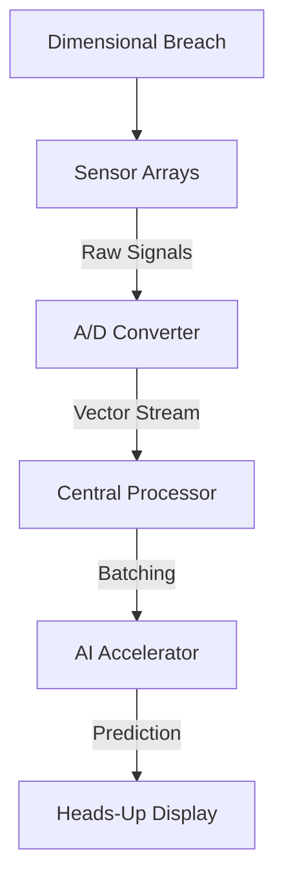
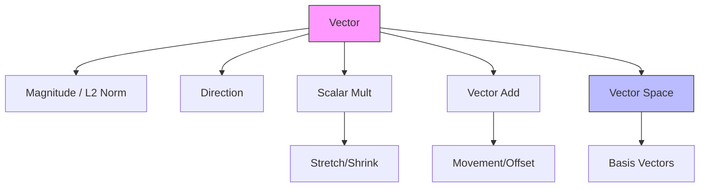

# Linear Algebra: Vectors and Scalars

## 📜 Story Mode: The Dimensional Breach

> **Mission Date**: 2042.03.15
> **Location**: Deep Space Outpost "Vector Prime"
> **Officer**: Lead Engineer Kael
> 
> **The Crisis**: The outpost's sensors are screaming. A dimensional breach has opened, and raw data is flooding our systems. But something is wrong. Our old "Scalar" computers—which process one number at a time—are choking. They see the breach as a billion separate alarms: `Pressure: 400`, `Heat: 9000`, `Radiation: 5`.
> 
> By the time the CPU reads "Pressure", the "Heat" has already changed. We can't see the *shape* of the breach because we're looking at pixels through a straw.
> 
> **The Solution**: We need to stop treating these readings as separate numbers. We need to bundle them. Pressure, Heat, and Radiation aren't three things; they are **one** state of the breach at **one** instant in time.
> 
> We need **Vectors**.

> [!NOTE] 
> **🛑 Pause & Explain (In Very Simple Words)**
> 
> **What just happened?**
>
> The computer was overwhelmed because it was treating:
> - Pressure
> - Heat
> - Radiation
>
> as three unrelated numbers.
>
> A vector lets us say:
> “These numbers belong together. They describe ONE situation.”
>
> Instead of asking: *"What is the pressure?"* then later: *"What is the heat?"*
> We ask: *"What is the full state right now?"*
>
> That single idea is why vectors exist.

> *"Computer! Switch architecture to SIMD. Group incoming telemetry into 3-dimensional packets. Visualise the breach direction!"*

---

## 1. Problem Setup & Motivation

### The 6 Engineering Questions
1.  **WHAT**: A vector is an encoded **state**. In our story, it's the "Pakcet" containing `[Pressure, Heat, Radiation]`. Mathematically, it's an ordered list of numbers.
2.  **WHY**: To capture **relationships**. If Heat goes up while Pressure goes down, that's a specific *type* of danger. Scalars lose this relationship; Vectors preserve it.
3.  **WHEN**: Use vectors when attributes **travel together**. A user in a database isn't just an Age; they are `[Age, Location, Clicks]`.
4.  **WHERE**: 
    *   **Story**: Inside the "Vector Prime" targeting computer.
    *   **Reality**: Inside the GPU's memory and Neural Network layers.
5.  **WHO**: Engineers who need to process billion-point datasets without crashing the system.
6.  **HOW**: By treating a list of numbers as a **single mathematical object**, allowing us to add, scale, and transform them in one go.

> [!TIP]
> **🧠 Simple Rule to Remember**
>
> If changing one number should NOT affect the others → scalars are fine.
>
> If changing one number only makes sense when seen with the others → you need a vector.
>
> AI almost always falls into the second case.

### The Real-World Failure: "The Scalar Bottleneck"
**Mission Log**:
We tried to map the breach using a `for` loop.
```python
# The Old Way (Scalar) - TOO SLOW
readings = [400, 9000, 5, ...] 
for r in readings:
    analyze(r) # By the time this finishes, the ship is destroyed.
```

> [!IMPORTANT]
> **🛑 Why the Loop Was Actually the Problem**
>
> The loop itself is not evil. The problem is that:
>
> - The CPU must check the type of every element
> - Each number is loaded separately from memory
> - The computer cannot “see” the whole situation at once
>
> Vectorization tells the computer:
> *“Here is the entire situation. Handle it in one shot.”*
>
> That single instruction is what unlocks speed.

**Why it failed**: The "Scalar" approach ignores that these numbers belong together. The CPU wasted time fetching them one by one.
**The Fix**: Vectorization. We analyze the whole Block `[400, 9000, 5]` instantly.

---

## 2. Mathematical Problem Formulation

### Definitions & Axioms
To save the ship, we define our **Sensor Vector** $\mathbf{v}$.
It lives in $\mathbb{R}^3$ (The 3-dimensional space of our readings).

$$ \mathbf{v} = \begin{bmatrix} \text{Pressure} \\ \text{Heat} \\ \text{Radiation} \end{bmatrix} $$

### Constraints
*   **Dimensional Integrity**: You cannot add a `[Pressure, Heat]` vector to a `[Pressure, Heat, Radiation]` vector. The computer will crash (Shape Mismatch Error).

---

## 3. Step-by-Step Derivation

### Deriving Vector Addition (Offsetting the Breach)
**Scenario**: The breach is pulling us at vector $\mathbf{b} = [10, 20, 5]$.
We need to fire thrusters $\mathbf{t}$ to counteract it.
If we fire $\mathbf{t} = [-10, -20, -5]$, what is our net movement?

**Step 1: Component Alignment**
We align the thruster force with the breach force.
*   Pressure vs Pressure: $10 + (-10) = 0$
*   Heat vs Heat: $20 + (-20) = 0$
*   Rad vs Rad: $5 + (-5) = 0$

**Step 2: The Math**
$$ \mathbf{b} + \mathbf{t} = \begin{bmatrix} 10 \\ 20 \\ 5 \end{bmatrix} + \begin{bmatrix} -10 \\ -20 \\ -5 \end{bmatrix} = \begin{bmatrix} 0 \\ 0 \\ 0 \end{bmatrix} $$
**Result**: We are stationary. We survived.

> [!NOTE]
> **🧠 What Zero Means Here (Important!)**
>
> The zero vector does NOT mean “nothing happened.”
>
> It means: **“All forces canceled perfectly.”**
>
> In engineering:
> - Zero often means balance
> - Zero means stability
> - Zero means survival
>
> This idea shows up everywhere: Physics, Optimization, Neural network training.

---

## 4. Algorithm Construction

### Map to Memory: "The Cargo Hold"
How does the ship's computer store this?
It doesn't scatter the numbers. It packs them into a **contiguous** crate.
`[Memory Address 0x1A]: [ 10.0 | 20.0 | 5.0 ]`

### Algorithm: SIMD (The Salvo Fire)
Instead of firing one thruster, then the next, then the next, we use **SIMD (Single Instruction, Multiple Data)**.
We send ONE command: `FIRE_ALL_THRUSTERS`.
The hardware executes the math for Pressure, Heat, and Radiation **simultaneously**.

> [!TIP]
> **🧠 One-Sentence SIMD Memory Trick**
>
> SIMD works because:
> *“The same math is applied to many numbers stored next to each other.”*
>
> If the numbers are scattered: SIMD cannot help you.
>
> This is why memory layout matters as much as math.

---

## 5. Optimization & Convergence Intuition

### Optimization: "The Supply Line" (Bandwidth)
The hardest part of the mission isn't the calculation; it's getting the fuel (data) to the engines (CPU).
*   **Good Supply Line (Stride-1)**: Fuel tanks are lined up perfectly. We pump them in order.
*   **Bad Supply Line (Stride-N)**: We have to run back and forth to finding tanks scattered around the cargo bay.
*   **Engineering Rule**: Keep your vectors packed tight (Contiguous Memory) to maximize speed.

> [!IMPORTANT]
> **🛑 Very Important Beginner Insight**
>
> Most AI code is NOT slow because math is hard.
>
> It is slow because:
> - Data is far away
> - Memory access is unpredictable
> - Bandwidth is limited
>
> Good AI engineers think about: *“How do I move data less?”*

---

## 6. Worked Examples

### Example 1: Calibrating the Holo-Deck (RGB Colors)
**Story**: The engineer needs to create the color "Purple" for a nebula simulation.
*   **Red Emitter**: $\mathbf{r} = [255, 0, 0]$
*   **Blue Emitter**: $\mathbf{b} = [0, 0, 255]$

**Action**: Set both to 50% power.
$$ \mathbf{nebula} = 0.5 \cdot \mathbf{r} + 0.5 \cdot \mathbf{b} $$
$$ \mathbf{nebula} = \begin{bmatrix} 127.5 \\ 0 \\ 0 \end{bmatrix} + \begin{bmatrix} 0 \\ 0 \\ 127.5 \end{bmatrix} = \begin{bmatrix} 127.5 \\ 0 \\ 127.5 \end{bmatrix} $$

> [!NOTE]
> **🧠 Why This Example Matters Beyond Colors**
>
> This is not really about colors.
>
> It’s about this idea:
> *“New meanings can be created by mixing existing vectors.”*
>
> This same math powers:
> - Image editing
> - Music synthesis
> - Word embeddings
> - Style transfer

### Example 2: Navigation Correction (Gradient Descent)
**Story**: The autopilot assumes the ship is at coordinates $\mathbf{w} = [0.5, -0.2]$.
The "Error Sensors" detect we are drifting. The direction of drift (Gradient) is $\mathbf{g} = [0.1, 0.0]$.
We need to steer *away* from the drift.
**Correction Step ($\eta = 0.1$)**:
$$ \mathbf{w}_{new} = \mathbf{w} - 0.1 \cdot \mathbf{g} $$
$$ \mathbf{w}_{new} = [0.5, -0.2] - [0.01, 0.0] = [0.49, -0.2] $$
**Log**: Course corrected.

> [!TIP]
> **🛑 Gradient Descent in Plain Language**
>
> The gradient does NOT say: *“Where to go.”*
>
> It says: *“If you go THIS way, things get worse.”*
>
> So learning simply means:
> *“Take a small step in the opposite direction.”*
>
> That’s it. No magic. Just many tiny vector updates.

---

## 7. Production-Grade Code

### The Ship's Code (Polyglot: Python vs NumPy vs PyTorch vs TensorFlow)

```python
import numpy as np
import torch
import tensorflow as tf

# LEVEL 0: Pure Python (The Math Logic)
# Equation: v_new = \alpha * v_old
def analyze_sensor_data_pure(sensor_data, alpha):
    """
    Implements the vector scaling equation from scratch.
    math: v_i = alpha * v_i  for all i
    """
    results = []
    # Explicit loop demonstrates the summation/operation logic
    for value in sensor_data:
        results.append(value * alpha)
    return results

# LEVEL 1: NumPy (The CPU Engine)
def analyze_sensor_data_fast(sensor_array, alpha):
    # SIMD Engaged: Processes the whole array in one clock cycle
    # Best for: CPU-based data preprocessing
    return sensor_array * alpha

# LEVEL 2: PyTorch (Research & Dynamic Graphs)
def analyze_telemetry_torch(sensor_tensor, alpha):
    # Moving calculation to the neural matrix (GPU)
    # Best for: Research requiring autograd
    return sensor_tensor * alpha

# LEVEL 3: TensorFlow (Production & Static Graphs)
def analyze_telemetry_tf(sensor_tensor, alpha):
    # Optimized for XLA compilation and static graphs
    # Best for: Edge Deployment (TFLite) & Production Serving
    # Best for: Edge Deployment (TFLite) & Production Serving
    return tf.math.multiply(sensor_tensor, alpha)

# LEVEL 4: Visualization (See the Vectors)
def visualize_vectors():
    """
    Plots vectors to build geometric intuition.
    Ref: Matplotlib Quiver
    """
    import matplotlib.pyplot as plt
    
    # Define vectors
    v1 = np.array([2, 5])
    v2 = np.array([3, 1])
    v_sum = v1 + v2
    
    # Setup plot
    plt.figure(figsize=(6,6))
    plt.axhline(0, color='grey', lw=1)
    plt.axvline(0, color='grey', lw=1)
    plt.grid(True, linestyle=':', alpha=0.6)
    
    # Quiver plot (x, y, u, v)
    vectors = [v1, v2, v_sum]
    colors = ['r', 'b', 'g']
    labels = ['V1 [2,5]', 'V2 [3,1]', 'Sum [5,6]']
    
    for v, c, l in zip(vectors, colors, labels):
        plt.quiver(0, 0, v[0], v[1], angles='xy', scale_units='xy', scale=1, color=c, label=l)
    
    plt.xlim(-1, 8)
    plt.ylim(-1, 8)
    plt.title("Vector Addition: Tip-to-Tail Rule")
    plt.legend()
    plt.show()

# Uncomment to run
# visualize_vectors()
```

---

## 8. System-Level Integration



**The Pipeline**:
1.  **Sensors**: Capture raw reality.
2.  **ADC**: Turns reality into Vectors of floats.
3.  **GPU**: Crunches millions of vectors to predict the breach size.

---

## 9. Evaluation & Failure Analysis

### Metric: Shield Integrity (Norm)
We measure the "Strength" of the breach using the **L2 Norm**.
$$ \text{Severity} = ||\mathbf{v}|| = \sqrt{\text{Pressure}^2 + \text{Heat}^2 + \text{Rad}^2} $$

### Failure Mode: The "Ghost Signal" (Catastrophic Cancellation)
**Warning**:
*   Sensor A reads: `1,000,000.05`
*   Sensor B reads: `1,000,000.04`
*   The difference is `0.01` (The life-sign of a survivor!)
*   But our 32-bit computer rounds both to `1,000,000.0`.
*   Result: `0.0`. **We miss the survivor.**
*   **Fix**: Use 64-bit precision for high-contrast difference calculations.

> [!CAUTION]
> **🧠 Why This Is Dangerous in Real Life**
>
> This problem is not academic.
>
> It can cause:
> - Missed medical signals
> - Financial miscalculations
> - Failed anomaly detection
>
> Precision is not about being fancy. It is about not losing important differences.

---

## 10. Ethics, Safety & Risk Analysis

### The Bias of the Map
**Log Entry**: "We realized our training data came only from the 'Northern' star cluster. As a result, our vectors for 'Habitable Zone' are biased towards blue stars interaction. We nearly missed a habitable planet orbiting a Red Dwarf because our vector math was 'Northern-Centric'."
**Lesson**: Mathematical spaces can hide prejudices. Always check your coordinate systems.

> In simple terms: **A vector decides what the system is allowed to notice — and what it ignores.**

---

## 11. Advanced Theory & Research Depth

### Warping Space (Manifolds)
Our vectors assume space is "flat" (Euclidean). But near a black hole (or in complex data), space describes a *curve*.
**Research**: We need **Riemannian Geometry** to handle vectors on curved surfaces.

### 📚 Deep Dive Resources
*   **Paper**: "Efficient Estimation of Word Representations in Vector Space" (Mikolov et al., 2013) - The birth of modern vector embeddings. [ArXiv:1301.3781](https://arxiv.org/abs/1301.3781)
*   **Concept**: **Banach Spaces**. When vectors have infinite dimensions (like functions).


---

## 12. Career & Mastery Signals

### Cadet (Junior)
*   Can load sensor data into a `np.array`.
*   Doesn't crash the ship with "Shape Errors".

### Commander (Senior)
*   Optimizes the "Supply Line" (Memory Stride).
*   Switching to "Low Precision Mode" (BF16) to save power without losing accuracy.

---

## 13. Industry Interview Corner

### ❓ Real World Questions
**Q1: "Why do we prefer dense vectors over sparse vectors in Deep Learning?"**
*   **Interviewer's Intent**: Checking if you understand hardware efficiency.
*   **Good Answer**: "Sparse vectors save memory, but dense vectors align better with GPU hardware (SIMD/Tensor Cores) and allow for richer semantic relationships (like in Word2Vec), whereas sparse vectors (One-Hot) lose semantic meaning."

**Q2: "What happens geometrically when you add a scalar to a vector?"**
*   **Trap**: Strictly speaking, you *cannot* add a scalar to a vector in pure math.
*   **The "Broadcasting" Answer**: "In math, it's undefined. But in Python/NumPy, **Broadcasting** stretches the scalar into a vector of the same shape, effectively shifting the entire coordinate system."

**Q3: "Explain the L2 Norm to a non-technical person."**
*   **Answer**: "It's the straight-line distance from the starting point to the destination. It ignores the winding path and just tells you 'how far away' you are."

---

## 14. Debug Your Thinking (Common Misconceptions)

### ❌ Myth: "Vectors are just lists of numbers."
**✅ Truth**: A list is a computer science structure. A **Vector** is a geometric object.
*   If you shuffle a list, it's just a shaken list.
*   If you shuffle a vector, you have **broken physics** (x and y are swapped). **Order matters.**

### ❌ Myth: "Higher dimension is always better."
**✅ Truth**: The **Curse of Dimensionality**.
*   As dimensions grow, vectors become "sparse" (far apart).
*   In 10,000 dimensions, *everything* is equally far away from everything else, breaking our distance metrics.


---

## 15. Assessment & Mastery Checks

**Q1: The Navigation Check**
You have vector $\mathbf{a} = [10, 0]$ (Flight Path) and $\mathbf{b} = [0, 5]$ (Cross-wind).
What is your actual direction vector?
*   *Answer*: $\mathbf{c} = [10, 5]$. You are drifting diagonally.

**Q2: The Supply Line**
Why is `array + array` faster than `list + list`?
*   *Answer*: **SIMD**. The ship's computer processes 16 tanks of fuel at once, rather than one by one.

---

## 16. Further Reading & Tooling

*   **Manual**: *"Numerical Linear Algebra"* (Trefethen) - The technical manual for our ship's computer.
*   **Tool**: **NumPy** - The language of the main core.

---

## 17. Concept Graph Integration

*   **Next Mission**: [Matrix Operations](01_foundation_math_cs/01_linear_algebra/02_matrix_operations.md) - How to transform our vectors.
*   **Next**: [Matrix Operations](01_foundation_math_cs/01_linear_algebra/02_matrix_operations.md) - How to transform our vectors.
*   **Related System**: Neural Networks - The brain that processes our vector signals.

### Concept Map


---

# 🧸 Appendix A: The Prerequisite Playground

*Welcome to the "Kids' Corner" of the ship! Here we quickly polish the rusty mental tools you need to survive Linear Algebra. No boring lectures—just facts.*

## 1. Real Numbers ($\mathbb{R}$): "The Smooth Slide"
**What is it?** 
The set of **ALL** numbers on the number line. 
*   Includes: $0$, $-5$, $17$ (Integers)
*   Includes: $0.5$, $1/3$ (Fractions)
*   Includes: $\pi$, $\sqrt{2}$ (Weird decimals that never end)

**The Analogy**: 
Imagine a **Staircase** vs a **Slide**.
*   **Integers ($\mathbb{Z}$)** are stairs. You are on Step 1 or Step 2. You cannot be on "Step 1.5".
*   **Real Numbers ($\mathbb{R}$)** are a slide. You can be *anywhere*. You can slide down just a tiny millimeter ($1.0001$).

**Why do we care?**
In AI, we rarely land exactly on "Step 1". We are usually sliding around at "Probability 0.98432". We need the slide.

## 2. Coordinates: "The Treasure Map"
**What are they?** 
`(x, y)`: An address for a location.
*   `x`: How far Right/Left.
*   `y`: How far Up/Down.

**The Analogy**: 
Think of **Battleship** (the board game).
*   "B-4!" $\to$ Go to column B, row 4.
*   In Math, we just use numbers. "Go to $(2, 3)$" means "Walk 2 steps East, 3 steps North".
*   **A "Vector"** is just the arrow pointing from Home $(0,0)$ to that Treasue $(2,3)$.

## 3. Pythagoras: "The Shortcut Rule"
**The Rule**: $a^2 + b^2 = c^2$.

**The Analogy**: 
You are at the corner of a park (rectangular).
*   **Option A**: Walk along the sidewalk. 3 meters Right, then 4 meters Up. Total walking = 7 meters. (Sweaty work!)
*   **Option B**: Cut across the grass diagonally. How far is it?
    *   $3^2 + 4^2 = 9 + 16 = 25$.
    *   Target is $\sqrt{25} = 5$ meters.
    *   **Result**: 5 meters is shorter than 7 meters! The diagonal is *always* the fastest path.

**Why do we care?**
In AI, the "Length of a Vector" (how strong the signal is) is just Pythagoras in 3D (or 1000D!). We call it the **Norm**.
