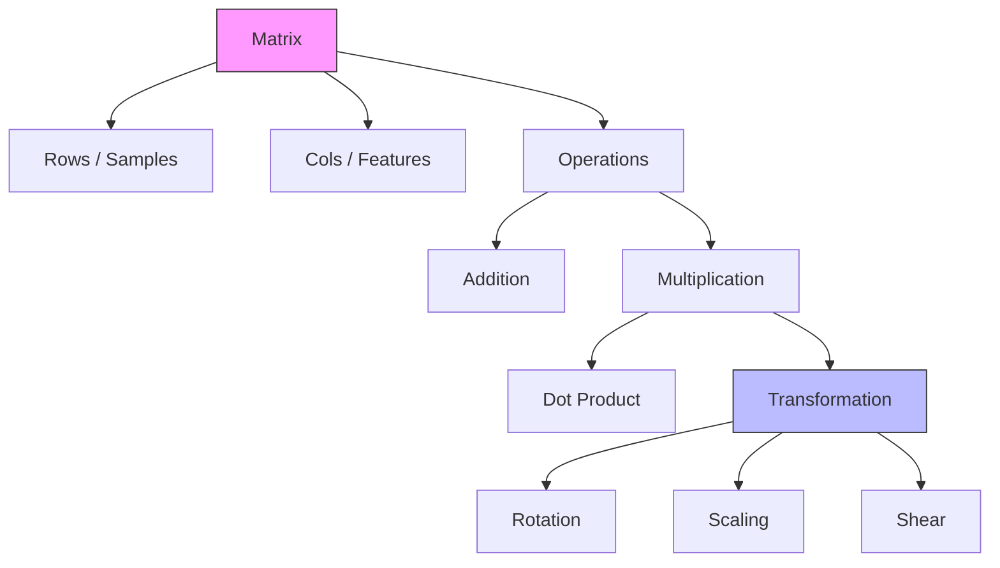

# Linear Algebra: Matrix Operations

## 📜 Story Mode: The Transformation Engine

> **Mission Date**: 2042.03.16
> **Location**: Deep Space Outpost "Vector Prime"
> **Officer**: Lead Engineer Kael
>
> **The Evolution**: Yesterday, we learned to see the breach as a **Vector**—a single state `[Pressure, Heat, Radiation]`. We survived the initial wave.
>
> **The New Crisis**: The breach isn't stationary. It is twisting.
> The raw sensor data $\mathbf{x}$ is coming from a damaged array that is rotated $30^\circ$ relative to the ship's hull. When the sensors read `[10, 0]`, the actual breach is at `[8.66, 5.0]`.
>
> We need a way to take *any* incoming vector $\mathbf{x}$ and **transform** it into the ship's calibrated coordinate system $\mathbf{y}$. We need a machine that takes a vector in, spins it, scales it, and spits a new vector out.
>
> We don't just need a list of numbers anymore. We need a grid of numbers that encodes the "Twist".
>
> We need a **Matrix**.
>
> *"Computer! Load the Calibration Matrix. Apply linear transformation to the entire sensor stream. Align us with the breach!"*

---

## 1. Problem Setup & Motivation

### The 6 Engineering Questions
1.  **WHAT**: A Matrix is a 2D grid of numbers. Geometrically, it represents a **Linear Transformation** (scaling, rotation, skewing, projection).
2.  **WHY**: Vectors represent **States** (Data). Matrices represent **Actions** (Functions) that change those states. Without matrices, neural networks couldn't transform Input $\to$ Hidden $\to$ Output.
3.  **WHEN**: Use matrices whenever you need to map one vector space to another (e.g., Image Pixels $\to$ Class Probabilities).
4.  **WHERE**:
    *   **Math**: $y = Ax$.
    *   **Hardware**: The "Tensor Cores" in an NVIDIA GPU are dedicated silicon circuits just for multiplying $4 \times 4$ matrices.
5.  **WHO**: Engineers building models, rendering graphics, or calibrating sensors.
6.  **HOW**: Implemented as contiguous memory blocks (Row-Major or Column-Major), optimized via **BLAS** (Basic Linear Algebra Subprograms) libraries.

> [!NOTE]
> **🛑 Pause & Explain (In Simple Words)**
>
> **What is a Matrix, really?**
>
> Don't think of it as "a spreadsheet" or "a table."
>
> Think of a Matrix as a **Machine**.
>
> - **Input**: A Vector (Raw materials).
> - **The Machine (Matrix)**: Stretches, turns, and moves the input.
> - **Output**: A new Vector (Finished product).
>
> If you have a neural network, the "weights" are just a Matrix. The network is just a series of these machines chained together.

---

## 2. Mathematical Problem Formulation

### Definitions & Axioms
A Matrix $\mathbf{A} \in \mathbb{R}^{m \times n}$ has $m$ rows and $n$ columns.
It maps a vector $\mathbf{x} \in \mathbb{R}^n$ to a vector $\mathbf{y} \in \mathbb{R}^m$.

$$ \mathbf{y} = \mathbf{A}\mathbf{x} $$

$$ \begin{bmatrix} y_1 \\ y_2 \end{bmatrix} = \begin{bmatrix} a_{11} & a_{12} \\ a_{21} & a_{22} \end{bmatrix} \begin{bmatrix} x_1 \\ x_2 \end{bmatrix} $$

### The Objective Function (Matrix-Vector Multiplication)
Each output element $y_i$ is the **Dot Product** of the $i$-th row of $\mathbf{A}$ with the vector $\mathbf{x}$.

$$ y_i = \sum_{j=1}^{n} A_{ij} x_j $$

> [!NOTE]
> **🛑 Pause & Explain: The Determinant**
>
> In the next chapter, we will need the **Determinant** ($\det(\mathbf{A})$).
>
> Think of a Matrix as a "Space Transformer".
> - **Determinant** measures how much the **Area (or Volume)** stretches.
> - If $\det = 2$: The area doubles.
> - If $\det = 0$: The area collapses to a line (singular).
>
> This number tells us if the transformation is "reversible" or if it destroys information.

---

## 3. Step-by-Step Derivation

### Deriving the Transformation (The "Twist")
**Goal**: We want to rotate space by $90^\circ$ counter-clockwise.
*   Basis Vector $\mathbf{e}_1$ (East) $\to$ $\begin{bmatrix} 1 \\ 0 \end{bmatrix}$ BECOMES $\begin{bmatrix} 0 \\ 1 \end{bmatrix}$ (North).
*   Basis Vector $\mathbf{e}_2$ (North) $\to$ $\begin{bmatrix} 0 \\ 1 \end{bmatrix}$ BECOMES $\begin{bmatrix} -1 \\ 0 \end{bmatrix}$ (West).

**Step 1: Construct Columns**
The columns of the matrix are literally just "Where did the basis vectors go?"
Column 1 is the new $\mathbf{e}_1$: $\begin{bmatrix} 0 \\ 1 \end{bmatrix}$.
Column 2 is the new $\mathbf{e}_2$: $\begin{bmatrix} -1 \\ 0 \end{bmatrix}$.

**Step 2: Assemble Matrix**
$$ \mathbf{R}_{90} = \begin{bmatrix} 0 & -1 \\ 1 & 0 \end{bmatrix} $$

**Step 3: Test on a Vector**
Let's rotate $\mathbf{v} = \begin{bmatrix} 2 \\ 0 \end{bmatrix}$ (2 steps East).
$$ \mathbf{R}_{90} \mathbf{v} = \begin{bmatrix} 0 & -1 \\ 1 & 0 \end{bmatrix} \begin{bmatrix} 2 \\ 0 \end{bmatrix} = \begin{bmatrix} (0)(2) + (-1)(0) \\ (1)(2) + (0)(0) \end{bmatrix} = \begin{bmatrix} 0 \\ 2 \end{bmatrix} $$
**Result**: $\begin{bmatrix} 0 \\ 2 \end{bmatrix}$ is 2 steps North. The rotation worked.

> [!TIP]
> **🧠 Intuition Behind the Math**
>
> The columns of a matrix tell you: **"Where do X, Y, and Z land after the transformation?"**
>
> If Column 1 is $\begin{bmatrix} 2 \\ 0 \end{bmatrix}$, it means "Anything pointing Right gets scaled by 2."
> If Column 2 is $\begin{bmatrix} 0 \\ 0.5 \end{bmatrix}$, it means "Anything pointing Up gets squashed by half."

---

## 4. Algorithm Construction

### Map to Memory
A 2D matrix does not exist in RAM. RAM is a 1D line.
We must flatten the grid.
**Row-Major (C/Python)**: Row 1, then Row 2. `[a11, a12, a21, a22]`.
**Column-Major (Fortran/MATLAB)**: Col 1, then Col 2. `[a11, a21, a12, a22]`.

> [!IMPORTANT]
> **🛑 Why This Matters**
> If you traverse a Row-Major matrix by *Columns*, you are jumping around memory (Stride-N). This causes **Cache Misses** and is 10-100x slower.
> Always iterate in the direction of the memory layout.

### Algorithm: Matrix Multiplication (GEMM)
**Problem**: Compute $\mathbf{C} = \mathbf{A} \times \mathbf{B}$.
**Naive (Triple Loop)**:
```python
for i in 0..N:
    for j in 0..N:
        for k in 0..N:
             C[i][j] += A[i][k] * B[k][j]
```
**Complexity**: $O(N^3)$. Extremely slow for large $N$.
**Optimized (Tiled/Blocked)**: Break matrix into small $32 \times 32$ tiles that fit in CPU Cache. Multiply tiles. This minimizes expensive RAM trips.

---

## 5. Optimization & Convergence Intuition

### The Hardware Optimization (Tensor Cores)
Modern AI doesn't just use loops.
NVIDIA GPUs have "Tensor Cores"—hardware units that *physically* perform a $4 \times 4$ matrix multiply in one clock cycle.
They use **Systolic Arrays**: Data flows through a grid of processors like blood through a heart, getting multiplied and added at each step, reusing data so much that memory bandwidth becomes less of a bottleneck.

> [!NOTE]
> **🧠 What the Computer Is Actually Doing**
>
> It is not doing sums one by one.
>
> It is streaming two rivers of numbers (Matrix A and B) into a grid of calculators. The calculators pass numbers to their neighbors. By the time the numbers exit the grid, they are fully multiplied.

---

## 6. Worked Examples

### Example 1: The Neural Layer (Forward Pass)
**Story**: We have a neural network layer.
**Input**: $\mathbf{x} = [1, 2]$ (Feature: Hours Slept, Cups of Coffee).
**Weights**: $\mathbf{W} = \begin{bmatrix} 0.5 & 0.8 \\ -1.0 & 2.0 \end{bmatrix}$ (The "Brain").
**Task**: Compute the hidden state $\mathbf{h} = \mathbf{W}\mathbf{x}$.

$$ \mathbf{h} = \begin{bmatrix} 0.5 & 0.8 \\ -1.0 & 2.0 \end{bmatrix} \begin{bmatrix} 1 \\ 2 \end{bmatrix} $$
Row 1: $(0.5)(1) + (0.8)(2) = 0.5 + 1.6 = 2.1$. (Energy Level)
Row 2: $(-1.0)(1) + (2.0)(2) = -1.0 + 4.0 = 3.0$. (Jitteriness)
**Output**: $\mathbf{h} = [2.1, 3.0]$.

> [!TIP]
> **🛑 Neural Networks in Plain Language**
>
> A layer is just: **"Mix the inputs to create new features."**
>
> Here, "Energy Level" is a mix of Sleep and Coffee.
> The numbers in the matrix (0.5, 0.8) just decide *how much* each input matters.

---

## 7. Production-Grade Code

### The Ship's Code (Polyglot: NumPy vs PyTorch vs TensorFlow)

```python
import numpy as np
import torch
import tensorflow as tf

# 1. Setup: A Batch of 3 Vectors (32 inputs each)
# Shape: (Batch_Size, Input_Dim) -> (3, 32)
# NumPy
batch_X_np = np.random.randn(3, 32)
# PyTorch
batch_X_torch = torch.randn(3, 32)
# TensorFlow
batch_X_tf = tf.random.normal((3, 32))

# 2. Weights: Connecting 32 inputs to 128 outputs
# NumPy (32, 128)
weights_np = np.random.randn(32, 128)
# PyTorch (128, 32) - PyTorch Linear layers store as (Out, In)
weights_torch = torch.randn(128, 32) 
# TensorFlow (32, 128) - Dense layers store as (In, Out)
weights_tf = tf.random.normal((32, 128))

# 3. The Operation: Matrix Multiplication
def run_matrix_ops():
    # LEVEL 0: Pure Python (The Math Logic)
    # Math: C_{ij} = \sum_k A_{ik} * B_{kj}
    out_pure = [[0 for _ in range(128)] for _ in range(3)]
    # We must implement the triple loop explicitly
    # A is (3, 32), B is (32, 128)
    for i in range(3):           # Rows of A
        for j in range(128):     # Cols of B
            for k in range(32):  # Shared Dimension
                # We access elements one by one (Scalar operations)
                # Note: This is 3 * 128 * 32 = 12,288 operations
                out_pure[i][j] += batch_X_np[i][k] * weights_np[k][j]

    # LEVEL 1: NumPy (CPU)
    # Uses BLAS under the hood. Great for data prep.
    # Shape: (3, 32) @ (32, 128) -> (3, 128)
    out_np = batch_X_np @ weights_np
    
    # LEVEL 2: PyTorch (Research/GPU)
    # Uses Linear Algebra or simple MatMul
    # Note: F.linear(input, weight) does input @ weight.T
    out_torch = torch.nn.functional.linear(batch_X_torch, weights_torch)
    
    # LEVEL 3: TensorFlow (Production/XLA)
    # Uses static graph optimization
    out_tf = tf.linalg.matmul(batch_X_tf, weights_tf)
    
    # LEVEL 0.5: Pure Python (List Comprehension)
    # This is another way to do pure Python matrix multiplication
    # For demonstration, using batch_X_np as A and weights_np as B
    A = batch_X_np.tolist() # Convert numpy array to list for pure python op
    B = weights_np.tolist() # Convert numpy array to list for pure python op
    
    result_list_comp = [[sum(a * b for a, b in zip(A_row, B_col)) 
               for B_col in zip(*B)] 
              for A_row in A]
    
    return out_pure, out_np, out_torch, out_tf, result_list_comp

# LEVEL 4: Visualization (The Grid Transform)
def visualize_transform():
    """
    Shows how a matrix distorts space.
    """
    import matplotlib.pyplot as plt
    
    # Grid of points
    x = np.linspace(-5, 5, 10)
    y = np.linspace(-5, 5, 10)
    X, Y = np.meshgrid(x, y)
    
    # Flatten
    coords = np.vstack([X.flatten(), Y.flatten()])
    
    # Transform Matrix (Shear)
    T = np.array([[1, 1], 
                  [0, 1]]) 
    
    # Apply
    transformed = T @ coords
    
    plt.figure(figsize=(10, 5))
    
    plt.subplot(1, 2, 1)
    plt.scatter(coords[0], coords[1], s=5)
    plt.title("Original Grid (cartesian)")
    plt.grid(True)
    
    plt.subplot(1, 2, 2)
    plt.scatter(transformed[0], transformed[1], s=5, c='red')
    plt.title("Transformed Grid (Sheared)")
    plt.grid(True)
    
    plt.show()

# Uncomment to run
# visualize_transform()


> [!CAUTION]
> **🛑 Why This Code Exists**
>
> We use `@` or `matmul` instead of a loop.
> If you looped through the batch `for x in batch_X:`, Python overhead would kill you.
> By passing the whole batch as a matrix, we let the underlying C++/CUDA code handle the parallelism.

---

## 8. System-Level Integration

```mermaid
graph LR
    Input[Batch of Images (B, C, H, W)] --> Flatten[Flatten Vector (B, D)]
    Flatten --> MatMul["Matrix Mult (W • x)"]
    MatMul --> Bias["Add Bias (+ b)"]
    Bias --> ReLU[Activation]
    ReLU --> Output[Next Layer]
```

**Where Matrices Live**:
1.  **Stored Weights**: On the hard drive (e.g., `pytorch_model.bin` is just a serialized dictionary of matrices).
2.  **GPU VRAM**: Loaded into memory for fast access during inference.

---

## 9. Evaluation & Failure Analysis

### Metric: Condition Number
How sensitive is the matrix to errors?
If $\mathbf{A}\mathbf{x} = \mathbf{b}$, and we change $\mathbf{b}$ slightly (noise), does $\mathbf{x}$ change wildly?
*   **Low Condition Number**: Stable.
*   **High Condition Number**: Unstable (Ill-conditioned).

### Failure Mode: The Exploding Matrix
In Deep Networks (many layers), we multiply matrices repeatedly: $\mathbf{W}_L \dots \mathbf{W}_2 \mathbf{W}_1 \mathbf{x}$.
If the eigenvalues of $\mathbf{W}$ are $> 1$, the signal grows exponentially ($1.1^{100} \approx 13780$).
**Result**: `NaN` (Not a Number) or `Inf` (Infinity). The training crashes.
**Fix**: Initialization techniques (He/Xavier Init) designed to keep the scale ~1.

> [!WARNING]
> **🧠 Why This Feels Confusing at First**
>
> You might think: *"It's just multiplication. How can it crash?"*
>
> But multiplying big numbers millions of times creates monsters.
> This is why "Deep Learning" was impossible until the mid-2000s—we didn't know how to tame the matrix multiplication chain.

---

## 10. Ethics, Safety & Risk Analysis

### The Bias of Transformation
Matrices define "Associations".
In a language model, the matrix might associate:
`Doctor` $\to$ `He` (Strong link, high value in matrix)
`Nurse` $\to$ `She` (Strong link, high value in matrix)
This isn't magic; it's just a number in a grid row.
**Safety**: We must "audit" these matrices (inspect the weights) or modify the training data to fix these associations.

---

## 11. Advanced Theory & Research Depth

### Low-Rank Approximation
Most massive matrices (like User-Item ratings) are "Low Rank"—they can be compressed into two smaller matrices.
$\mathbf{R} \approx \mathbf{U} \times \mathbf{V}^T$.
This is the math behind **LoRA** (Low-Rank Adaptation), which allows us to fine-tune massive LLMs on consumer GPUs.

### 📚 Deep Dive Resources
*   **Paper**: "LoRA: Low-Rank Adaptation of Large Language Models" (Hu et al., 2021) - The matrix math that saved LLM fine-tuning. [ArXiv:2106.09685](https://arxiv.org/abs/2106.09685)
*   **Concept**: **Spectral Theory**. The study of eigenvalues/vectors which tells us how a matrix "vibrates".


---

## 12. Career & Mastery Signals

### Cadet (Junior)
*   Can inspect matrix shapes with `.shape`.
*   Knows why `(3, 10) @ (5, 5)` crashes.

### Commander (Senior)
*   Uses `einsum` for complex high-dimensional tensors.
*   Avoids automatic broadcasting bugs by being explicit with dimensions.

---

## 13. Industry Interview Corner

### ❓ Real World Questions
**Q1: "What is the computational complexity of multiplying two $N \times N$ matrices? Can we do better?"**
*   **Interviewer's Intent**: Checking CS fundamentals vs AI reality.
*   **Answer**: "Naive is $O(N^3)$. Strassen's Algorithm is $O(N^{2.8})$. However, in AI, we rely on **Tiling** and GPU Hardware (Tensor Cores) which optimize memory access (bandwidth) rather than just operation count."

**Q2: "Why do we initialize neural network weights randomly instead of with zeros?"**
*   **Answer**: "Symmetry Breaking. If all weights are zero (a Zero Matrix), every neuron in the layer learns the exact same gradient. The matrix effectively collapses to a single column repeated. Randomness makes them distinct 'feature detectors'."

**Q3: "If a matrix has a determinant of 0, what does that mean for a nervous network?"**
*   **Answer**: "It means the transformation collapses space (2D -> 1D, or 3D -> 2D). Information is lost and cannot be recovered (functions are not invertible). This is sometimes desired (dimensionality reduction) but often bad for deep layers preserving information flow."

---

## 14. Debug Your Thinking (Common Misconceptions)

### ❌ Myth: "Matrix multiplication is just a table calculation."
**✅ Truth**: It is **function composition**.
*   Multiplying Matrix $A$ then Matrix $B$ ($B \cdot A \cdot x$) is exactly the same as applying Function $f(x)$ then Function $g(x)$.
*   Matrices are just functions written as grids.

### ❌ Myth: "Order doesn't matter (A x B = B x A)."
**✅ Truth**: **NON-COMMUTATIVE**.
*   Rotating then Scaling is NOT the same as Scaling then Rotating.
*   $A \times B \neq B \times A$.
*   This is why "Pre-training" then "Fine-tuning" works, but you can't reverse it easily.


---

## 15. Assessment & Mastery Checks

**Q1: Shapes**
You have Input $(10, 5)$ and Weights $(5, 20)$.
What is output shape?
*   *Answer*: $(10, 20)$. The inner dimensions (5 and 5) cancel out.

**Q2: Identity**
What matrix does absolutely nothing to a vector?
*   *Answer*: The Identity Matrix $\mathbf{I}$. It has 1s on the diagonal and 0s everywhere else.
$$ \begin{bmatrix} 1 & 0 \\ 0 & 1 \end{bmatrix} \begin{bmatrix} x \\ y \end{bmatrix} = \begin{bmatrix} x \\ y \end{bmatrix} $$

---

## 16. Further Reading & Tooling

*   **Book**: *"Matrix Computations"* (Golub & Van Loan) - The bible of how computers actually solve linear algebra.
*   **Library**: **BLAS** (Basic Linear Algebra Subprograms) - The low-level standard that NumPy and PyTorch are built on top of.

---

## 17. Concept Graph Integration

*   **Previous**: [Vectors and Scalars](01_foundation_math_cs/01_linear_algebra/01_vectors_and_scalars.md) (The input to matrices).
*   **Next**: [Eigenvalues](01_foundation_math_cs/01_linear_algebra/03_eigenvalues_eigenvectors.md).

### Concept Map

 (The "characteristic" directions of a matrix).
