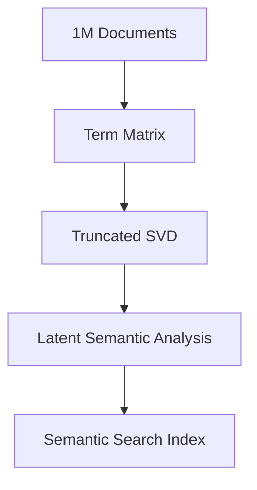

# Linear Algebra: Singular Value Decomposition (SVD)

## 📜 Story Mode: The Hologram

> **Mission Date**: 2042.03.22 (The Finale)
> **Location**: Deep Space Outpost "Vector Prime"
> **Officer**: Lead Engineer Kael
>
> **The Victory**: We have stabilized the ship (Eigenvalues), navigated the subspace (Vector Spaces), and targeted the enemy (Norms).
>
> **The Aftermath**: The battle is won, but our data banks are full. We have petabytes of telemetry recording the breach. We need to send this data to Earth, but the bandwidth is too slow.
>
> We need to **Compress** reality.
>
> We need to take this massive, messy matrix of data and find the "Essence" of it. We need to discard the noise and keep only the signal.
>
> We need **The Hologram Algorithm** (SVD).
>
> *"Computer! Decompose the mission logs. Keep the top 3 singular values. Compress 1 Petabyte to 1 Gigabyte. Send the Hologram to Earth."*

---

## 1. Problem Setup & Motivation

### The 6 Engineering Questions
1.  **WHAT**: SVD is the "Master Algorithm" of Linear Algebra. It breaks **ANY** matrix (square or rectangular) into 3 matrices: $\mathbf{U} \mathbf{\Sigma} \mathbf{V}^T$.
    *   **Rotate** ($\mathbf{V}^T$).
    *   **Stretch** ($\mathbf{\Sigma}$).
    *   **Rotate** ($\mathbf{U}$).
2.  **WHY**: It reveals the *Rank*, the *Noise*, and the *Principal structure* of any dataset.
3.  **WHEN**: Compression (Images), Denoising (Audio), Recommender Systems (Netflix Prize), Pseudo-Inverse.
4.  **WHERE**: Every time you watch a compressed video or search for a topic (LSI).
5.  **WHO**: Data Scientists (PCA is just SVD centered), Audio Engineers.
6.  **HOW**: `U, S, V = torch.linalg.svd(A)`. Computed via Golub-Kahan algorithm.

> [!NOTE]
> **🛑 Pause & Explain (In Simple Words)**
>
> **Think of a Music Equalizer.**
>
> A song is a mix of many frequencies (Bass, Treble, Mids).
>
> SVD takes a messy signal and separates it:
> 1. "Here is the Bass track." (Singular Value 1: Loud)
> 2. "Here is the Vocals." (Singular Value 2: Medium)
> 3. "Here is the Tape Hiss." (Singular Value 3: Quiet)
>
> If you delete the "Tape Hiss" (set small values to 0) and put the song back together...
> **You have just Denoised the audio.**

---

## 2. Mathematical Problem Formulation

### The Decomposition
For any complex matrix $\mathbf{A} \in \mathbb{R}^{m \times n}$:
$$ \mathbf{A} = \mathbf{U} \mathbf{\Sigma} \mathbf{V}^T $$

*   **$\mathbf{U}$ (Left Singular Vectors)**: Orthogonal matrix ($m \times m$). The "Output" axes.
*   **$\mathbf{\Sigma}$ (Singular Values)**: Diagonal matrix ($m \times n$). The "Strengths" ($\sigma_1 \ge \sigma_2 \ge \dots \ge 0$).
*   **$\mathbf{V}^T$ (Right Singular Vectors)**: Orthogonal matrix ($n \times n$). The "Input" axes.

### The Low-Rank Approximation (The Compression)
We can approximate $\mathbf{A}$ by keeping only the top $k$ singular values.
$$ \mathbf{A}_k = \sigma_1 \mathbf{u}_1 \mathbf{v}_1^T + \sigma_2 \mathbf{u}_2 \mathbf{v}_2^T + \dots + \sigma_k \mathbf{u}_k \mathbf{v}_k^T $$
This is the **closest** rank-$k$ matrix to $\mathbf{A}$ (Eckart-Young Theorem).

---

## 3. Step-by-Step Derivation

### Connection to Eigenvalues
SVD is just Eigendecomposition run on the **Correlation Matrices**:
1.  $\mathbf{A}^T \mathbf{A} = \mathbf{V} \mathbf{\Sigma}^2 \mathbf{V}^T$ (Gives $\mathbf{V}$ and $\sigma^2$).
2.  $\mathbf{A} \mathbf{A}^T = \mathbf{U} \mathbf{\Sigma}^2 \mathbf{U}^T$ (Gives $\mathbf{U}$ and $\sigma^2$).

**Why do this?**
$\mathbf{A}^T \mathbf{A}$ is always square and symmetric, even if $\mathbf{A}$ is weird and rectangular. SVD fixes the "Rectangular Matrix" problem.

> [!TIP]
> **🧠 Intuition Behind the Math**
>
> Eigenvectors only work for "Transformers" (Square matrices mapping space to itself).
> SVD works for "Mappers" (Rectangular matrices mapping Space A to Space B).
>
> It says: "If I find the right axes in Space A ($\mathbf{V}$) and Space B ($\mathbf{U}$), this complicated map becomes just a simple scaling ($\mathbf{\Sigma}$)."

---

## 4. Algorithm Construction

### Map to Memory (The Storage Saver)
Matrix $\mathbf{A}$ has $1,000,000$ entries ($1000 \times 1000$).
Rank 1 approx: $\mathbf{u} (1000) + \mathbf{v} (1000) + \sigma (1) = 2001$ numbers.
**Compression Ratio**: $2001 / 1,000,000 \approx 0.2\%$.
We saved 99.8% of space.

### Algorithm: Randomized SVD
**Goal**: Compute top $k$ SVD for huge matrices (e.g., Wikipedia).
**Idea**: Multiply $\mathbf{A}$ by a random thin matrix. This "sketches" the range. Compute SVD on the sketch.
**Speed**: Super fast compared to deterministic SVD. Standard in `sklearn` and PyTorch.

---

## 5. Optimization & Convergence Intuition

### The Pseudo-Inverse
To solve $\mathbf{A}\mathbf{x} = \mathbf{b}$ when $\mathbf{A}$ is not invertible (rectangular):
$$ \mathbf{x} = \mathbf{A}^+ \mathbf{b} = \mathbf{V} \mathbf{\Sigma}^{-1} \mathbf{U}^T \mathbf{b} $$
If $\sigma_i$ is tiny ($10^{-9}$), $\frac{1}{\sigma_i}$ becomes huge ($10^9$). This explodes noise.
**Truncated SVD**: Set tiny $\sigma_i$ to 0. Stable solution!

---

## 6. Worked Examples

### Example 1: Image Compression
**Story**: An image is a $500 \times 500$ matrix of pixels.
Compute SVD.
*   Keep top 1 $\sigma$: Looks like a blur (Artistic).
*   Keep top 20 $\sigma$: Looks recognizable.
*   Keep top 50 $\sigma$: Almost perfect.
**Result**: Sent photo of the enemy using 10% bandwidth.

### Example 2: Recommender System (Netflix)
**Matrix**: Users $\times$ Movies.
Decompose into:
*   $\mathbf{U}$: User tastes (Action-lover, Romance-hater).
*   $\mathbf{V}$: Movie genes (Action-heavy, Romance-light).
*   $\mathbf{\Sigma}$: Importance of these genres.
Multiplying them back fills in the "Blanks" (Movies you haven't seen but will like).

---

## 7. Production-Grade Code

### The Ship's Code (Polyglot: Pure Python + Libraries)

```python
import numpy as np
import torch
import tensorflow as tf

# LEVEL 0: Pure Python (The Algorithm Logic)
# Algorithm: Simplified Power Iteration for Top Singular Value
# SVD depends on Eigenvalues of A^T A
def svd_top_component_pure(matrix, steps=10):
    """
    Finds only the largest singular value/vector pair manually.
    """
    # 1. Transpose Matrix (A_T)
    rows = len(matrix)
    cols = len(matrix[0])
    A_T = [[matrix[r][c] for r in range(rows)] for c in range(cols)]
    
    # 2. Compute Correlation Matrix (A_T * A)
    # This is O(N^3) logic again...
    corr = [[0.0]*cols for _ in range(cols)]
    for i in range(cols):
        for j in range(cols):
            for k in range(rows):
                corr[i][j] += A_T[i][k] * matrix[k][j]
    
    # 3. Power Iteration on Correlation Matrix
    v = [1.0] * cols
    for _ in range(steps):
        v_next = [0.0] * cols
        for i in range(cols):
            for j in range(cols):
                v_next[i] += corr[i][j] * v[j]
        # Normalize
        norm = max(abs(x) for x in v_next)
        v = [x/norm for x in v_next]
        
    return v, norm # Approximate Right Singular Vector

# LEVEL 1: NumPy (Batch CPU)
def svd_numpy(matrix):
    # Uses classical LAPACK (divide-and-conquer)
    U, S, Vh = np.linalg.svd(matrix, full_matrices=False)
    return U, S, Vh

# LEVEL 2: PyTorch (Research/GPU)
def svd_torch_low_rank(matrix_tensor, k=10):
    # Specialized randomized SVD for huge matrices
    # Efficiently finds only top K components
    U, S, V = torch.svd_lowrank(matrix_tensor, q=k)
    return U, S, V

# LEVEL 3: TensorFlow (Production)
def svd_tf(matrix_tensor):
    # TPU-accelerated SVD
    s, u, v = tf.linalg.svd(matrix_tensor)
    s, u, v = tf.linalg.svd(matrix_tensor)
    return u, s, v

# LEVEL 4: Visualization (Image Compression)
def visualize_compression():
    """
    Compresses a generated gradient image using SVD.
    """
    import matplotlib.pyplot as plt
    
    # 1. Create a synthetic image (100x100)
    x = np.linspace(0, 1, 100)
    y = np.linspace(0, 1, 100)
    X, Y = np.meshgrid(x, y)
    img = np.sin(10*X) * np.cos(5*Y) # Wavy Pattern
    
    # 2. Compute SVD
    U, S, Vt = np.linalg.svd(img, full_matrices=False)
    
    # 3. Reconstruct with top K components
    k = 5
    img_compressed = U[:, :k] @ np.diag(S[:k]) @ Vt[:k, :]
    
    plt.figure(figsize=(10, 5))
    
    plt.subplot(1, 2, 1)
    plt.imshow(img, cmap='gray')
    plt.title(f"Original (Rank 100)")
    
    plt.subplot(1, 2, 2)
    plt.imshow(img_compressed, cmap='gray')
    plt.title(f"Compressed (Rank {k})")
    
    plt.show()
```

> [!CAUTION]
> **🛑 Production Warning**
>
> SVD is $O(\min(m^2n, mn^2))$.
> Do not run `torch.linalg.svd` on a $100k \times 100k$ matrix. It will run for years.
> Use **Randomized SVD** (Level 2) or Iterative Solvers (Lanczos) for massive sparse matrices.

---

## 8. System-Level Integration



**Where it lives**:
**LSA (Latent Semantic Analysis)**: Old school NLP. SVD creates "Concept Vectors".
**LoRA**: Decomposes weight updates $\Delta W$ into $\mathbf{A} \times \mathbf{B}$ (Rank-r SVD style) to fine-tune models cheaply.

---

## 9. Evaluation & Failure Analysis

### Metric: Explained Variance Ratio
$$ \text{Explained} = \frac{\sum_{i=1}^k \sigma_i^2}{\sum_{all} \sigma_i^2} $$
"How much of the data did we capture?"
If 90% variance is in top 10 components, the rest is noise.

---

## 10. Ethics, Safety & Risk Analysis

### Erasing Minorities (Again)
SVD is the ultimate "Majority Rule" algorithm. It minimizes squared error.
It sacrifices the "rare outlier" to save the "common pattern".
**Risk**: In medical anomaly detection (cancer is rare), SVD denoising might literally **delete the cancer signal** thinking it is noise.
**Fix**: Robust PCA (separates Noise from Sparse Outliers).

---

## 11. Advanced Theory & Research Depth

## 11. Advanced Theory & Research Depth

### Tensor Decomposition
SVD is for 2D Matrices.
For 3D Tensors (Videos, MRI), we use **CP-Decomposition** or **Tucker Decomposition**.
This is the frontier of efficient AI.

### 📚 Deep Dive Resources
*   **Paper**: "Finding Structure with Randomness: Probabilistic Algorithms for Constructing Approximate Matrix Decompositions" (Halko et al., 2011) - The bible of Randomized SVD (what PyTorch uses). [ArXiv:0909.4061](https://arxiv.org/abs/0909.4061)
*   **Concept**: **Eckart-Young-Mirsky Theorem**. The formal proof that SVD gives the *optimal* low-rank approximation in terms of L2 norm.


---

## 12. Career & Mastery Signals

### Cadet (Junior)
*   Can inspect singular values to guess the "Rank" of a matrix.
*   Knows `U, S, V = svd(A)`.

### Commander (Senior)
*   Knowing that **PCA**, **LSA**, **Eigenfaces**, and **Spectral Clustering** are all just SVD in disguise.
*   Uses **Randomized SVD** for speedups on large datasets.

---

## 13. Industry Interview Corner

### ❓ Real World Questions
**Q1: "How does PCA relate to SVD?"**
*   **Answer**: "PCA is exactly SVD applied to the **Centered** data matrix (after subtracting the mean). The Singular Vectors of the data are the Principal Components."

**Q2: "Why is the Pseudo-Inverse ($\mathbf{A}^+$) unstable?"**
*   **Answer**: "Because it involves inverting singular values ($\frac{1}{\sigma_i}$). If $\sigma_i$ is close to 0 (noise), then $\frac{1}{\sigma_i}$ explodes to infinity. We must truncate small singular values to fix this (Regularization)."

**Q3: "If I have a dataset of 1M users and 100k movies, how do I compute SVD?"**
*   **Answer**: "You don't use dense SVD. You use `scipy.sparse.linalg.svds` (Iterative Lanczos algorithm) or Randomized SVD to find only the top $k$ components (e.g., k=100) without ever materializing the full matrices."

---

## 14. Debug Your Thinking (Common Misconceptions)

### ❌ Myth: "SVD is too slow for big data."
**✅ Truth**: *Exact* SVD is slow ($O(N^3)$). But *Approximate* Randomized SVD is incredibly fast ($O(N \cdot \log k)$). Modern recommender systems run SVD on billions of rows daily.

### ❌ Myth: "Singular values can be negative."
**✅ Truth**: No. Singular values are **Magnitude** (Lengths). They are always non-negative real numbers ($\sigma \ge 0$). If your code gives negative values, you confused SVD with Eigenvalues.

---

## 15. Assessment & Mastery Checks

**Q1: Rank and SVD**
If a matrix has Rank 5, how many non-zero singular values does it have?
*   *Answer*: Exactly 5.

**Q2: Rotation**
What do orthogonal matrices ($\mathbf{U}, \mathbf{V}$) do geometrically?
*   *Answer*: They rotate (or reflect) space. They do not stretch it. All stretching is in $\mathbf{\Sigma}$.

---

## 16. Further Reading & Tooling

*   **Book**: *"Data-Driven Science and Engineering"* (Brunton & Kutz) - Amazing book on SVD in physics/ML.
*   **Tool**: **Scikit-Learn** `TruncatedSVD`.

---

## 17. Concept Graph Integration

*   **Previous**: [Norms and Inner Products](01_foundation_math_cs/01_linear_algebra/06_norms_inner_products.md).
*   **Next**: [Calculus Fundamentals](01_foundation_math_cs/02_calculus/01_derivatives_gradients.md) (Starting Phase 2).

### Concept Map
```mermaid
graph TD
    SVD[SVD Decomposition] --> U[U (Left Singular)]
    SVD --> S[Sigma (Singular Matrix)]
    SVD --> V[V (Right Singular)]
    
    U --> Ortho1[Orthogonal Output]
    S --> Values[Scale Factors]
    V --> Ortho2[Orthogonal Input]
    
    SVD --> App[Applications]
    App --> Compression[Image Compression]
    App --> Denoise[Denoising]
    App --> PCA[PCA]
    App --> RecSys[Recommenders]
    
    style SVD fill:#f9f,stroke:#333
    style App fill:#bbf,stroke:#333
```
