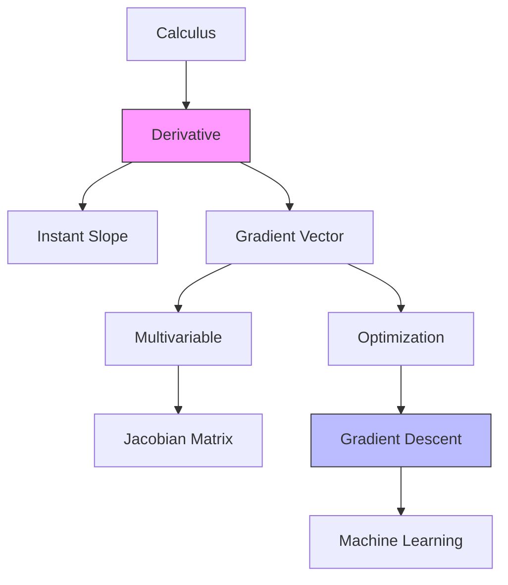

# Calculus for AI: Derivatives and Gradients

## 📜 Story Mode: The Reactor Criticality

> **Mission Date**: 2042.04.01
> **Location**: Deep Space Outpost "Vector Prime"
> **Officer**: Lead Engineer Kael
>
> **The Problem**: We fixed the hull (Linear Algebra), but the **Core Reactor** is unstable.
> The temperature $T$ is rising.
>
> I look at the gauge: $T = 3000K$.
> The Captain asks: "Is it bad?"
> I say: "3000K is high, but manageable."
>
> Suddenly, it jumps to $3100K$ in one second. Then $3300K$.
>
> The Captain screams: "It's not just hot! It's **getting hot fast**!"
>
> We don't care about the *Value* ($T$). We care about the **Rate of Change** ($\frac{dT}{dt}$).
> If the rate is positive and increasing, we explode in 30 seconds.
>
> We need to measure the **Slope**. We need to predict the future.
>
> *"Computer! Calculate the derivative of the temperature function. If the Gradient is positive, scram the reactor!"*

---

## 1. Problem Setup & Motivation

### The 6 Engineering Questions
1.  **WHAT**:
    *   **Derivative ($\frac{dy}{dx}$)**: How much output $y$ changes if you nudge input $x$ slightly.
    *   **Gradient ($\nabla f$)**: The vector of all partial derivatives. The direction of steepest ascent.
2.  **WHY**: To **Learn**. In AI, "Learning" means "Reducing Error". The Derivative tells you *which way* to move to reduce the error.
3.  **WHEN**: Every time you train a Neural Network (Backpropagation).
4.  **WHERE**:
    *   **Physics**: Velocity = Derivative of Position.
    *   **Economics**: Marginal Cost = Derivative of Cost.
5.  **WHO**: Optimization Algorithms (SGD, Adam).
6.  **HOW**: **Automatic Differentiation (Autograd)**. Computers don't use limits; they build a graph of operations and apply the Chain Rule.

> [!NOTE]
> **🛑 Pause & Explain (In Simple Words)**
>
> **Derivative = Sensitivity.**
>
> Imagine you are tweaking a radio volume knob ($x$). The volume ($y$) changes.
>
> - **High Derivative**: You touch the knob continuously, and the volume blasts your ears. (Sensitive).
> - **Zero Derivative**: You turn the knob, and nothing happens. (Dead zone).
> - **Negative Derivative**: You turn it up, but volume goes down. (Broken/Inverted).
>
> AI training is just tweaking millions of knobs (Weights) to turn down the noise (Error).

---

## 2. Mathematical Problem Formulation

### The Formal Definition (Limit)
$$ f'(x) = \lim_{h \to 0} \frac{f(x+h) - f(x)}{h} $$
*   $f(x+h) - f(x)$: The Change in Output ("Rise").
*   $h$: The Change in Input ("Run").
*   Ratio: "Rise over Run".

### The Gradient (Multivariable)
If $f(x, y)$ depends on two variables:
$$ \nabla f = \begin{bmatrix} \frac{\partial f}{\partial x} \\ \frac{\partial f}{\partial y} \end{bmatrix} $$
This vector points "Uphill". To minimize loss, we go the opposite way: $-\nabla f$.

---

## 3. Step-by-Step Derivation

### Deriving Power Rule ($x^2$)
**Goal**: Find slope of $f(x) = x^2$.
**Step 1**: Apply definition.
$$ \frac{(x+h)^2 - x^2}{h} $$
**Step 2**: Expand.
$$ \frac{x^2 + 2xh + h^2 - x^2}{h} $$
**Step 3**: Cancel $x^2$.
$$ \frac{2xh + h^2}{h} = 2x + h $$
**Step 4**: Limit $h \to 0$.
Result: $2x$.

> [!TIP]
> **🧠 Intuition Behind the Math**
>
> Why is the derivative of $x^2$ equal to $2x$?
>
> Imagine a square of side $x$. Area = $x^2$.
> If you grow the side by a tiny bit $h$, you add two thin strips of area (length $x$, width $h$).
> Total added area $\approx 2x \cdot h$.
> Divide by $h$: $2x$.
> The derivative measures the "Border" of the shape!

---

## 4. Algorithm Construction

### Map to Memory (Computational Graphs)
Computers don't do algebra. They view functions as a **Directed Acyclic Graph (DAG)**.
*   Nodes = Operations (+, *, sin).
*   Edges = Data flow.

### Algorithm: Automatic Differentiation (Reverse Mode)
**Forward Pass**: Compute outputs. Store values at each node.
**Backward Pass**: Start at Output (Error). Calculate local derivative. Multiply by incoming gradient (Chain Rule). Pass to parent.
**Complexity**: Same cost as the Forward Pass ($O(1)$ overhead). This is why Deep Learning is feasible!
>
> ### Visual Flow: Reverse Mode Differentiation
>
> ```mermaid
> graph LR
>     subgraph Forward Pass
>     x[Input x] --> Node1[Op: Square]
>     Node1 --> y[Output y]
>     end
>
>     subgraph Backward Pass
>     y -- "Grad: 1.0 (Start)" --> Node1_Grad[d(Square)/dx]
>     Node1_Grad -- "2x * 1.0" --> x_Grad[Gradient at x]
>     end
>     
>     style Forward Pass fill:#e1f5fe
>     style Backward Pass fill:#fff3e0
> ```

---

## 5. Optimization & Convergence Intuition

### Gradient Descent
$$ \mathbf{w}_{new} = \mathbf{w}_{old} - \alpha \nabla Loss $$
*   $\alpha$ (**Learning Rate**): Step size.
    *   Too big: Overshoot (Explode).
    *   Too small: Forever to converge.
*   **Intuition**: You are on a foggy mountain in the dark. You feel the ground with your foot. It slopes down to the left. You take a step left. Repeat.

---

## 6. Worked Examples

### Example 1: The Greedy CEO (Maximizing Profit)
**Function**: $Profit = -x^2 + 10x - 5$ (where $x$ is price).
**Goal**: Find optimal price.
**Derivative**: $-2x + 10$.
**Set to 0** (Peak of the hill):
$-2x + 10 = 0 \Rightarrow 2x = 10 \Rightarrow x = 5$.
**Check**: If $x=4$, Slope = +2 (Keep increasing price). If $x=6$, Slope = -2 (Decrease price).

### Example 2: Neural Net Weight Update
**Error**: $E = (w \cdot x - y)^2$.
**Given**: $x=2, y=10, w=3$.
**Prediction**: $3 \cdot 2 = 6$. Error = $(6-10)^2 = 16$.
**Derivative ($\frac{dE}{dw}$)**: $2(wx - y) \cdot x$ (Chain rule).
$= 2(6 - 10) \cdot 2 = 2(-4) \cdot 2 = -16$.
**Update**: Gradient is Negative. We must *increase* $w$ (subtract negative).
New $w = 3 - (0.01)(-16) = 3.16$.
New Prediction: $3.16 \cdot 2 = 6.32$. (Closer to 10!)

---

## 7. Production-Grade Code

### The Ship's Code (Polyglot: Pure Python + Libraries)

```python
import numpy as np
import torch
import tensorflow as tf

# LEVEL 0: Pure Python (The Numerical Math Logic)
# Math: f'(x) approx (f(x+h) - f(x-h)) / 2h
def numerical_gradient_pure(f, x, h=1e-5):
    """
    Computes derivative of ANY python function f at x.
    Slope = Rise / Run.
    """
    rise = f(x + h) - f(x - h)
    run = 2 * h
    return rise / run

def my_function(x):
    return x**2

# Test it:
# grad = numerical_gradient_pure(my_function, 3.0) 
# approx 6.0

# LEVEL 1: NumPy (Analytical/Symbolic placeholder)
def gradient_numpy(x_val):
    # NumpPy doesn't have Autograd. We must know the derivative formula.
    # d/dx(x^2) = 2x
    return 2 * x_val

# LEVEL 2: PyTorch (Autograd - Dynamic)
def gradient_torch(x_val):
    x = torch.tensor(float(x_val), requires_grad=True)
    y = x**2
    y.backward()
    return x.grad.item()

# LEVEL 3: TensorFlow (Autograd - Static/XLA)
def gradient_tf(x_val):
    x = tf.Variable(float(x_val))
    with tf.GradientTape() as tape:
        y = x**2
    # Get gradient of y with respect to x
    grad = tape.gradient(y, x)
    return grad.numpy()
```

> [!CAUTION]
> **🛑 Production Warning**
>
> `.backward()` accumulates gradients. If you run it twice in a loop without clearing, they add up.
> **Cardinal Rule**: Always call `optimizer.zero_grad()` before the next step!

> [!CAUTION]
> **🛑 Production Warning**
>
> `.backward()` accumulates gradients. If you run it twice in a loop without clearing, they add up.
> **Cardinal Rule**: Always call `optimizer.zero_grad()` before the next step!
>
> ### Visualizing the Derivative (The "Tangent Line")
> Use this script to *see* the math.
>
> ```python
> import numpy as np
> import matplotlib.pyplot as plt
>
> def plot_derivative_visual():
>     # 1. Define Function: f(x) = x^2
>     x = np.linspace(-5, 5, 100)
>     y = x**2
>
>     # 2. Pick a point to inspect: x = 2
>     x_point = 2
>     y_point = x_point**2
>     slope = 2 * x_point # Derivative: 2x -> 4
>
>     # 3. Tangent Line Equation: y = mx + c => y - y1 = m(x - x1)
>     # at x=2: y = 4(x - 2) + 4
>     tangent_y = slope * (x - x_point) + y_point
>
>     # 4. Plot
>     plt.figure(figsize=(8, 5))
>     plt.plot(x, y, label="f(x) = x^2 (The Curve)")
>     plt.plot(x, tangent_y, '--r', label=f"Tangent at x={x_point} (Slope={slope})")
>     plt.scatter([x_point], [y_point], color='red', zorder=5)
>     plt.title("Visualizing the Derivative: The Instantaneous Slope")
>     plt.legend()
>     plt.grid(True)
>     plt.show()
>
> # Uncomment to run:
> # plot_derivative_visual()
> ```

---

## 8. System-Level Integration

```mermaid
graph TD
    Input --> Mul[*]
    Weights --> Mul
    Mul --> Add[+]
    Bias --> Add
    Add --> Loss[MSE Loss]
    Loss --> |Backward()| Add_Grad[Grad Add]
    Add_Grad --> |Chain Rule| Mul_Grad[Grad Mul]
    Mul_Grad --> Weight_Update
```

**Where it lives**:
**PyTorch/TensorFlow Core**: The "Autograd Engine" tracks every bits of memory.
**Memory Cost**: Training takes 2x-3x more RAM than inference because we must store the "Intermediate Activations" to compute gradients later.

---

## 9. Evaluation & Failure Analysis

### Failure Mode: Vanishing Gradients
In deep networks (many layers), we multiply gradients: $0.1 \times 0.1 \times 0.1 \dots$
The signal becomes $0.0000001$. The earliest layers stop learning.
**Fix**: ReLU Activation (Derivative is 1, not <1), Residual Connections (ResNet).

### Failure Mode: Exploding Gradients
Gradient becomes $10 \times 10 \times 10 \dots =$ NaN.
**Fix**: Gradient Clipping (If grad > 5, set to 5).

---

## 10. Ethics, Safety & Risk Analysis

### Adversarial Attacks (Gradient Based)
Hackers use gradients too.
They compute: $\nabla_{input} Loss$.
"How can I change the **Image Pixels** to maximize the Error?"
They add this gradient to the image. To humans, it looks the same. To AI, it looks like a toaster.
**Defense**: Adversarial Training.

---

## 11. Advanced Theory & Research Depth

## 11. Advanced Theory & Research Depth

### Jacobian Matrix
For functions mapping Vector $\to$ Vector ($\mathbb{R}^n \to \mathbb{R}^m$).
The "Derivative" is a matrix of size $m \times n$.
Crucial for Robotics (Inverse Kinematics).

### 📚 Deep Dive Resources
*   **Paper**: "Automatic Differentiation in Machine Learning: a Survey" (Baydin et al., 2018) - The definitive guide to how Autograd works under the hood. [ArXiv:1502.05767](https://arxiv.org/abs/1502.05767)
*   **Concept**: **Dual Numbers**. A mathematical trick ($a + b\epsilon$ where $\epsilon^2=0$) that allows calculating derivatives exactly without limits.


---

## 12. Career & Mastery Signals

### Cadet (Junior)
*   Can inspect `.grad` in PyTorch to debug "frozen" layers.
*   Knows that `detach()` stops gradient flow.

### Commander (Senior)
*   Writes custom `torch.autograd.Function` for non-differentiable operations (like ArgMax approximations).
*   Debugs `NaN` gradients using `torch.autograd.detect_anomaly()`.

---

## 13. Industry Interview Corner

### ❓ Real World Questions
**Q1: "Can we use data that isn't differentiable?"**
*   **Answer**: "Strictly speaking, gradient descent requires differentiable functions. However, we can use techniques like Reinforcement Learning (Policy Gradient) or Straight-Through Estimators (STE) to estimate gradients through blocks like Quantization or ArgMax."

**Q2: "What is the difference between Forward-Mode and Reverse-Mode Differentiation?"**
*   **Answer**: "Reverse-Mode (Backprop) is efficient when Inputs >> Outputs (Loss is scalar). It costs proportional to outputs. Forward-Mode is efficient when Outputs >> Inputs. AI uses Reverse-Mode because we usually condense millions of pixels into 1 Loss value."

**Q3: "Why do gradients explode in RNNs?"**
*   **Answer**: "Because of the Chain Rule repeatedly multiplying the same weight matrix $W$ ($W \cdot W \cdot W$). If the largest eigenvalue $>1$, the product grows exponentially. We fix this with LSTM gates (Additive gradient flow) or Gradient Clipping."

---

## 14. Debug Your Thinking (Common Misconceptions)

### ❌ Myth: "Numerical Gradient (checking with h=0.0001) is too slow."
**✅ Truth**: It IS slow for training, but it is **Mandatory** for debugging. If your backprop implementation violates the Gradient Check (Numerical vs Analytical match), your code is wrong.

### ❌ Myth: "Stop Gradient means stop learning."
**✅ Truth**: Yes, but we use it intentionally. E.g., in GANs, we freeze the Generator while training the Discriminator. In PyTorch `x.detach()` creates a new tensor that shares data but cuts the graph wire.


---

## 15. Assessment & Mastery Checks

**Q1: Velocity**
If Position $x(t) = t^2$, what is Velocity at $t=3$?
*   *Answer*: $v(t) = 2t$. $v(3) = 6$.

**Q2: Zero Gradient**
What does $\nabla f = 0$ mean?
*   *Answer*: You are at a flat point (Peak, Valley, or Saddle Point). You have converged (or got stuck).

---

## 16. Further Reading & Tooling

*   **Article**: *"Calculus on Computational Graphs: Backpropagation"* (Colah's Blog).
*   **Library**: **JAX** - Google's library that can differentiate *any* Python function, including loops and if-statements.

---

## 17. Concept Graph Integration

*   **Previous**: [Singular Value Decomposition](01_foundation_math_cs/01_linear_algebra/07_svd.md) (End of Linear Algebra).
*   **Next**: [Chain Rule & Backpropagation](01_foundation_math_cs/02_calculus/02_chain_rule.md) (Applying this to networks).

### Concept Map

