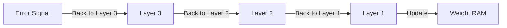

# Calculus for AI: Chain Rule & Backpropagation

## 📜 Story Mode: The Blame Game

> **Mission Date**: 2042.04.02
> **Location**: Deep Space Outpost "Vector Prime"
> **Officer**: Lead Engineer Kael
>
> **The Problem**: The reactor is still slightly unstable. The "Cooling System" failed.
> But the Cooling System is complex. It works like this:
> 1.  **Valve A** controls **Pressure B**.
> 2.  **Pressure B** controls **Flow C**.
> 3.  **Flow C** controls **Temperature T**.
>
> The Temperature is too high. I need to fix it.
> I can't touch the Temperature directly. I can only turn **Valve A**.
>
> I ask: "If I turn Valve A closer, how much will Temperature T change?"
>
> The system says: "I don't know. I only know how A affects B."
>
> I realize: I need to chain the logic.
> "A affects B. B affects C. C affects T."
> So: **Effect(A -> T) = Effect(A -> B) $\times$ Effect(B -> C) $\times$ Effect(C -> T)**.
>
> *"Computer! Initiate Backpropagation Protocol. Trace the error from the Core back to the Valve. Find the root cause!"*

---

## 1. Problem Setup & Motivation

### The 6 Engineering Questions
1.  **WHAT**:
    *   **Chain Rule**: The math formula for the derivative of nested functions: $\frac{dz}{dx} = \frac{dz}{dy} \cdot \frac{dy}{dx}$.
    *   **Backpropagation**: The algorithm that applies the Chain Rule to Neural Networks efficiently.
2.  **WHY**: Neural Networks are just massive nested functions: $y = f_L(f_{L-1}(\dots f_1(x)))$. We need to know how the *first* layer weights affect the *final* error.
3.  **WHEN**: Every single training step of every deep learning model.
4.  **WHERE**: Inside `loss.backward()`.
5.  **WHO**: The "Autograd" engine.
6.  **HOW**: By multiplying local gradients (Jacobians) together, starting from the loss and moving backward.

> [!NOTE]
> **🛑 Pause & Explain (In Simple Words)**
>
> **The Chain Rule is just "Passing the Buck".**
>
> Imagine a CEO (Loss) wants to increase profits (reduce error).
> - CEO yells at Manager: "Profits are down!" (Gradient at Output).
> - Manager yells at Worker: "Producing too slow!" (Gradient at Hidden Layer).
> - Worker yells at Machine: "Run faster!" (Gradient at Input Weights).
>
> Each person takes the message "You need to change," scales it by their own responsibility ("Local Gradient"), and passes it back.

---

## 2. Mathematical Problem Formulation

### The Formula
If $z = f(y)$ and $y = g(x)$, then $z = f(g(x))$.
$$ \frac{dz}{dx} = \frac{dz}{dy} \cdot \frac{dy}{dx} $$
*   **$\frac{dz}{dy}$**: "Upstream Gradient" (Coming from the end).
*   **$\frac{dy}{dx}$**: "Local Gradient" (How this specific gate works).
*   **Product**: Multiplication.

### Deeper Nesting
If $L(a(b(c(x))))$, then:
$$ \frac{dL}{dx} = \frac{dL}{da} \cdot \frac{da}{db} \cdot \frac{db}{dc} \cdot \frac{dc}{dx} $$

---

## 3. Step-by-Step Derivation

### Deriving Backprop for a Simple Neuron
**Model**: $z = wx + b$, $a = \sigma(z)$, $L = (a - y)^2$.
**Goal**: Find $\frac{dL}{dw}$.

**Step 1: Break it down (The Chain)**
We need $\frac{dL}{dw}$. Path is $w \to z \to a \to L$.
$$ \frac{dL}{dw} = \frac{dL}{da} \cdot \frac{da}{dz} \cdot \frac{dz}{dw} $$

**Step 2: Calculate Local Gradients**
1.  **Loss to Activation**: $\frac{dL}{da} = 2(a - y)$.
2.  **Activation to Logit** (Sigmoid derivative): $\frac{da}{dz} = \sigma(z)(1 - \sigma(z))$.
3.  **Logit to Weight**: $\frac{dz}{dw} = x$.

**Step 3: Multiply them**
$$ \frac{dL}{dw} = [2(a - y)] \cdot [\sigma(z)(1-\sigma(z))] \cdot [x] $$
**Result**: We have a precise number telling us how to update $w$.

> [!TIP]
> **🧠 Intuition Behind the Math**
>
> Notice the term $x$ at the end.
> It means: "If the input $x$ was big, this weight had a HUGE effect. Blame it more."
> "If the input $x$ was 0, this weight did nothing. Don't blame it."

---

## 4. Algorithm Construction

### Map to Memory (The "Cache")
To compute backprop, we need the values of $a$ and $z$ from the Forward Pass.
We must **Cache** (save) them.
This means memory usage $\propto$ Depth of Network.
If you run out of VRAM ("OOM Error"), it's usually because the graph is too deep/wide and storing too many intermediate values.

### Algorithm: Backpropagation
1.  **Forward**: Compute $x \to h \to y$. Save $x, h$ in memory.
2.  **Backward Init**: Gradient at output = 1.0 (or loss derivative).
3.  **Loop Backward**:
    *   Pop node specific values ($h$).
    *   Compute Local Grad.
    *   Multiply by Incoming Grad.
    *   Pass to parent.

---

## 5. Optimization & Convergence Intuition

### The Vanishing Gradient Problem (Revisited)
Recall the Chain: $\frac{dL}{dx} = g_1 \cdot g_2 \cdot g_3 \dots \cdot g_{100}$.
If "Local Gradient" of Sigmoid is max 0.25...
$0.25^{100} \approx 0$.
The signal dies. The CEO's message never reaches the factory floor.
**Solution**: **ReLU** ($f(x) = \max(0, x)$).
Derivative is 1 (if $x>0$) or 0.
$1^{100} = 1$. The signal survives!

---

## 6. Worked Examples

### Example 1: The "Add" Gate vs The "Multiply" Gate
**Gate 1**: $z = x + y$.
$\frac{dz}{dx} = 1$. $\frac{dz}{dy} = 1$.
**Gradients Flow**: An "Add" gate is a **Gradient Distributor**. It takes the incoming gradient and copies it to both inputs equally.

**Gate 2**: $z = x \cdot y$.
$\frac{dz}{dx} = y$. $\frac{dz}{dy} = x$.
**Gradients Flow**: A "Multiply" gate is a **Gradient Switcher**.
If $x$ is huge and $y$ is tiny:
$x$ gets a tiny gradient (scaled by small $y$).
$y$ gets a huge gradient (scaled by big $x$).
**Lesson**: Large inputs make their *partners* extremely sensitive.

---

## 7. Production-Grade Code

### The Ship's Code (Polyglot: Pure Python + Libraries)

```python
import numpy as np
import torch
import tensorflow as tf

# LEVEL 0: Pure Python (The Backprop Logic)
# Scenario: f(x) = (x * w)^2
# Chain: x -> z=x*w -> y=z^2
def backprop_pure(x, w, target):
    # 1. Forward Pass (Cache values)
    z = x * w
    y = z ** 2
    loss = (y - target) ** 2
    
    # 2. Backward Pass (Chain Rule)
    # dLoss/dy = 2(y - target)
    grad_y = 2 * (y - target)
    
    # dy/dz = 2z
    grad_z = grad_y * (2 * z)
    
    # dz/dw = x
    grad_w = grad_z * x
    
    return grad_w

# LEVEL 1: NumPy (Manual Vectorized Backprop)
def backprop_numpy(X, W, y_true):
    # Forward
    z = X @ W
    y_pred = 1 / (1 + np.exp(-z)) # Sigmoid
    
    # Backward (dL/dW) for Binary Cross Entropy
    # The magical simplification: X.T * (y_pred - y_true)
    error = y_pred - y_true
    grad_w = X.T @ error
    return grad_w

# LEVEL 2: PyTorch (Autograd)
def backprop_torch(x_val, w_val, target):
    x = torch.tensor(x_val)
    w = torch.tensor(w_val, requires_grad=True)
    
    y = (x * w) ** 2
    loss = (y - target) ** 2
    
    loss.backward()
    return w.grad

# LEVEL 3: TensorFlow (GradientTape)
def backprop_tf(x_val, w_val, target):
    x = tf.constant(x_val)
    w = tf.Variable(w_val)
    
    with tf.GradientTape() as tape:
        y = (x * w) ** 2
        loss = (y - target) ** 2
        
    grad = tape.gradient(loss, w)
    grad = tape.gradient(loss, w)
    return grad

# LEVEL 4: Visualization (Vanishing Gradient)
def plot_gradients():
    """
    Visualizes why Deep Sigmoid Networks die.
    """
    import matplotlib.pyplot as plt
    
    x = np.linspace(-6, 6, 100)
    
    # 1. Sigmoid Derivative
    sigmoid = 1 / (1 + np.exp(-x))
    grad_sigmoid = sigmoid * (1 - sigmoid) # Max value is 0.25
    
    # 2. ReLU Derivative
    grad_relu = (x > 0).astype(float) # Max value is 1.0
    
    plt.figure(figsize=(10, 5))
    plt.plot(x, grad_sigmoid, label="Sigmoid Gradient (Max 0.25)", color='red')
    plt.plot(x, grad_relu, label="ReLU Gradient (Max 1.0)", color='green', linestyle='--')
    
    plt.title("The Vanishing Gradient: 0.25^100 ≈ 0 vs 1^100 = 1")
    plt.axhline(0, color='grey', alpha=0.5)
    plt.axvline(0, color='grey', alpha=0.5)
    plt.legend()
    plt.grid(True)
    plt.show()
```

> [!CAUTION]
> **🛑 Production Warning**
>
> You rarely write custom backward passes.
> Only do this if you are inventing a new mathematical operation efficiently (e.g., a custom attention kernel). Otherwise, let PyTorch handle it.

---

## 8. System-Level Integration



**Where it lives**:
**Checkpointing**: To save VRAM, we can "forget" the intermediate values and re-compute them during the backward pass. This trades Compute (slower) for Memory (cheaper). `torch.utils.checkpoint`.

---

## 9. Evaluation & Failure Analysis

### Failure Mode: Broken Chain
If you use a function like `np.argmax` or `round()` inside your model...
These functions are **Step Functions**.
Their derivative is 0 everywhere (or undefined).
The chain breaks. The gradient becomes 0. The model learns nothing.
**Fix**: Use "Softmax" (smooth argmax) or "Straight-Through Estimator".

---

## 10. Ethics, Safety & Risk Analysis

### Interpreting Influence
Backpropagation gives us **Saliency Maps**.
We can ask: "Which pixels in the image contributed most to the decision 'Cat'?"
**Safety**: Keep asking "Why?". If the model is looking at the *background grass* to identify the cow, not the cow itself, you have a **Spurious Correlation**. The gradient reveals this cheating.

---

## 11. Advanced Theory & Research Depth

## 11. Advanced Theory & Research Depth

### Hessian-Vector Products
The gradient is the 1st derivative.
Can we compute the 2nd derivative (Hessian) efficiently?
Yes, by "Backpropagating through the Backpropagation".
Used for advanced optimizers (Newton's Method) to converge faster.

### 📚 Deep Dive Resources
*   **Paper**: "Learning Representations by Back-propagating Errors" (Rumelhart, Hinton, Williams, 1986) - The paper that started it all. [Nature Link](https://www.nature.com/articles/323533a0)
*   **Concept**: **Computational Graph Optimization**. How compilers like **XLA** (TensorFlow) or **Inductor** (PyTorch 2.0) fuse chain rule operations into a single GPU kernel.


---

## 12. Career & Mastery Signals

### Cadet (Junior)
*   Understands that Backprop is just the Chain Rule.
*   Can inspect `loss.item()` to verify training.

### Commander (Senior)
*   Implements **Gradient Checkpointing** to train larger models on limited VRAM.
*   Debugs **Exploding Gradients** by inspecting the Norm of the gradient vector before the optimizer step.

---

## 13. Industry Interview Corner

### ❓ Real World Questions
**Q1: "Why do we need the Chain Rule?"**
*   **Answer**: "Because Deep Learning models are composite functions ($f(g(h(x)))$). The Chain Rule allows us to attribute error locally to parameters that are hidden deep inside the function stack, decoupling the complexity of the layers."

**Q2: "What is the Vanishing Gradient problem mathematically?"**
*   **Answer**: "Since Backprop involves multiplying gradients, if the local derivatives are small ($<1$, like Sigmoid), the product approaches zero exponentially with depth. This stops earlier layers from learning."

**Q3: "Does Backpropagation work with non-differentiable functions like ReLU?"**
*   **Answer**: "Technically ReLU is not differentiable at exactly 0. In practice, we define a **Subderivative** (usually 0 or 1) at that point. Since the probability of hitting exactly 0.000000 is zero, it works fine."

---

## 14. Debug Your Thinking (Common Misconceptions)

### ❌ Myth: "Backprop is the learning algorithm."
**✅ Truth**: Backprop is just the **Gradient Calculation** algorithm. The *Learning* algorithm is Gradient Descent (Optimizer) which *uses* the values from Backprop to update weights.

### ❌ Myth: "We need 2nd derivatives for better learning."
**✅ Truth**: 2nd Order methods (Newton) are faster per step but prohibitively expensive to compute ($O(N^2)$ Hessian). 1st Order (SGD) is 'good enough' and scales to billions of params.


---

## 15. Assessment & Mastery Checks

**Q1: Chain Rule Logic**
If $y=3x$ and $z=y^2$:
What is $dz/dx$?
*   *Answer*: $dz/dy = 2y$. $dy/dx = 3$.
    $dz/dx = (2y)(3) = 6y = 6(3x) = 18x$.

**Q2: Sigmoid Gradient**
What is the max value of Sigmoid derivative?
*   *Answer*: 0.25 (at x=0). This explains why deep sigmoid networks die (0.25 is small).

---

## 16. Further Reading & Tooling

*   **Paper**: *"Learning Representations by Back-propagating Errors"* (Rumelhart, Hinton, Williams, 1986) - The paper that started it all.
*   **Visual**: **TensorFlow Playground** - Watch the weights update in real time.

---

## 17. Concept Graph Integration

*   **Previous**: [Derivatives](01_foundation_math_cs/02_calculus/01_derivatives_gradients.md).
*   **Next**: [Jacobian & Hessians](01_foundation_math_cs/02_calculus/03_jacobian_hessian.md) (Multivariable Calculus).

### Concept Map
```mermaid
graph TD
    Chain[Chain Rule] --> Nested[Nested Functions f(g(x))]
    Chain --> Product[Gradient Product]
    
    Product --> Local[Local Gradient]
    Product --> Upstream[Upstream Gradient]
    
    Chain --> Backprop[Backpropagation]
    Backprop --> Graph[Comp Graph]
    Backprop --> Cache[Cache Forward Values]
    
    Backprop --> Vanish[Vanishing Gradient]
    Vanish --> ReLU[ReLU Fix]
    
    style Chain fill:#f9f,stroke:#333
    style Backprop fill:#bbf,stroke:#333
```
