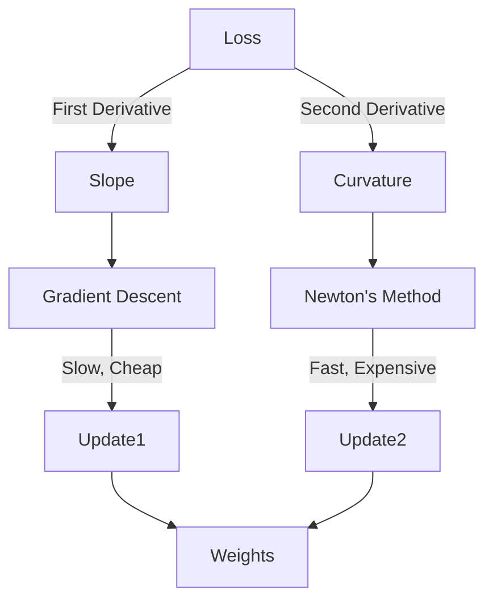

# Calculus for AI: Jacobians & Hessians

## 📜 Story Mode: The Landscape

> **Mission Date**: 2042.04.05
> **Location**: Deep Space Outpost "Vector Prime"
> **Officer**: Lead Engineer Kael
>
> **The Problem**: We fixed the reactor (Backprop), but the repair bots are moving too slowly.
> They are using simple Gradient Descent. They look at the ground, find a slope, and take a step.
>
> But the terrain is tricky. It's not a simple hill. It's a **Valley**.
> The bots are bouncing back and forth across the valley walls instead of walking down the riverbed.
>
> They only know the **Slope** (Gradient).
> They don't know the **Curvature** (Hessian).
>
> If they knew the curvature, they would say: "Ah, this is a narrow valley. I should take small steps sideways and big steps forward."
>
> *"Computer! Calculate the Hessian Matrix. Map the curvature of the optimization landscape. Switch to Newton's Method!"*

---

## 1. Problem Setup & Motivation

### The 6 Engineering Questions
1.  **WHAT**:
    *   **Jacobian ($\mathbf{J}$)**: The matrix of all first-order partial derivatives. Mapps Input velocities to Output velocities.
    *   **Hessian ($\mathbf{H}$)**: The matrix of all second-order partial derivatives. Measures "Curvature" or "Acceleration".
2.  **WHY**:
    *   **Jacobian**: Needed when transforming coordinate systems (e.g., Robot Arms).
    *   **Hessian**: Needed to know if a flat point is a Peak, Valley, or Saddle Point.
3.  **WHEN**: Advanced Optimization (Newton's Method), Sensitivity Analysis, Robotics.
4.  **WHERE**:
    *   **Robotics**: Inverse Kinematics (How do I move my joints to move my hand *here*?).
    *   **GANs**: Mode Collapse analysis.
5.  **WHO**: Research Scientists, Robotics Engineers.
6.  **HOW**: `torch.autograd.functional.jacobian`, `hessian`.

> [!NOTE]
> **🛑 Pause & Explain (In Simple Words)**
>
> **Gradient = Velocity.** (How fast am I falling?)
> **Hessian = Acceleration.** (Is the slope getting steeper or flatter?)
>
> - **Zero Gradient**: You are stopped.
> - **Positive Hessian**: You are in a **Bowl** (Minimum).
> - **Negative Hessian**: You are on a **Hill** (Maximum).
> - **Mixed Hessian**: You are on a **Horse Saddle** (Up in one direction, Down in another).

---

## 2. Mathematical Problem Formulation

### The Jacobian Matrix
For a function $\mathbf{f}: \mathbb{R}^n \to \mathbb{R}^m$ (n inputs, m outputs).
$$ \mathbf{J} = \begin{bmatrix}
\frac{\partial f_1}{\partial x_1} & \dots & \frac{\partial f_1}{\partial x_n} \\
\vdots & \ddots & \vdots \\
\frac{\partial f_m}{\partial x_1} & \dots & \frac{\partial f_m}{\partial x_n}
\end{bmatrix} $$
Dimensions: $m \times n$.

### The Hessian Matrix
For a scalar function $L: \mathbb{R}^n \to \mathbb{R}$ (Loss function).
$$ \mathbf{H} = \begin{bmatrix}
\frac{\partial^2 L}{\partial x_1^2} & \frac{\partial^2 L}{\partial x_1 \partial x_2} \\
\frac{\partial^2 L}{\partial x_2 \partial x_1} & \frac{\partial^2 L}{\partial x_2^2}
\end{bmatrix} $$
Dimensions: $n \times n$ (Always symmetric).

---

## 3. Step-by-Step Derivation

### Deriving the Hessian of $f(x, y) = x^2 + y^2$
**Goal**: Find curvature.
**Step 1: First Derivatives (Gradient)**
$\frac{\partial f}{\partial x} = 2x$.
$\frac{\partial f}{\partial y} = 2y$.

**Step 2: Second Derivatives (Hessian)**
$H_{11} = \frac{\partial}{\partial x}(2x) = 2$.
$H_{22} = \frac{\partial}{\partial y}(2y) = 2$.
$H_{12} = \frac{\partial}{\partial y}(2x) = 0$.
$H_{21} = \frac{\partial}{\partial x}(2y) = 0$.

**Step 3: Assemble**
$$ \mathbf{H} = \begin{bmatrix} 2 & 0 \\ 0 & 2 \end{bmatrix} $$
**Interpretation**: Positive eigenvalues (2, 2). It's a Bowl (Minimum). Curvature is uniform.

> [!TIP]
> **🧠 Intuition Behind the Math**
>
> If the Hessian has:
> - All Positive Eigenvalues: **Bowl** (Happy, stable minimum).
> - All Negative Eigenvalues: **Hill** (Unstable peak).
> - Mixed (+ and -): **Saddle Point**.
>
> **Saddle Points** are the biggest enemy in Deep Learning. Gradient Descent gets confused because "It looks flat" (Grad=0), but it's not a minimum.

---

## 4. Algorithm Construction

### Map to Memory (The Expansion)
Gradient size: $N$ (Parameters).
Hessian size: $N^2$.
**Example**: GPT-3 has 175 Billion params.
Hessian = $1.75 \cdot 10^{11} \times 1.75 \cdot 10^{11}$.
**Memory**: 100 Billion Exabytes. Impossible.
**Solution**: We never compute the full Hessian. We use **Hessian-Vector Products (HVP)** or "Diagonal Approximations" (Adam).

> [!IMPORTANT]
> **🧠 The "VJP" Secret (Vector-Jacobian Product)**
>
> In Backpropagation, we never actually form the full Jacobian Matrix $\mathbf{J}$.
> We only care about how the Gradient Vector $\mathbf{v}$ gets transformed.
> We calculate $\mathbf{v}^T \mathbf{J}$ directly.
>
> - **Computing $\mathbf{J}$**: $O(N^2)$ memory. (Impossible).
> - **Computing $\mathbf{v}^T \mathbf{J}$ (VJP)**: $O(N)$ memory. (Cheap).
>
> Deep Learning frameworks (JAX, PyTorch) are just **VJP Engines**.

### Algorithm: Newton's Method (Optimized)
Instead of $x_{new} = x - \alpha g$, use:
$$ x_{new} = x - \mathbf{H}^{-1} g $$
It jumps directly to the bottom of the parabola.
**Pros**: Converges in 5 steps.
**Cons**: Computing $\mathbf{H}^{-1}$ is $O(N^3)$. Impossible for NN.

---

## 5. Optimization & Convergence Intuition

### Second-Order Optimization (Adam)
Adam (Adaptive Moment Estimation) is a "Quasi-Newton" method.
It keeps a running average of $g^2$ (variance).
This $g^2$ acts like a cheap "Diagonal Hessian".
If gradients are noisy (high variance), Adam takes smaller steps (divides by $\sqrt{v}$).
This mimics the "Curvature" awareness without the cost.

---

## 6. Worked Examples

### Example 1: The Robot Arm (Jacobian)
**Arm**: Length $L$. Angle $\theta$.
Position $x = L \cos(\theta)$, $y = L \sin(\theta)$.
**Goal**: Move hand velocity $(\dot{x}, \dot{y})$. How fast do I spin $\theta$?
**Jacobian**:
$\frac{\partial x}{\partial \theta} = -L \sin(\theta)$.
$\frac{\partial y}{\partial \theta} = L \cos(\theta)$.
$$ \mathbf{v} = \mathbf{J} \cdot \dot{\theta} $$
To find required $\dot{\theta}$, we invert $\mathbf{J}$. $\dot{\theta} = \mathbf{J}^{-1} \mathbf{v}$.
**Singularity**: If arm is fully stretched ($ \theta = 0$), $\mathbf{J}$ loses rank. You physically cannot move in X direction using $\theta$.

### Example 2: The Saddle (Hessian)
**Function**: $f(x, y) = x^2 - y^2$.
**Grad at (0,0)**: $[0, 0]$. (Looks stable).
**Hessian**: $\begin{bmatrix} 2 & 0 \\ 0 & -2 \end{bmatrix}$.
**Eigenvalues**: +2 and -2.
**Analysis**: Stable in X (Bowl), Unstable in Y (Hill).
If a ball lands here, it might stay for a while, then roll off along Y.

---

## 7. Production-Grade Code

### The Ship's Code (Polyglot: Pure Python + Libraries)

```python
import numpy as np
import torch
import tensorflow as tf

# LEVEL 0: Pure Python (Numerical Jacobian)
# Math: J_ij = d(f_i)/d(x_j)
def numerical_jacobian_pure(f, x, h=1e-5):
    """
    Computes Jacobian by perturbing each input x_j and measuring change in each output f_i.
    x: List of floats.
    """
    n = len(x)
    # 1. Get baseline output
    y_base = f(x)
    m = len(y_base)
    
    J = [[0.0]*n for _ in range(m)]
    
    for j in range(n):
        # 2. Perturb input j
        x_plus = x[:]
        x_plus[j] += h
        y_plus = f(x_plus)
        
        # 3. Compute derivative for each output i
        for i in range(m):
            rise = y_plus[i] - y_base[i]
            run = h
            J[i][j] = rise / run
            
    return J

def my_robot_arm(angle_list):
    # Pure python conversion of the robot arm logic
    theta1, theta2 = angle_list
    x = math.cos(theta1) + math.cos(theta1 + theta2)
    y = math.sin(theta1) + math.sin(theta1 + theta2)
    return [x, y]

import math # Needed for the python function above

# LEVEL 1: NumPy (Not Applicable)
# NumPy doesn't do Autograd. You have to derive the Jacobian manually on paper
# and write a function `def analytical_jacobian(x): ...`

# LEVEL 2: PyTorch (Research - Functional API)
def jacobian_torch(func, inputs):
    # torch.autograd.functional.jacobian is the modern way
    return torch.autograd.functional.jacobian(func, inputs)

# LEVEL 3: TensorFlow (Production - GradientTape)
def jacobian_tf(func, inputs_tensor):
    with tf.GradientTape() as tape:
        tape.watch(inputs_tensor)
        y = func(inputs_tensor)
    return tape.jacobian(y, inputs_tensor)

# LEVEL 4: Visualization (The Saddle Point)
def plot_saddle_point():
    """
    Visualizes f(x,y) = x^2 - y^2 (The Pringles Chip).
    """
    import matplotlib.pyplot as plt
    from mpl_toolkits.mplot3d import Axes3D
    
    x = np.linspace(-2, 2, 30)
    y = np.linspace(-2, 2, 30)
    X, Y = np.meshgrid(x, y)
    Z = X**2 - Y**2 # Curvature up in X, down in Y
    
    fig = plt.figure(figsize=(10, 6))
    ax = fig.add_subplot(111, projection='3d')
    
    surf = ax.plot_surface(X, Y, Z, cmap='coolwarm', edgecolor='none', alpha=0.8)
    
    # Plot the Saddle Point at (0,0)
    ax.scatter([0], [0], [0], color='black', s=100, label="Saddle Point (Grad=0)")
    
    ax.set_title("Saddle Point: Min in X, Max in Y")
    ax.set_xlabel("X (bowl)")
    ax.set_ylabel("Y (hill)")
    plt.legend()
    plt.show()
```

> [!CAUTION]
> **🛑 Production Warning**
>
> `hessian(f, x)` is extremely slow ($O(N^2)$).
> In training loops, never compute full Hessians. Use `torch.autograd.grad` twice if you absolutely need a specific second derivative (like for Gradient Penalty in WGANs).

> [!CAUTION]
> **🛑 Production Warning**
>
> `hessian(f, x)` is extremely slow.
> In training loops, never compute full Hessians. Use `torch.autograd.grad` twice if you absolutely need a specific second derivative (like for Gradient Penalty in WGANs).

---

## 8. System-Level Integration



**Where it lives**:
**Saddle Free Newton (SFN)**: Research optimizers that try to specifically escape saddle points using curvature information.

---

## 9. Evaluation & Failure Analysis

### Failure Mode: Ill-Conditioned Hessian
If the Hessian has one huge eigenvalue (1000) and one tiny (0.001).
This creates a "Canyon".
Gradient Descent bounces on the walls (direction 1000) and crawls along the floor (direction 0.001).
**Fix**: Batch Norm, Skip Connections (ResNet actually smoothens the Hessian!).

---

## 10. Ethics, Safety & Risk Analysis

### Robustness & Curvature
A "Sharp Minimum" (High curvature Hessian) means if you change weights slightly, Loss explodes.
A "Flat Minimum" (Low curvature Hessian) means you can change weights without hurting accuracy.
**Generalization**: Flat Minima generalize better.
**Safety**: We prefer models that end up in flat regions, because they are robust to noise and quantization.

---

## 11. Advanced Theory & Research Depth

## 11. Advanced Theory & Research Depth

### The Neural Tangent Kernel (NTK)
A theory that treats the Hessian/Jacobian of infinite-width networks.
It explains *why* massive networks converge so easily (The Optimization Landscape becomes surprisingly smooth).

### 📚 Deep Dive Resources
*   **Paper**: "Visualizing the Loss Landscape of Neural Nets" (Li et al., 2018) - Famous paper showing how ResNets smoothen the Hessian. [ArXiv:1712.09913](https://arxiv.org/abs/1712.09913)
*   **Concept**: **Fisher Information Matrix**. Closely related to the Hessian (identical near the optimum). Used in Natural Gradient Descent.


---

## 12. Career & Mastery Signals

### Cadet (Junior)
*   Knows that Gradient is First Order, Hessian is Second Order.
*   Avoids computing second derivatives unless absolutely necessary.

### Commander (Senior)
*   Uses **Hessian-Vector Products (HVP)** to estimate curvature without storing the full matrix.
*   Implemented **Gradient Penalty** (WGAN-GP) which requires double-backprop.

---

## 13. Industry Interview Corner

### ❓ Real World Questions
**Q1: "Why don't we use Newton's Method (2nd Order) for Deep Learning?"**
*   **Answer**: "Because it requires inverting the Hessian Matrix ($H^{-1}$). The Hessian is $N \times N$. For 1 Billion parameters, storing it requires Exabytes of RAM, and inverting it is $O(N^3)$. It is computationally impossible. We use First-Order methods (SGD/Adam) instead."

**Q2: "What is a Saddle Point and why is it a problem?"**
*   **Answer**: "A point where gradients are zero, but it's not a minimum (it curves up in one direction, down in another). In high dimensions, saddle points are exponentially more common than local minima. Simple SGD can get stuck there, but Momentum helps escape."

**Q3: "How does batch size affect the 'noise' of the gradient?"**
*   **Answer**: "Smaller batch size = Noisier Gradient (High Variance). Larger batch size = Smoother Gradient (Approximates the true population gradient). Interestingly, some noise helps jump out of sharp local minima."

---

## 14. Debug Your Thinking (Common Misconceptions)

### ❌ Myth: "Training stops when Gradient is Zero."
**✅ Truth**: Not always. You might be at a Saddle Point. Or, more likely, you are bouncing around the minimum because of the Learning Rate noise. We rarely hit exactly 0.000.

### ❌ Myth: "The loss landscape is a chaotic collection of millions of local minima."
**✅ Truth**: Research (NTK, Mode Connectedness) shows that for massive overparameterized networks, "All global minima are roughly equally good" and connected by simple paths. The landscape is friendlier than we thought.


---

## 15. Assessment & Mastery Checks

**Q1: Jacobian Shape**
Function $f: \mathbb{R}^3 \to \mathbb{R}^2$. Inputs 3, Outputs 2.
Jacobian size?
*   *Answer*: $2 \times 3$. (Outputs $\times$ Inputs).

**Q2: Convexity**
If the Hessian is "Positive Definite" everywhere, what shape is the function?
*   *Answer*: Strictly Convex (A perfect bowl). Global Minimum is guaranteed.

---

## 16. Further Reading & Tooling

*   **Paper**: *"Visualizing the Loss Landscape of Neural Nets"* (Li et al., 2018).
*   **Tool**: **Loss Landscape Visualizer** (GitHub repo).

---

## 17. Concept Graph Integration

*   **Previous**: [Chain Rule](01_foundation_math_cs/02_calculus/02_chain_rule.md).
*   **Next**: [Integrals](01_foundation_math_cs/02_calculus/04_integrals.md) (Accumulation).

### Concept Map
```mermaid
graph TD
    Calc[Multivariable Calculus] --> Derivative[Derivatives]
    
    Derivative --> First[First Order]
    First --> Grad[Gradient Vector]
    First --> Jac[Jacobian Matrix]
    
    Derivative --> Second[Second Order]
    Second --> Hess[Hessian Matrix]
    Second --> Curv[Curvature]
    
    Curv --> Pos[Positive Def (Bowl)]
    Curv --> Neg[Negative Def (Hill)]
    Curv --> Mixed[Indefinite (Saddle)]
    
    style Calc fill:#f9f,stroke:#333
    style Hess fill:#bbf,stroke:#333
```
