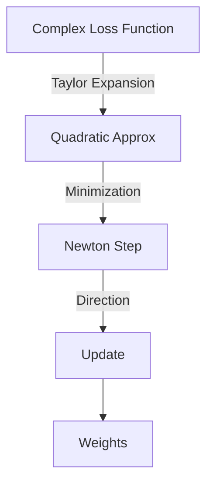
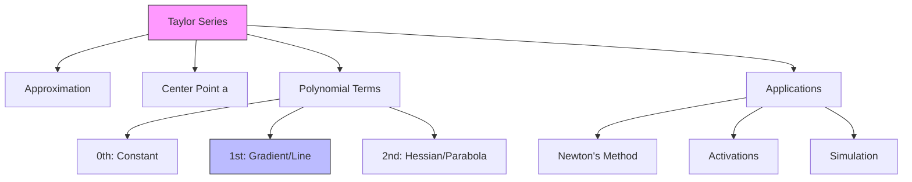

# Calculus for AI: Taylor Series & Approximation

## 📜 Story Mode: The Prediction

> **Mission Date**: 2042.04.15
> **Location**: Deep Space Outpost "Vector Prime"
> **Officer**: Lead Engineer Kael
>
> **The Problem**: The reactor is safe, but the debris field from the battle is drifting towards us.
> We have a complex physics model $P(t)$ for the debris path, but it takes hours to compute. Runge-Kutta integration is too slow.
>
> We need to know where the debris will be in 5 seconds.
> I don't need the *exact* Complex Physics.
> I just need a **Polynomial**. $P(t) \approx a + bt + ct^2$.
>
> If I know:
> 1.  Where it is (Position $a$)
> 2.  How fast it's moving (Velocity $b$)
> 3.  How much it's accelerating (Acceleration $c$)
>
> I can predict the future with 99.9% accuracy for short times.
>
> *"Computer! Expand the trajectory function around $t=0$. Keep the first 3 terms. Fire countermeasures at the predicted coordinates!"*

---

## 1. Problem Setup & Motivation

### The 6 Engineering Questions
1.  **WHAT**: A **Taylor Series** is a way to represent *any* smooth function as an infinite sum of simple polynomials ($x, x^2, x^3 \dots$).
2.  **WHY**: Computers can only do arithmetic (+, -, *, /). They cannot compute $\sin(x)$ or $e^x$ directly. They compute the Taylor Series approximation.
3.  **WHEN**:
    *   **Optimization**: Newton's Method approximates the Loss Function as a Parabola (2nd order Taylor Series).
    *   **Hardware**: Your GPU uses Taylor series to compute activation functions.
4.  **WHERE**: Inside the FPU (Floating Point Unit) of the processor.
5.  **WHO**: Approx. Theory Researchers, Numerical Analysts.
6.  **HOW**: $f(x) \approx f(a) + f'(a)(x-a) + \frac{1}{2}f''(a)(x-a)^2 \dots$

> [!NOTE]
> **🛑 Pause & Explain (In Simple Words)**
>
> **Taylor Series = "The Best Match at a Point".**
>
> Imagine trying to draw a complex curve.
> 1.  **0th Order**: Draw a flat line at the current height. (Matches Position).
> 2.  **1st Order**: Tilt the line to match the slope. (Matches Velocity).
> 3.  **2nd Order**: Curve the line to match the bend. (Matches Acceleration).
>
> If you keep adding terms, your simple drawing eventually looks *exactly* like the complex curve.

---

## 2. Mathematical Problem Formulation

### The Formula
For a smooth function $f(x)$ near point $a$:
$$ f(x) = \sum_{n=0}^{\infty} \frac{f^{(n)}(a)}{n!} (x-a)^n $$
$$ f(x) \approx f(a) + f'(a)(x-a) + \frac{f''(a)}{2!} (x-a)^2 + \frac{f'''(a)}{3!} (x-a)^3 $$

### The 2nd Order Approximation (The Gold Standard)
In Deep Learning, we care about the "Quadratic Approximation":
$$ \text{Loss}(\theta + \Delta \theta) \approx L(\theta) + \nabla L^T (\Delta \theta) + \frac{1}{2} (\Delta \theta)^T \mathbf{H} (\Delta \theta) $$
This uses Gradient $\nabla L$ and Hessian $\mathbf{H}$.

---

## 3. Step-by-Step Derivation

### Deriving Expansion for $e^x$ at $a=0$
**Goal**: Turn $e^x$ into polynomials.
**Facts**: The derivative of $e^x$ is just $e^x$.
At $x=0$, $e^0 = 1$. So all derivatives $f^{(n)}(0) = 1$.

**Step 1: Term n=0**
$\frac{1}{0!} x^0 = 1$. (Constant).

**Step 2: Term n=1**
$\frac{1}{1!} x^1 = x$. (Line).

**Step 3: Term n=2**
$\frac{1}{2!} x^2 = \frac{x^2}{2}$. (Parabola).

**Result**:
$$ e^x \approx 1 + x + \frac{x^2}{2} + \frac{x^3}{6} + \dots $$
**Check**: $e^1 \approx 2.718$.
Approximation: $1 + 1 + 0.5 + 0.166 = 2.666$. (Close!)

---

## 4. Algorithm Construction

### Map to Memory (Lookup Tables)
In early computers, we stored huge tables of $\sin(x)$.
Now, we calculate it on the fly using Polynomial Approximation (Remez Algorithm, a cousin of Taylor).
Memory is slow. Math is fast. It is cheaper to calculate $x - x^3/6$ than to fetch `sin_table[x]` from RAM.

### Algorithm: XGBoost (Gradient Boosting)
XGBoost optimizes the **2nd Order Taylor Expansion** of the loss function.
It finds a new tree $f_t(x)$ that minimizes:
$$ Loss \approx \sum [ g_i f_t(x_i) + \frac{1}{2} h_i f_t(x_i)^2 ] + \Omega(f_t) $$
Where $g_i$ is gradient, $h_i$ is hessian.
This is why XGBoost is mathematically superior to Random Forest.

---

## 5. Optimization & Convergence Intuition

### Universal Approximation Theorem
A Taylor Series sums simple powers ($x^n$) to approximate any function.
A **Neural Network** sums simple functions (Sigmoids/ReLUs) to approximate any function.
**Connection**: Both are "Basis Functions".
Taylor uses Polynomial Basis ($x, x^2, \dots$).
Neural Nets use Activation Basis ($\sigma(wx+b)$).
Neural Networks are essentially "Tuneable Taylor Series" where we learn the basis instead of fixing it.

---

## 6. Worked Examples

### Example 1: Physics Simulation (Euler Integration)
**Goal**: Move particle.
**Taylor (1st Order)**: $x(t+dt) \approx x(t) + v(t)dt$.
This is **Euler's Method**. It assumes velocity is constant for the step.
Error is $O(dt^2)$.

### Example 2: Newton's Method (Optimization)
**Goal**: Find where derivative is zero.
We model the curve as a Parabola (2nd Order Taylor).
We jump to the bottom of that parabola.
If the function *is* a parabola (Linear Regression), Newton's Method solves it in **One Step**.

---

## 7. Production-Grade Code

### The Ship's Code (Polyglot: Pure Python + Libraries)

```python
import numpy as np
import torch
import tensorflow as tf

# LEVEL 0: Pure Python (Taylor Expansion Logic)
# Math: f(x) approx sum( f^n(a)/n! * (x-a)^n )
# We approximate e^x around a=0
def taylor_exp_pure(x, terms=10):
    """
    Computes e^x using Taylor Series.
    e^x = 1 + x + x^2/2! + x^3/3! ...
    """
    prediction = 1.0 # 0th term (x^0 / 0!)
    factorial = 1
    
    for n in range(1, terms):
        # Update factorial (1 -> 1*2 -> 2*3 -> 6*4 ...)
        factorial *= n
        # Add term
        term = (x**n) / factorial
        prediction += term
        
    return prediction

# LEVEL 1: NumPy (Polynomial Fit - Polyfit)
def polynomial_approx_numpy(x_train, y_train, degree=3):
    # Taylor series are just polynomials. 
    # Polyfit finds the *best* polynomial (Global), not just the local match.
    coeffs = np.polyfit(x_train, y_train, deg=degree)
    return np.poly1d(coeffs)

# LEVEL 2: PyTorch (Polynomial Features Layer)
def polynomial_features_torch(x, degree=2):
    # Manually expand features [x] -> [1, x, x^2]
    # This turns Linear Regression into Polynomial Regression!
    features = [torch.ones_like(x), x]
    for d in range(2, degree+1):
        features.append(x**d)
    return torch.stack(features, dim=1)

# LEVEL 3: TensorFlow (Keras Preprocessing)
def polynomial_features_tf(x):
    # Often done with Feature Columns or preprocessing layers
    # Manual approach:
    # Manual approach:
    return tf.stack([x, tf.square(x), tf.pow(x, 3)], axis=-1)

# LEVEL 4: Visualization (Approximating exp(x))
def visualize_taylor():
    """
    Shows how adding terms improves the fit.
    """
    import matplotlib.pyplot as plt
    
    x = np.linspace(-3, 3, 100)
    y_true = np.exp(x)
    
    # Approximations around a=0
    y_0 = np.ones_like(x) # 1
    y_1 = 1 + x # 1 + x
    y_2 = 1 + x + x**2/2 # 1 + x + x^2/2
    y_3 = 1 + x + x**2/2 + x**3/6 # 1 + x + x^2/2 + x^3/6
    
    plt.figure(figsize=(8, 6))
    plt.plot(x, y_true, 'k', linewidth=3, label="True e^x")
    
    plt.plot(x, y_0, '--', label="n=0 (Constant)")
    plt.plot(x, y_1, '--', label="n=1 (Line)")
    plt.plot(x, y_2, '--', label="n=2 (Parabola)")
    plt.plot(x, y_3, '--', label="n=3 (Cubic)")
    
    plt.ylim(-1, 10)
    plt.title("Taylor Expansion of e^x around 0")
    plt.legend()
    plt.grid(True)
    plt.show()
```

> [!CAUTION]
> **🛑 Production Warning**
>
> Taylor Series are **Local**. They only work near point $a$.
> If you try to approximate a function at $x=100$ using an expansion at $a=0$, you need huge precision and thousands of terms.
> Always center your data (Normalization) so $x \approx 0$.

> [!CAUTION]
> **🛑 Production Warning**
>
> Taylor Series are **Local**. They only work near point $a$.
> If you try to approximate a function at $x=100$ using an expansion at $a=0$, you need huge precision and thousands of terms.
> Always center your data (Normalization) so $x \approx 0$.

---

## 8. System-Level Integration



**Where it lives**:
**Mixed Precision Training (FP16)**:
When we use 16-bit floats, we lose precision.
If the Taylor Series Terms (Gradient updates) are smaller than $2^{-24}$, they become zero.
We rely on the fact that the *Higher Order Terms* are negligible, but the *First Order Terms* (Gradients) are preserved.

---

## 9. Evaluation & Failure Analysis

### Failure Mode: Divergence
If you approximate a function that has a "Sharp Corner" (like $|x|$ or ReLU) using smooth polynomials.
**Gibbs Phenomenon**: Typical ringing artifacts near the discontinuity.
Taylor series struggle with non-smooth functions (which is barely everything in Deep Learning).

---

## 10. Ethics, Safety & Risk Analysis

### Over-Extrapolation
Using a Taylor Series to predict *far* into the future (Stock Market, Climate).
"The trend is linear, so in 100 years..."
**NO.** The higher order terms (Catastrophic events) dominate eventually.
**Risk**: Assuming local stability implies global stability.

---

## 11. Advanced Theory & Research Depth

## 11. Advanced Theory & Research Depth

### Pade Approximants
Ratio of two polynomials: $\frac{P(x)}{Q(x)}$.
Often converges much faster than Taylor Series (Sum of polynomials).
Used in advanced physics simulations.

### 📚 Deep Dive Resources
*   **Paper**: "Deep Learning as a Gaussian Process" (Lee et al., 2017) - Analyzing very wide neural networks using Taylor expansions of the kernel. [ArXiv:1711.00165](https://arxiv.org/abs/1711.00165)
*   **Concept**: **Function Space**. Just as vectors live in Vector Space, smooth functions live in a space where "Polynomials" form a Basis.


---

## 12. Career & Mastery Signals

### Cadet (Junior)
*   Knows that "Linear Approximation" is just the first two terms of Taylor ($f(a) + f'(a)(x-a)$).
*   Understands why we initialize weights near 0 (to stay in the linear region of activation functions).

### Commander (Senior)
*   Uses **Second-Order Optimization** ideas (Curvature) to debug slow convergence.
*   Understands how **Residual Connections** (ResNet) make the Taylor expansion of the network deeper and more stable.

---

## 13. Industry Interview Corner

### ❓ Real World Questions
**Q1: "Why do we say Gradient Descent is a First-Order method?"**
*   **Answer**: "Because it relies on the Gradient, which comes from the First-Order Taylor Approximation of the loss function. Newton's Method is Second-Order because it uses the Hessian (2nd derivative)."

**Q2: "How does Taylor Series relate to Overfitting?"**
*   **Answer**: "A high-order Taylor series (Polynomial) wiggles too much to fit every data point. This is Runge's Phenomenon. In ML, this is overfitting. We prefer low-order approximations for generalization."

**Q3: "What is `torch.nn.Linear` doing mathematically?"**
*   **Answer**: "It is learning a First-Order Taylor Approximation (Line/Plane) for the data manifold. We stack non-linearities (ReLU) to patch these flat planes into a curved complex shape."

---

## 14. Debug Your Thinking (Common Misconceptions)

### ❌ Myth: "Higher order approximation is always better."
**✅ Truth**: No. Runge's Phenomenon shows that higher-degree polynomials can oscillate wildly at the edges. Often a simpler model (1st or 2nd order) extrapolates better than a complex one (10th order).

### ❌ Myth: "Neural Networks are Black Boxes."
**✅ Truth**: Locally, they are just Taylor Series. At any specific point $x$, a Neural Net behaves exactly like a Linear Function + a tiny Quadratic correction. We can inspect the Gradient (Slope) to see exactly what the network is "thinking" right now.


---

## 15. Assessment & Mastery Checks

**Q1: Maclaurin Series**
What is a Maclaurin Series?
*   *Answer*: A Taylor Series centered at $a=0$.

**Q2: The Sine Approx**
What is $\sin(x)$ for very small $x$?
*   *Answer*: $\sin(x) \approx x$. (The first term).
    This is known as the "Small Angle Approximation" in physics.

---

## 16. Further Reading & Tooling

*   **Book**: *"Numerical Recipes"* - The guide to how math is implemented in C++.
*   **Concept**: **Chebyshev Polynomials** - A better way to approximate functions uniformly.

---

## 17. Concept Graph Integration

*   **Previous**: [Integrals](01_foundation_math_cs/02_calculus/04_integrals.md).
*   **Next**: [Probability & Statistics](01_foundation_math_cs/03_probability/01_random_variables.md) (Applying Calculus to Chance).

### Concept Map

