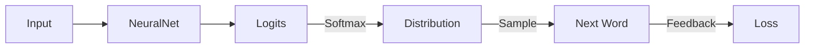

# Probability for AI: Random Variables & Distributions

## 📜 Story Mode: The Fog of War

> **Mission Date**: 2042.05.01
> **Location**: Deep Space Outpost "Vector Prime"
> **Officer**: Lead Engineer Kael
>
> **The Problem**: The enemy ships are cloaked.
> Our sensors don't give us a vector $\mathbf{x}$. They give us a **Cloud**.
>
> Radar says: "Target is *probably* at Sector 4, but *maybe* at Sector 5."
>
> I ask: "Where should I aim?"
>
> The rookie gunner says: "Just aim at the average."
> I scream: "NO! If they are 50% Left and 50% Right, the average is the Middle. If you fire at the Middle, you hit **Nothing**!"
>
> We need to stop thinking in Points (Deterministic).
> We need to start thinking in **Clouds** (Probabilistic).
>
> *"Computer! Switch targeting mode from Deterministic to Stochastic. Map the Probability Density Function of the hostile fleet!"*

---

## 1. Problem Setup & Motivation

### The 6 Engineering Questions
1.  **WHAT**:
    *   **Random Variable ($X$)**: A variable that doesn't have a fixed value, but a set of possible values with associated probabilities.
    *   **Distribution**: The "Shape" of that probability (Bell Curve, Uniform, Poisson).
2.  **WHY**: The real world is noisy. Sensors lie. Users are unpredictable. If you assume everything is exact ($x=5$), your system will crash when $x=5.01$.
3.  **WHEN**: Always. Especially in **Generative AI** (predicting the next token is a roll of the dice) and **Reinforcement Learning**.
4.  **WHERE**:
    *   **Output Layer**: Softmax is a probability distribution over classes.
    *   **Loss Function**: Cross-Entropy measures the distance between distributions.
5.  **WHO**: Statisticians, ML Engineers, Risk Analysts.
6.  **HOW**: Defined by a **PDF** (Probability Density Function) for continuous data or **PMF** (Probability Mass Function) for discrete data.

> [!NOTE]
> **🛑 Pause & Explain (In Simple Words)**
>
> **Deterministic**: $2 + 2 = 4$. (Always).
> **Probabilistic**: "I roll a die. It might be 4."
>
> A **Random Variable** is just a box.
> You don't know what's inside until you open it (Sample it).
> But you know the **rules** of the box (The Distribution).
>
> - **Uncertainty** is not a bug. It's a feature. It tells you how confident you should be.

---

## 2. Mathematical Problem Formulation

### Discrete vs Continuous
1.  **Discrete (Categorical)**:
    *   Values: {Head, Tail} or {Cat, Dog, Bird}.
    *   Function: **PMF** (Probability Mass Function).
    *   Sum: $\sum P(x) = 1$.
2.  **Continuous (Real Numbers)**:
    *   Values: Height, Temperature, Weight.
    *   Function: **PDF** (Probability Density Function).
    *   Integral: $\int p(x) dx = 1$.

### Key Metrics
*   **Expectation ($\mathbb{E}[X]$)**: The center of mass (Mean).
    $$ \mathbb{E}[X] = \sum x \cdot P(x) $$
*   **Variance ($\text{Var}(X)$)**: The spread (Uncertainty).
    $$ \text{Var}(X) = \mathbb{E}[(X - \mu)^2] $$

---

## 3. Step-by-Step Derivation

### Deriving Variance of a Die Roll
**Goal**: Measure the spread of a 6-sided die.
**Values**: $\{1, 2, 3, 4, 5, 6\}$. Prob $P(x) = 1/6$.

**Step 1: Expectation (Mean)**
$$ \mu = 1(\frac{1}{6}) + 2(\frac{1}{6}) + \dots + 6(\frac{1}{6}) = 3.5 $$
Note: You can never calculate 3.5 on a die. The mean is not always a valid value!

**Step 2: Variance (Squared distance from Mean)**
Compute $(x - 3.5)^2$ for each face.
*   1: $(1-3.5)^2 = (-2.5)^2 = 6.25$
*   ...
*   6: $(6-3.5)^2 = 6.25$
Average of deviations: $\approx 2.91$.

**Result**: $\sigma = \sqrt{2.91} \approx 1.7$.
Most rolls are within $3.5 \pm 1.7$ (i.e., between 1.8 and 5.2).

---

## 4. Algorithm Construction

### Map to Memory (Floating Point Probabilities)
Probabilities are small ($0.000001$).
Multiplying them ($p_1 \cdot p_2 \dots p_n$) causes **Underflow** (becomes 0).
**Fix**: Work in **Log-Space**.
$\log(a \cdot b) = \log(a) + \log(b)$.
We store Log-Probabilities (negative numbers).
Summing them is numerically stable.

### Algorithm: Sampling (Inverse Transform)
**Goal**: Computer only has `rand()` (Uniform 0-1). How do I get a Gaussian?
**Method**: Use the CDF (Cumulative Distribution Function).
1.  Pick Random $u \in [0, 1]$.
2.  Find $x$ such that $\text{CDF}(x) = u$.
3.  $x = \text{CDF}^{-1}(u)$.
This transforms uniform randomness into *any* shape.

---

## 5. Optimization & Convergence Intuition

### Entropy (The Measure of Surprise)
$$ H(P) = - \sum P(x) \log P(x) $$
*   **Low Entropy**: Coin with Heads 99%, Tails 1%. (Expected, Boring).
*   **High Entropy**: Coin with 50/50. (Maximum confusion).
*   **AI Goal**: Minimize Entropy of the error. We want the model to be **Certain** and **Correct**.

---

## 6. Worked Examples

### Example 1: The Softmax (Discrete)
**Logits**: $[2.0, 1.0, 0.1]$. (Raw scores).
**Softmax**: $e^x / \sum e^x$.
$e^2 = 7.39$.
$e^1 = 2.71$.
$e^{0.1} = 1.10$.
Sum = 11.2.
**Probs**: $[0.66, 0.24, 0.10]$.
**Interpretation**: "I am 66% sure it's Class A".

### Example 2: The Gaussian (Continuous)
**Sensor Noise**: Reads 10.0m, but has variance $\sigma^2=0.01$.
**Distribution**: $N(10.0, 0.01)$.
**Meaning**:
- 68% chance true value is $10.0 \pm 0.1$.
- 95% chance true value is $10.0 \pm 0.2$.
- 99.7% chance true value is $10.0 \pm 0.3$.
**Action**: If we measure 11.0, it's NOT noise. It's a signal. (10 sigma event).

---

## 7. Production-Grade Code

### The Ship's Code (Polyglot: Pure Python + Libraries)

```python
import numpy as np
import torch
import tensorflow as tf

# LEVEL 0: Pure Python (Sampling Logic)
# Algorithm: Inverse Transform Sampling (Discrete)
def sample_pmf_pure(probs):
    """
    Samples an index based on probabilities [p0, p1, p2].
    """
    # 1. Compute PDF -> CDF
    cdf = []
    cumulative = 0.0
    for p in probs:
        cumulative += p
        cdf.append(cumulative)
    
    # 2. Pick random number
    u = np.random.rand() # Only using numpy for randomness here, typically random.random()
    
    # 3. Find index where u falls
    for i, threshold in enumerate(cdf):
        if u < threshold:
            return i
    return len(probs) - 1

# LEVEL 1: NumPy (Entropy Calculation)
def entropy_numpy(probs):
    # H(x) = -sum(p * log(p))
    # Add epsilon to avoid log(0)
    p = np.array(probs) + 1e-9 
    return -np.sum(p * np.log(p))

# LEVEL 2: PyTorch (Distribution API)
def entropy_torch(logits):
    # Logits -> Softmax -> Entropy
    probs = torch.nn.functional.softmax(logits, dim=0)
    dist = torch.distributions.Categorical(probs=probs)
    return dist.entropy().item()

# LEVEL 3: TensorFlow (Categorical Cross Entropy)
def entropy_tf(logits):
    # TF usually computes Cross-Entropy (H(P, Q)).
    # Self-Entropy is Cross-Entropy with itself.
    probs = tf.nn.softmax(logits)
    # manual: -sum(p * log(p))
    return -tf.reduce_sum(probs * tf.math.log(probs + 1e-9))

# LEVEL 4: Visualization (PDF vs CDF)
def visualize_distributions():
    """
    Shows the relationship between Density (PDF) and Cumulative Probability (CDF).
    """
    import matplotlib.pyplot as plt
    from scipy.stats import norm
    
    x = np.linspace(-4, 4, 100)
    pdf = norm.pdf(x)
    cdf = norm.cdf(x)
    
    fig, ax1 = plt.subplots(figsize=(8, 5))
    
    # Plot PDF
    ax1.plot(x, pdf, 'b-', label='PDF (Likelihood)', linewidth=2)
    ax1.set_ylabel('Density', color='b')
    ax1.tick_params(axis='y', labelcolor='b')
    ax1.fill_between(x, pdf, alpha=0.1, color='b')
    
    # Plot CDF
    ax2 = ax1.twinx()
    ax2.plot(x, cdf, 'r--', label='CDF (Cumulative)', linewidth=2)
    ax2.set_ylabel('Probability Space', color='r')
    ax2.tick_params(axis='y', labelcolor='r')
    
    plt.title("The Bell Curve (PDF) vs The S-Curve (CDF)")
    plt.axvline(0, color='gray', linestyle=':')
    plt.grid(True, alpha=0.3)
    plt.show()
```

> [!CAUTION]
> **🛑 Production Warning**
>
> Never convert to probabilities just to take the Log again.
> BAD: `log(softmax(x))` (Unstable).
> GOOD: `log_softmax(x)` (Fused, stable).
> Always use `nn.CrossEntropyLoss` which takes **Logits** directly.

> [!CAUTION]
> **🛑 Production Warning**
>
> Never convert to probabilities just to take the Log again.
> BAD: `log(softmax(x))` (Unstable).
> GOOD: `log_softmax(x)` (Fused, stable).
> Always use `nn.CrossEntropyLoss` which takes **Logits** directly.

---

## 8. System-Level Integration



**Where it lives**:
**LLMs (GPT)**: They are just massive Conditional Probability Machines.
$P(\text{word} | \text{context})$.
Temperature parameter scales the logits to make the distribution "Flatter" (More random) or "Sharper" (More deterministic).

---

## 9. Evaluation & Failure Analysis

### Failure Mode: Overconfidence
Modern Neural Networks are **Overconfident**.
They output $P(\text{Cat}) = 0.99$ even for an image of static noise.
This is because Softmax pushes values apart.
**Fix**: **Label Smoothing** (Tell the model the target is 0.9, not 1.0) or **Temperature Scaling** (Calibrate the confidence).

---

## 10. Ethics, Safety & Risk Analysis

### Aleatoric vs Epistemic Uncertainty
*   **Aleatoric**: The world is random (Coin flip). You can't fix this.
*   **Epistemic**: The model is ignorant (Missing data). You CAN fix this with more data.
**Risk**: If an autonomous car is "confused" (Epistemic), it should slow down. If it assumes the confusion is just "noise" (Aleatoric), it might kill someone.

---

## 11. Advanced Theory & Research Depth

## 11. Advanced Theory & Research Depth

### The Reparameterization Trick (VAE)
We cannot backpropagate through a random sample `z ~ N(0,1)`.
The randomness breaks the chain rule.
**Trick**: $z = \mu + \sigma \cdot \epsilon$.
Where $\epsilon \sim N(0,1)$ is a fixed random noise.
Now we can derive w.r.t $\mu$ and $\sigma$. The randomness is moved to a side input.

### 📚 Deep Dive Resources
*   **Paper**: "A Tutorial on Energy-Based Learning" (LeCun et al., 2006) - Viewing probabilities as Energy States (Physics). [Link](http://yann.lecun.com/exdb/publis/pdf/lecun-06.pdf)
*   **Concept**: **Measure Theory**. The severe mathematical foundation that handles specific weird cases where probabilities don't behave nicely (e.g., The Dirac Delta function).


---

## 12. Career & Mastery Signals

## 12. Career & Mastery Signals

### Cadet (Junior)
*   Knows that Softmax outputs sum to 1.
*   Understands that `argmax` is deterministic (Greedy) and `multinomial`/`sample` is probabilistic.

### Commander (Senior)
*   Uses **Gumbel-Softmax** to differentiate through discrete samples.
*   Understands **KL-Divergence** as the penalty for using the "wrong" probability distribution to encode data.

---

## 13. Industry Interview Corner

### ❓ Real World Questions
**Q1: "Why do we use Log-Likelihood instead of Likelihood?"**
*   **Answer**: "Two reasons: 1) **Underflow**. Multiplying small probabilities ($10^{-5}$) results in 0. Adding logs is stable. 2) **Optimization**. The Log function is monotonic, so maximizing log(P) is the same as maximizing P, but the derivatives of products are messy, whereas derivatives of sums are clean."

**Q2: "What is the difference between Likelihood and Probability?"**
*   **Answer**: "Probability is calculating data given parameters ($P(D|\theta)$). Likelihood is calculating parameters given data ($L(\theta|D)$). They are numerically equal but philosophically opposite."

**Q3: "How do you handle a class imbalance of 99% vs 1%?"**
*   **Answer**: "1) Resample the data (Oversample minority). 2) Use Weighted Loss (Punish errors on minority 100x more). 3) Change metric from Accuracy to F1-Score or AUC-ROC."

---

## 14. Debug Your Thinking (Common Misconceptions)

### ❌ Myth: "High Confidence (0.99) means the model is Right."
**✅ Truth**: No. It just means the model is *Arrogant*. Deep Learning models are notoriously uncalibrated. A prediction of 0.99 might only have 60% accuracy on out-of-distribution data.

### ❌ Myth: "Randomness is bad for AI."
**✅ Truth**: Randomness is **essential**. It breaks symmetry (weight init), escapes local minima (SGD), and enables creativity (Generative AI). Deterministic AI is brittle AI.


---

## 15. Assessment & Mastery Checks

**Q1: Integration**
What is the area under a PDF?
*   *Answer*: Exactly 1.

**Q2: Independence**
If $P(A, B) = P(A)P(B)$, what does that mean?
*   *Answer*: A and B are independent. Knowing A tells you nothing about B.

---

## 16. Further Reading & Tooling

*   **Book**: *"Deep Learning"* (Goodfellow) - Chapter 3: Probability and Information Theory.
*   **Library**: **TensorFlow Probability** - Advanced tools for Bayesian methods.

---

## 17. Concept Graph Integration

*   **Previous**: [Taylor Series](01_foundation_math_cs/02_calculus/05_taylor_series.md) (Calculus foundation).
*   **Next**: [Bayes Theorem](01_foundation_math_cs/03_probability/02_bayes_theorem.md) (Updating belief).

### Concept Map
```mermaid
graph TD
    Var[Random Variable X] --> Discrete[Discrete (PMF)]
    Var --> Cont[Continuous (PDF)]
    
    Discrete --> Sum[Sum = 1]
    Cont --> Int[Integral = 1]
    
    Var --> Metrics[Metrics]
    Metrics --> Mean[Mean/Expectation]
    Metrics --> Variance[Variance/Spread]
    Metrics --> Entropy[Entropy/Uncertainty]
    
    Var --> Distributions
    Distributions --> Gaussian[Gaussian]
    Distributions --> Bernoulli[Bernoulli]
    Distributions --> Poisson[Poisson]
    
    style Var fill:#f9f,stroke:#333
    style Distributions fill:#bbf,stroke:#333
```
