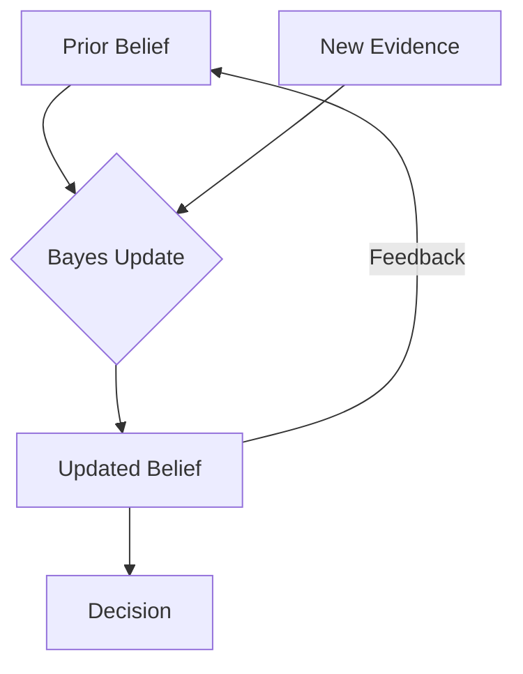

# Probability for AI: Bayes Theorem & Inference

## 📜 Story Mode: The Update

> **Mission Date**: 2042.06.12
> **Location**: Deep Space Outpost "Vector Prime"
> **Officer**: Lead Engineer Kael
>
> **The Problem**: A blip appears on the radar.
> It looks like an Enemy Ship.
> But it also looks like a Space Whale.
>
> Rookie: "It looks 90% like an Enemy Ship! Open fire!"
>
> I check the records.
> **Fact 1**: Enemy ships are rare (1 in 1000).
> **Fact 2**: Space Whales are common (1 in 10).
>
> Even if it *looks* like an enemy, the fact that enemies are so rare makes it *probably* a whale.
>
> The Rookie is falling for the **Base Rate Fallacy**.
> We need to combine what we **See** (Likelihood) with what we **Know** (Prior).
>
> *"Computer! Calculate the Posterior Probability given the signal. Update the threat level."*

---

## 1. Problem Setup & Motivation

### The 6 Engineering Questions
1.  **WHAT**:
    *   **Bayes Theorem**: A formula to flip conditional probabilities: $P(A|B) = \frac{P(B|A)P(A)}{P(B)}$.
    *   **Inference**: The process of updating your beliefs ($P(H)$) after seeing data ($D$) to get $P(H|D)$.
2.  **WHY**: Models are never 100% sure. We need a math framework to handle "Partial Evidence".
3.  **WHEN**: Medical Diagnosis, Spam Filtering, Kalman Filters (Self-Driving Cars), VAEs.
4.  **WHERE**: The "Decoder" step of generative models (inferring latent $z$ from $x$).
5.  **WHO**: Data Scientists, Poker Players, Doctors.
6.  **HOW**: `Posterior = (Likelihood * Prior) / Evidence`.

> [!NOTE]
> **🛑 Pause & Explain (In Simple Words)**
>
> **The Equation of Learning.**
>
> - **Prior ($P(H)$)**: What you believed *yesterday*. ("Cancer is rare").
> - **Likelihood ($P(D|H)$)**: What the test says *today*. ("The test is positive").
> - **Posterior ($P(H|D)$)**: What you believe *now*. ("You probably don't have cancer, because the test false positive rate is higher than the cancer rate").
>
> Machine Learning is just applying Bayes Theorem over and over again.
> Initial Weights (Prior) + Training Data (Likelihood) = Trained Model (Posterior).

---

## 2. Mathematical Problem Formulation

### The Formula
$$ P(H|D) = \frac{P(D|H) \cdot P(H)}{P(D)} $$

*   $H$: Hypothesis (e.g., "It's a Spam Email").
*   $D$: Data (e.g., "Contains word 'Viagra'").
*   $P(D|H)$: Likelihood (Probability of seeing 'Viagra' IF it is Spam).
*   $P(H)$: Prior (Probability of any email being Spam).
*   $P(D)$: Evidence (Probability of seeing 'Viagra' in ANY email).

### Naive Bayes (The "Naive" Assumption)
If we depend on many features ($D_1, D_2, \dots$), math gets hard.
Assumption: Features are **Independent**.
$$ P(H | D_1 \dots D_n) \propto P(H) \prod P(D_i | H) $$
This simplifies computing $P(\text{Spam} | \text{text})$ to just multiplying word probabilities.

---

## 3. Step-by-Step Derivation

### The Cancer Test Paradox
**Prior**: Cancer rate $P(C) = 1\% = 0.01$.
**Likelihood**: Test accuracy $P(+|C) = 90\%$. False positive $P(+|\neg C) = 10\%$.
**Data**: You test positive (+). Do you have cancer?

**Step 1: Calculate Numerator (True Positive path)**
$P(+|C) \cdot P(C) = 0.90 \cdot 0.01 = 0.009$.

**Step 2: Calculate Denominator (Total Evidence)**
Total Positives = (True Positives) + (False Positives).
$P(+) = P(+|C)P(C) + P(+|\neg C)P(\neg C)$.
$P(+) = 0.009 + (0.10 \cdot 0.99) = 0.009 + 0.099 = 0.108$.

**Step 3: Posterior**
$P(C|+) = \frac{0.009}{0.108} \approx 0.083$ (8.3%).

**Result**: Even with a 90% accurate test, you only have an 8% chance of cancer.
**Why?**: Because the False Positives from the massive healthy population swamp the True Positives.

---

## 4. Algorithm Construction

### Map to Memory (Online Learning)
Bayes is **Stateful**.
Posterior of Day 1 becomes Prior of Day 2.
We don't need to store all history. We just store the current Belief State.
This is how **Kalman Filters** track missiles using only the latest radar ping and the previous estimate.

### Algorithm: Naive Bayes Classifier
**Training**: Count word frequencies in Spam folder vs Ham folder. Store as lookup tables ($P(w|S)$).
**Inference**: For new email, sum the logs of probabilities.
$\log P(S) + \sum \log P(w_i|S)$ vs $\log P(\neg S) + \sum \log P(w_i|\neg S)$.
Pick the winner.

---

## 5. Optimization & Convergence Intuition

### Bayesian Neural Networks (BNN)
Standard NN: Weights are Numbers ($w=0.5$).
Bayesian NN: Weights are Distributions ($w \sim N(0.5, 0.1)$).
**Pros**: The network knows when it doesn't know (Uncertainty).
**Cons**: Computations are $2x$ slower and harder to converge.

---

## 6. Worked Examples

### Example 1: Spam Filter
**Email**: "Buy Cheap Rolex".
**Priors**: Spam 50%, Ham 50%.
**Likelihoods**:
*   "Rolex" | Spam: 0.1
*   "Rolex" | Ham: 0.001 (Very rare)
**Score**:
Spam: $0.5 \cdot 0.1 = 0.05$.
Ham: $0.5 \cdot 0.001 = 0.0005$.
Ratio: 100:1.
**Verdict**: SPAM.

### Example 2: The Lost Robot
**Map**: Hallway consisting of 10 cells.
**Prior**: Robot could be anywhere ($P=0.1$ each).
**Sensor**: Sees a "Door".
**Map Info**: Doors are only at Cell 3 and 7.
**Update**:
$P(3) = 0.5$. $P(7) = 0.5$. Others = 0.
The probability distribution collapses to the two possible locations.

---

## 7. Production-Grade Code

### The Ship's Code (Polyglot: Pure Python + Libraries)

```python
import numpy as np
import torch
import tensorflow as tf

# LEVEL 0: Pure Python (Bayesian Update Logic)
# Formula: Posterior = (Likelihood * Prior) / Evidence
def bayes_update_pure(prior, likelihood_true_pos, likelihood_false_pos, test_result):
    """
    Updates belief about hypothesis H given a binary test result.
    prior: P(H)
    likelihood_true_pos: P(Test+|H)
    likelihood_false_pos: P(Test+|Not H)
    test_result: True (+) or False (-)
    """
    if test_result:
        # We saw Positive Test (+)
        numerator = likelihood_true_pos * prior
        evidence = (likelihood_true_pos * prior) + (likelihood_false_pos * (1 - prior))
    else:
        # We saw Negative Test (-)
        likelihood_true_neg = 1.0 - likelihood_true_pos
        likelihood_false_neg = 1.0 - likelihood_false_pos
        numerator = likelihood_true_neg * prior
        evidence = (likelihood_true_neg * prior) + (likelihood_false_neg * (1 - prior))
        
    return numerator / evidence

# LEVEL 1: NumPy (Naive Bayes Inference)
def naive_bayes_inference_numpy(log_priors, log_likelihoods, x_input):
    # Log Posterior = Log Prior + Sum(Log Likelihoods)
    # x_input: Binary features [1, 0, 1...]
    # log_likelihoods: Shape (Features, Classes)
    
    # In pure numpy, we broadcast
    # For class 0: Prior[0] + Sum(Likelihood[feat, 0] if x[feat]==1)
    
    # Simplified Vectorized version:
    # Scores = Prior + X @ Likelihoods
    return log_priors + x_input @ log_likelihoods

# LEVEL 2: PyTorch (Bayesian Layer)
def bayesian_linear_layer(x, mu_w, sigma_w):
    # Weights are random variables N(mu, sigma)
    # Reparameterization Trick: w = mu + sigma * epsilon
    epsilon = torch.randn_like(sigma_w)
    w_sampled = mu_w + sigma_w * epsilon
    return x @ w_sampled.T

# LEVEL 3: TensorFlow (Probabilistic Layer)
import tensorflow_probability as tfp
tfd = tfp.distributions
def bayesian_layer_tf(x, inputs, units):
    # Using TFP allows DenseFlipout (Variational Inference built-in)
    # Using TFP allows DenseFlipout (Variational Inference built-in)
    layer = tfp.layers.DenseFlipout(units)
    return layer(x)

# LEVEL 4: Visualization (The Learning Process)
def visualize_bayes_update():
    """
    Shows how a Prior becomes a Posterior after seeing Evidence.
    """
    import matplotlib.pyplot as plt
    from scipy.stats import norm
    
    x = np.linspace(0, 10, 200)
    
    # 1. Prior: Broad belief centered at 5
    prior = norm.pdf(x, loc=5, scale=2)
    
    # 2. Likelihood: Sensor sees 7 (Narrow)
    likelihood = norm.pdf(x, loc=7, scale=0.8)
    
    # 3. Posterior: Unnormalized product
    posterior = prior * likelihood
    posterior /= posterior.sum() * (x[1]-x[0]) # Normalize
    
    plt.figure(figsize=(8, 5))
    plt.plot(x, prior, 'b--', label='Prior (Before Data)')
    plt.plot(x, likelihood, 'g:', label='Likelihood (Sensor Data)')
    plt.plot(x, posterior, 'r-', linewidth=3, label='Posterior (Updated Belief)')
    
    plt.fill_between(x, posterior, color='red', alpha=0.2)
    plt.title("Bayes Update: Blending what we KNEW with what we SAW")
    plt.legend()
    plt.grid(True, alpha=0.3)
    plt.show()
```

> [!CAUTION]
> **🛑 Production Warning**
>
> **Zero Frequency Problem**: If a word (e.g., "Antigravity") never appeared in the training Spam folder, $P(\text{Antigravity}|\text{Spam}) = 0$.
> Multiplying by 0 allows a single new word to kill the entire probability.
> **Fix**: **Laplace Smoothing** (Add 1 to all counts). Assume every word has been seen at least once.

> [!CAUTION]
> **🛑 Production Warning**
>
> **Zero Frequency Problem**: If a word (e.g., "Antigravity") never appeared in the training Spam folder, $P(\text{Antigravity}|\text{Spam}) = 0$.
> Multiplying by 0 allows a single new word to kill the entire probability.
> **Fix**: **Laplace Smoothing** (Add 1 to all counts). Assume every word has been seen at least once.

---

## 8. System-Level Integration



**Where it lives**:
**A/B Testing**: Bayesian A/B testing allows us to peek at the results early. "There is a 99% probability Option B is better than A." We don't need to wait for fixed sample sizes (Frequentist).

---

## 9. Evaluation & Failure Analysis

### Failure Mode: The Prior Trap
If your Prior is $0$ (Impossible), no amount of Evidence can convince you otherwise.
$0 \cdot \text{Likelihood} = 0$.
**Lesson**: Never assign probability 0 or 1 to anything unless it is a logical definition. Always leave epsilon.

---

## 10. Ethics, Safety & Risk Analysis

### Algorithmic Prejudice
Bayes Theorem **amplifies** definitions from the training data.
If "Criminal" is correlated with "Neighborhood X" in the prior (Historical Data)...
The model will predict anyone from X is a criminal *before seeing any evidence*.
**Safety**: We must intervene on the Priors to ensure they reflect the *world we want*, not just the *world we had*.

---

## 11. Advanced Theory & Research Depth

## 11. Advanced Theory & Research Depth

### Variational Autoencoders (VAEs)
We want to find $P(z|x)$.
Bayes says: calculate $\frac{P(x|z)P(z)}{P(x)}$.
Problem: $P(x)$ (Evidence) is an integral we can't solve.
Solution: We use a Neural Network (Encoder) to **approximate** $P(z|x)$ with a simpler distribution $q(z|x)$.
We minimize the KL-Divergence between the Approximation and the True Posterior.

### 📚 Deep Dive Resources
*   **Paper**: "Practical Bayesian Optimization of Machine Learning Algorithms" (Snoek et al., 2012) - Using Bayes to tune hyperparameters (AutoML). [ArXiv:1206.2944](https://arxiv.org/abs/1206.2944)
*   **Concept**: **Conjugate Priors**. The "Magic Matches" of probability. If Likelihood is Gaussian and Prior is Gaussian, Posterior is... also Gaussian. This makes math easy (Closed Form).


---

## 12. Career & Mastery Signals

## 12. Career & Mastery Signals

### Cadet (Junior)
*   Understands Precision (True Positives / Predicted Positives) vs Recall (True Positives / Actual Positives).
*   Knowing that **Naive Bayes** is a great "Baseline" model before trying fancy Transformers.

### Commander (Senior)
*   Uses **Bayesian Optimization** (Gaussian Processes) to tune hyperparameters instead of Random Search.
*   Implements **Uncertainty Quantification** (Dropout as Bayesian Approx) to detect Out-of-Distribution inputs.

---

## 13. Industry Interview Corner

### ❓ Real World Questions
**Q1: "Explain the Base Rate Fallacy with an example."**
*   **Answer**: "If a disease affects 1 in 10,000 people, and a test has 1\% false positive rate... if you test positive, you likely *don't* have the disease. 99\% of positives are errors because the healthy population is so much larger. Ignoring the Base Rate (1/10k) leads to panic."

**Q2: "Why is Naive Bayes called 'Naive'?"**
*   **Answer**: "It assumes all features are Independent given the class. E.g., it assumes the probability of seeing 'Hong' and 'Kong' are unrelated. This is false (they usually appear together), but the model works surprisingly well anyway."

**Q3: "How does Bayesian A/B testing differ from Frequentist?"**
*   **Answer**: "Frequentist (p-value) asks: 'Is A different from B?' requires fixed sample size. Bayesian asks: 'What is the probability A is better than B?' (e.g., 99.4\%). You can stop the test anytime."

---

## 14. Debug Your Thinking (Common Misconceptions)

### ❌ Myth: "Posterior is just Likelihood $\times$ Prior."
**✅ Truth**: PROPORTIONAL TO ($\propto$). You must divide by the Evidence ($P(Data)$) to normalize it to sum to 1. If you forget this, your probabilities will be greater than 1.

### ❌ Myth: "Priors bias the result, so we should use Uniform Priors."
**✅ Truth**: A Uniform Prior is *still* a bias (It assumes all answers are equally likely, which is often false). Using an informative prior (e.g., "Physics laws must hold") is actually **Smart constraint**, not bias.


---

## 15. Assessment & Mastery Checks

**Q1: Independence**
If Bayes Theorem simplifies to $P(A|B) = P(A)$, what does that mean?
*   *Answer*: $A$ and $B$ are independent. $P(B|A) = P(B)$. The evidence $B$ changed nothing.

**Q2: The Denominator**
Why do we often ignore $P(D)$ in classification?
*   *Answer*: Because $P(D)$ is the same for all classes. We just care which numerator is bigger.

---

## 16. Further Reading & Tooling

*   **Book**: *"Bayesian Data Analysis"* (Gelman) - The bible of the field.
*   **Tool**: **PyMC3** or **Stan** - Probabilistic programming languages.

---

## 17. Concept Graph Integration

*   **Previous**: [Random Variables](01_foundation_math_cs/03_probability/01_random_variables.md).
*   **Next**: [Maximum Likelihood Estimation](01_foundation_math_cs/03_probability/03_mle.md) (How to find the best parameters).

### Concept Map
```mermaid
graph TD
    Bayes[Bayes Theorem] --> Prior[Prior P(H)]
    Bayes --> Likelihood[Likelihood P(D|H)]
    Bayes --> Evidence[Evidence P(D)]
    Bayes --> Posterior[Posterior P(H|D)]
    
    Likelihood --> Data[Observed Data]
    Prior --> Belief[Previous Belief]
    
    Posterior --> Action[Take Action]
    Posterior --> Loop[Becomes new Prior]
    
    Bayes --> App[Applications]
    App --> Spam[Spam Filter]
    App --> Medical[Medical Diag]
    App --> Kalman[Kalman Filter]
    
    style Bayes fill:#f9f,stroke:#333
    style Posterior fill:#bbf,stroke:#333
```
