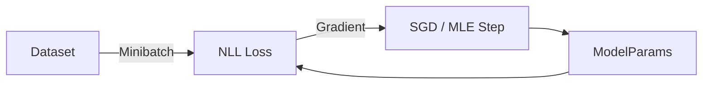

# Probability for AI: Maximum Likelihood Estimation (MLE)

## 📜 Story Mode: The Best Fit

> **Mission Date**: 2042.06.15
> **Location**: Deep Space Outpost "Vector Prime"
> **Officer**: Lead Engineer Kael
>
> **The Problem**: We have captured 1,000 enemy drones.
> They all seem to be aiming for the same point, but their guidance systems are noisy.
>
> Drone 1 landed at $x=10.1$.
> Drone 2 landed at $x=9.8$.
> Drone 3 landed at $x=10.2$.
>
> I need to know: **Where is their Base?** ($\mu$).
> And I need to know: **How bad is their guidance?** ($\sigma$).
>
> I can try guessing.
> "Maybe the Base is at $x=100$?"
> No, that would make the data we saw *highly unlikely*.
>
> "Maybe the Base is at $x=10$?"
> Yes. That would make the data *highly probable*.
>
> We need to find the parameters ($\theta$) that maximize the probability of seeing the data we actually saw.
>
> *"Computer! Run Maximum Likelihood Estimation. Find the parameters that explain this mess!"*

---

## 1. Problem Setup & Motivation

### The 6 Engineering Questions
1.  **WHAT**:
    *   **Likelihood ($L(\theta|X)$)**: The probability that a model with parameters $\theta$ would generate the observed data $X$.
    *   **MLE**: The method of finding $\theta$ that maximizes this Likelihood.
2.  **WHY**: It gives us a mathematical way to "Fitting a Line" or "Train a Network". Minimizing MSE (Mean Squared Error) is exactly the same as Maximizing Gaussian Likelihood.
3.  **WHEN**: Training *any* supervised learning model.
4.  **WHERE**: The Loss Function (Negative Log Likelihood).
5.  **WHO**: AI Training Algorithms (Backprop optimizes Likelihood).
6.  **HOW**: `Maximize P(Data | Theta)` $\rightarrow$ `Minimize -log P(Data | Theta)`.

> [!NOTE]
> **🛑 Pause & Explain (In Simple Words)**
>
> **Reverse Engineering Reality.**
>
> Probability is: Given the rules (Coin is fair), predict the data (50% heads).
> MLE is: Given the data (50% heads), predict the rules (Coin is fair).
>
> We ask: *"Which setting of the machine would make this outcome the most likely?"*

---

## 2. Mathematical Problem Formulation

### The Likelihood Function
Assume data samples $x_1, x_2, \dots x_n$ are independent (I.I.D.).
$$ L(\theta) = \prod_{i=1}^n P(x_i | \theta) $$

### The Log-Likelihood (The Engineering Fix)
Multiplying probabilities causes underflow. We take the Log.
$$ \ell(\theta) = \sum_{i=1}^n \log P(x_i | \theta) $$
We want to **Maximize** $\ell(\theta)$.
In Deep Learning, we **Minimize** Negative Log Likelihood (NLL).

---

## 3. Step-by-Step Derivation

### Deriving Mean Squared Error (MSE) from MLE
**Assumption**: The error is Gaussian (Normal Distribution).
$$ P(y|x) = \frac{1}{\sqrt{2\pi\sigma^2}} e^{-\frac{(y - \hat{y})^2}{2\sigma^2}} $$
**Step 1: Take Log**
$$ \log P = \text{const} - \frac{(y - \hat{y})^2}{2\sigma^2} $$
**Step 2: Maximize Log P**
To maximize this, we must **minimize** the negative term: $(y - \hat{y})^2$.
**Result**: Minimizing Squared Error is mathematically proven to be the "Best" way to fit data *if the noise is Gaussian*.

### Deriving Cross-Entropy from MLE
**Assumption**: Bernoulli Distribution (Coin Flip / Classification).
$$ P(y|p) = p^y (1-p)^{1-y} $$
**Step 1: Take Log**
$$ \log P = y \log p + (1-y) \log (1-p) $$
**Result**: This is exactly the **Binary Cross Entropy** loss formula.

---

## 4. Algorithm Construction

### Map to Memory (Minibatch MLE)
True MLE requires the *entire* dataset (Sum over $N$).
We can't fit ImageNet in RAM.
**Solution**: Minibatch Stochastic Gradient Descent.
We estimate the Likelihood using a small batch (32 samples).
It's a noisy estimate, but it points in the correct direction on average.

### Algorithm: Expectation-Maximization (EM)
**Problem**: What if some data is missing? (Latent variables $Z$).
**Algorithm**:
1.  **E-Step**: Guess the missing data (using current params).
2.  **M-Step**: Update params (using filled-in data).
3.  Repeat.
Used in **K-Means Clustering** and **GMMs**.

---

## 5. Optimization & Convergence Intuition

### Convexity of MLE
For simple distributions (Exponential Family), the Log-Likelihood is **Concave** (Bowl-shaped downside).
This means there is a **Unique Global Maximum**.
Training Logistic Regression *always* converges to the best solution.
(Neural Nets are not convex, sadly).

---

## 6. Worked Examples

### Example 1: The Biased Coin
**Data**: H, H, H, T. (3 Heads, 1 Tail).
**Parameter**: $\theta$ (Prob of Head).
**Likelihood**: $\theta^3 (1-\theta)^1$.
**Goal**: Maximize $\theta^3 - \theta^4$.
**Derivative**: $3\theta^2 - 4\theta^3 = 0$.
Divide by $\theta^2$: $3 - 4\theta = 0 \Rightarrow \theta = 3/4 = 0.75$.
**Result**: The MLE estimate is exactly the empirical frequency (75%).

### Example 2: Curve Fitting
**Points**: (1, 2.1), (2, 3.9), (3, 6.2).
**Model**: $y = ax$.
**Errors (assuming a=2)**: 0.1, -0.1, 0.2. (Small residuals).
**Errors (assuming a=10)**: -7.9, -16.1, -23.8. (Huge residuals).
Gaussian Likelihood prefers the small residuals.
So MLE chooses $a=2$.

---

## 7. Production-Grade Code

### The Ship's Code (Polyglot: Pure Python + Libraries)

```python
import numpy as np
import torch
import tensorflow as tf

# LEVEL 0: Pure Python (Gradient Descent for MLE)
# Scenario: Estimate Mean (mu) of data [x1, x2...] trying to minimize (x - mu)^2
def mle_sgd_pure(data, lr=0.01, epochs=100):
    """
    Finds the mean (mu) by minimizing Negative Log Likelihood (NLL).
    NLL = Sum( (x - mu)^2 ) ignoring constants.
    Derivative dNLL/dmu = -2 * Sum(x - mu)
    """
    mu = 0.0 # Initial guess
    
    for _ in range(epochs):
        # Compute Gradient (Average descent direction)
        grad = 0.0
        for x in data:
            grad += -2 * (x - mu)
        
        # Update Parameter (Steer towards likelihood)
        # We subtract gradient because we want to minimize NLL
        mu = mu - lr * (grad / len(data))
        
    return mu

# LEVEL 1: NumPy (Analytical solution)
def mle_analytical_numpy(data):
    # For Gaussian, MLE is just the empirical mean.
    return np.mean(data)

# LEVEL 2: PyTorch (Autograd Optimization)
def mle_torch(data_tensor):
    # The "training loop" approach
    mu = torch.tensor(0.0, requires_grad=True)
    sigma = torch.tensor(1.0, requires_grad=True) # optimizing scale too
    
    optimizer = torch.optim.Adam([mu, sigma], lr=0.1)
    
    for _ in range(100):
        # NLL = -LogProb
        dist = torch.distributions.Normal(mu, torch.abs(sigma))
        loss = -torch.sum(dist.log_prob(data_tensor))
        
        optimizer.zero_grad()
        loss.backward()
        optimizer.step()
        
    return mu.item(), torch.abs(sigma).item()

# LEVEL 3: TensorFlow (Keras/Probabilistic)
def mle_tf(data_tensor):
    # Using TF Variable and standard backprop
    mu = tf.Variable(0.0)
    
    with tf.GradientTape() as tape:
        # Simplified Gaussian NLL (ignoring sigma)
        loss = tf.reduce_sum(tf.square(data_tensor - mu))
        
    grad = tape.gradient(loss, mu)
    mu.assign_sub(0.01 * grad)
    return mu.numpy()

# LEVEL 4: Visualization (The Peak of Truth)
def visualize_mle():
    """
    Shows the Likelihood Curve for a Coin Flip (Bernoulli).
    We saw 3 Heads, 1 Tail. Which bias is most likely?
    """
    import matplotlib.pyplot as plt
    
    # Possible biases: 0.0 to 1.0
    theta = np.linspace(0, 1, 100)
    
    # Likelihood Function: L = p^3 * (1-p)^1
    # (Seeing 3 Heads, 1 Tail)
    likelihood = (theta**3) * ((1-theta)**1)
    
    # Find Max
    best_theta = theta[np.argmax(likelihood)]
    
    plt.figure(figsize=(8, 5))
    plt.plot(theta, likelihood, 'purple', linewidth=3, label="L(theta)")
    plt.axvline(best_theta, color='orange', linestyle='--', label=f"Max Likelihood (theta={best_theta:.2f})")
    
    plt.title("Maximum Likelihood Estimation: Finding the Best Explanation")
    plt.xlabel("Parameter Theta (Probability of Heads)")
    plt.ylabel("Likelihood of Seeing [H, H, H, T]")
    plt.legend()
    plt.grid(True)
    plt.show()
```

> [!CAUTION]
> **🛑 Production Warning**
>
> A common bug: Optimizing Variance $\sigma^2$ directly.
> Gradient Descent might push $\sigma^2$ to be negative (mathematically impossible).
> **Fix**: Optimize $s = \log(\sigma)$. Then $\sigma = e^s$. This ensures $\sigma$ is always positive.

> [!CAUTION]
> **🛑 Production Warning**
>
> A common bug: Optimizing Variance $\sigma^2$ directly.
> Gradient Descent might push $\sigma^2$ to be negative (mathematically impossible).
> **Fix**: Optimize $s = \log(\sigma)$. Then $\sigma = e^s$. This ensures $\sigma$ is always positive.

---

## 8. System-Level Integration



**Where it lives**:
**Loss Functions**: `nn.MSELoss`, `nn.CrossEntropyLoss`, `nn.NLLLoss`.
These are all doing MLE. If you change the loss, you are implicitly changing your assumption about the probability distribution of the data.

---

## 9. Evaluation & Failure Analysis

### Failure Mode: Overfitting (The MLE Flaw)
MLE loves the training data too much.
If I flip a coin once and get Heads...
MLE says: "Probability of Heads is 100%".
This predicts "Tails is Impossible".
Then I see a Tail. The probability was 0.
$\log(0) = -\infty$. The code crashes or Loss explodes.
**Fix**: **MAP (Maximum A Posteriori)**. Add a regularization term (Prior).
"I believe the coin is likely fair."
Now $P(H) = \frac{1 + 1}{1 + 2} = 2/3$. (Not 100%).

---

## 10. Ethics, Safety & Risk Analysis

### Goodhart's Law
"When a measure becomes a target, it ceases to be a good measure."
MLE ruthlessly optimizes likelihood.
If your data has a slight bias (e.g., clickbait headlines get more clicks), MLE will amplify it until the model generates *only* clickbait.
It maximizes the probability of clicks, ignoring the "Quality" or "Truth" which isn't in the likelihood function.

---

## 11. Advanced Theory & Research Depth

## 11. Advanced Theory & Research Depth

### Fisher Information Matrix
The second derivative of the Likelihood (Curvature).
It tells us **how much information** the data carries about the parameters.
High Curvature = Sharp Peak = We are very sure about $\theta$.
Low Curvature = Flat = We are unsure.
Cramér-Rao Bound: The inverse of Fisher Information is the *limit* of how precise any estimator can be.

### 📚 Deep Dive Resources
*   **Paper**: "On the Information Bottleneck Theory of Deep Learning" (Tishby et al., 2017) - Arguing that MLE training is about compressing information. [ArXiv:1703.00810](https://arxiv.org/abs/1703.00810)
*   **Concept**: **Method of Moments**. The "Cheap Alternative" to MLE. Just match the Mean and Variance. Less precise, but faster.


---

## 12. Career & Mastery Signals

## 12. Career & Mastery Signals

### Cadet (Junior)
*   Knows that MSE (Mean Squared Error) assumes Gaussian Noise.
*   Knows that Cross-Entropy assumes Bernoulli/Categorical Noise.

### Commander (Senior)
*   Can explain **EM Algorithm (Expectation-Maximization)** as coordinate ascent on the ELBO (Evidence Lower Bound).
*   Uses **Label Smoothing** to prevent MLE from being "too sure" (Overfitting probability distributions).

---

## 13. Industry Interview Corner

### ❓ Real World Questions
**Q1: "Why do we minimize Negative Log Likelihood instead of maximizing Likelihood directly?"**
*   **Answer**: "Numerical Stability. Probabilities are small ($10^{-5}$); multiplying billions of them creates underflow (0). Summing Logs is stable. Also, optimization frameworks (PyTorch) are built to Minimize, not Maximize."

**Q2: "What is the relationship between MLE and MAP?"**
*   **Answer**: "MAP (Maximum A Posteriori) is just MLE plus a Regularization term (Prior). MLE assumes Uniform Prior. MAP = MLE + $\log P(\theta)$. Weight Decay (L2) is actually doing MAP with a Gaussian Prior."

**Q3: "If my dataset has duplicates, does MLE break?"**
*   **Answer**: "No, it actually reinforces the signal. Seeing a data point twice means it is twice as likely. The distribution peak will shift stronger towards that point. However, if duplicates are artificial (data leakage), that's bad."

---

## 14. Debug Your Thinking (Common Misconceptions)

### ❌ Myth: "The most likely parameter is the true parameter."
**✅ Truth**: No. MLE is **biased** for small samples. E.g., Estimating variance $\sigma^2$ with $\frac{1}{N} \sum (x-\mu)^2$ is wrong (it's too small). You need $N-1$ (Bessel's Correction). MLE gives the *best explanation for the observed data*, not necessarily the truth.

### ❌ Myth: "MLE handles outliers well."
**✅ Truth**: Terrible handling. Squaring the error (Log Gaussian) means one outlier pulls the mean massively. We use Robust Regressors (L1 Loss / Laplace Likelihood) to ignore outliers.


---

## 15. Assessment & Mastery Checks

**Q1: Independence**
Why do we sum the logs?
*   *Answer*: Because the data samples are independent. The joint probability is the product. Log of product is Sum of logs.

**Q2: The Perfect Model**
If $Likelihood = 1$, what is the Loss?
*   *Answer*: $\log(1) = 0$. The loss is zero. Perfect memorization.

---

## 16. Further Reading & Tooling

*   **Article**: *"The Unreasonable Effectiveness of Data"* (Halevy et al.).
*   **Tool**: **Scikit-Learn** - `LogisticRegression` uses MLE by default.

---

## 17. Concept Graph Integration

*   **Previous**: [Bayes Theorem](01_foundation_math_cs/03_probability/02_bayes_theorem.md).
*   **Next**: [Hypothesis Testing](01_foundation_math_cs/03_probability/04_hypothesis_testing.md) (Checking if the fit is real).

### Concept Map
```mermaid
graph TD
    Estimate[Parameter Estimation] --> MLE[MLE (Max Likelihood)]
    Estimate --> MAP[MAP (Bayesian)]
    
    MLE --> Data[Data Obs]
    MLE --> Dist[Assumed Dist]
    MLE --> LogL[Log Likelihood]
    LogL --> Opt[Optimization/SGD]
    
    MAP --> Prior[Prior Belief]
    MAP --> Reg[Regularization]
    
    Dist --> Gaussian[Gaussian -> MSE]
    Dist --> Bernoulli[Bernoulli -> Binary CE]
    Dist --> Categorical[Categorical -> CrossEnt]
    
    style Estimate fill:#f9f,stroke:#333
    style MLE fill:#bbf,stroke:#333
```
