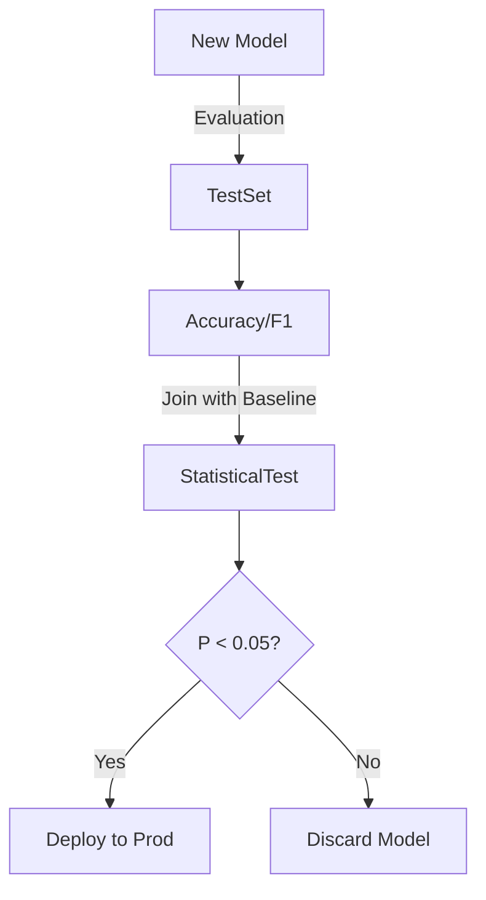

# Probability for AI: Hypothesis Testing & Confidence

## 📜 Story Mode: The Signal

> **Mission Date**: 2042.06.20
> **Location**: Deep Space Outpost "Vector Prime"
> **Officer**: Lead Engineer Kael
>
> **The Problem**: We fired the new experimental laser at the enemy.
> Damage report: "Target Shield Integrity down by 1.2%."
>
> The Captain is excited: "It works! Increased damage!"
> I shake my head. "Captain, the background radiation fluctuates shield readings by $\pm 1.0\%$ normally."
>
> "Is 1.2% real damage? Or is it just a random cosmic fluctuation?"
>
> If I say "It works" and order mass production, but it was just noise, we waste billions (Type I Error).
> If I say "It's noise" and scrap the project, but it actually worked, we lose a weapon (Type II Error).
>
> I need to measure the **Significance**.
>
> *"Computer! Run a T-Test. Null Hypothesis: The Laser does nothing. Calculate the P-Value!"*

---

## 1. Problem Setup & Motivation

### The 6 Engineering Questions
1.  **WHAT**:
    *   **Hypothesis Test**: A formal procedure to decide between two claims ($H_0$: Nothing happened vs $H_1$: Something happened).
    *   **P-Value**: The probability of seeing this data *if the Null Hypothesis were true*.
2.  **WHY**: To stop us from fooling ourselves. Humans love finding patterns in noise. Statistics forces us to be skeptical.
3.  **WHEN**:
    *   **A/B Testing**: "Does the new UI increase clicks?"
    *   **Model Eval**: "Is the new model *actually* better than the baseline, or did it just get lucky on the Test Set?"
4.  **WHERE**: Data Science Dashboards, Medical Trials.
5.  **WHO**: Data Scientists, Product Managers.
6.  **HOW**: `scipy.stats.ttest_ind(group_a, group_b)`.

> [!NOTE]
> **🛑 Pause & Explain (In Simple Words)**
>
> **The "Surprise" Factor.**
>
> The Null Hypothesis ($H_0$) is the Skeptic. It says: "This is all luck."
>
> - **High P-Value (0.5)**: "Meh. I see this kind of luck every day. Not impressed." (Keep $H_0$).
> - **Low P-Value (0.001)**: "Whoa. Getting this result by luck is basically impossible. Something real must be happening." (Reject $H_0$).
>
> **P < 0.05** is the standard cutoff. It means "Less than 1 in 20 chance of being a fluke."

---

## 2. Mathematical Problem Formulation

### Z-Score (The Standard Ruler)
How many standard deviations away is the result?
$$ Z = \frac{\bar{x} - \mu}{\sigma / \sqrt{n}} $$
*   $\bar{x}$: Observed deviation (1.2%).
*   $\mu$: Expected deviation (0%).
*   $\sigma$: Noise level (1.0%).
*   $\sqrt{n}$: Sample size bonus. (More data makes us more sure).

### Confidence Intervals
Instead of a single number ("Accuracy 90%"), give a range.
"Accuracy is $90\% \pm 2\%$ with 95% confidence."
Formula: $\bar{x} \pm 1.96 \frac{\sigma}{\sqrt{n}}$.

---

## 3. Step-by-Step Derivation

### Deriving the T-Test Logic
**Problem**: We have two models, A and B.
Mean accuracy: $\mu_A = 80\%$, $\mu_B = 82\%$.
Is B better?
**Step 1: Difference of Means**
$\Delta = \mu_B - \mu_A = 2\%$.
**Step 2: Combined Variance (Standard Error)**
$\text{SE} = \sqrt{\frac{\sigma_A^2}{n_A} + \frac{\sigma_B^2}{n_B}}$.
Assume $\sigma=5\%$, $n=100$.
$\text{SE} = \sqrt{\frac{25}{100} + \frac{25}{100}} = \sqrt{0.5} \approx 0.7\%$.
**Step 3: T-Statistic**
$t = \Delta / \text{SE} = 2.0 / 0.7 \approx 2.85$.
**Step 4: Check Table**
For $t=2.85$, P-Value is roughly 0.005.
**Conclusion**: Highly significant. Reject Null. B is strictly better.

---

## 4. Algorithm Construction

### Map to Memory (Bootstrapping)
Sometimes math is hard. We can cheat with raw compute.
**Bootstrap Resampling**:
1.  Take your dataset $D$.
2.  Resample with replacement 1000 times ($D_1 \dots D_{1000}$).
3.  Calculate the metric (e.g., Accuracy) on each.
4.  Look at the histogram of results.
5.  Get the bottom 2.5% and top 97.5% percentiles.
This gives you Confidence Intervals **without any math formulas**.

### Algorithm: Bonferroni Correction
**Problem**: If you test 100 hypotheses, 5 will be "significant" ($p<0.05$) purely by chance.
**Fix**: Divide the threshold by number of tests.
New cutoff = $0.05 / 100 = 0.0005$.
This is crucial in **Feature Selection** (testing 1000 features to see which correlates with target).

---

## 5. Optimization & Convergence Intuition

### The Bandit Problem (Optimization + Hypothesis)
In A/B testing, you waste time testing "B" if "A" is clearly better.
**Multi-Armed Bandits** (Thompson Sampling) combine Testing and Optimization.
They stop testing bad options early and funnel traffic to the winner dynamically.
Result: Maximize reward *while* learning.

---

## 6. Worked Examples

### Example 1: The Lucky Neural Net
**Story**: Junior Dev trains a model. Initial seed 42 -> Accuracy 88%.
Baseline is 87%.
"I beat SOTA by 1%!"
**Test**: Retrain with 5 random seeds.
Results: $[87.1, 86.9, 88.0, 87.2, 87.5]$.
Mean: $87.3$. Std Dev: $0.4$.
T-Test against Baseline (87.0). $t = (87.3 - 87.0) / (0.4 / \sqrt{5}) = 0.3 / 0.17 = 1.76$.
P-Value > 0.1.
**Verdict**: Not significant. The 88% was a lucky seed.

### Example 2: Medical Trial (Type I vs Type II)
**Null**: Drug doesn't work.
**Type I Error (False Positive)**: We approve a useless drug. Patients pay money, get no help.
**Type II Error (False Negative)**: We reject a cure. Patients die.
**Tradeoff**: We cannot minimize both. We usually cap Type I at 5% and assume the risk of Type II.

---

## 7. Production-Grade Code

### The Ship's Code (Polyglot: Pure Python + Libraries)

```python
import numpy as np
from scipy import stats
import torch
import tensorflow as tf

# LEVEL 0: Pure Python (Welch's T-Test Logic)
import math
def t_test_pure(group_a, group_b):
    """
    Computes T-statistic and P-value (approx) for two independent groups.
    Assumes unequal variance (Welch).
    """
    # 1. Calculate Statistics
    n_a, n_b = len(group_a), len(group_b)
    mean_a, mean_b = sum(group_a)/n_a, sum(group_b)/n_b
    
    # Variance
    var_a = sum((x - mean_a)**2 for x in group_a) / (n_a - 1)
    var_b = sum((x - mean_b)**2 for x in group_b) / (n_b - 1)
    
    # 2. Pooled Standard Error
    se = math.sqrt(var_a/n_a + var_b/n_b)
    
    # 3. T-Statistic
    t_stat = (mean_a - mean_b) / se
    
    # 4. P-Value (Approximate via Normal Distribution CDF assumption for large N)
    # Real T-dist requires Gamma function. For N>30, Normal is fine.
    # p = 2 * (1 - CDF(|t|))
    # Approximation of Erf/CDF is complex without math lib, returning t-stat.
    return t_stat

# LEVEL 1: SciPy (The Standard)
def t_test_scipy(a, b):
    # This is what you should actually use.
    # equal_var=False does Welch's T-Test (safer).
    return stats.ttest_ind(a, b, equal_var=False)

# LEVEL 2: PyTorch (Manual Tensor stats)
def t_test_torch(a_tensor, b_tensor):
    # PyTorch doesn't have t_test_ind built-in, we calculate manually.
    mean_a, mean_b = a_tensor.mean(), b_tensor.mean()
    var_a, var_b = a_tensor.var(), b_tensor.var()
    n_a, n_b = a_tensor.numel(), b_tensor.numel()
    
    se = torch.sqrt(var_a/n_a + var_b/n_b)
    t_stat = (mean_a - mean_b) / se
    return t_stat

# LEVEL 3: TensorFlow (TF Probability)
# import tensorflow_probability as tfp (Optional dep)
def t_test_tf(a_tensor, b_tensor):
    # Manual implementation in TF
    mean_a, var_a = tf.nn.moments(a_tensor, axes=[0])
    mean_b, var_b = tf.nn.moments(b_tensor, axes=[0])
    n_a = tf.cast(tf.size(a_tensor), tf.float32)
    n_b = tf.cast(tf.size(b_tensor), tf.float32)
    
    se = tf.sqrt(var_a/n_a + var_b/n_b)
    t = (mean_a - mean_b) / se
    return t

# LEVEL 4: Visualization (The Tail Area)
def visualize_p_value(t_stat=2.0):
    """
    Shows the P-Value area under the T-Distribution.
    """
    import matplotlib.pyplot as plt
    from scipy.stats import t
    
    df = 30 # degrees of freedom
    x = np.linspace(-4, 4, 100)
    y = t.pdf(x, df)
    
    plt.figure(figsize=(8, 5))
    plt.plot(x, y, 'k-', label="Null Hypothesis Dist")
    
    # Shade the P-Value area (Two-tailed)
    plt.fill_between(x, y, where=(x >= abs(t_stat)), color='red', alpha=0.5, label="P-Value Area")
    plt.fill_between(x, y, where=(x <= -abs(t_stat)), color='red', alpha=0.5)
    
    plt.axvline(t_stat, color='blue', linestyle='--', label=f"Observed t={t_stat}")
    
    plt.title(f"Hypothesis Testing: Is the observed t={t_stat} inside the 'Red Zone'?")
    plt.legend()
    plt.grid(True, alpha=0.3)
    plt.show()
```

> [!CAUTION]
> **🛑 Production Warning**
>
> **Peeking**: If you constantly check the P-Value while the test is running and stop when it hits 0.05, you are cheating.
> This inflates False Positives massively.
> **Rule**: Decide sample size $N$ *before* the experiment. Stick to it.

> [!CAUTION]
> **🛑 Production Warning**
>
> **Peeking**: If you constantly check the P-Value while the test is running and stop when it hits 0.05, you are cheating.
> This inflates False Positives massively.
> **Rule**: Decide sample size $N$ *before* the experiment. Stick to it.

---

## 8. System-Level Integration



**Where it lives**:
**CI/CD Pipelines**: Automated Model Evaluation.
If `P(New_Model < Old_Model) > 0.05`, the pipeline fails. We don't deploy regressors.

---

## 9. Evaluation & Failure Analysis

### Failure Mode: P-Hacking
Trying 20 different hyperparameters and reporting only the one that worked.
Because $1/20$ chance is 0.05, you are guaranteed to find a "significant" result even if the model is garbage.
**Fix**: Use a **Hold-Out Test Set** that you only look at **ONCE** at the very end.

---

## 10. Ethics, Safety & Risk Analysis

### The Significance of "Significance"
"Statistically Significant" $\neq$ "Practically Significant".
With $N=1,000,000$, a difference of $0.0001\%$ becomes Statistically Significant.
But it is useless to the user.
**Safety**: Always report **Effect Size** (Cohen's d) alongside P-Value.

---

## 11. Advanced Theory & Research Depth

## 11. Advanced Theory & Research Depth

### Bayesian Hypothesis Testing (Bayes Factors)
Instead of P-Values (which are confusing), calculate the Odds Ratio.
$$ \frac{P(D|H_1)}{P(D|H_0)} $$
If Ratio > 10, evidence is strong.
If Ratio < 1, evidence favors Null.
This is much more intuitive but requires priors.

### 📚 Deep Dive Resources
*   **Paper**: "Deep Learning Generalization" (Jiang et al, 2019) - Used statistical margin theory to predict if a trained network will generalize to test set (Hypothesis testing on weights). [ArXiv:1812.11118](https://arxiv.org/abs/1812.11118)
*   **Concept**: **Permutation Test**. If you don't trust Normality assumptions, shuffle the labels 1000 times. If your real result is better than 99% of shuffled results, it's real.


---

## 12. Career & Mastery Signals

## 12. Career & Mastery Signals

### Cadet (Junior)
*   Can interpret a P-Value correctly (Rejection of Null, not Probability of Truth).
*   Uses **Bootstrap** to get Confidence Intervals for metrics like F1-Score.

### Commander (Senior)
*   Designs **Power Analysis** (Sample Size calculation) *before* starting an experiment.
*   Implements **Stratified Sampling** to ensure A/B tests are balanced across user demographics.

---

## 13. Industry Interview Corner

### ❓ Real World Questions
**Q1: "When should you use a T-Test vs a Z-Test?"**
*   **Answer**: "Z-Test requires knowing the true population variance $\sigma^2$ (rare) or huge sample size $N > 30$. T-Test estimates variance from data. In engineering practice, we almost always use T-Test (or Welch's T-Test) because $N$ is variable."

**Q2: "What is A/A Testing and why do we do it?"**
*   **Answer**: "A/A Testing is giving both groups the *same* model to verify the testing pipeline. If the test finds a 'Significant' difference between A and A, your randomization or data logging is broken."

**Q3: "How do you test if two distributions are the same (e.g. Training vs Production Data)?"**
*   **Answer**: "Kolmogorov-Smirnov (KS) Test measures the max distance between CDFs. Or better yet for High-D data: Maximum Mean Discrepancy (MMD) or just monitoring the KL-Divergence drift."

---

## 14. Debug Your Thinking (Common Misconceptions)

### ❌ Myth: "We need more data to get a higher P-Value."
**✅ Truth**: No, more data usually leads to a **Lower** P-Value (easier to detect small differences). If the effect is real, $P \to 0$ as $N \to \infty$. If P is high despite high N, the effect is likely zero.

### ❌ Myth: "Validation Accuracy 90.1% is better than 90.0%."
**✅ Truth**: Almost certainly noise. Without a Confidence Interval or a T-Test over multiple runs, comparing the 3rd decimal place is numerology, not science.


---

## 15. Assessment & Mastery Checks

**Q1: Sample Size**
How does $N$ affect the Confidence Interval?
*   *Answer*: It shrinks it by $\sqrt{N}$. More data = More precision.

**Q2: Random Seeds**
Why do we average over seeds?
*   *Answer*: To distinguish between "Model Architecture Quality" (Signal) and "Initialization Weight Luck" (Noise).

---

## 16. Further Reading & Tooling

*   **Article**: *"The P-Value Statement"* (American Statistical Association).
*   **Tool**: **Statsmodels** (Python) - For rigorous statistical tests.

---

## 17. Concept Graph Integration

*   **Previous**: [MLE](01_foundation_math_cs/03_probability/03_mle.md).
*   **Next**: [Algorithms & Complexity](01_foundation_math_cs/04_algorithms/01_big_o.md) (Starting Phase 4).

### Concept Map
```mermaid
graph TD
    Test[Hypothesis Test] --> H0[Null Hypothesis H0]
    Test --> H1[Alt Hypothesis H1]
    
    Test --> PVal[P-Value]
    PVal --> Sig[Significance Level alpha]
    Sig --> Decisions
    
    Decisions --> Reject[Reject H0 (Signal)]
    Decisions --> Fail[Fail to Reject (Noise)]
    
    Test --> Errors
    Errors --> Type1[Type I: False Pos]
    Errors --> Type2[Type II: False Neg]
    
    Test --> Types
    Types --> TTest[T-Test (Means)]
    Types --> Chi[Chi-Square (Counts)]
    Types --> ANOVA[ANOVA (Groups)]
    
    style Test fill:#f9f,stroke:#333
    style PVal fill:#bbf,stroke:#333
```
