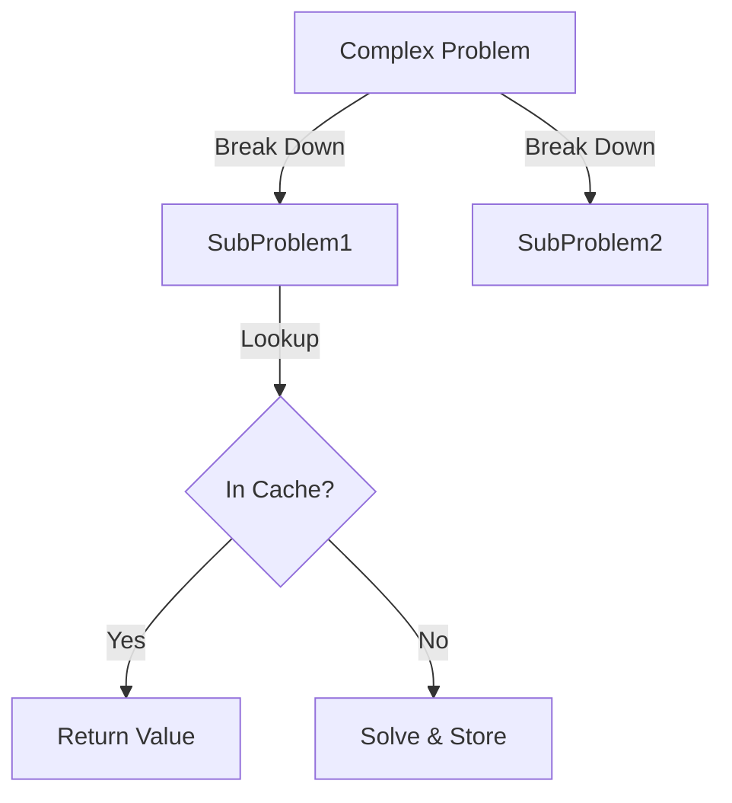

# Algorithms for AI: Recursion & Dynamic Programming

## 📜 Story Mode: The Subproblem

> **Mission Date**: 2042.06.31
> **Location**: Deep Space Outpost "Vector Prime"
> **Officer**: Lead Engineer Kael
>
> **The Problem**: We need to plot a course through the asteroid belt.
> The belt is a grid $1000 \times 1000$.
>
> I ask the computer: "Best path from Start to End?"
> It starts calculating: "Path 1... Path 2... Path 3..."
>
> "How many paths?"
> "Roughly $2^{1000}$. I will be done in the next universe."
>
> The problem is that it is re-solving the same segments over and over. Getting from A to B is the same, no matter how you got to A.
>
> We need to **Remember**.
>
> *"Computer! Enable Memoization. If you solve a sector, write it down. Don't solve it twice!"*

---

## 1. Problem Setup & Motivation

### The 6 Engineering Questions
1.  **WHAT**:
    *   **Recursion**: A function that calls itself to solve smaller instances of the same problem.
    *   **Dynamic Programming (DP)**: Recursion + Caching (Memoization). Breaking a problem into overlapping subproblems and storing the answers.
2.  **WHY**: Many AI problems (Pathfinding, Sequence Alignment, Decision Process) are recursive.
3.  **WHEN**:
    *   **Reinforcement Learning**: The Bellman Equation is pure DP.
    *   **NLP**: Viterbi Algorithm (finding best pos-tags).
4.  **WHERE**: The Call Stack (Recursion) and the Hash Map (DP Table).
5.  **WHO**: Algorithm Engineers.
6.  **HOW**: `Value(State) = Reward + max(Value(NextStates))`.

> [!NOTE]
> **🛑 Pause & Explain (In Simple Words)**
>
> **Recursion is the movie "Inception".**
> You dream within a dream.
> You must wake up from the inner dream to finish the outer dream.
>
> **DP is just "Not being stupid".**
> If I ask you "What is 112 + 15?", you calculate "127".
> If I ask you again 5 seconds later, do you re-calculate?
> No. You **remember** "127".
> DP = Recursion + Memory.

---

## 2. Mathematical Problem Formulation

### The Bellman Equation (The Heart of AI)
For an optimal policy:
$$ V(s) = \max_a [ R(s,a) + \gamma \sum P(s'|s,a) V(s') ] $$
*   $V(s)$: Value of being in state $s$.
*   $R$: Immediate Reward.
*   $V(s')$: Value of the next state (Recursive step).
*   $\gamma$: Discount factor (future is less important).

### Top-Down vs Bottom-Up
1.  **Top-Down (Memoization)**: Start at Goal, work backward. Cache results. Best if not all subproblems need solving.
2.  **Bottom-Up (Tabulation)**: Fill the table from 0 to N. Best if you need all subproblems (Iterative, no stack overflow).

---

## 3. Step-by-Step Derivation

### The Fibonacci Sequence
**Definition**: $F(n) = F(n-1) + F(n-2)$. Base: $F(0)=0, F(1)=1$.

**Attempt 1 (Naive Recursion)**:
```python
fib(5) calls fib(4), fib(3)
    fib(4) calls fib(3), fib(2)
        fib(3) calls fib(2), fib(1) ...
```
We solved `fib(3)` twice. `fib(2)` three times.
Structure: **Tree**. Nodes: Exponential ($O(2^n)$).

**Attempt 2 (DP)**:
Initialize `memo = {}`.
1.  Check `memo`. If exists, return.
2.  Compute `res = fib(n-1) + fib(n-2)`.
3.  Store `memo[n] = res`.
Structure: **Line**. Nodes: Linear ($O(N)$).

---

## 4. Algorithm Construction

### Map to Memory (The Stack Limit)
Recursion uses the **Call Stack**.
Every call adds a "Stack Frame" (Variables, Return Address).
Stack size is limited (e.g., 1000 deep).
**Stack Overflow**: If you recurse too deep, the program crashes.
**Fix**: Use Bottom-Up DP (Loop) which uses Heap memory, or Tail Recursion (if generic language supports it).

### Algorithm: Longest Common Subsequence (LCS)
**Goal**: Compare DNA strings "AGGTAB" and "GXTXAYB".
**Recurrence**:
If chars match: $1 + LCS(i-1, j-1)$.
If no match: $\max(LCS(i-1, j), LCS(i, j-1))$.
This is the core of **Git Diff** and **Bioinformatics**.

---

## 5. Optimization & Convergence Intuition

### Space Complexity Reduction
Standard DP uses $O(N^2)$ space for the table.
Often, we only need the *previous row* to compute the *current row*.
We can optimize Space to $O(N)$ by discarding old rows.
**Example**: In Transformer KV-Cache (inference), we cache past keys/values to avoid recomputing. This is a form of Memoization.

---

## 6. Worked Examples

### Example 1: The Robot Grid (Unique Paths)
**Grid**: $M \times N$. Robot starts top-left. Move Down or Right.
**State**: $Paths(i, j)$ is ways to get to $(i, j)$.
**Recurrence**: $Paths(i, j) = Paths(i-1, j) + Paths(i, j-1)$.
**Base Case**: $Paths(0, 0) = 1$.
**Table**:
1  1  1
1  2  3
1  3  6
Answer: 6.

### Example 2: Edit Distance (Spell Checker)
**Words**: "Cat" $\to$ "Cut".
**Ops**: Insert, Delete, Replace.
DP Table finds the minimum ops to transform string A to B.
Minimizing this "Edit Distance" is how search engines say "Did you mean...?"

---

## 7. Production-Grade Code

### The Ship's Code (Polyglot: Pure Python + Libraries)

```python
import numpy as np
import torch
import tensorflow as tf

# LEVEL 0: Pure Python (Manual Memoization)
# No decorators. Showing the raw mechanics.
def fib_manual_memo(n, memo={}):
    if n in memo: 
        return memo[n]
    if n < 2: 
        return n
    
    # Store result before returning
    res = fib_manual_memo(n-1, memo) + fib_manual_memo(n-2, memo)
    memo[n] = res
    return res

# LEVEL 1: NumPy (Tabulation / Vectorized DP)
def fib_numpy(n):
    # Bottom-up array filling
    # Pre-allocate array (vectorized init)
    dp = np.zeros(n+1, dtype=int)
    dp[1] = 1
    for i in range(2, n+1):
        dp[i] = dp[i-1] + dp[i-2]
    return dp[n]

# LEVEL 2: PyTorch (RNN/Sequence approach)
def torch_rnn_sim(input_seq):
    # RNN is basically DP over time: h_t = tanh(W*x_t + U*h_{t-1})
    # We remember the "state" h
    hidden_state = torch.zeros(1, 10) # 10 hidden units
    output = []
    
    rnn_cell = torch.nn.RNNCell(input_size=5, hidden_size=10)
    
    for x in input_seq:
        hidden_state = rnn_cell(x, hidden_state)
        output.append(hidden_state)
    
    return torch.stack(output)

# LEVEL 3: TensorFlow (tf.scan for Functional DP)
def tf_scan_fib(n):
    # tf.scan is "accumulation" or "fold"
    # It passes state to next step.
    # Generating fib sequence [1, 1, 2, 3...]
    
    # Initial state (prev, current)
    initial = (tf.constant(0), tf.constant(1))
    
    def step(state, _):
        prev, curr = state
        return (curr, prev + curr)
    
    # Run scan n times
    fibs = tf.scan(step, tf.range(n), initializer=initial)
    return fibs[1][-1] # Return last current
```

> [!CAUTION]
> **🛑 Production Warning**
>
> **LRU Cache (Least Recently Used)**: In production, never set `maxsize=None`.
> It will eat all your RAM until the server crashes.
> Set a limit (e.g., 1024) so old entries are evicted.

> [!CAUTION]
> **🛑 Production Warning**
>
> **LRU Cache (Least Recently Used)**: In production, never set `maxsize=None`.
> It will eat all your RAM until the server crashes.
> Set a limit (e.g., 1024) so old entries are evicted.

---

## 8. System-Level Integration



**Where it lives**:
**Dynamic Computation Graphs**: PyTorch builds graphs dynamically.
**Beam Search**: In LLM generation, we keep the top K best partial sentences (DP-like search) to find the best total sentence.

---

## 9. Evaluation & Failure Analysis

### Failure Mode: The Curse of Dimensionality
DP fills a table.
1D: Array (Easy).
2D: Grid (Okay).
100D: Grid of $N^{100}$. (Impossible).
**Reinforcement Learning**: We can't solve Bellman Equation for high-dim inputs (Images).
**Fix**: Function Approximation. Replace the DP Table with a **Neural Network** ($V(s) \approx NN(s)$). This is **Deep** RL.

---

## 10. Ethics, Safety & Risk Analysis

### Optimization vs Robustness
DP finds the *Global Optimum* for the *Specific Constraints*.
If the constraints are slightly wrong (Model mismatch), the "Optimal" path might be dangerous.
**Example**: Optimal path for a robot might graze the wall (Risk of collision).
**Safety**: Add "Safety Margins" to the cost function.

---

## 11. Advanced Theory & Research Depth

## 11. Advanced Theory & Research Depth

### The Viterbi Algorithm
DP on Hidden Markov Models (HMM).
Used in decoding the most likely sequence of hidden states.
Also used in **CTC Loss** (Connectionist Temporal Classification) for Speech Recognition.

### 📚 Deep Dive Resources
*   **Paper**: "Neural Turing Machines" (Graves et al., 2014) - Neural networks that can learn algorithms (like copy/sort) using explicit read/write memory. [ArXiv:1410.5401](https://arxiv.org/abs/1410.5401)
*   **Concept**: **Reinforcement Learning as DP**. Understand that Q-Learning is just DP where we learn the recurrence relation (The Bellman update) from data instead of knowing it perfectly.


---

## 12. Career & Mastery Signals

## 12. Career & Mastery Signals

### Cadet (Junior)
*   Can transform Recursion ($O(2^N)$) into DP ($O(N)$) using a simple dictionary.
*   Knows the difference between `lru_cache` (Memoization) and Iterative Loops (Tabulation).

### Commander (Senior)
*   Recognizes **DP on Trees** (e.g., Tree-LSTM).
*   Designs **beam search decoders** for sequence models to trade off speed vs optimal text generation.

---

## 13. Industry Interview Corner

### ❓ Real World Questions
**Q1: "Climbing Stairs Problem: You can take 1 or 2 steps. How many ways to top?"**
*   **Answer**: "This is exactly Fibonacci. $Ways(N) = Ways(N-1) + Ways(N-2)$. Base cases $W(1)=1, W(2)=2$. Solved via DP in $O(N)$."

**Q2: "What is the difference between Memoization and Tabulation?"**
*   **Answer**: "Memoization is Top-Down (Lazy). It solves only needed subproblems but uses stack space. Tabulation is Bottom-Up (Eager). It fills the table iteratively. It avoids stack overflow but might compute unnecessary entries."

**Q3: "How does Dynamic Programming apply to sequence alignment (bioinformatics)?"**
*   **Answer**: "Needleman-Wunsch algorithm. We build a grid comparing DNA sequence A vs B. Diagonal moves are matches. Vertical/Horizontal are gaps (insertions/deletions). We find the path with max score."

---

## 14. Debug Your Thinking (Common Misconceptions)

### ❌ Myth: "Recursion is always slower than loops."
**✅ Truth**: Not always. In languages with **Tail Call Optimization** (Scala, C++, not Python), recursion is compiled into a loop. It costs zero stack. In Python, yes, it is slower due to stack overhead.

### ❌ Myth: "DP is just recursion."
**✅ Truth**: DP is Recursion **+ Reuse**. Without reuse/overlapping subproblems, it's just Divide & Conquer (like Quicksort), not DP.


---

## 15. Assessment & Mastery Checks

**Q1: Overlapping Subproblems**
What property does a problem need for DP?
*   *Answer*: Optimality Substructure (Solution uses optimal sub-solutions) AND Overlapping Subproblems (Same subproblems occur repeatedly).

**Q2: 0/1 Knapsack**
Can you solve Knapsack with Greedy?
*   *Answer*: No. You might pick a high-value item that fills the bag awkwardly. You need DP.

---

## 16. Further Reading & Tooling

*   **Book**: *"Dynamic Programming for Coding Interviews"* (Meenakshi).
*   **Concept**: **Reinforcement Learning** (Sutton & Barto) - The bible of DP in AI.

---

## 17. Concept Graph Integration

*   **Previous**: [Big O](01_foundation_math_cs/04_algorithms/01_big_o.md).
*   **Next**: [Sorting & Searching](01_foundation_math_cs/04_algorithms/03_sorting_searching.md) (Organizing Data).
