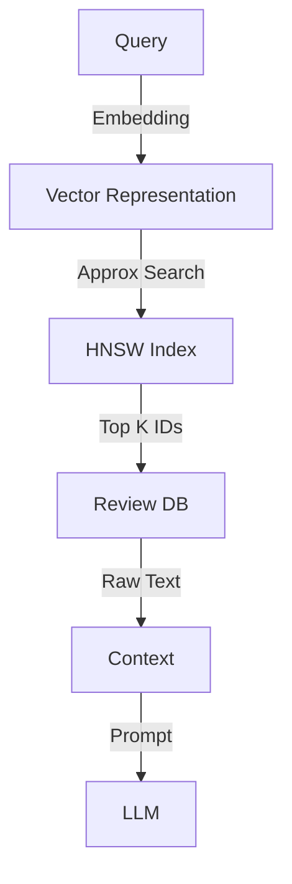

# Algorithms for AI: Sorting & Searching

## 📜 Story Mode: The Organization

> **Mission Date**: 2042.07.15
> **Location**: Deep Space Outpost "Vector Prime"
> **Officer**: Lead Engineer Kael
>
> **The Problem**: The Sensor Array dumped 10 Billion signal logs into a single text file.
> It's a mess. Timestamps are random.
>
> The Captain asks: "Did we detect a Gamma Burst at timestamp `123456789`?"
>
> I look at the file. It's unsorted.
> To find one timestamp, I have to read the whole file. (Linear Search: $O(N)$).
> With 10 Billion lines, that takes 1 hour.
>
> And the Captain calls me every 5 minutes.
>
> I can't keep scanning. I need to **Sort** the data once.
> If it's sorted, I can jump to the middle, check if it's high or low, and cut the problem in half. (Binary Search: $O(\log N)$).
>
> *"Computer! Initiate Quicksort. Organize this chaos. Then build an Index."*

---

## 1. Problem Setup & Motivation

### The 6 Engineering Questions
1.  **WHAT**:
    *   **Sorting**: Arranging data in order ($1, 2, 3 \dots$).
    *   **Searching**: Finding a specific item in the data.
2.  **WHY**: Sorted data is "Indexed" data. It allows retrieval in $O(\log N)$ instead of $O(N)$.
3.  **WHEN**: Preparing Datasets, RAG (Retrieval Augmented Generation), Database Indices.
4.  **WHERE**: `numpy.sort()`, `torch.topk()`, Vector Databases (FAISS).
5.  **WHO**: Data Engineers, Search Engineers.
6.  **HOW**: **QuickSort** (Divide & Conquer) + **Binary Search** (Cut in half).

> [!NOTE]
> **🛑 Pause & Explain (In Simple Words)**
>
> **Sorting is the price you pay for speed later.**
>
> Imagine a library where books are thrown on the floor randomly.
> Finding "Harry Potter" takes forever.
>
> Now imagine a library where books are sorted by Title.
> You walk to "H", then "Ha", then "Har". You find it in seconds.
>
> **Cost**: Organizing the books takes a long time (Sorting).
> **Benefit**: Finding a book becomes instant (Searching).
> **Tradeoff**: If you only look for one book, don't sort. If you look for books every day, SORT.

---

## 2. Mathematical Problem Formulation

### The Sorting Limit
For Comparison-Based Sorting (comparing $A$ vs $B$), the lower bound is $N \log N$.
Proof: There are $N!$ permutations. You need $\log_2(N!)$ comparisons to distinguish them.
Stirling's Approximation $\log(N!) \approx N \log N$.

### Binary Search (The Splitting)
$T(N) = T(N/2) + 1$.
Step 1: N
Step 2: N/2
...
Step k: $N/2^k = 1$.
$2^k = N \Rightarrow k = \log_2 N$.

---

## 3. Step-by-Step Derivation

### Deriving QuickSort
**Goal**: Sort $[5, 2, 9, 1, 5, 6]$.
**Step 1: Pick Pivot**. Say $5$ (First element).
**Step 2: Partition**.
Less than 5: $[2, 1]$.
Equal to 5: $[5, 5]$.
Greater than 5: $[9, 6]$.
**Step 3: Recurse**.
Sort $[2, 1] \to [1, 2]$.
Sort $[9, 6] \to [6, 9]$.
**Step 4: Combine**.
$[1, 2] + [5, 5] + [6, 9] = [1, 2, 5, 5, 6, 9]$.
**Complexity**: Average $O(N \log N)$. Worst case $O(N^2)$ (if already sorted and pivot is bad).

---

## 4. Algorithm Construction

### Map to Memory (Locality/Paging)
Binary Search is theoretically fast ($O(\log N)$), but it jumps around memory randomly.
For 10 Billion items, the array is on Disk. Random Disk Access is slow.
**B-Trees**: A "Fat" Binary Tree.
Instead of 2 branches, each node has 1000 branches.
Height of tree becomes $\log_{1000} N$.
Drastically reduces Disk Reads.
Used in **SQL Databases** and **File Systems**.

### Algorithm: Top-K (The AI Sort)
In AI, we rarely need the *whole* array sorted.
We usually want the "Top 5 most probable tokens" (Beam Search) or "Top 10 similar documents" (RAG).
**Heap Sort (Priority Queue)**:
Keep a min-heap of size K.
If new item > min, replace min.
Cost: $N \log K$. (Much cheaper than $N \log N$ if $K \ll N$).

---

## 5. Optimization & Convergence Intuition

### Vector Search (Approximate Nearest Neighbor)
In High Dimensions (1024-dim vectors), simple sorting doesn't work.
"Is this vector larger than that one?" is meaningless.
We need **Nearest Neighbor Search**.
Exact NN is $O(N)$. Too slow.
**ANN (HNSW)**: Build a "Highway" graph.
Jump far, then jump close.
Reduces search to $O(\log N)$ even in high dimensions.

---

## 6. Worked Examples

### Example 1: The RAG Pipeline
**Problem**: User asks "How do I fix error 504?"
**Database**: 1 Million Documents.
**Naive**: Run LLM on all 1M docs. (Cost: $1M).
**Smart**:
1.  Embed Query.
2.  Search Vector DB (ANN Index): $O(\log N)$. Get Top 5 docs.
3.  Run LLM on Top 5. (Cost: $0.01).
**Lesson**: Searching is the filter that makes AI affordable.

### Example 2: TimSort (Python's Sort)
Python's `sort()` is **TimSort** (Merge Sort + Insertion Sort).
It assumes real-world data often has "Runs" of already sorted segments.
It merges these runs.
On random data: $O(N \log N)$.
On nearly sorted data: $O(N)$.
This is why Python sorting feels surprisingly fast.

---

## 7. Production-Grade Code

### The Ship's Code (Polyglot: Pure Python + Libraries)

```python
import numpy as np
import torch
import tensorflow as tf

# LEVEL 0: Pure Python (Quicksort - The Recursive Divide)
def quicksort_pure(arr):
    """
    Sorts array in O(N log N) using divide & conquer.
    Note: Python lists are slow. This is for Logic demonstration.
    """
    if len(arr) <= 1:
        return arr
    
    pivot = arr[len(arr) // 2]
    left = [x for x in arr if x < pivot]
    middle = [x for x in arr if x == pivot]
    right = [x for x in arr if x > pivot]
    
    return quicksort_pure(left) + middle + quicksort_pure(right)

# LEVEL 1: NumPy (Highly Optimized C-Sort)
def sort_numpy(arr):
    # Uses IntroSort (QuickSort + HeapSort)
    return np.sort(arr)

def argsort_numpy(arr):
    # Returns INDICES that would sort the array
    # Crucial for finding "Which item is this?"
    return np.argsort(arr)

# LEVEL 2: PyTorch (GPU Sorting / Top-K)
def torch_sort_demo(tensor):
    # Full Sort (Expensive)
    sorted_vals, indices = torch.sort(tensor, descending=True)
    return sorted_vals

def torch_topk_demo(tensor, k=5):
    # Approximate or Partial Sort (Fast)
    # Only finds the top K items. O(N log K)
    # Used in Beam Search for LLMs.
    vals, indices = torch.topk(tensor, k)
    return vals, indices

# LEVEL 3: TensorFlow (XLA Sort)
def tf_sort_demo(tensor):
    # TF Sort
    return tf.sort(tensor, direction='DESCENDING')

def tf_topk_demo(tensor, k=5):
    # Top K in TF
    return tf.math.top_k(tensor, k=k)
```

> [!CAUTION]
> **🛑 Production Warning**
>
> **Argmax vs Max**:
> `max()` gives the value. `argmax()` gives the index.
> In Classification, you need `argmax` (Class ID), not `max` (Probability).
> Common bug: Logging the probability instead of the class label.

> [!CAUTION]
> **🛑 Production Warning**
>
> **Argmax vs Max**:
> `max()` gives the value. `argmax()` gives the index.
> In Classification, you need `argmax` (Class ID), not `max` (Probability).
> Common bug: Logging the probability instead of the class label.

---

## 8. System-Level Integration



**Where it lives**:
**FAISS / Pinecone / Milvus**: These are specialized Search Engines for Vectors.
They don't use B-Trees. They use **HNSW** (Hierarchical Navigable Small World) graphs to navigate high-dimensional space.

---

## 9. Evaluation & Failure Analysis

### Failure Mode: The "Curse of Dimensionality" in Search
In 2D, "Near" is meaningful.
In 10,000D, **Everything is far from everything**.
Distance metrics lose meaning.
Nearest Neighbor Search degrades to Linear Scan ($O(N)$).
**Fix**: Dimensionality Reduction (PCA / Autoencoders) before indexing.

---

## 10. Ethics, Safety & Risk Analysis

### The Filter Bubble
Search Algorithms optimize for "Relevance" (CTR).
If you click on Conspiracy Theories, the Search puts them at the top (Top-K).
Eventually, your entire world (Sorted List) is conspiracy theories.
**Safety**: We must inject diversity (Randomness) into the Top-K results to break the echo chamber.

---

## 11. Advanced Theory & Research Depth

## 11. Advanced Theory & Research Depth

### Quantum Search (Grover's Algorithm)
Classical Search: $O(N)$.
Quantum Search: $O(\sqrt{N})$.
If you have 1 Trillion items...
Classical: 1 Trillion steps.
Quantum: 1 Million steps.
This is one of the few proven quantum speedups.

### 📚 Deep Dive Resources
*   **Paper**: "The Case for Learned Index Structures" (Kraska et al., 2017) - Exploring if we can replace B-Trees with Neural Networks (Learning the CDF of data). [ArXiv:1712.01208](https://arxiv.org/abs/1712.01208)
*   **Concept**: **Approximate Nearest Neighbor (ANN)**. Algorithms like HNSW (Hierarchical Navigable Small World) or LSH (Locality Sensitive Hashing) trade 1% accuracy for 1000x speedups in vector search.


---

## 12. Career & Mastery Signals

## 12. Career & Mastery Signals

### Cadet (Junior)
*   Can implement Binary Search ($O(\log N)$) without off-by-one errors.
*   Knows `sort()` vs `sorted()` in Python (In-place vs New List).

### Commander (Senior)
*   Selects **Radix Sort** for sorting Integers/IP Addresses ($O(N)$) to avoid the $N \log N$ bottleneck.
*   Designs **Search Ranking Systems** (Learning to Rank) using XGBoost or Neural Nets.

---

## 13. Industry Interview Corner

### ❓ Real World Questions
**Q1: "You have a stream of numbers coming in. Find the Median at any time."**
*   **Answer**: "Use two heaps: A Max-Heap for the lower half and a Min-Heap for the upper half. Balance them. Median is the top of the heaps. Complexity $O(\log N)$ to add, $O(1)$ to read."

**Q2: "Why is MergeSort preferred over QuickSort for Linked Lists?"**
*   **Answer**: "MergeSort accesses data sequentially (good for Linked Lists). QuickSort requires random access to swap pivots efficiently (bad for Linked Lists, slow traversal)."

**Q3: "How does Database Indexing work?"**
*   **Answer**: "It creates a B-Tree (balanced tree) on the indexed column. Leaf nodes point to the disk location. Searching the tree is $O(\log N)$. Without it, DB does a Full Table Scan $O(N)$."

---

## 14. Debug Your Thinking (Common Misconceptions)

### ❌ Myth: "Hash Map is always O(1) Search."
**✅ Truth**: Worst case is $O(N)$ if many keys collide (hash to same bucket). In Python, if you use a mutable object (that shouldn't be hashed) or a bad hash function, you can break the performance. Security attacks (Hash Flooding) can exploit this to DoS a server.

### ❌ Myth: "QuickSort is the fastest sort."
**✅ Truth**: Not always. For very small arrays ($N<50$), Insertion Sort is faster (less overhead). Standard libraries use hybrid sorts (Timsort, Introsort) that switch algorithms based on size.


---

## 15. Assessment & Mastery Checks

**Q1: Best Case Sorting**
What is the best case for Insertion Sort?
*   *Answer*: $O(N)$. When the array is already sorted.

**Q2: Binary Search Prereq**
Can you Binary Search a Linked List?
*   *Answer*: No. You cannot jump to the middle in $O(1)$. You need an Array or Vector.

---

## 16. Further Reading & Tooling

*   **Lib**: **FAISS** (Facebook AI Similarity Search) - The standard for Vector Search.
*   **Visual**: **VisuAlgo.net** - Animations of sorting algorithms.

---

## 17. Concept Graph Integration

*   **Previous**: [Recursion & DP](01_foundation_math_cs/04_algorithms/02_recursion_dp.md).
*   **Next**: [Data Structures](01_foundation_math_cs/05_data_structures/01_stack_queue.md) (Storing Data).
