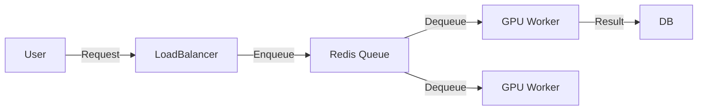

# Data Structures for AI: Stacks & Queues

## 📜 Story Mode: The Buffer

> **Mission Date**: 2042.08.01
> **Location**: Deep Space Outpost "Vector Prime"
> **Officer**: Lead Engineer Kael
>
> **The Problem**: We are receiving distress signals from two sectors.
> Sector Alpha: "Critical Life Support Fail!" (Received 1 second ago).
> Sector Beta: "Cat stuck in tree." (Received 1 hour ago).
>
> The Communication Buffer is set to **LIFO** (Last In, First Out).
> It shows me the *newest* message first (Sector Alpha). This saves lives.
>
> But the Supply Drones are set to **LIFO** too.
> They loaded the medical kits *first*, then the cat food *last*.
> Now I have to unload all the cat food to get to the medical kits.
>
> I need to change the Supply Drones to **FIFO** (First In, First Out). First loaded is first delivered.
>
> *"Computer! Reconfigure Memory Architecture. Comms = Stack. Logistics = Queue. Don't mix them up!"*

---

## 1. Problem Setup & Motivation

### The 6 Engineering Questions
1.  **WHAT**:
    *   **Stack**: LIFO (Last In, First Out). Like a stack of plates. Push/Pop $O(1)$.
    *   **Queue**: FIFO (First In, First Out). Like a line at Starbucks. Enqueue/Dequeue $O(1)$.
    *   **Deque**: Double-ended queue. Push/Pop at both ends.
2.  **WHY**: They control the **order of processing**.
3.  **WHEN**:
    *   **Stack**: Function calls (Recursion), Undo buttons, DFS (Depth First Search).
    *   **Queue**: Data Buffers, Print Jobs, BFS (Breadth First Search).
4.  **WHERE**: `collections.deque`, `list.append()`, CPU Call Stack.
5.  **WHO**: Drivers writing firmware, AI Engineers writing Data Loaders.
6.  **HOW**: Using Dynamic Arrays or Linked Lists.

> [!NOTE]
> **🛑 Pause & Explain (In Simple Words)**
>
> **The Order of Time.**
>
> - **Queue**: Fairness. "I was here first." (Streaming video, assembling batches).
> - **Stack**: Urgency / Reversibility. "What was I just doing?" (Back button, Backpropagation).
> - **Priority Queue**: Importance. "Let the VIP go first." (A* Search).

---

## 2. Mathematical Problem Formulation

### Complexity Analysis
| Operation | Array (List) | Linked List | Deque |
| :--- | :--- | :--- | :--- |
| **Push** | $O(1)^*$ | $O(1)$ | $O(1)$ |
| **Pop** | $O(1)$ | $O(1)$ | $O(1)$ |
| **Access middle** | $O(1)$ | $O(N)$ | $O(N)$ |

*Amortized time for Dynamic Array.

### Deep Learning Connection
**Experience Replay Buffer (DQN)**:
A generic Queue? No. A **Circular Buffer**.
We store 1,000,000 frames. When full, we overwrite the oldest.
Capacity $N$ is fixed to prevent RAM explosion.

---

## 3. Step-by-Step Derivation

### Implementing a Stack using an Array
**Goal**: Design `MyStack`.
**State**: Array `arr`, Pointer `top`.
**Init**: `arr` = size 10, `top` = -1.

**Push(5)**:
1.  Increment `top` to 0.
2.  `arr[0] = 5`.
**Push(8)**:
1.  Increment `top` to 1.
2.  `arr[1] = 8`.

**Pop()**:
1.  Return `arr[top]` (8).
2.  Decrement `top` to 0.
**Warning**: The number 8 is still in memory! We just moved the pointer.
In C++, this is fine. In Python, the Garbage Collector handles it.

---

## 4. Algorithm Construction

### Map to Memory (Ring Buffer)
Allocating memory is slow.
A **Ring Buffer** (Circular Queue) allows infinite streaming without re-allocating.
`index = (index + 1) % capacity`.
**Use Case**: Audio Streaming. The audio card reads from Head, the CPU writes to Tail. If they touch, glitch happens.

### Algorithm: Monotonic Stack
**Problem**: Find the "Next Greater Element" for every item in an array.
**Naive**: $O(N^2)$.
**Smart**: Use a Stack. Keep items in decreasing order.
When a big number comes, pop all smaller numbers (they found their match).
**Complexity**: $O(N)$.
Used in various vision transformers for efficient spatial mixing.

---

## 5. Optimization & Convergence Intuition

### Prefetching (Queueing Theory)
Processors are faster than Memory.
We use a **Prefetch Queue**.
While GPU computes Batch 1, CPU prepares Batch 2 and pushes it to Queue.
**PyTorch DataLoader**: Uses multiprocessing queues to ensure the GPU *never* starves.
If Queue Empty $\to$ GPU 0% Util $\to$ Wasted Money.

---

## 6. Worked Examples

### Example 1: Depth First Search (DFS) -> Stack
**Maze Solving**:
1.  Go North. (Push North).
2.  Go North. (Push North).
3.  Hit Wall.
4.  Backtrack. (Pop North).
5.  Go East.
The **Stack** remembers the path back home.

### Example 2: Breadth First Search (BFS) -> Queue
**Viral Spread**:
1.  Patient Zero infects A, B. (Enqueue A, B).
2.  Process A. Infects C, D. (Enqueue C, D).
3.  Process B...
The **Queue** ensures we process the infection layer by layer.

---

## 7. Production-Grade Code

### The Ship's Code (Polyglot: Pure Python + Libraries)

```python
import numpy as np
import torch
import tensorflow as tf
import collections
import queue

# LEVEL 0: Pure Python (The Ring Buffer)
# Critical for Audio/Streaming where we can't allocate new memory.
class RingBuffer:
    def __init__(self, capacity):
        self.capacity = capacity
        self.data = [None] * capacity
        self.head = 0
        self.count = 0

    def append(self, item):
        # Overwrite oldest if full
        self.data[self.head] = item
        self.head = (self.head + 1) % self.capacity
        if self.count < self.capacity:
            self.count += 1
            
    def get_all(self):
        # Reconstruct order from oldest to newest
        # Complexity: O(N)
        start = (self.head - self.count) % self.capacity
        result = []
        for i in range(self.count):
            idx = (start + i) % self.capacity
            result.append(self.data[idx])
        return result

# LEVEL 1: Standard Lib (Deque)
def deque_demo():
    # Double Ended Queue - O(1) ends
    d = collections.deque(maxlen=10) # Auto-discard old items
    for i in range(20):
        d.append(i)
    return list(d) # [10, 11... 19]

# LEVEL 2: PyTorch (DataLoader Queue)
# Multiprocessing Queue for feeding GPU
from torch.utils.data import DataLoader, TensorDataset
def torch_loader_demo():
    # The "Worker Preretch" Queue
    data = torch.randn(100, 5)
    labels = torch.randint(0, 2, (100,))
    dataset = TensorDataset(data, labels)
    
    # num_workers=2 means 2 background processes filling the Queue
    loader = DataLoader(dataset, batch_size=10, shuffle=True, num_workers=0)
    
    # Iterating pops from the Queue
    batch = next(iter(loader))
    return batch

# LEVEL 3: TensorFlow (TF Data Pipeline)
def tf_queue_demo():
    # TF maintains an internal graph-level buffer (shuffle buffer)
    dataset = tf.data.Dataset.range(100)
    dataset = dataset.shuffle(buffer_size=10) # Reservoir sampling queue
    dataset = dataset.batch(10)
    dataset = dataset.prefetch(tf.data.AUTOTUNE) # Async Prefetch Queue
    return list(dataset.as_numpy_iterator())[0]
```

> [!CAUTION]
> **🛑 Production Warning**
>
> **Lists are Stacks.** `pop()` is fast.
> **Lists are NOT Queues.** `pop(0)` is deadly.
> Never use `list.pop(0)` in a tight loop. Always use `collections.deque`.

> [!CAUTION]
> **🛑 Production Warning**
>
> **Lists are Stacks.** `pop()` is fast.
> **Lists are NOT Queues.** `pop(0)` is deadly.
> Never use `list.pop(0)` in a tight loop. Always use `collections.deque`.

---

## 8. System-Level Integration



**Where it lives**:
**Celery / RabbitMQ / Kafka**: Enterprise Message Queues.
They decouple "Asking for work" vs "Doing work".
If traffic spikes, the Queue fills up. The Workers don't crash; they just work at max speed until the queue drains.

---

## 9. Evaluation & Failure Analysis

### Failure Mode: Stack Overflow
Recursion depth > 1000.
**Fix**: Rewrite as Iterative using a manual Stack (Heap memory is huge, Stack memory is tiny).

### Failure Mode: Queue Saturation
Producer is faster than Consumer.
Queue grows to infinity $\to$ OOM Kill.
**Fix**: Backpressure. Tell the User "HTTP 503 Busy" until Queue drains.

---

## 10. Ethics, Safety & Risk Analysis

### Algorithmic Fairness
If a Queue is strictly FIFO, it is fair?
Maybe not.
**Priority Queues** allow VIPs to cut the line.
If "VIP" = "Paid User", the system is capitalist.
If "VIP" = "Emergency Alert", the system is safe.
**Risk**: Starvation. Low-priority jobs might *never* run.
**Fix**: Aging. Increase priority of old jobs over time.

---

## 11. Advanced Theory & Research Depth

## 11. Advanced Theory & Research Depth

### Wait-Free Queues (Concurrency)
How do 100 threads write to a Queue without locking (Mutex)?
**Compare-And-Swap (CAS)** Atomic Operations.
Crucial for High-Frequency Trading and OS Kernels.

### 📚 Deep Dive Resources
*   **Paper**: "Prioritized Experience Replay" (Schaul et al., 2016) - Using Sum-Tree (a specialized Priority Queue) to sample important RL memories. [ArXiv:1511.05952](https://arxiv.org/abs/1511.05952)
*   **Concept**: **Ring Buffer**. The structure connecting your webcam to your screen. Data is written in a circle. If the consumer is slow, frames are dropped (overwritten).


---

## 12. Career & Mastery Signals

## 12. Career & Mastery Signals

### Cadet (Junior)
*   Uses `deque` for queues, not `list`.
*   Knows that **Recursion** implicitly uses the Call Stack.

### Commander (Senior)
*   Implements **Leaky Bucket** algorithms (Queues with rate limits) for API Throttling.
*   Debugs **Deadlocks** caused by full queues blocking producers in multi-process DataLoaders.

---

## 13. Industry Interview Corner

### ❓ Real World Questions
**Q1: "Implement a Stack that returns Min() in O(1)."**
*   **Answer**: "Maintain two stacks. `MainStack` for data. `MinStack` stores the minimum seen so far. When pushing X, push min(X, MinStack.top) to MinStack. When popping, pop both."

**Q2: "What is the difference between a Process Queue and a Thread Queue?"**
*   **Answer**: "Thread Queue (`queue.Queue`) shares memory. Fast. Process Queue (`multiprocessing.Queue`) serializes data (pickles) to send between CPU cores. Slower, but necessary for Python GIL avoidance."

**Q3: "How do you handle backpressure in a streaming system?"**
*   **Answer**: "1) Drop new messages (Impacts availability). 2) Block the producer (Impacts latency). 3) Scale the consumers (Auto-scaling). 4) Buffer to disk (Kafka) if RAM is full."

---

## 14. Debug Your Thinking (Common Misconceptions)

### ❌ Myth: "Queue is just a list."
**✅ Truth**: A Queue is a *behavior* (FIFO). A List is an implementation. Implementing Queue via Array (List) requires circular logic or expensive shifts. Implementing via Linked List needs pointer logic.

### ❌ Myth: "Stacks are only for recursion."
**✅ Truth**: Stacks are for **Parsing** (Compilers), **Undo/Redo** history, **Backtracking** (Maze solving), and **DFS**. They are the data structure of "Going Deeper and Returning".


---

## 15. Assessment & Mastery Checks

**Q1: Valid Parentheses**
Input: `(()))`.
How to check?
*   *Answer*: Use a Stack. Push `(`, Pop `)`. If stack empty at end, Valid.

**Q2: BFS vs DFS**
Which one finds the *shortest* path in an unweighted graph?
*   *Answer*: BFS (Queue). It expands in concentric circles.

---

## 16. Further Reading & Tooling

*   **Standard Lib**: `queue.Queue` (Thread-safe), `multiprocessing.Queue` (Process-safe).
*   **System**: **Apache Kafka** (The ultimate log/queue).

---

## 17. Concept Graph Integration

*   **Previous**: [Sorting & Searching](01_foundation_math_cs/04_algorithms/03_sorting_searching.md).
*   **Next**: [Hash Maps & Sets](01_foundation_math_cs/05_data_structures/02_hash_maps.md) (O(1) Access).
