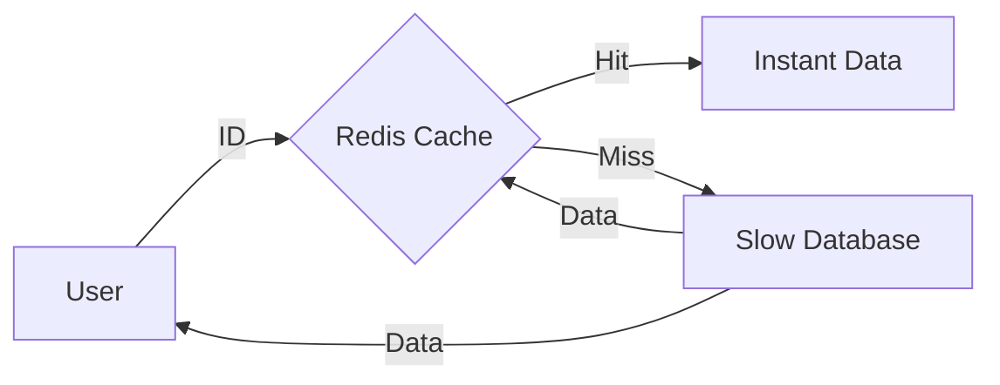

# Data Structures for AI: Hash Maps & Sets

## 📜 Story Mode: The Dictionary

> **Mission Date**: 2042.08.05
> **Location**: Deep Space Outpost "Vector Prime"
> **Officer**: Lead Engineer Kael
>
> **The Problem**: Our Translator Droid is too slow.
> It holds a dictionary of 1 Million Alien Words.
> When an Alien says "Glarb", the Droid scans the list:
> "Apple? No. Banana? No. ... Glarb? Yes! It means 'Peace'."
>
> This Linear Search ($O(N)$) takes 0.5 seconds.
> But the Alien speaks 10 words per second. The Droid is lagging 5 minutes behind.
>
> I need the Droid to find the word **Instantly**.
> I don't want to search. I want to **Know** exactly where "Glarb" is stored.
>
> I need a **Hash Function**. A math formula that turns "Glarb" into a memory address.
>
> *"Computer! Index the dictionary into a Hash Map. Access Time must be O(1)!"*

---

## 1. Problem Setup & Motivation

### The 6 Engineering Questions
1.  **WHAT**:
    *   **Hash Map (Dictionary)**: Stores Key-Value pairs. Lookup is $O(1)$.
    *   **Set**: Stores Unique Keys. Checks "Is this here?" in $O(1)$.
2.  **WHY**: It is the single most important data structure for speed. It trades Memory (Space) for Speed (Time).
3.  **WHEN**: Caching, Deduplication, Counting Frequencies, Database Indices.
4.  **WHERE**: `dict` (Python), `HashMap` (Java), `std::unordered_map` (C++).
5.  **WHO**: Backend Engineers, NLP Engineers (vocabularies).
6.  **HOW**: `Address = Hash(Key) % Capacity`.

> [!NOTE]
> **🛑 Pause & Explain (In Simple Words)**
>
> **The Library vs The Hash Map.**
>
> - **Library (Sorted Array)**: You walk to the "G" section. You find "Gl". You find "Glarb". ($O(\log N)$). Fast, but requires walking.
> - **Hash Map**: You have a Magic Teleporter. You accept the book "Glarb", it zaps you directly to Shelf 42, Slot 9. You just grab it. ($O(1)$). Instant.

---

## 2. Mathematical Problem Formulation

### The Hash Function
$h(k) \to \mathbb{Z}$.
Maps arbitrary data (String, Image, File) to an Integer.
**Properties**:
1.  **Deterministic**: $h(x)$ always yields the same value.
2.  **Uniform**: Spreads keys evenly across memory.

### The Collision Problem
What if $h(\text{"Cat"}) = 42$ and $h(\text{"Dog"}) = 42$?
**Collision!** Two keys fight for the same slot.
**Solutions**:
1.  **Chaining**: The slot contains a Linked List. Store both ["Cat", "Dog"]. Lookup becomes $O(L)$.
2.  **Open Addressing**: If slot 42 is full, try 43, then 44.

---

## 3. Step-by-Step Derivation

### Designing a Simple Hash Map
**Size**: 10.
**Function**: $h(x) = \text{len}(x) \pmod{10}$.
**Insert**: "Hello" (Len 5), "AI" (Len 2), "Map" (Len 3).

1.  "Hello" $\to$ Index 5. Store "Hello".
2.  "AI" $\to$ Index 2. Store "AI".
3.  "Map" $\to$ Index 3. Store "Map".

**Insert**: "World" (Len 5).
Index 5 is occupied by "Hello".
**Collision!**
**Chaining**: Add "World" to the list at Index 5.
Slot 5: `["Hello"] -> ["World"]`.

**Lookup**: "World".
$h$("World") is 5. Go to Slot 5. Scan list. Found "World".

---

## 4. Algorithm Construction

### Map to Memory (Load Factor)
When the map gets full, Collisions increase. Speed drops to $O(N)$.
**Load Factor ($\alpha$)**: $\text{Items} / \text{Slots}$.
If $\alpha > 0.7$, we **Resize**.
Create a new array (Double size). Re-hash everything.
Cost: $O(N)$ (Amortized $O(1)$).

### Algorithm: Bloom Filter (Probabilistic Set)
**Problem**: Set is too big for RAM (e.g., "Have I crawled this URL?", 10 Billion URLs).
**Solution**: Use a Bit Array and 3 Hash functions.
To add URL: Hash it 3 times. Set those bits to 1.
To check URL: Hash it. If all 3 bits are 1, it matches.
**Result**: Tiny memory. No False Negatives. Some False Positives.
Used in **Chrome** (Malicious URL check).

---

## 5. Optimization & Convergence Intuition

### Semantic Hashing (LSH)
Standard Hashing: slightly different inputs $\to$ totally different hashes.
"Cat" $\to$ 101. "Cats" $\to$ 999.
**Locality Sensitive Hashing (LSH)**:
Goal: Similar inputs $\to$ Similar hashes.
"Cat" $\to$ 101. "Cats" $\to$ 102.
Used for **Vector Search** (Find similar images without comparing all pixels).

---

## 6. Worked Examples

### Example 1: Tokenizer (NLP)
**Input**: "Hello World".
**Vocab**: Map `{"Hello": 1, "World": 2}`.
**Process**:
1.  Lookup "Hello" $\to$ 1.
2.  Lookup "World" $\to$ 2.
**Output**: `[1, 2]`.
This must be $O(1)$. If vocab lookup was $O(N)$, training GPT would take eons.

### Example 2: Count Frequencies (Counter)
**Task**: Count words in a book.
**Hash Map**: `{"word": count}`.
Iterate book:
If word in map: `map[word] += 1`.
Else: `map[word] = 1`.
Complexity: $O(N)$ (Linear scan of book).
Without Hash Map, you'd sort ($O(N \log N)$) or nest loops ($O(N^2)$).

---

## 7. Production-Grade Code

### The Ship's Code (Polyglot: Pure Python + Libraries)

```python
import collections
import hashlib
import torch
import tensorflow as tf

# LEVEL 0: Pure Python (Hash Map from Scratch)
# Demonstrating Collision Handling (Chaining)
class MyHashMap:
    def __init__(self, size=10):
        self.size = size
        self.buckets = [[] for _ in range(size)] # List of Lists
        
    def _hash(self, key):
        return len(str(key)) % self.size # Simple hash
        
    def put(self, key, value):
        idx = self._hash(key)
        bucket = self.buckets[idx]
        # Check update
        for i, (k, v) in enumerate(bucket):
            if k == key:
                bucket[i] = (key, value)
                return
        # Insert new
        bucket.append((key, value))
        
    def get(self, key):
        idx = self._hash(key)
        for k, v in self.buckets[idx]:
            if k == key: return v
        return None

# LEVEL 1: Standard Lib (Counter / DefaultDict)
def counting_demo(words):
    # O(N) optimized C-loop
    return collections.Counter(words)

# LEVEL 2: PyTorch (Embedding Bag / Lookups)
def torch_lookup_demo():
    # Hash Map in Neural Nets is an Embedding Layer
    # Key: Index (Int). Value: Vector (Float).
    vocab_size = 1000
    embed_dim = 128
    embedding = torch.nn.Embedding(vocab_size, embed_dim)
    
    # "Lookup" indices [1, 5, 99]
    indices = torch.tensor([1, 5, 99])
    vectors = embedding(indices) # O(1) lookup per item
    return vectors

# LEVEL 3: TensorFlow (String Lookup / Hashing Trick)
def tf_hashing_demo(strings):
    # If vocab is too huge, we use "Hashing Trick"
    # We don't store the key. We just hash it to a bucket.
    # Collisions? We just accept "Noise" in the model.
    num_buckets = 1000
    hashed = tf.strings.to_hash_bucket_fast(strings, num_buckets)
    return hashed
```

> [!CAUTION]
> **🛑 Production Warning**
>
> **Mutable Keys**: Never use a List as a Key.
> `d[[1,2]] = 5` crashes.
> Why? Because if you change the list later (`list.append(3)`), its Hash changes, but it's sitting in the wrong memory slot.
> **Fix**: Use Tuples `(1,2)` (Immutable).

> [!CAUTION]
> **🛑 Production Warning**
>
> **Mutable Keys**: Never use a List as a Key.
> `d[[1,2]] = 5` crashes.
> Why? Because if you change the list later (`list.append(3)`), its Hash changes, but it's sitting in the wrong memory slot.
> **Fix**: Use Tuples `(1,2)` (Immutable).

---

## 8. System-Level Integration



**Where it lives**:
**Redis / Memcached**: Distributed Hash Maps.
They run in RAM.
Entire backends rely on Redis to avoid killing the SQL Database.
"Cache Hit Rate" is a primary KPI for system engineers.

---

## 9. Evaluation & Failure Analysis

### Failure Mode: Hash Flooding Attack
Attacker sends millions of keys that all hash to `42`.
The Hash Map becomes a Linked List ($O(N)$).
Server CPU spikes.
**Fix**: Use **Salted Hashing** (Python does this by default since 3.3). The Hash Function includes a random seed known only to the server.

---

## 10. Ethics, Safety & Risk Analysis

### Privacy Hashing
Storing Passwords?
**NEVER** store plain text.
Store `Hash(Password)`.
If DB is stolen, hackers only get hashes.
**Salt**: Add random string `Hash(Password + Salt)` to prevent Rainbow Table attacks.

---

## 11. Advanced Theory & Research Depth

## 11. Advanced Theory & Research Depth

### Perfect Hashing
If we know all keys in advance (e.g., Keywords of a language), we can design a **Perfect Hash Function** with **Zero Collisions**.
Access becomes guaranteed $O(1)$ worst-case.
Tools like `gperf` generate C++ code for this.

### 📚 Deep Dive Resources
*   **Paper**: "Bloom Filter" (Bloom, 1970) - Space/Time trade-offs in hash coding with allowable errors.
*   **Concept**: **Consistent Hashing** (Dynamo Paper). In Distributed Chains, when a server fails, we map its keys to the next server on the ring. Prevents reshuffling the entire database.


---

## 12. Career & Mastery Signals

## 12. Career & Mastery Signals

### Cadet (Junior)
*   Uses `set(list)` to remove duplicates in $O(N)$.
*   Knows that Hash keys must be Immutable (Tuples/Strings, not Lists).

### Commander (Senior)
*   Designs **Sharding Strategies** (Hash(UserID) % ServerCount) for distributed databases.
*   Uses **Bloom Filters** to prevent expensive DB lookups for non-existent keys.

---

## 13. Industry Interview Corner

### ❓ Real World Questions
**Q1: "Design a URL Shortener (TinyURL)."**
*   **Answer**: "We need a map `ID -> LongURL`. ID can be a base-62 encoding of a database auto-increment ID. Or specific hash of the URL. Key issue is collisions (if random) and scale (Shard by ID range)."

**Q2: "What is the complexity of Python's `dict`?"**
*   **Answer**: "Average $O(1)$. Worst case $O(N)$. Python uses Open Addressing with Random Probing. It resizes (doubles) when 2/3 full to keep collisions low."

**Q3: "How does `torch.nn.Embedding` work?"**
*   **Answer**: "It is essentially a Lookup Table (Hash Map where keys are integers 0..N). It is implemented as a dense matrix multiplication with a One-Hot vector, but optimized as a direct array gather."

---

## 14. Debug Your Thinking (Common Misconceptions)

### ❌ Myth: "Hash Maps store order."
**✅ Truth**: Traditionally, NO. They are unordered bags. However, Python 3.7+ implementation *happens* to preserve insertion order as a side effect of memory optimization. Do not rely on this in other languages (C++/Java maps are unordered).

### ❌ Myth: "Hashing is Encryption."
**✅ Truth**: No. Hashing is one-way (Lossy compression). Encryption is two-way (Reversible). You cannot "Decrypt" a hash, you can only brute-force guess inputs until one matches.


---

## 15. Assessment & Mastery Checks

**Q1: O(1) Guarantee**
Is Hash Map lookup *always* $O(1)$?
*   *Answer*: No. Worst case $O(N)$ (All keys collide). Average case $O(1)$.

**Q2: Set vs List**
Why use `set` instead of `list` for membership check?
*   *Answer*: `x in set` is $O(1)$. `x in list` is $O(N)$. For large N, `set` is million times faster.

---

## 16. Further Reading & Tooling

*   **Tool**: **Redis** - The world's fastest in-memory data structure store.
*   **Concept**: **Consistent Hashing** - How to split a Hash Map across 100 servers (Sharding).

---

## 17. Concept Graph Integration

*   **Previous**: [Stacks & Queues](01_foundation_math_cs/05_data_structures/01_stack_queue.md).
*   **Next**: [Trees & Heaps](01_foundation_math_cs/05_data_structures/03_trees_heaps.md) (Hierarchical Data).
