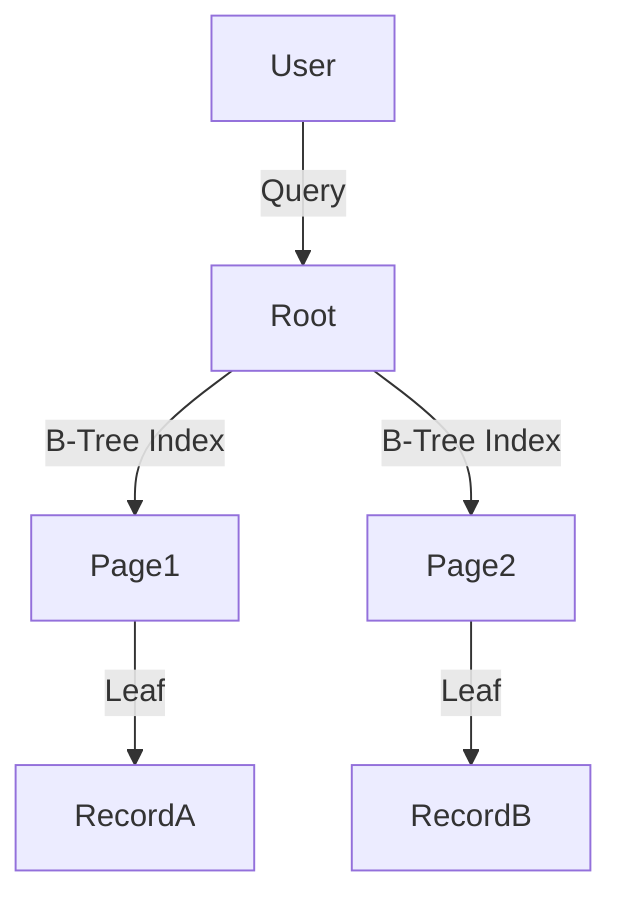

# Data Structures for AI: Trees & Heaps

## 📜 Story Mode: The Hierarchy

> **Mission Date**: 2042.08.10
> **Location**: Deep Space Outpost "Vector Prime"
> **Officer**: Lead Engineer Kael
>
> **The Problem**: We are scanning the galaxy for habitable planets.
> We found 100 Million planets.
>
> The Captain asks: "Find me all planets with Temp > 20C AND Temp < 30C."
>
> If I check them one by one, it takes too long.
> I need to organize them.
>
> Imagine I ask the first planet: "Are you hot or cold?"
> It says "Hot (>50C)".
> I say: "Okay, everything to your Right is even hotter. I can ignore half the galaxy instantly."
>
> By organizing data into a **Binary Tree**, I can eliminate billions of options with just 30 questions.
>
> *"Computer! Build a KD-Tree spatial index. Filter the sector. Find Earth 2.0."*

---

## 1. Problem Setup & Motivation

### The 6 Engineering Questions
1.  **WHAT**:
    *   **Tree**: Hierarchical data. Root $\to$ Branches $\to$ Leaves.
    *   **BST (Binary Search Tree)**: Left child < Parent < Right child.
    *   **Heap**: Complete Tree. Parent > Children (Max-Heap).
2.  **WHY**:
    *   **BST**: Fast Search ($O(\log N)$).
    *   **Heap**: fast Access to Max/Min ($O(1)$).
3.  **WHEN**:
    *   **Trees**: Databases (B-Trees), File Systems, AI Decision Trees (XGBoost).
    *   **Heaps**: Priority Queues, A* Search, Dijkstra Algorithm.
4.  **WHERE**: `heapq` (Python), `sklearn.tree.DecisionTreeClassifier`.
5.  **WHO**: Database Architects, ML Engineers.
6.  **HOW**: Using Pointers (Classes in Python) or Array Indices (Heaps).

> [!NOTE]
> **🛑 Pause & Explain (In Simple Words)**
>
> **The Executive Structure.**
>
> - **Array**: A mob of people standing in a line. To find "Bob", you check everyone.
> - **Tree**: A Corporation.
>   - **CEO (Root)**: "Is Bob in Sales (Left) or Engineering (Right)?"
>   - **VP (Node)**: "Is Bob in Frontend (Left) or Backend (Right)?"
>   - **Manager (Node)**: "Here is Bob."
>
> You found Bob in 3 steps instead of checking 10,000 employees.

---

## 2. Mathematical Problem Formulation

### Logarithmic Depth
If a tree is **Balanced** (Left and Right sides are equal):
Height $h = \log_2 N$.
Leaf Nodes $\approx N/2$.
Search Cost: $O(h) = O(\log N)$.
**Failure Mode**: If the tree is a straight line (Unbalanced), $h = N$. Search becomes $O(N)$.
**Solution**: Self-Balancing Trees (AVL, Red-Black).

### Heap Property
Max-Heap: $A[\text{parent}(i)] \ge A[i]$.
The Root is always the Maximum.
Pop Max: $O(\log N)$ (to reassign new root).
Peek Max: $O(1)$.

---

## 3. Step-by-Step Derivation

### Implementing a Min-Heap (Array based)
**Concept**: We don't need dedicated Node objects. We can map a tree to an Array.
Root at index `0`.
Left Child of `i`: `2*i + 1`.
Right Child of `i`: `2*i + 2`.
Parent of `i`: `(i-1) // 2`.

**Operation: Insert(2)**
Array: `[5, 10, 15]`.
1.  Append 2. `[5, 10, 15, 2]`.
2.  **Bubble Up**: Is 2 < Parent(10)? Yes. Swap.
    `[5, 2, 15, 10]`.
3.  **Bubble Up**: Is 2 < Parent(5)? Yes. Swap.
    `[2, 5, 15, 10]`.
**Result**: 2 is at the root. Heap property restored.

---

## 4. Algorithm Construction

### Map to Memory (Cache Friendly Heaps)
Array-based Heaps are **Cache Friendly**.
Parents and children are close in memory.
Node-based Trees (pointers) scatter nodes across RAM.
**B-Trees**: Optimize this further by putting 1000 keys in one node (one Disk Page).

### Algorithm: Beam Search (Tree Pruning)
**Goal**: Generate text. "The cat sat on the..."
**Step 1**: Find top 3 next words. (Mat, Hat, Floor).
**Step 2**: For each, find top 3 next words. (3x3 = 9 branches).
**Pruning**: We can't keep $3^{100}$ branches.
We keep only the top K (Beam Width) most probable paths at each layer.
This is a greedy exploration of a Probability Tree.

---

## 5. Optimization & Convergence Intuition

### Huffman Coding (Compression)
We build a binary tree where frequent characters ("e", "a") are near the top (short binary codes).
Rare characters ("z", "q") are deep (long codes).
Result: The most efficient way to compress data without loss.

---

## 6. Worked Examples

### Example 1: A* Search (Pathfinding)
**Map**: Grid with obstacles.
**Open Set**: A Min-Heap storing `(Cost, Node)`.
**Loop**:
1.  Pop lowest cost node from Heap. ($O(1)$).
2.  Explore neighbors.
3.  Calculated expected cost. Push to Heap. ($O(\log N)$).
**Result**: Guaranteed shortest path much faster than scanning the whole grid.

### Example 2: Decision Trees (Random Forest)
**Structure**: A tree of "If-Else" rules.
**Root**: "Is Petal Length > 2.5?"
**Left**: Setosa.
**Right**: Check Petal Width.
**Training**: We build the tree by choosing the split that maximizes **Information Gain** (reduces Entropy).

---

## 7. Production-Grade Code

### The Ship's Code (Polyglot: Pure Python + Libraries)

```python
import numpy as np
import heapq
import torch
from sklearn.tree import DecisionTreeClassifier

# LEVEL 0: Pure Python (The Binary Tree)
# Pointer-based logic.
class TreeNode:
    def __init__(self, val=0, left=None, right=None):
        self.val = val
        self.left = left
        self.right = right

def invert_tree(root):
    # The famous Google Interview Question
    if not root: return None
    # Swap
    root.left, root.right = root.right, root.left
    # Recurse
    invert_tree(root.left)
    invert_tree(root.right)
    return root

# LEVEL 1: Standard Lib (Min-Heap)
def task_scheduler_demo():
    tasks = []
    # (Priority, Task)
    heapq.heappush(tasks, (10, "Clean Cache"))
    heapq.heappush(tasks, (1, "Fix Bug"))
    
    # O(1) Access to highest priority
    return heapq.heappop(tasks)

# LEVEL 2: Scikit-Learn (Decision Tree)
def sklearn_tree_demo():
    # A Tree learned from data
    X = [[0, 0], [1, 1]] # Input
    y = [0, 1]          # Labels
    clf = DecisionTreeClassifier()
    clf.fit(X, y)
    return clf.predict([[2, 2]])

# LEVEL 3: PyTorch (Beam Search Heap)
def torch_beam_search_step(log_probs, k=5):
    # Select top K most probable next tokens
    # log_probs: [Batch, VocabSize]
    # We use TopK (which uses a Heap-like selection on GPU)
    top_scores, top_indices = torch.topk(log_probs, k=k, dim=-1)
    return top_indices
```

> [!CAUTION]
> **🛑 Production Warning**
>
> **Heap Stability**: Python's `heapq` is not stable.
> If two tasks have priority 5, the order is undefined (or compares the TaskName string).
> **Fix**: Store entries as `(priority, timestamp, task)`. The timestamp breaks ties FIFO.

> [!CAUTION]
> **🛑 Production Warning**
>
> **Heap Stability**: Python's `heapq` is not stable.
> If two tasks have priority 5, the order is undefined (or compares the TaskName string).
> **Fix**: Store entries as `(priority, timestamp, task)`. The timestamp breaks ties FIFO.

---

## 8. System-Level Integration



**Where it lives**:
**PostgreSQL**: Uses B-Trees for Indices.
**XGBoost / LightGBM**: "Gradient Boosted Decision Trees". The winners of every Kaggle competition on tabular data.

---

## 9. Evaluation & Failure Analysis

### Failure Mode: Unbalanced Trees
If you insert sorted data `[1, 2, 3, 4, 5]` into a naive BST...
It creates a Linked List (Right child only).
Search becomes $O(N)$.
**Fix**: Use Red-Black Trees (Java `TreeMap`, C++ `std::map`) which rotate to maintain balance.

---

## 10. Ethics, Safety & Risk Analysis

### Decision Tree Explainability
Trees are "White Box" models.
You can print the tree and show it to a regulator.
"The loan was denied because Income < 50k AND Credit < 600."
**Contrast**: Neural Networks are "Black Boxes".
**Safety**: For high-stakes decisions (Law, Medicine), prefer Trees over Neural Nets when possible.

---

## 11. Advanced Theory & Research Depth

## 11. Advanced Theory & Research Depth

### Cartesian Trees
A tree that is a Heap by value and a Binary Search Tree by index.
Used in **Suffix Arrays** for advanced string searching.

### 📚 Deep Dive Resources
*   **Paper**: "XGBoost: A Scalable Tree Boosting System" (Chen & Guestrin, 2016) - How to train 1000 trees in parallel. [ArXiv:1603.02754](https://arxiv.org/abs/1603.02754)
*   **Concept**: **Merkle Tree**. A tree of hashes used in Blockchain (Bitcoin/Git). If one leaf changes, the Root Hash changes. Efficient verification.


---

## 12. Career & Mastery Signals

## 12. Career & Mastery Signals

### Cadet (Junior)
*   Can implement a `TreeNode` class.
*   Knows Pre-order vs Post-order traversal (Root First vs Root Last).

### Commander (Senior)
*   Tunes **XGBoost Hyperparameters** (Max Depth, Subsample) to prevent Overfitting.
*   Implements **Beam Search** for LLM decoding to generate better text than Greedy search.

---

## 13. Industry Interview Corner

### ❓ Real World Questions
**Q1: "Explain the difference between a Tree and a Graph."**
*   **Answer**: "A Tree is a Graph that is Connected, Acyclic, and has N-1 edges. It has a hierarchical Root. A Graph can have cycles and disconnected parts."

**Q2: "What is a Trie? Why do we use it?"**
*   **Answer**: "A Prefix Tree. It stores strings by character. 'Cat' and 'Car' share the 'Ca' node. Used for Auto-Complete and Spell Checkers. Space efficient for dictionaries."

**Q3: "How does a Random Forest work?"**
*   **Answer**: "It trains N Decision Trees on random subsets of data (Bagging) and random subsets of features. Final prediction is the majority vote (Classification) or Average (Regression). This reduces Variance (Overfitting)."

---

## 14. Debug Your Thinking (Common Misconceptions)

### ❌ Myth: "Binary Search Tree is always O(log N)."
**✅ Truth**: Only if BALANCED. If you insert `[1,2,3,4,5]`, it becomes a linked list with $O(N)$ search. Production systems use **Red-Black Trees** or **AVL Trees** to self-balance.

### ❌ Myth: "Heaps imply Sorted arrays."
**✅ Truth**: No. A Heap only guarantees Parent < Child. It says nothing about Sibling vs Sibling. `[1, 5, 2]` is a valid heap (1<5, 1<2), but 5 > 2. It is NOT sorted. You must Pop N times to get a sorted list ($O(N \log N)$).


---

## 15. Assessment & Mastery Checks

**Q1: Heap vs Sorted Array**
Why use a Heap if a Sorted Array also gives Min in $O(1)$?
*   *Answer*: Inserting into a sorted array is $O(N)$ (shift elements). Inserting into a Heap is $O(\log N)$.

**Q2: Trie (Prefix Tree)**
Best data structure for Autocomplete?
*   *Answer*: A **Trie**. It stores strings character by character. "Apple" and "App" share the "App" branch.

---

## 16. Further Reading & Tooling

*   **Lib**: `networkx` - For graph and tree manipulation in Python.
*   **Visual**: **XGBoost** documentation - Visualizing gradient boosted trees.

---

## 17. Concept Graph Integration

*   **Previous**: [Hash Maps](01_foundation_math_cs/05_data_structures/02_hash_maps.md).
*   **Next**: [Graphs & Networks](01_foundation_math_cs/05_data_structures/04_graphs_networks.md) (The Ultimate Structure).
