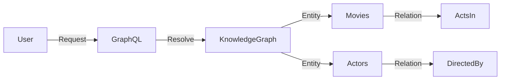

# Data Structures for AI: Graphs & Networks

## 📜 Story Mode: The Web

> **Mission Date**: 2042.08.15
> **Location**: Deep Space Outpost "Vector Prime"
> **Officer**: Lead Engineer Kael
>
> **The Problem**: We intercepted a Smuggler's transmission.
> It doesn't contain coordinates. It contains **Relationship Data**.
>
> "Pilot A knows Pilot B."
> "Pilot B visited Planet X."
> "Planet X sells Illegal Engine Parts."
>
> I need to connect the dots.
> If A knows B, and B knows X... does A have Illegal Engines?
>
> This isn't a Tree (Hierarchy). It's a **Graph**.
> It has loops, cycles, and complex connections.
>
> *"Computer! Build the Knowledge Graph. Run a Breadth-First Search from Pilot A. Find the shortest path to a Crime."*

---

## 1. Problem Setup & Motivation

### The 6 Engineering Questions
1.  **WHAT**:
    *   **Graph**: A set of Nodes (Vertices) and Edges (Links). $G = (V, E)$.
    *   **Types**: Directed (One-way), Undirected (Two-way), Weighted (Distance).
2.  **WHY**: The world is not a tree. Roads, Social Networks, Molecules, and **Neural Networks** are all Graphs.
3.  **WHEN**: Pathfinding (Maps), Recommendation Systems (Users $\to$ Movies), Analyzing Molecules (GNNs).
4.  **WHERE**: `networkx` (Python), `torch_geometric` (GNNs), Graph Databases (Neo4j).
5.  **WHO**: AI Researchers, Social Network Analysts.
6.  **HOW**: Represented as Adjacency Matrix ($N \times N$) or Adjacency List (Dict).

> [!NOTE]
> **🛑 Pause & Explain (In Simple Words)**
>
> **The Universal Structure.**
>
> - **Linked List**: A Graph where everyone holds hands in a line.
> - **Tree**: A Graph with no loops (Cycle-free).
> - **Neural Network**: A Directed Acyclic Graph (DAG) of math operations.
>
> If you understand Graphs, you understand *structure*.

---

## 2. Mathematical Problem Formulation

### The Adjacency Matrix (Linear Algebra Connection)
Graph with $N$ nodes.
Matrix $A$ of size $N \times N$.
$A_{ij} = 1$ if node $i$ is connected to $j$.
$A_{ij} = 0$ otherwise.

**Power of Matrix Powers**:
$A^2$ tells you how many paths of length 2 exist.
$A^k$ tells you how many paths of length $k$ exist.
**Eigenvectors of A**: Tell you the "Centrality" (PageRank) of nodes.

### The Adjacency List (Sparse Storage)
If we have 1 Million nodes but only 10 edges each (Sparse).
Matrix $A$: $10^{12}$ entries. (RAM Explosion).
List: Dictionary `{Node: [Neighbors]}`. Size: $10^7$.
**AI Rule**: Always use Sparse representations for large real-world graphs.

---

## 3. Step-by-Step Derivation

### PageRank (How Google Works)
**Goal**: Rank web pages by importance.
**Idea**: A page is important if important pages link to it.
**Formula**:
$$ PR(A) = (1-d) + d \sum_{i \in \text{LinksTo}(A)} \frac{PR(i)}{C(i)} $$
*   $PR(A)$: Rank of Page A.
*   $C(i)$: Count of outbound links from Page i.
*   $d$: Damping factor (0.85). Probability user keeps clicking.

**Computation**:
This is just a matrix multiplication!
$\mathbf{v}_{new} = d \mathbf{M} \mathbf{v}_{old}$.
Iterate until $\mathbf{v}$ converges.

---

## 4. Algorithm Construction

### Map to Memory (Computational Graphs)
PyTorch/TensorFlow build a **DAG** (Directed Acyclic Graph).
Nodes = Operations (+, *, Sin).
Edges = Tensors (Data flow).
**Backward Pass**: Just a Graph Traversal starting from "Loss" node, going backwards to "Input".
**Topological Sort**: The order in which we must execute operations (Deps first).

### Algorithm: Dijkstra's Algorithm (GPS)
**Goal**: Shortest path from A to B with weights (Traffic).
**Method**:
1.  Set dist[Start] = 0, others = $\infty$.
2.  Use Priority Queue (Min-Heap) to pick closest node.
3.  "Relax" neighbors: If Path via Me < Old Path, update them.
4.  Repeat.
**AI usage**: A* Search (Dijkstra + Heuristic) is used in Game AI and Robot Path Planning.

---

## 5. Optimization & Convergence Intuition

### Graph Neural Networks (GNNs)
Standard CNNs work on Grids (Pixels).
GNNs work on Graphs (Molecules).
**Message Passing**:
Every node sends a message to its neighbors.
$H_i^{new} = \sigma ( \sum_{j \in Neigh(i)} W H_j )$.
This aggregates local information across the graph structure.

---

## 6. Worked Examples

### Example 1: Social Network (BFS)
**Goal**: Find "Degrees of Kevin Bacon".
**Start**: Me.
**Layer 1**: My Friends.
**Layer 2**: Friends of Friends.
**Algorithm**: Breadth-First Search (Queue).
It guarantees finding the shortest connection (smallest layer number).

### Example 2: Deadlock Detection (Cycle detection)
**System**: Resource A waits for B. B waits for A.
**Graph**: Directed A $\to$ B $\to$ A.
**Cycle**: If you find a cycle in the dependency graph, the system is deadlocked (Frozen).
**Algorithm**: Depth-First Search (DFS). If you see a "Grey" node (currently visiting), it's a cycle.

---

## 7. Production-Grade Code

### The Ship's Code (Polyglot: Pure Python + Libraries)

```python
import numpy as np
import scipy.sparse as sp
import networkx as nx
import torch

# LEVEL 0: Pure Python (BFS on Adjacency List)
# Finding "Degrees of Separation"
def bfs_pure(adj_list, start_node):
    visited = {start_node}
    queue = [start_node]
    traversal = []
    
    while queue:
        node = queue.pop(0) # Pop front
        traversal.append(node)
        
        for neighbor in adj_list.get(node, []):
            if neighbor not in visited:
                visited.add(neighbor)
                queue.append(neighbor)
    return traversal

# LEVEL 1: NetworkX (The Data Science Standard)
def nx_demo():
    # Build a graph
    G = nx.Graph()
    G.add_edge("Alice", "Bob")
    G.add_edge("Bob", "Charlie")
    
    # Calculate Shortest Path
    path = nx.shortest_path(G, "Alice", "Charlie")
    return path # ['Alice', 'Bob', 'Charlie']

# LEVEL 2: PyTorch (Adjacency Matrix Multiplication)
def torch_msg_passing(adj_matrix, node_feats):
    # Simple GCN Layer: H_new = RELU(A * H * W)
    # adj_matrix: [N, N]
    # node_feats: [N, Features]
    
    # 1. Aggregate Neighbor Info (Message Passing)
    # Matrix Mult performs "Sum over neighbors"
    agg = torch.matmul(adj_matrix, node_feats)
    return torch.relu(agg)

# LEVEL 3: PyTorch Geometric (Sparse GNN)
# (Conceptual snippet, requires torch_geometric)
def gnn_sparse_demo(edge_index, x):
    # edge_index: [2, NumEdges] (Sparse List of pairs)
    # x: Node features
    pass 
```

> [!CAUTION]
> **🛑 Production Warning**
>
> **Recursion Limit**: Standard DFS uses recursion.
> Python limit is 1000. Large graphs crash Python.
> **Fix**: Always write DFS iteratively using a manual Stack `stack = [root]`.

> [!CAUTION]
> **🛑 Production Warning**
>
> **Recursion Limit**: Standard DFS uses recursion.
> Python limit is 1000. Large graphs crash Python.
> **Fix**: Always write DFS iteratively using a manual Stack `stack = [root]`.

---

## 8. System-Level Integration



**Where it lives**:
**Knowledge Graphs (KG)**: Storing "Facts" as triples. `(Obama, BornIn, Hawaii)`.
LLMs use KGs to verify truth and reduce hallucinations (RAG).

---

## 9. Evaluation & Failure Analysis

### Failure Mode: Connectivity (Disjoint Sets)
If the graph is broken into islands.
Message Passing (GNN) cannot flow from Island A to Island B.
**Analysis**: Compute "Connected Components". If > 1, you have isolated systems.

---

## 10. Ethics, Safety & Risk Analysis

### Virality & Echo Chambers
Social Networks optimize for Engagement (Time spent).
The algorithm finds that "Anger" spreads faster (High weight edges).
The Graph Clusters people into polarized groups.
**Safety**: We must analyze the "Modularity" of the graph to detect and mitigate polarization.

---

## 11. Advanced Theory & Research Depth

## 11. Advanced Theory & Research Depth

### Spectral Graph Theory
Using Eigenvalues of the Laplacian Matrix to understand graph clusters.
Smallest non-zero eigenvalue ("Fiedler Value") tells us how disconnected the graph is.
Used to solve "Graph Cut" (Image Segmentation).

### 📚 Deep Dive Resources
*   **Paper**: "Graph Attention Networks (GAT)" (Velickovic et al., 2018) - Applying Attention mechanism to Graphs. Weighing important neighbors more than others. [ArXiv:1710.10903](https://arxiv.org/abs/1710.10903)
*   **Concept**: **Knowledge Graph Embeddings** (TransE). Learning vector representations for entities so that `Vec(King) - Vec(Man) + Vec(Woman) approx Vec(Queen)` holds true in the graph structure.


---

## 12. Career & Mastery Signals

## 12. Career & Mastery Signals

### Cadet (Junior)
*   Can implement BFS (Queue) and DFS (Stack/Recursion).
*   Representative of "LeetCode Medium".

### Commander (Senior)
*   Models business problems as Graphs (e.g., Fraud Detection: "Do these two accounts share a credit card?").
*   Scales Graph algos to Billions of edges using **Spark GraphX** or **Neo4j**.

---

## 13. Industry Interview Corner

### ❓ Real World Questions
**Q1: "Deep Copy a Graph."**
*   **Answer**: "Use a Hash Map `old_node -> new_node` to track created clones. Run BFS/DFS. For every neighbor, if it's in the map, link to it. If not, create clone, add to map, and enqueue."

**Q2: "Detect a Cycle in a Directed Graph."**
*   **Answer**: "DFS with 3 colors. White (Unvisited), Grey (Visiting), Black (Visited). If you see a Grey node, it's a back-edge (Cycle). Topological Sort only works if NO cycles exist."

**Q3: "How does Google Maps find the path so fast?"**
*   **Answer**: "They don't run Dijkstra on the raw road graph (Too big). They use **Contraction Hierarchies**. They pre-compute 'Highways'. You go from Local -> Highway -> Distant Highway -> Local. It hierarchies the graph."

---

## 14. Debug Your Thinking (Common Misconceptions)

### ❌ Myth: "Shortest Path means fewest edges."
**✅ Truth**: Only in **Unweighted** graphs (BFS). In Weighted graphs (Distance/Cost), 3 short edges might be better than 1 long edge. BFS fails here. You MUST use **Dijkstra** or **A\***.

### ❌ Myth: "Adjacency Matrix is faster."
**✅ Truth**: Only for dense graphs ($E \approx N^2$). Real world graphs are sparse ($E \ll N^2$). A Matrix for Facebook (3B users) would require Exabytes of RAM. Always use Adjacency Lists (Sparse) for AI.


---

## 15. Assessment & Mastery Checks

**Q1: Matrix Size**
If you have 1 Million users, how big is the $N \times N$ adjacency matrix?
*   *Answer*: $10^{12}$ entries. Too big for RAM. Use Sparse Matrix.

**Q2: Tree vs Graph**
What is the difference?
*   *Answer*: A Tree is a Graph with $N$ nodes and $N-1$ edges (and connected, no cycles).

---

## 16. Further Reading & Tooling

*   **Lib**: **Neo4j** - The leading Graph Database.
*   **Lib**: **PyTorch Geometric** - GNN library.

---

## 17. Concept Graph Integration

*   **Previous**: [Trees & Heaps](01_foundation_math_cs/05_data_structures/03_trees_heaps.md).
*   **Next**: [Core ML / Optimization](02_core_ml/01_optimization/01_gradient_descent.md) (Starting Core ML Phase!).
