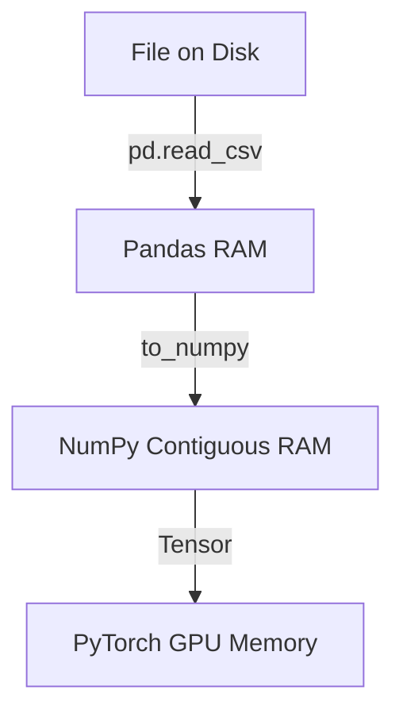

# Python for AI: The Data Stack (NumPy, Pandas, Matplotlib)

## 📜 Story Mode: The Array

> **Mission Date**: 2042.06.02
> **Location**: Earth, ESA Headquarters
> **Officer**: Cadet Kael
>
> **The Problem**: I have the alien sensor data. It sends 1 million Temperature readings per second.
> I wrote a Python loop to calculate the Average Temperature.
>
> `sum = 0; for x in data: sum += x`
>
> It took 45 seconds to process 1 second of data.
> The General is screaming. "We need Real-Time processing!"
>
> Python lists are too slow. They are arrays of Pointers.
> I need a contiguous block of C-Memory.
> I need **Vectorization**. I need to perform the math on 1 million numbers at once, using the CPU's SIMD instructions.
>
> *"Computer! Import NumPy. Cast list to `float32` Array. `data.mean()`. Execution time?"*
>
> **Computer**: *"Time: 0.001 seconds."*

---

## 1. Problem Setup & Motivation

### The 6 Engineering Questions
1.  **WHAT**:
    *   **NumPy**: The engine of numeric computing. N-Dimensional Arrays.
    *   **Pandas**: Excel for Python. Tabular Data (Rows/Columns).
    *   **Matplotlib**: Visualization. Plotting graphs.
2.  **WHY**: Python lists are slow ($O(N)$ with high overhead). NumPy utilizes C/Fortran speed ($O(N/8)$ via SIMD). Pandas manages messy real-world CSVs.
3.  **WHEN**: Every single AI project involves: Load Data (Pandas) $\to$ Process Arrays (NumPy) $\to$ Visualize (Matplotlib).
4.  **WHERE**: Preprocessing pipelines.
5.  **WHO**: Data Engineers, ML Engineers.
6.  **HOW**: `import numpy as np`, `import pandas as pd`.

> [!NOTE]
> **🛑 Pause & Explain (In Simple Words)**
>
> **The Warehouse vs The Backpack.**
>
> - **Python List**: A Backpack. You can put anything in it (Apple, Rock, Book). But to find the total weight, you have to take each item out, check what it is, and weigh it. Slow.
> - **NumPy Array**: A Warehouse of uniform Bricks. You know EXACTLY what follows what. You can weigh the whole pallet at once. Fast.

---

## 2. Mathematical Problem Formulation

### Vectorization
Scalar Math: $c = a + b$. (1 operation).
Vector Math: $\mathbf{c} = \mathbf{a} + \mathbf{b}$.
Hardware (SIMD - Single Instruction Multiple Data):
The CPU loads 4 numbers into a register and adds them in ONE clock cycle.
NumPy automatically uses SIMD.

### Broadcasting
How to add a Scalar to a Matrix? $A + 5$.
Mathematically invalid.
NumPy logic: "Stretch" the 5 into a matrix of 5s matching A's shape.
$$ \begin{bmatrix} 1 & 2 \\ 3 & 4 \end{bmatrix} + 5 \to \begin{bmatrix} 1 & 2 \\ 3 & 4 \end{bmatrix} + \begin{bmatrix} 5 & 5 \\ 5 & 5 \end{bmatrix} $$

---

## 3. Step-by-Step Derivation

### The Pandas DataFrame
A DataFrame is built *on top* of NumPy.
It adds **Indices** (Row Names) and **Columns** (Headers).
Ideally, each Column is a NumPy Array.
Efficiency:
*   Column-Oriented access is fast (`df['Age']`).
*   Row-Oriented access is slow (`df.iloc[0]`). (Avoid iterating rows!).

---

## 4. Algorithm Construction

### Map to Memory (Strides)
A 2D Array `(Rows, Cols)` is actually 1D in RAM.
`[0,0], [0,1], [1,0], [1,1]`. (Row Major).
**Strides**: To move one column right, jump 4 bytes. To move one row down, jump `Cols * 4` bytes.
**Reshaping**: `arr.reshape(4, 1)` takes $O(1)$ time. It doesn't move data. It just changes the **Strides**.
This is why NumPy is efficient: zero-copy views.

---

## 5. Optimization & Convergence Intuition

### Data Types matter
*   `float64` (Default in Python): 8 bytes per number.
*   `float32` (Standard for AI): 4 bytes. Half the RAM, faster math.
*   `int8` (Quantization): 1 byte.
**Optimization**: Always downcast your data (`df['age'].astype('int8')`) to fit large datasets in RAM.

---

## 6. Worked Examples

### Example 1: NumPy Broadcasting
**Task**: Normalize a matrix (Subtract Mean).
```python
import numpy as np

X = np.array([[10, 20], [30, 40]])
mu = X.mean(axis=0) # [20, 30] (Mean of cols)

# X is (2,2). mu is (2,).
# NumPy "Broadcasts" mu to (2,2) by repeating rows.
X_norm = X - mu 
# [[-10, -10], [10, 10]]
```

### Example 2: Pandas Filtering
**Task**: Find people > 18.
```python
import pandas as pd

df = pd.DataFrame({'Age': [10, 20, 30], 'Name': ['A', 'B', 'C']})

# Boolean Masking
mask = df['Age'] > 18 # [False, True, True]
adults = df[mask]
# Fast because it happens in C-speed.
```

### Example 3: Matplotlib Visualization
**Task**: Plot Loss curve.
```python
import matplotlib.pyplot as plt

epoch = [1, 2, 3]
loss = [0.9, 0.5, 0.2]

plt.plot(epoch, loss, label='Training Loss')
plt.xlabel('Epoch')
plt.ylabel('Error')
plt.title('Convergence')
plt.legend()
plt.show() # Renders the image
```

---

## 7. Production-Grade Code

### Efficient Data Loading Pipeline

```python
import pandas as pd
import numpy as np

def load_and_process(path: str) -> np.ndarray:
    # 1. Read CSV (Chunksize for huge files)
    # Using 'usecols' saves memory immediately
    df = pd.read_csv(path, usecols=['feature1', 'feature2', 'target'])
    
    # 2. Handle Missings (The Pandas way)
    df.fillna(df.mean(), inplace=True)
    
    # 3. Convert to NumPy for ML
    X = df[['feature1', 'feature2']].to_numpy(dtype=np.float32)
    y = df['target'].to_numpy(dtype=np.float32)
    
    return X, y

# Usage
# X, y = load_and_process("data.csv")
```

> [!CAUTION]
> **🛑 Production Warning**
>
> **Setting With Copy Warning**:
> Pandas `df` often returns a "View" or a "Copy".
> `df[df['age'] > 10]['score'] = 5`
> Pandas panics: "Are you trying to modify the original df or this new temp copy?"
> **Fix**: Use `.loc`.
> `df.loc[df['age'] > 10, 'score'] = 5`.

---

## 8. System-Level Integration



**Where it lives**:
**Memory Mapping (`np.memmap`)**:
If data is 1TB and RAM is 16GB.
You can open a file *as if* it were an array in RAM.
The OS pages data in/out automatically.

---

## 9. Evaluation & Failure Analysis

### Failure Mode: NaNs propagate
In C/Java, dividing by zero crashes.
In NumPy, `1.0 / 0.0 = inf`. `0.0 / 0.0 = nan`.
`NaN + 5 = NaN`.
One bad calculation infects the entire matrix with NaNs.
**Fix**: `np.isnan(arr).sum()` check often.

---

## 10. Ethics, Safety & Risk Analysis

### Data Visualization Bias
Truncating the Y-Axis.
If accuracy goes from 90% to 91%.
Plot Y from 0 to 100: Looks flat.
Plot Y from 90 to 91: Looks like a massive improvement.
**Ethics**: Always clearly label axes and consider the "Lie Factor" in charts.

---

## 11. Advanced Theory & Research Depth

### Einstein Summation (`einsum`)
Matrix multiplication is specific.
`einsum` is general notation.
`C[i,k] = sum_j A[i,j] * B[j,k]`.
`np.einsum('ij,jk->ik', A, B)` -> Dot Product.
`np.einsum('ii->', A)` -> Trace.
Used in Transformers (Attention Mechanism) for complex tensor shapes.

---

## 12. Career & Mastery Signals

### Interview Pitfall
Q: "How do you loop over a DataFrame?"
**Bad Answer**: `for index, row in df.iterrows(): ...`
**Good Answer**: "You don't. You use Vectorization (`df['a'] + df['b']`). If logic is complex, use `.apply()` (slower) or rewrite in Cython."

---

## 13. Assessment & Mastery Checks

**Q1: View vs Copy**
`b = a[:]`. Is b a copy in NumPy?
*   *Answer*: No. It's a **View**. Modifying `b` changes `a`. (Different from Python lists!). Use `.copy()` for a real copy.

**Q2: Axis Direction**
`mean(axis=0)` collapses which dimension?
*   *Answer*: It collapses the rows (axis 0), executing the operation *down* the columns. Result shape is `(Cols,)`.

---

## 14. Further Reading & Tooling

*   **Book**: *"Python for Data Analysis"* (Wes McKinney, Creator of Pandas).
*   **Lib**: **Polars** - A modern, faster Rust-based alternative to Pandas.

---

## 15. Concept Graph Integration

*   **Previous**: [Python Foundations](01_foundation_math_cs/06_python/01_foundations.md).
*   **Next**: [Adv Math / Info Theory](01_foundation_math_cs/07_advanced_math/01_info_optimization.md) (Gap Fill 2).
