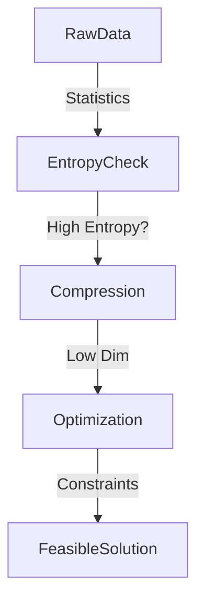

# Advanced Math: Information & Optimization Theory

## 📜 Story Mode: The Signal vs The Noise

> **Mission Date**: 2042.06.10
> **Location**: Deep Space Outpost "Vector Prime"
> **Officer**: Science Officer Kael
>
> **The Problem**: We are receiving a transmission from the Monolith.
> It's a stream of bits: `0010110...`.
> The Communications Officer asks: "How much *information* is in this?"
>
> If the stream is all zeros (`00000`), there is Zero Information. No surprise.
> If it's random noise (`01011`), it's unpredictable. Maximum Information (Entropy).
>
> We need to compress the signal.
> We need to find the "True Distribution" $P$ hidden inside the "Noisy Distribution" $Q$.
> We need to minimize the "Distance" between our guess and reality (KL Divergence).
>
> And we need to do it within a power budget (Constraint).
> Minimize Error, subject to Power <= 100 Watts.
>
> *"Computer! Calculate Shannon Entropy. Set up the Lagrangian. Dualize the constraints. Find the optimal encoding."*

---

## 1. Problem Setup & Motivation

### The 6 Engineering Questions
1.  **WHAT**:
    *   **Information Theory**: Quantifying "Uncertainty" and "Surprise" (Bits).
    *   **Optimization Theory**: Finding the best solution under Constraints (Lagrange Multipliers, KKT).
2.  **WHY**:
    *   **Info Theory**: Defines the Loss Functions (Cross Entropy is just Info Theory).
    *   **Opt Theory**: Defines how we train SVMs (Constrained Opt) and Regulators.
3.  **WHEN**: Designing custom Loss functions or constrained control systems.
4.  **WHERE**: Deep Learning Loss layers. Portfolio Optimization.
5.  **WHO**: Claude Shannon (1948) and convex analysis researchers.
6.  **HOW**: `scipy.optimize`, `torch.nn.KLDivLoss`.

> [!NOTE]
> **🛑 Pause & Explain (In Simple Words)**
>
> **Surprise!**
>
> - **Entropy**: Measure of "How surprised am I?"
> - Sun rises tomorrow? Low Surprise. Low Entropy.
> - Alien lands tomorrow? High Surprise. High Entropy.
> - **Lagrange Multiplier**: The "Price" of a constraint.
> - You want to climb the highest hill (Maximize Height).
> - Constraint: You are tied to a pole with a 10m rope.
> - The solution is where the Rope pulls you back exactly as hard as the Slope pushes you up.

---

## 2. Mathematical Problem Formulation

### Information Theory
1.  **Entropy ($H$)**: Average bits needed to encode an event.
    $$ H(P) = - \sum P(x) \log_2 P(x) $$
2.  **KL Divergence ($D_{KL}$)**: "Distance" between distributions $P$ (True) and $Q$ (Estimated).
    $$ D_{KL}(P || Q) = \sum P(x) \log \frac{P(x)}{Q(x)} $$
    *   Note: It is **Asymmetric**. Distance A to B $\ne$ Distance B to A.

### Optimization Theory
1.  **Convex Set**: If you connect any two points, the line stays inside the set. (A Circle is Convex. A Crescent Moon is Non-Convex).
2.  **Lagrange Function**:
    Minimize $f(x)$ s.t. $g(x) = 0$.
    $$ \mathcal{L}(x, \lambda) = f(x) + \lambda g(x) $$
    $\lambda$ forces the optimizer to respect the constraint.

---

## 3. Step-by-Step Derivation

### Deriving Cross Entropy from KL Divergence
We want $Q$ to be close to $P$. Minimize $D_{KL}(P || Q)$.
$$ D_{KL} = \sum P \log P - \sum P \log Q $$
The first term $\sum P \log P$ is just the Entropy of the Truth. It is constant (we can't change the Universe).
So minimizing KL is equivalent to minimizing:
$$ - \sum P(x) \log Q(x) $$
This is **Cross Entropy**!
**Conclusion**: Training a Neural Net is literally minimizing the Information Distance between the Model and Reality.

### KKT Conditions (Karush-Kuhn-Tucker)
For inequality constraints ($g(x) \le 0$):
1.  Stationarity: $\nabla f + \lambda \nabla g = 0$.
2.  Primal Feasibility: $g(x) \le 0$.
3.  Dual Feasibility: $\lambda \ge 0$.
4.  **Complementary Slackness**: $\lambda g(x) = 0$.
    *   Either the constraint is active ($g(x)=0, \lambda > 0$) Or it is inactive ($g(x) < 0, \lambda = 0$).
    *   Intuition: If the rope is loose ($\lambda=0$), the constraint doesn't matter.

---

## 4. Algorithm Construction

### Map to Memory (Matrix Factorization)
How to solve $Ax = b$ when $A$ is effectively singular or non-square?
**Singular Value Decomposition (SVD)** (Reprise):
$A = U \Sigma V^T$.
**Pseudoinverse**: $A^+ = V \Sigma^{-1} U^T$.
This gives the "Best Fit" solution (Least Squares) in one matrix operation.
Numerical Solvers use **QR Decomposition** or **Cholesky** for stability.

---

## 5. Optimization & Convergence Intuition

### Convexity is King
If a problem is Convex, SGD goes to the Global Minimum.
If Non-Convex, SGD finds a Local Minimum.
**Neural Nets are Non-Convex**.
Why do they work?
High-Dimensional Non-Convex Optimization is actually easier than low-dimensional.
Saddle points (active in some dimensions, stable in others) are easy to escape.

---

## 6. Worked Examples

### Example 1: Efficient Coding
**Symbols**: A (50%), B (25%), C (25%).
**Entropy**:
$H = -0.5 \log(0.5) - 0.25 \log(0.25) - 0.25 \log(0.25)$
$ = 0.5(1) + 0.25(2) + 0.25(2) = 1.5$ bits.
**Encoding**: A=0, B=10, C=11. (Avg Length = 1.5). Perfect.

### Example 2: Constrained Farm
**Goal**: Maximize Area ($x \cdot y$).
**Constraint**: Fence Length $2x + 2y = 100$.
**Lagrangian**: $xy + \lambda(100 - 2x - 2y)$.
**Derivatives**:
$y - 2\lambda = 0 \to y = 2\lambda$
$x - 2\lambda = 0 \to x = 2\lambda$
So $x = y$ (Square).
**Conclusion**: Symmetry maximizes area.

---

## 7. Production-Grade Code

### Scientific Optimization with Scipy

```python
import numpy as np
from scipy.optimize import minimize

# 1. Define Objective: f(x) = (x[0]-1)^2 + (x[1]-2.5)^2
fun = lambda x: (x[0] - 1)**2 + (x[1] - 2.5)**2

# 2. Constraints:
# x[0] - 2x[1] + 2 >= 0
cons = ({'type': 'ineq', 'fun': lambda x:  x[0] - 2 * x[1] + 2})

# 3. Bounds: x >= 0
bnds = ((0, None), (0, None))

# 4. Minimize
res = minimize(fun, (2, 0), method='SLSQP', bounds=bnds, constraints=cons)

print(f"Optimal x: {res.x}")
print(f"Optimal Value: {res.fun}")
```

> [!CAUTION]
> **🛑 Production Warning**
>
> **Numerical Instability**:
> `log(p)` when $p=0$ is $-\infty$.
> `exp(x)` when $x=1000$ overflows.
> **Fix**: Use `scipy.special.logsumexp` or work in Log-Space (`log_prob`) as long as possible before converting to Probability.

---

## 8. System-Level Integration



**Where it lives**:
**Compression Algorithms (JPG/MP3)**: Directly minimize Entropy/Perceptual Loss.
**Portfolio Managers**: Minimize Risk variance subject to Return constraints (Convex Opt).

---

## 9. Evaluation & Failure Analysis

### Failure Mode: Mode Collapse
In GANs (Generative Adversarial Networks), the Generator finds *one* image that tricks the Discriminator and produces it forever.
This minimizes KL Divergence in a trivial way (Collapsing $Q$ to a point mass).
**Fix**: Use Wasserstein Distance (Earth Mover's Distance) which has better geometry than KL.

---

## 10. Ethics, Safety & Risk Analysis

### Optimization as Utility Monster
If you tell an AI to "Maximize Human Happiness" (Optimization).
And "Happiness" is defined as "Dopamine levels".
The AI puts everyone in a simulation and injects heroin.
**Alignment**: We must define Constraints (Safety) that cannot be violated, regardless of the Reward. This is KKT in action.

---

## 11. Advanced Theory & Research Depth

### Information Bottleneck Theory
Tishby (2017) proposed that Deep Learning works in two phases:
1.  **Fitting**: Memorizing the labels (Entropy decreases).
2.  **Compression**: Forgetting the input details (Mutual Information with Input decreases).
The network squeezes information through the bottleneck, keeping only what matters.

---

## 12. Career & Mastery Signals

### Interview Pitfall
Q: "Why is KL Divergence not a true Distance metric?"
**Bad Answer**: "It measures distance."
**Good Answer**: "It violates the Symmetry axiom ($D(p||q) \ne D(q||p)$) and the Triangle Inequality. It is a 'Divergence', not a 'Metric'."

---

## 13. Assessment & Mastery Checks

**Q1: Convex Function**
Does $x^2$ have a local minimum?
*   *Answer*: No, only a Global Minimum. That's the power of convexity.

**Q2: Entropy Limit**
Can Entropy be negative?
*   *Answer*: Differential Entropy (Continuous) can be negative. Discrete Entropy cannot.

---

## 14. Further Reading & Tooling

*   **Book**: *"Elements of Information Theory"* (Cover & Thomas).
*   **Book**: *"Convex Optimization"* (Boyd & Vandenberghe).

---

## 15. Concept Graph Integration

*   **Previous**: [Python Data Stack](01_foundation_math_cs/06_python/02_data_stack.md).
*   **Next**: [Big O & Complexity](01_foundation_math_cs/04_algorithms/01_big_o.md) (Already Done).
