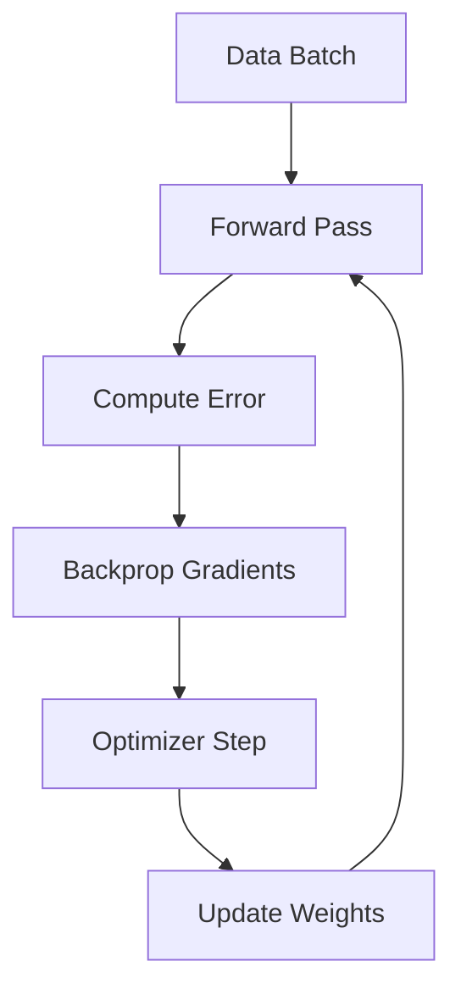
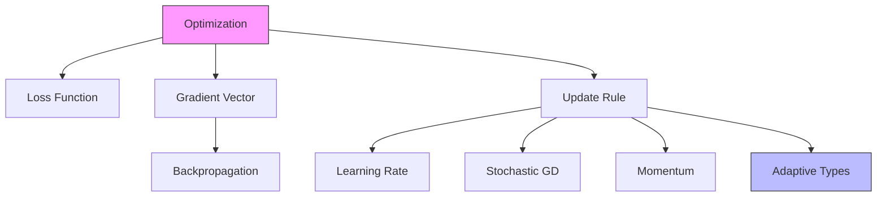

# Core ML: Gradient Descent & Optimization

## 📜 Story Mode: The Mountain

> **Mission Date**: 2042.09.01
> **Location**: Deep Space Outpost "Vector Prime"
> **Officer**: Lead Engineer Kael
>
> **The Problem**: We are crashed on an uncharted planet. A thick fog (High Dimensionality) covers everything.
> Oxygen is leaking. We need to find the lowest point in the valley where the air is dense enough to breathe.
>
> I can't see the bottom.
> I can only feel the **slope** under my boots.
>
> If the ground tilts **Down-Left**, I step **Down-Left**.
>
> The Captain asks: "How big of a step?"
>
> - If I take a tiny step (Low Learning Rate), we might run out of oxygen before we reach the bottom.
> - If I jump (High Learning Rate), I might overshoot the valley and fall off a cliff.
>
> *"Computer! Calculate the Gradient Vector of the terrain. Set Learning Rate to 0.01 with Decay. Let's descend."*

---

## 1. Problem Setup & Motivation

### The 6 Engineering Questions
1.  **WHAT**:
    *   **Gradient Descent (GD)**: An iterative optimization algorithm to find the minimum of a function.
    *   **Rule**: $\theta_{new} = \theta_{old} - \alpha \nabla L(\theta)$.
2.  **WHY**: We cannot solve Neural Networks analytically ($Closed Form$). The equations are too complex. We must search for the solution step-by-step.
3.  **WHEN**: Training *any* Deep Learning model (Linear Regression to GPT-4).
4.  **WHERE**: The `optimizer.step()` line in PyTorch.
5.  **WHO**: The "Optimizer" (SGD, Adam, RMSProp).
6.  **HOW**: Using Auto-Differentiation (Backprop) to get the direction, and a Learning Rate to determine the speed.

> [!NOTE]
> **🛑 Pause & Explain (In Simple Words)**
>
> **Walking Downhill blindfolded.**
>
> - **Loss Function**: The height of the mountain (Error). We want to be at height 0.
> - **Parameters ($\theta$)**: Your GPS coordinates (Latitude, Longitude).
> - **Gradient ($\nabla L$)**: The direction of steepest ascent (Up).
> - **Update ($- \alpha \nabla L$)**: Walk in the *opposite* direction (Down).
>
> We repeat this "Step, Sensing, Step" loop 1,000,000 times until the slope becomes flat.

---

## 2. Mathematical Problem Formulation

### The Update Rule
For parameters $\theta$ (Weights):
$$ \theta_{t+1} = \theta_t - \eta \cdot \nabla_\theta J(\theta_t) $$
*   $\eta$ (Eta): Learning Rate (Step size).
*   $\nabla J$: Gradient of the Cost Function.

### The 3 Flavors of Descent
1.  **Batch GD**: Compute Gradient using **ALL** data.
    *   Pros: Perfect step. Cons: Too slow, doesn't fit in RAM.
2.  **Does Stochastic GD (SGD)**: Compute Gradient using **ONE** sample.
    *   Pros: Instant. Cons: Noisy, drunk walk.
3.  **Mini-Batch GD**: Compute Gradient using **32-512** samples.
    *   **The Gold Standard**. Balances speed and stability. Optimizes GPU parallelism.

---

## 3. Step-by-Step Derivation

### Deriving GD for Linear Regression
**Model**: $y = wx$.
**Loss**: $J(w) = \frac{1}{2}(wx - y)^2$.
**Goal**: Find $w$ that minimizes $J$.

**Step 1: The Derivative**
$$ \frac{\partial J}{\partial w} = (wx - y) \cdot x $$
(Chain Rule: Outer derivative times Inner derivative $x$).

**Step 2: The Update**
$$ w_{new} = w_{old} - \eta \cdot (w_{old}x - y)x $$
**Intuition**:
If Prediction ($wx$) > Target ($y$), Error is Positive.
Gradient is Positive (assuming $x>0$).
We subtract positive amount. $w$ goes down. Correct!

---

## 4. Algorithm Construction

### Map to Memory (In-Place Updates)
Optimizers like SGD are **In-Place**.
They modify the weight matrix directly in VRAM.
`w -= lr * w.grad`.
This saves memory.
Advanced optimizers (Adam) need **State** (Momentum buffer).
They double the memory requirement ($N$ weights + $N$ momentum + $N$ velocity).

### Algorithm: Momentum (The Heavy Ball)
Problem: SGD gets stuck in "Ravines" (Oscillates).
Solution: Add "Velocity".
$$ v_{t+1} = \beta v_t + (1-\beta) g_t $$
$$ \theta_{t+1} = \theta_t - \eta v_{t+1} $$
If we are rolling downhill, we gain speed. Small bumps don't stop us. We plough through noisy gradients.

---

## 5. Optimization & Convergence Intuition

### Learning Rate Schedules
*   **Constant**: 0.001 forever. (Safe but slow).
*   **Decay**: Start big (0.1) to move fast. Decrease to 0.0001 to settle into the sweet spot.
*   **Warmup**: Start 0 $\to$ 0.1. (Prevents early instability).
*   **Cosine**: Wave-like decay. (Current SOTA).

---

## 6. Worked Examples

### Example 1: The Local Minimum Trap
**Function**: $f(x) = x^4 - 2x^2 + x$. (W-shape).
It has a Global Min and a Local Min.
If you start near the Local Min with small LR, you get stuck.
**SGD Noise** helps kick you out of shallow local minima. The "noise" is a feature, not a bug!

### Example 2: Overshooting (Exploding Gradient)
Function: $y = x^2$. Min at 0.
Current $x = 10$. Gradient = 20.
If $\eta = 1.1$:
Update: $10 - 1.1(20) = 10 - 22 = -12$.
Next step: $x = -12$. Gradient = -24.
Update: $-12 - 1.1(-24) = -12 + 26.4 = 14.4$.
Points: $10 \to -12 \to 14.4 \to -17 \dots$
We are flying away to infinity!
**Fix**: Gradient Clipping or Lower Learning Rate.

---

## 7. Production-Grade Code

### The Ship's Code (Polyglot: Pure Python + Libraries)

```python
import numpy as np
import torch
import tensorflow as tf

# LEVEL 0: Pure Python (Manual Gradient Descent)
def gradient_descent_pure(data_x, data_y, lr=0.01, epochs=100):
    """
    Linear Regression: y = wx + b.
    Loss = (wx+b - y)^2.
    """
    w, b = 0.0, 0.0
    N = len(data_x)
    
    for _ in range(epochs):
        grad_w, grad_b = 0.0, 0.0
        
        # Accumulate Gradients (Batch GD)
        for x, y in zip(data_x, data_y):
            pred = w*x + b
            error = pred - y
            # dL/dw = 2 * error * x
            grad_w += 2 * error * x
            grad_b += 2 * error
            
        # Average
        grad_w /= N
        grad_b /= N
        
        # Access: Update weights
        w -= lr * grad_w
        b -= lr * grad_b
        
    return w, b

# LEVEL 1: PyTorch (The Standard)
def torch_optimizer_demo():
    model = torch.nn.Linear(1, 1)
    # SGD with Momentum (The Workhorse)
    optimizer = torch.optim.SGD(model.parameters(), lr=0.01, momentum=0.9)
    # Adam (The Magic wand)
    # optimizer = torch.optim.Adam(model.parameters(), lr=0.001)
    
    loss = model(torch.tensor([[1.0]]))
    optimizer.zero_grad()
    loss.backward()
    optimizer.step()

# LEVEL 2: TensorFlow (Keras Optimizer)
def tf_optimizer_demo():
    model = tf.keras.layers.Dense(1)
    optimizer = tf.keras.optimizers.SGD(learning_rate=0.01, momentum=0.9)
    
    with tf.GradientTape() as tape:
        loss = model(tf.ones((1, 1)))
        
    grads = tape.gradient(loss, model.trainable_variables)
    optimizer.apply_gradients(zip(grads, model.trainable_variables))
```

> [!TIP]
> **👁️ Visualizing the Loss Landscape (3D)**
> Run this Python script to generate the classic "Bowl" shape of the error function.
>
> ```python
> import numpy as np
> import matplotlib.pyplot as plt
> from mpl_toolkits.mplot3d import Axes3D
>
> def plot_loss_surface():
>     # 1. Define Grid
>     w_range = np.linspace(-10, 10, 50)
>     b_range = np.linspace(-10, 10, 50)
>     W, B = np.meshgrid(w_range, b_range)
>
>     # 2. Define Loss: L = w^2 + b^2 (Simple Bowl)
>     Loss = W**2 + B**2
>
>     # 3. Plot
>     fig = plt.figure(figsize=(10, 7))
>     ax = fig.add_subplot(111, projection='3d')
>     surf = ax.plot_surface(W, B, Loss, cmap='viridis',  edgecolor='none', alpha=0.8)
>     
>     # 4. Add "Ball" (Current State)
>     ax.scatter([5], [5], [50], color='red', s=100, label="Start Point")
>     
>     ax.set_xlabel('Weight (w)')
>     ax.set_ylabel('Bias (b)')
>     ax.set_zlabel('Loss (Error)')
>     ax.set_title('Gradient Descent: The Ball Rolling Downhill')
>     fig.colorbar(surf)
>     plt.legend()
>     plt.show()
>
> # Uncomment to run:
> # plot_loss_surface()
> ```

> [!CAUTION]
> **🛑 Production Warning**
>
> **Gradient Accumulation**:
> If you have small VRAM (Batch 16) but need big Batches (Simulated 128).
> Don't call `optimizer.step()` every loop.
> Loop 8 times. Sum gradients. Then step. Then zero_grad.
> This simulates Batch 128 perfectly.

> [!CAUTION]
> **🛑 Production Warning**
>
> **Gradient Accumulation**:
> If you have small VRAM (Batch 16) but need big Batches (Simulated 128).
> Don't call `optimizer.step()` every loop.
> Loop 8 times. Sum gradients. Then step. Then zero_grad.
> This simulates Batch 128 perfectly.

---


```mermaid
graph TD
    Data[Batch of Data (x, y)] --> Forward[Forward Pass: y_pred = Model(x)]
    Forward --> LossCalc[Compute Loss: (y_pred - y)^2]
    
    LossCalc --> Backward[Backward Pass: Calculate Gradients]
    Backward -- "Gradients (Direction)" --> Opt[Optimizer Step]
    
    Opt -- "Update Rule: w = w - lr * grad" --> Weights[Update Weights]
    Weights -- "New Parameters" --> Forward
    
    style Backward fill:#ffcccb
    style Weights fill:#90ee90
```

**Where it lives**:
**Distributed Training (DDP)**:
Each GPU computes gradients on its own split of data.
**AllReduce**: GPUs average their gradients together.
**Step**: Every GPU moves the weights in sync.

---

## 9. Evaluation & Failure Analysis

### Failure Mode: Saddle Points
In high dimensions, Local Minima are rare. **Saddle Points** are common.
(Curve Up in X, Curve Down in Y).
Standard GD halts here (Gradient = 0).
**Fix**: Momentum or Adam (which scales by curvature) escapes saddles quickly.

---

## 10. Ethics, Safety & Risk Analysis

### The Energy Cost of Optimization
Training GPT-3 took thousands of GPU-years.
Hyperparameter Tuning (Searching for the best Learning Rate) amplifies this by 100x.
**Responsible AI**: Use "Learning Rate Finders" (One-cycle policy) instead of Grid Search to save planet-scale energy.

---

## 11. Advanced Theory & Research Depth

## 11. Advanced Theory & Research Depth

### Second-Order Methods (Why not Newton?)
Newton's Method jumps to the minimum instantly using Curvature ($H^{-1}$).
Why don't we use it?
Matrix Inversion is $O(N^3)$.
**Adam** is a "Diagonal Approximation" of Newton. It approximates curvature using variance, getting 80% of the benefit for 0% of the cost.

### 📚 Deep Dive Resources
*   **Paper**: "Adam: A Method for Stochastic Optimization" (Kingma & Ba, 2014) - The most cited optimizer paper in history. [ArXiv:1412.6980](https://arxiv.org/abs/1412.6980)
*   **Concept**: **Gradient Clipping**. If norm(grad) > 5, scale it down. Prevents explaining gradients in RNNs.


---

## 12. Career & Mastery Signals

## 12. Career & Mastery Signals

### Cadet (Junior)
*   Uses `Adam` correctly with default LR ($1e-3$ or $3e-4$).
*   Remembers to `optimizer.zero_grad()` before `.backward()`.

### Commander (Senior)
*   Implements **Gradient Accumulation** to train Large Models on small GPUs.
*   Writes custom **Learning Rate Schedulers** (Cyclic with Warmup).

---

## 13. Industry Interview Corner

### ❓ Real World Questions
**Q1: "Explain Momentum using physics."**
*   **Answer**: "Gradient Descent is a man walking downhill. Momentum is a heavy ball rolling downhill. The ball has inertia. It resists small bumps (noise) and accelerates in the main direction."

**Q2: "What is the difference between Batch Gradient Descent and SGD?"**
*   **Answer**: "Batch uses the *entire* dataset for one step (Accurate, Slow). SGD uses *one* sample (Noisy, Fast). We typically use Mini-Batch (e.g., 32 samples) as a middle ground for GPU efficiency."

**Q3: "Why does Adam converge faster than SGD?"**
*   **Answer**: "Adam has adaptive learning rates per parameter. It's like having a different brake pedal for every wheel. It slows down on sensitive parameters (high variance) and speeds up on flat ones."

---

## 14. Debug Your Thinking (Common Misconceptions)

### ❌ Myth: "Learning Rate should be 0.01."
**✅ Truth**: LR is the most sensitive hyperparameter. For Transformers, we use $1e-4$. For ResNets, $0.1$. For Fine-Tuning, $1e-5$. Always perform a **Learning Rate Sweep**.

### ❌ Myth: "Optimization Loss = Evaluation Metric."
**✅ Truth**: Loss is a smooth proxy (e.g., Cross Entropy). Metric is the business goal (e.g., Accuracy, F1). We optimize Loss, but we stop early based on Validation Accuracy.


---

## 15. Assessment & Mastery Checks

**Q1: Learning Rate**
What happens if LR is too low?
*   *Answer*: Convergence takes forever.

**Q2: SGD vs GD**
Which one has a lower computational cost *per step*?
*   *Answer*: SGD (1 sample vs N samples).

---

## 16. Further Reading & Tooling

*   **Paper**: *"Adam: A Method for Stochastic Optimization"* (Kingma & Ba).
*   **Visual**: **Distill.pub** - Momentum visualizer.

---

## 17. Concept Graph Integration

*   **Previous**: [Graphs & Networks](01_foundation_math_cs/05_data_structures/04_graphs_networks.md).
*   **Next**: [Loss Functions](02_core_ml/01_optimization/02_loss_functions.md) (The Target).

### Concept Map

