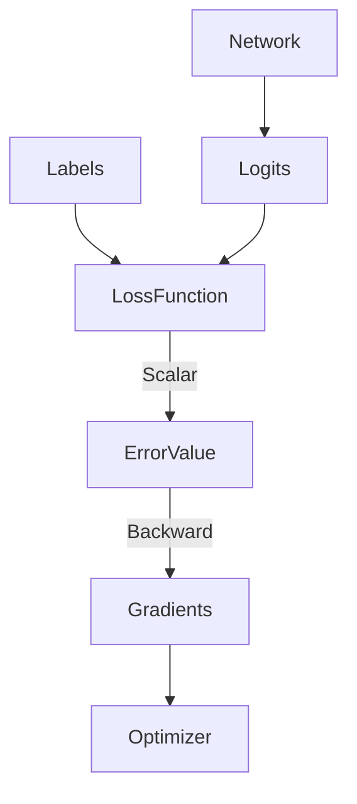

# Core ML: Loss Functions & Objectives

## 📜 Story Mode: The Compass

> **Mission Date**: 2042.09.05
> **Location**: Deep Space Outpost "Vector Prime"
> **Officer**: Lead Engineer Kael
>
> **The Problem**: The Gradient Descent engine is running perfectly. The ship is moving.
> But... we are moving in circles.
>
> The Captain screams: "We are getting nowhere! What is the Navigation Target?"
>
> I check the console. The target is set to: **"Do Good Things."**
> The computer doesn't understand "Good". It needs a Number. It needs an Error Metric.
>
> If I set the goal to **"Minimize Distance"** (MSE), it flies straight to the nearest rock. (Crash).
> If I set the goal to **"Maximize Surprise"** (Entropy), it flies into a black hole.
>
> I need to define the *exact* mathematical difference between "Where we are" and "Where we want to be."
>
> *"Computer! Set Objective Function to 'Categorical Cross Entropy'. Target: 'Earth'. Minimize the divergence!"*

---

## 1. Problem Setup & Motivation

### The 6 Engineering Questions
1.  **WHAT**:
    *   **Loss Function**: A mathematical formula that quantifies the "Badness" of a prediction. $L(y_{true}, y_{pred})$.
2.  **WHY**: Gradient Descent needs a slope. Without a differentiable Loss Function, there is no Gradient, and no learning.
3.  **WHEN**: Designing the model architecture. The Loss dictates *what* the model learns.
4.  **WHERE**: The final layer of the network.
5.  **WHO**: The Architect. (You).
6.  **HOW**: `criterion = nn.CrossEntropyLoss()`.

> [!NOTE]
> **🛑 Pause & Explain (In Simple Words)**
>
> **The Teacher's Scorecard.**
>
> - **MSE (Mean Squared Error)**: "You missed by 5 meters. That is $5^2 = 25$ points bad." (Harsh on outliers).
> - **MAE (Mean Absolute Error)**: "You missed by 5 meters. That is 5 points bad." (Fair).
> - **Cross Entropy**: "You said it was a Dog with 10% confidence. It WAS a Dog. You failed to be confident. Punishment!"

---

## 2. Mathematical Problem Formulation

### Regression Losses (Predicting Numbers)
1.  **MSE (L2 Loss)**: $\frac{1}{N} \sum (y - \hat{y})^2$.
    *   **Pros**: Penalizes large errors heavily. Easy gradients (Linear).
    *   **Cons**: Explodes if you have Outliers (Noise).
2.  **MAE (L1 Loss)**: $\frac{1}{N} \sum |y - \hat{y}|$.
    *   **Pros**: Robust to outliers.
    *   **Cons**: Gradient is undefined at 0. (Needs Huber Loss to smooth it).

### Classification Losses (Predicting Classes)
1.  **Cross Entropy (Log Loss)**: $- \sum y \cdot \log(\hat{y})$.
    *   Forces the model to be **Confident**.
    *   If $\hat{y}=0.9$ (for true class), Loss is small.
    *   If $\hat{y}=0.1$ (for true class), Loss is Huge.

### Why not "Accuracy"?
Accuracy is discrete. "Right" or "Wrong".
The graph is a staircase. Slope is 0 everywhere.
Gradient Descent cannot learn on flat surfaces.
We use Cross Entropy as a "Smooth Proxy" for Accuracy.

---

## 3. Step-by-Step Derivation

### Deriving Cross Entropy from Probability
**Goal**: Maximize Likelihood of True Class.
$$ P(Correct) = \hat{y}_{correct} $$
**Step 1**: Maximize Product (for batch).
$$ \prod \hat{y}_i $$
**Step 2**: Take Log (to turn product into sum).
$$ \sum \log(\hat{y}_i) $$
**Step 3**: Minimize Negative (Descent).
$$ - \sum \log(\hat{y}_i) $$
**Result**: This is exactly Cross Entropy. It is literally just "Maximize the probability of the right answer."

---

## 4. Algorithm Construction

### Map to Memory (Numerical Stability)
Computing $\log(\hat{y})$ is dangerous.
If $\hat{y} = 0$, $\log(0) = -\infty$. Code crashes.
**Log-Sum-Exp Trick**:
Deep Learning frameworks fuze Softmax + Log.
Instead of `log(exp(x) / sum(exp(x)))`...
They compute `x - log(sum(exp(x)))`.
This avoids overflow/underflow.
**Always use `nn.CrossEntropyLoss`, never `log(softmax(x))`.**

### Algorithm: Focal Loss (Handling Imbalance)
**Problem**: 99% of image is Background (Easy). 1% is Object (Hard).
Cross Entropy is overwhelmed by the 99% easy examples.
**Solution**: Scale the loss by $(1 - p)^\gamma$.
If probability $p$ is high (Easy), loss goes to 0.
The model ignores easy stuff and focuses only on the hard stuff.
State-of-the-Art for Object Detection (RetinaNet).

---

## 5. Optimization & Convergence Intuition

### Hinge Loss (SVMs)
$$ L = \max(0, 1 - y \cdot \hat{y}) $$
**Intuition**: "I don't care if you are *very* correct. Just be correct *enough* (Score > 1)."
This creates a **Margin**. The model stops pushing once it's safe.
Cross Entropy never stops pushing (wants $p \to 1.0$), which can lead to Overfitting.

---

## 6. Worked Examples

### Example 1: The Outlier (MSE vs MAE)
**Data**: 10 people earn $50k. 1 person (Elon) earns $100B.
**MSE Model**: Will predict Average = $10B.
Error for normal people: Huge.
Error for Elon: Small.
**MAE Model**: Will predict Median = $50k.
Error for normal people: 0.
Error for Elon: Huge. (But we don't care, he's just one point).
**Lesson**: Use MAE for financial data (Salaries, House Prices). Use MSE for Physics.

### Example 2: The Softmax Temperature
$\text{Softmax}(z/T)$.
**High T (100)**: Output is uniform [0.33, 0.33, 0.33]. (High Loss).
**Low T (0.01)**: Output is sharp [0.99, 0.0, 0.0]. (Low Loss).
**Annealing**: Start High T (Explore), reduce to Low T (Converge).

---

## 7. Production-Grade Code

### The Ship's Code (Polyglot: Pure Python + Libraries)

```python
import numpy as np
import torch
import torch.nn as nn
import tensorflow as tf

# LEVEL 0: Pure Python (Manual Cross Entropy)
# Showing the Log-Sum-Exp Trick for stability
def cross_entropy_pure(logits, target_index):
    """
    logits: List of raw scores [2.0, 1.0, 0.1]
    target_index: 0
    """
    # 1. Softmax (Stable)
    max_val = max(logits)
    exps = [np.exp(x - max_val) for x in logits] # Shift for stability
    sum_exps = sum(exps)
    probs = [x / sum_exps for x in exps]
    
    # 2. Negative Log Likelihood
    p_correct = probs[target_index]
    return -np.log(p_correct)

# LEVEL 1: PyTorch (Standard)
def torch_loss_demo(logits, target):
    # CrossEntropyLoss combines LogSoftmax + NLLLoss
    criterion = nn.CrossEntropyLoss()
    return criterion(logits, target)

# LEVEL 2: TensorFlow (Keras)
def tf_loss_demo(logits, target):
    # from_logits=True is crucial for stability!
    criterion = tf.keras.losses.SparseCategoricalCrossentropy(from_logits=True)
    return criterion(target, logits)

# LEVEL 3: Custom Weighted Loss (PyTorch)
class WeightedMSELoss(nn.Module):
    def __init__(self, weight_recent=2.0):
        super().__init__()
        self.w = weight_recent
        
    def forward(self, pred, target):
        sq_err = (pred - target)**2
        weights = torch.ones_like(sq_err)
        weights[:, -1] = self.w # Weight last step
        return torch.mean(weights * sq_err)
```

> [!CAUTION]
> **🛑 Production Warning**
>
> **Reduction**: Default is `mean`.
> If you change Batch Size, Mean Loss stays consistent. Sum Loss grows.
> If you use `reduction='sum'`, your Learning Rate must change with Batch Size ($LR = LR_{base} / BatchSize$).

> [!CAUTION]
> **🛑 Production Warning**
>
> **Reduction**: Default is `mean`.
> If you change Batch Size, Mean Loss stays consistent. Sum Loss grows.
> If you use `reduction='sum'`, your Learning Rate must change with Batch Size ($LR = LR_{base} / BatchSize$).

---

## 8. System-Level Integration



**Where it lives**:
**Ranking Loss (Triplet Loss)**:
Used in FaceID.
Loss = Distance(Anchor, Positive) - Distance(Anchor, Negative) + Margin.
Push Face A away from Face B. Pull Face A1 close to Face A2.

---

## 9. Evaluation & Failure Analysis

### Failure Mode: Pattern Collapse
If Loss Function is badly designed (e.g., GAN Discriminator wins too fast).
The Generator gives up. "Whatever I do, Loss is Max."
Gradients vanish.
**Fix**: Wasserstein Loss (Earth Mover Distance) which provides smooth gradients even when distributions don't overlap.

---

## 10. Ethics, Safety & Risk Analysis

### Optimization Gaming
If you set YouTube Recommendation Loss to "Maximize Watch Time".
The model will learn to recommend:
1.  Clickbait.
2.  Conspiracy Theories.
3.  Autoplay loops.
**Alignment**: We must add **Constraint Terms** to the Loss.
$L = -WatchTime + \lambda \cdot (Diversity + Truth)$.

---

## 11. Advanced Theory & Research Depth

## 11. Advanced Theory & Research Depth

### Information Bottleneck
Loss functions maximize information about Target ($Y$) while minimizing information about Input ($X$).
We want to **forget** the nuisance pixels (lighting, background) and **remember** the concept (Dog).
This is the core theory of Deep Learning Generalization.

### 📚 Deep Dive Resources
*   **Paper**: "Focal Loss for Dense Object Detection" (Lin et al., 2017) - Fixing class imbalance by focusing training on hard negatives. [ArXiv:1708.02002](https://arxiv.org/abs/1708.02002)
*   **Concept**: **Label Smoothing**. Instead of target `[0, 1, 0]`, use `[0.05, 0.9, 0.05]`. Prevents the model from becoming "Overconfident" (Logits $\to \infty$) and improves generalization.


---

## 12. Career & Mastery Signals

## 12. Career & Mastery Signals

### Cadet (Junior)
*   Knows `CrossEntropy` expects Logits (unnormalized scores), not Probabilities (Softmax output).
*   Can inspect Loss curves to detect Overfitting (Val Loss goes up) vs Underfitting (Train Loss stays high).

### Commander (Senior)
*   Implements **Auxiliary Losses** (e.g., Inception Network) to inject gradients deeper into the network.
*   Designs **Contrastive Losses** (InfoNCE) for Self-Supervised Learning.

---

## 13. Industry Interview Corner

### ❓ Real World Questions
**Q1: "When would you use Mean Absolute Error (MAE) instead of MSE?"**
*   **Answer**: "When we have outliers. MSE squares the error ($10^2=100$), so it screams at outliers. MAE is linear ($|10|=10$), so it's more robust. We use MAE for Salary prediction (Billionaires exist), MSE for physics (Gaussian noise)."

**Q2: "What is the derivative of Softmax Cross Entropy?"**
*   **Answer**: "$P - Y$. It is elegantly simple: The difference between Predicted Probability and True Label. This is why it trains so well."

**Q3: "Why does Neural Net training fail if I use Accuracy as the Loss?"**
*   **Answer**: "Accuracy is a step function (Non-differentiable). The gradient is zero almost everywhere. Gradient descent needs a smooth slope (like Cross Entropy) to know which way to move."

---

## 14. Debug Your Thinking (Common Misconceptions)

### ❌ Myth: "Zero Loss is the goal."
**✅ Truth**: No. Zero Training Loss usually means **Overfitting** (Memorization). We want Minimal *Validation* Loss. We accept some training error to maintain generality.

### ❌ Myth: "Regression always uses MSE."
**✅ Truth**: Not if you want uncertainty. We might use **Negative Log Likelihood** of a Gaussian to predict both Mean and Variance ($\mu, \sigma$). This allows the model to say "I don't know" (High Variance).


---

## 15. Assessment & Mastery Checks

**Q1: Bias Penalty**
How do we ensure the model doesn't just output the average value?
*   *Answer*: The Loss Function penalizes "Always Average" strategies eventually, provided the data has variance. However, L2 Reg pushes weights towards zero (Average).

**Q2: KL Divergence**
What is $KL(P || Q)$?
*   *Answer*: The extra bits needed to code samples from P using a code optimized for Q. Used in VAEs.

---

## 16. Further Reading & Tooling

*   **Paper**: *"Focal Loss for Dense Object Detection"* (He et al.).
*   **Lib**: **TorchMetrics** - Standard library for tracking metrics vs losses.

---

## 17. Concept Graph Integration
> 
> *   **Previous**: [Gradient Descent](02_core_ml/01_optimization/01_gradient_descent.md).
> *   **Next**: [Regularization](02_core_ml/01_optimization/03_regularization.md) (The Constraint).
> 
> ### Concept Map
> ```mermaid
> graph LR
>     Loss[Loss Function] --> Regression
>     Loss --> Classification
>     
>     Regression --> MSE[MSE - L2]
>     Regression --> MAE[MAE - L1]
>     Regression --> Huber[Huber Loss]
>     
>     Classification --> CE[Cross Entropy]
>     Classification --> Hinge[Hinge Loss]
>     Classification --> Focal[Focal Loss]
>     
>     MSE -- "Sensitive to" --> Outliers[Outliers]
>     MAE -- "Robust to" --> Outliers
>     CE -- "Optimizes" --> Probability
>     Hinge -- "Optimizes" --> Margin
>     
>     style Loss fill:#f9f,stroke:#333
>     style CE fill:#bbf,stroke:#333
>     style MSE fill:#faa,stroke:#333
> ```
