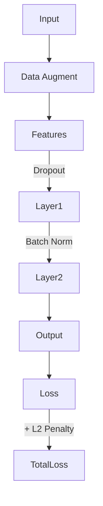
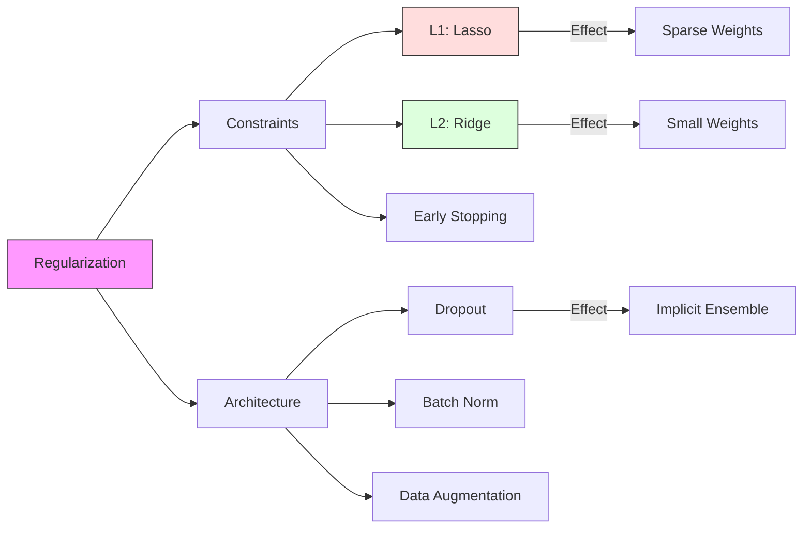

# Core ML: Regularization & Generalization

## 📜 Story Mode: The Razor

> **Mission Date**: 2042.09.10
> **Location**: Deep Space Outpost "Vector Prime"
> **Officer**: Lead Engineer Kael
>
> **The Problem**: The AI Navigation System is "too smart".
> We trained it on the asteroid field data.
> Ideally, it should fly *between* the rocks.
>
> Instead, it learned to fly *exactly* where a rock was **yesterday**.
> It memorized the position of every single pebble in the training set (`Overfitting`).
> But the rocks move.
> Today, it flew straight into a micrometeoroid because it "expected" empty space there.
>
> It's hallucinating patterns that don't exist.
>
> I need to make the AI **Dumber**.
> I need to force it to ignore the small pebbles and only look at the big gravity wells.
>
> *"Computer! Activate Occam's Razor Protocol. Apply L2 Regularization. Delete 50% of neural pathways (Dropout). Force simplicity!"*

---

## 1. Problem Setup & Motivation

### The 6 Engineering Questions
1.  **WHAT**:
    *   **Regularization**: Any technique that prevents Overfitting by simplifying the model.
    *   **Generalization**: The ability of the model to perform well on *unseen* data.
2.  **WHY**: A model with 1 Billion parameters can memorize Wikipedia. But does it *understand* language? Regularization forces it to learn rules, not facts.
3.  **WHEN**: When Training Loss < Validation Loss (Overfitting Gap).
4.  **WHERE**: Added to the Loss Function ($Loss + \lambda ||w||$) or inside the Layer (Dropout).
5.  **WHO**: ML Engineers trying to fix "High Variance".
6.  **HOW**: L1/L2 Penalties, Dropout, Early Stopping, Data Augmentation.

> [!NOTE]
> **🛑 Pause & Explain (In Simple Words)**
>
> **Don't memorize the answers.**
>
> - **Overfitting**: You studied for the test by memorizing the textbook questions. You get 100% on the Practice Exam (Training). You fail the Real Exam (Test).
> - **Regularization**: The teacher bans you from bringing the textbook. You are forced to learn the **Concepts**.
> - **Dropout**: The teacher randomly deletes half the questions. You can't rely on any single question. You must learn the big picture.

---

## 2. Mathematical Problem Formulation

### The Penalized Loss
$$ J_{reg}(\theta) = J(\theta) + \lambda \cdot R(\theta) $$
*   $J(\theta)$: Original Error (Data fit).
*   $\lambda$: Regularization Strength.
*   $R(\theta)$: The Penalty.

### L1 vs L2 (The Norms)
1.  **L2 Regularization (Ridge)**: $R(\theta) = \sum \theta_i^2$.
    *   Effect: Pushes weights to be **Small** ($0.001$).
    *   Math: "Gaussian Prior" (Weights likely near 0).
    *   Result: Smooth model. Distributed weights.
2.  **L1 Regularization (Lasso)**: $R(\theta) = \sum |\theta_i|$.
    *   Effect: Pushes weights to be **Zero** ($0$).
    *   Math: "Laplace Prior" (Sparse).
    *   Result: Feature Selection. (Weight becomes exactly 0, effectively deleting the input).

---

## 3. Step-by-Step Derivation

### Why L2 prevents large weights
**Loss Surface**: $x^2 + y^2$. Minimizing this means staying close to origin (0,0).
**Gradient**: $\frac{\partial}{\partial w} (\lambda w^2) = 2\lambda w$.
**Update Rule**:
$$ w_{new} = w - \alpha (\nabla L + 2\lambda w) = (1 - 2\alpha\lambda)w - \alpha \nabla L $$
$(1 - 2\alpha\lambda)$ is a number like $0.99$.
**Interpretation**: Every step, we simply **decay** the weight by 1%.
That is why L2 is called **Weight Decay**.

### Why Dropout works
We randomly shut off neurons with probability $p$ (e.g., 0.5).
A neuron cannot rely on its neighbor "Bob" to fix its mistakes, because Bob might be dead next step.
The neuron must start doing useful work itself.
**Result**: It creates an **Ensemble** of $2^N$ sub-networks.
A "Vote" of many dumb networks is smarter than one genius network.

---

## 4. Algorithm Construction

### Map to Memory (Implicit Regularization)
Does SGD regularize? Yes.
The "Noise" in SGD prevents the model from settling in sharp, brittle minima.
It forces the model into "Flat Minima" (wide valleys).
Flat valleys are robust. If test data shifts slightly ($\Delta x$), the loss doesn't explode.

### Algorithm: Early Stopping
**Logic**:
1.  Training Loss goes down forever.
2.  Validation Loss goes down... then stops... then goes UP.
3.  **Stop** at the inflection point.
This is the cheapest and most effective regularizer. Cost: $O(1)$.

---

## 5. Optimization & Convergence Intuition

### Batch Normalization (Smoothness)
By normalizing activation stats ($\mu=0, \sigma=1$) at every layer:
1.  We prevent gradients from exploding/vanishing.
2.  The "Landscape" becomes smoother (Loss surface is less rugged).
3.  We can use higher Learning Rates.
BN acts as a weak regularizer because the batch statistics add noise.

---

## 6. Worked Examples

### Example 1: Polynomial Regression
**Data**: 5 points in a line.
**Model**: 10th-degree polynomial ($ax^{10} + \dots$).
**Result without Reg**: Travels through every point perfectly, but wiggles wildly in between.
**Result with L2**: The coefficients for $x^{10}, x^9$ shrink to nearly 0. The curve becomes a straight line ($y=mx+b$). Simplicity wins.

### Example 2: The Dropout Mask
**Layer**: [1.0, 2.0, -5.0, 0.5].
**Mask**: [1, 0, 1, 0].
**Output**: [1.0, 0.0, -5.0, 0.0]. (Scaled by $1/(1-p)$ to maintain magnitude).
During **Inference**, we turn Dropout **OFF**. We use the full brain.

---

## 7. Production-Grade Code

### The Ship's Code (Polyglot: Pure Python + Libraries)

```python
import numpy as np
import torch
import torch.nn as nn
import tensorflow as tf

# LEVEL 0: Pure Python (Manual Dropout)
# Understanding the scaling factor 1/(1-p)
def dropout_forward(x, p=0.5, training=True):
    """
    x: Input list [1.0, 2.0, 3.0, 4.0]
    p: Probability of dropping (0.5)
    """
    if not training:
        return x # Identity during test
        
    mask = np.random.binomial(1, 1-p, size=len(x))
    # Scaling to maintain expected sum
    scale = 1 / (1-p)
    return [val * m * scale for val, m in zip(x, mask)]

# LEVEL 1: PyTorch (Weight Decay & Dropout)
def torch_reg_demo():
    model = nn.Sequential(
        nn.Linear(10, 100),
        nn.Dropout(p=0.5), # Standard Dropout
        nn.ReLU(),
        nn.Linear(100, 1)
    )
    # L2 Regularization is "weight_decay" in optimizer
    optimizer = torch.optim.Adam(model.parameters(), lr=1e-3, weight_decay=1e-5)
    return model, optimizer

# LEVEL 2: TensorFlow (L1/L2 Constraints)
def tf_reg_demo():
    # Keras allows granular control per layer
    layer = tf.keras.layers.Dense(
        units=64,
        activation='relu',
        kernel_regularizer=tf.keras.regularizers.l2(0.01), # Weight penalty
        activity_regularizer=tf.keras.regularizers.l1(0.01) # Output penalty (Sparse)
    )
    return layer

# LEVEL 3: Early Stopping (The Ultimate Regularizer)
class EarlyStopping:
    def __init__(self, patience=5):
        self.patience = patience
        self.best_loss = float('inf')
        self.counter = 0
        
    def check(self, val_loss):
        if val_loss < self.best_loss:
            self.best_loss = val_loss
            self.counter = 0
            return False # Keep training
        else:
            self.counter += 1
            if self.counter >= self.patience:
                return True # Stop!
            return False
```

> [!CAUTION]
> **🛑 Production Warning**
>
> **Model.eval()**:
> Forgetting `model.eval()` during inference is the #1 bug in Junior ML code.
> If you leave Dropout on, your predictions will be random/noisy.
> Always verify results are deterministic.

> [!CAUTION]
> **🛑 Production Warning**
>
> **Model.eval()**:
> Forgetting `model.eval()` during inference is the #1 bug in Junior ML code.
> If you leave Dropout on, your predictions will be random/noisy.
> Always verify results are deterministic.

---

## 8. System-Level Integration



**Where it lives**:
**Data Augmentation**: (Rotating images, adding noise). This is regularization!
It forces the model to be Invariant to rotation/noise.
If you don't have enough data, fake it.

---

## 9. Evaluation & Failure Analysis

### Failure Mode: Underfitting
If $\lambda$ is too high.
The model becomes *too* simple. $y = 0$.
Training Loss is high. Validation Loss is high.
**Fix**: Reduce regularization. Increase model capacity.

---

## 10. Ethics, Safety & Risk Analysis

### Robustness to Adversarial Attacks
Overfitted models are easily hacked.
Changing 1 pixel can flip "Panda" to "Gibbon".
Regularized models are "smoother". They ignore single pixels.
**Safety**: Regularization makes AI harder to fool.

---

## 11. Advanced Theory & Research Depth

## 11. Advanced Theory & Research Depth

### Double Descent Phenomenon
Classical Stats says: "Too many parameters = Overfitting".
Deep Learning says: "Add more parameters!"
**Double Descent**:
1.  Loss goes down.
2.  Goes UP (Overfitting regime).
3.  Goes DOWN AGAIN (Interpolation regime).
Huge models (GPT-4) generalize *better* than medium models. Why? Still an active research area.

### 📚 Deep Dive Resources
*   **Paper**: "Dropout: A Simple Way to Prevent Neural Networks from Overfitting" (Srivastava et al., 2014) - The original paper that changed NN training forever. [ArXiv:1207.0580](https://arxiv.org/abs/1207.0580)
*   **Concept**: **Label Smoothing**. Instead of forcing 1.0 probability, we target 0.9. This prevents the weights from exploding to infinity to reach "Certainty".


---

## 12. Career & Mastery Signals

## 12. Career & Mastery Signals

### Cadet (Junior)
*   Understands why `model.eval()` is necessary (Disable Dropout/BatchNorm updates).
*   Can tune Weight Decay ($1e-4$ vs $1e-5$).

### Commander (Senior)
*   Implements **Stochastic Depth** (ResNets) where entire *layers* are dropped, not just neurons.
*   Uses **MixUp** and **CutMix** augmentation strategies for SOTA robustness.

---

## 13. Industry Interview Corner

### ❓ Real World Questions
**Q1: "Why does L1 regularization create sparse models but L2 doesn't?"**
*   **Answer**: "Geometric interpretation: L1 contours are diamond-shaped. The loss minimum often hits the sharp corner (where weights are 0). L2 contours are circles, touching the loss curve at small non-zero values."

**Q2: "What is the difference between Batch Norm and Layer Norm?"**
*   **Answer**: "Batch Norm normalizes across the Batch dimension (needs batch size > 1). Layer Norm normalizes across the Feature dimension (independent of batch size). Transformers use LayerNorm because sequence lengths vary."

**Q3: "Does Dropout work at Test time?"**
*   **Answer**: "No (usually). We turn it off and scale the weights by $(1-p)$ (or inverted dropout divides by $(1-p)$ during train). However, **Monte Carlo Dropout** keeps it ON at test time to estimate uncertainty."

---

## 14. Debug Your Thinking (Common Misconceptions)

### ❌ Myth: "More Data = No Overfitting."
**✅ Truth**: More data helps, but if your model is massive (Trillions of params) and data is noisy, it can still memorize noise. You typically *always* need some regularization (at least Early Stopping).

### ❌ Myth: "L2 Regularization fixes everything."
**✅ Truth**: L2 only handles high variance (weights exploding). It doesn't fix Bias (Model too simple), nor does it fix Bad Data. It's just a weight constraint.


---

## 15. Assessment & Mastery Checks

**Q1: Bias-Variance Tradeoff**
What does High Regularization do?
*   *Answer*: Increases Bias (Simpler model). Decreases Variance (Less noise sensitivity).

**Q2: Dropout Rate**
Is 0.9 distinct from 0.1?
*   *Answer*: In PyTorch `p` is probability of *zeroing*. So `p=0.9` means 90% dead (Very harsh). `p=0.1` means 10% dead (Light).

---

## 16. Further Reading & Tooling

*   **Paper**: *"Dropout: A Simple Way to Prevent Neural Networks from Overfitting"* (Srivastava et al.).
*   **Concept**: **Label Smoothing** - Regularizing the targets themselves.

---

## 17. Concept Graph Integration

*   **Previous**: [Loss Functions](02_core_ml/01_optimization/02_loss_functions.md).
*   **Next**: [Evaluation & Tuning](02_core_ml/01_optimization/04_evaluation_tuning.md).

### Concept Map

