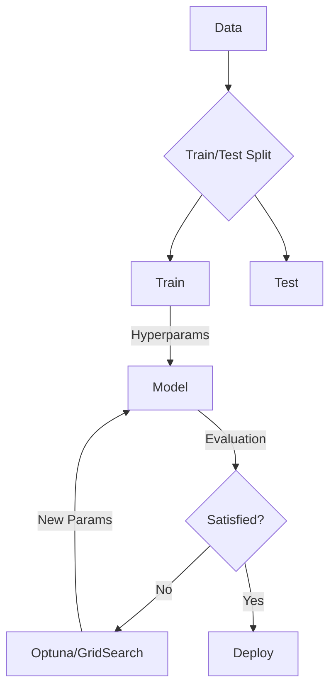
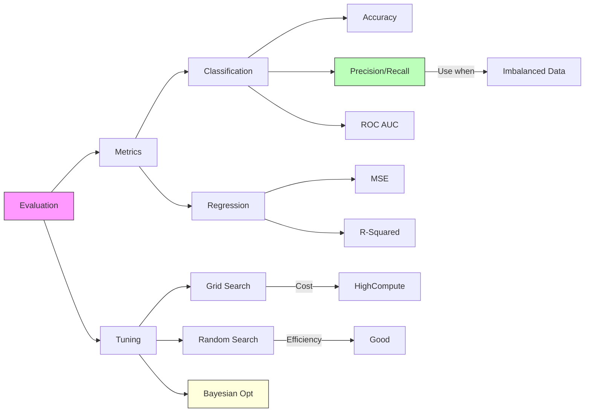

# Core ML: Evaluation & Hyperparameter Tuning

## 📜 Story Mode: The Scoreboard

> **Mission Date**: 2042.09.15
> **Location**: Deep Space Outpost "Vector Prime"
> **Officer**: Lead Engineer Kael
>
> **The Problem**: We installed the "Regularized" Navigation AI. It flies between rocks safely.
> But the Commander is asking: "Is it *ready* for war?"
>
> I look at the dashboard.
> **Accuracy: 95%**.
>
> Looks good? No.
> The "War Scenario" is 95% empty space and 5% enemy mines.
> A model that says "Safe" (Empty Space) **always** gets 95% accuracy.
> But it hits 100% of the mines. We die.
>
> I need a better metric. I need to measure **Precision** (How many alerts were real?) and **Recall** (Did we spot all mines?).
> And I need to tune the **Sensitivity** (Threshold).
>
> *"Computer! Disregard Accuracy. Plot the ROC Curve. Maximize Recall at 1% False Positive Rate. Initiate Grid Search for optimal Threshold."*

---

## 1. Problem Setup & Motivation

### The 6 Engineering Questions
1.  **WHAT**:
    *   **Evaluation**: Measuring performance beyond "Accuracy" (Precision, Recall, F1, AUC).
    *   **Tuning**: Finding the best "Hyperparameters" (Learning Rate, Batch Size, Tree Depth).
2.  **WHY**:
    *   **Imbalance**: Accuracy lies on imbalanced data.
    *   **Optimization**: The "Default" parameters are rarely optimal for your data.
3.  **WHEN**: After Training, before Deployment.
4.  **WHERE**: `sklearn.metrics`, `sklearn.model_selection`.
5.  **WHO**: ML Engineers, Data Scientists.
6.  **HOW**: Grid Search, Random Search, Bayesian Optimization.

> [!NOTE]
> **🛑 Pause & Explain (In Simple Words)**
>
> **The Metal Detector.**
>
> - **Threshold**: How loud does the beep need to be?
> - **Low Threshold**: Beeps at everything (Old cans, Nails). You find all the Gold, but dig 1000 holes. (**High Recall, Low Precision**).
> - **High Threshold**: Only beeps at massive gold bars. You miss the small coins. (**Low Recall, High Precision**).
> - **ROC Curve**: A plot showing this tradeoff for *every possible threshold*.

---

## 2. Mathematical Problem Formulation

### The Confusion Matrix
| | Predict Positive | Predict Negative |
| :--- | :--- | :--- |
| **Actual Positive** | True Positive (TP) | False Negative (FN) |
| **Actual Negative** | False Positive (FP) | True Negative (TN) |

### Key Metrics
1.  **Recall (Sensitivity)**: $\frac{TP}{TP + FN}$. "Did we catch them all?"
2.  **Precision**: $\frac{TP}{TP + FP}$. "When we predicted Yes, was it right?"
3.  **F1 Score**: $2 \cdot \frac{P \cdot R}{P + R}$. Harmonic mean.
4.  **FPR**: $\frac{FP}{FP + TN}$. "False Alarm Rate".

### Hyperparameter Optimization (HPO)
Let $f(x, \lambda)$ be the model performance.
Goal: $\lambda^* = \arg\max_\lambda \text{ValidationScore}(f(x, \lambda))$.
This is a "Black Box" optimization problem (No gradients for $\lambda$).

---

## 3. Step-by-Step Derivation

### The ROC Curve (Receiver Operating Characteristic)
**X-axis**: False Positive Rate (FPR).
**Y-axis**: True Positive Rate (Recall).
**Process**:
1.  Get Probability outputs from model $[0.1, 0.4, 0.8, 0.9]$.
2.  Set Threshold $T=0$. Everyone is Positive. (FPR=1, TPR=1). Top Right.
3.  Set Threshold $T=1$. Everyone is Negative. (FPR=0, TPR=0). Bottom Left.
4.  Sweep $T$ from 0 to 1. The curve connects the points.
**AUC (Area Under Curve)**:
*   0.5 = Random Guessing.
*   1.0 = Perfect.
*   0.9 = Excellent.

---

## 4. Algorithm Construction

### Map to Memory (The Cost of Search)
**Grid Search**: Try `LR=[0.1, 0.01, 0.001]` and `Batch=[16, 32, 64]`.
Total runs: $3 \times 3 = 9$.
Complexity: $O(K^N)$ where $N$ is number of hyperparameters. **Exponential**.
**Random Search**: Randomly sample `LR` and `Batch`.
Surprisingly effective.
Probability of finding a "Good" point is higher because not all parameters matter equally. Random Search explores the *important* dimensions more thoroughly.

### Algorithm: k-Fold Cross Validation
**Problem**: You tune on Validation set. You overfit the Validation set.
**Solution**:
1.  Split data into $k=5$ chunks.
2.  Train on 4, Test on 1.
3.  Rotate.
4.  Average the 5 scores.
**Result**: A robust estimate of performance. Cost: Uses $5\times$ compute.

---

## 5. Optimization & Convergence Intuition

### Bayesian Optimization (Smart Search)
Grid/Random search are "blind". They don't learn from past results.
**Bayesian Opt**:
1.  Try LR=0.1. Result=Bad.
2.  Try LR=0.001. Result=Good.
3.  **Intellect**: "Try close to 0.001, avoid 0.1".
Uses a Gaussian Process to model the "Surrogate Function" of performance.

---

## 6. Worked Examples

### Example 1: Medical Diagnosis (Recall is King)
**Task**: Detect Cancer.
**Cost of FN**: Patient dies. (Infinite).
**Cost of FP**: Biopsy (Expensive, but okay).
**Strategy**: Set Threshold very **Low** (e.g., 0.1).
Maximize **Recall**. Accept Low Precision.

### Example 2: Spam Filter (Precision is King)
**Task**: Block Spam.
**Cost of FN**: You see a spam email. (Annoying).
**Cost of FP**: You miss a Job Offer. (Catastrophic).
**Strategy**: Set Threshold very **High** (e.g., 0.99).
Maximize **Precision**. Accept Low Recall.

---

## 7. Production-Grade Code

### The Ship's Code (Polyglot: Pure Python + Libraries)

```python
import numpy as np
import sklearn.metrics
import torch
import optuna

# LEVEL 0: Pure Python (Manual Grid Search)
def grid_search_pure(model_fn, param_grid, X_val, y_val):
    """
    param_grid: {'lr': [0.1, 0.01], 'batch': [16, 32]}
    """
    best_score = 0
    best_params = {}
    
    # 1. Generate combinations (Nested Loop)
    for lr in param_grid['lr']:
        for batch in param_grid['batch']:
            # 2. Evaluate
            # pseudo: model = train(lr, batch)
            # pseudo: score = model.evaluate(X_val, y_val)
            score = np.random.random() # Fake score
            
            if score > best_score:
                best_score = score
                best_params = {'lr': lr, 'batch': batch}
                
    return best_params

# LEVEL 1: Scikit-Learn (Metrics)
def sklearn_metrics_demo(y_true, y_pred_prob):
    # Thresholding
    y_pred = [1 if p > 0.5 else 0 for p in y_pred_prob]
    
    # The Big 3
    acc = sklearn.metrics.accuracy_score(y_true, y_pred)
    f1 = sklearn.metrics.f1_score(y_true, y_pred)
    roc_auc = sklearn.metrics.roc_auc_score(y_true, y_pred_prob)
    
    return {"Accuracy": acc, "F1": f1, "AUC": roc_auc}

# LEVEL 2: Optuna (Bayesian Optimization)
# The Industry Standard for Hyperparam Tuning
def objective(trial):
    # 1. Suggest Params
    lr = trial.suggest_loguniform('lr', 1e-5, 1e-1)
    layers = trial.suggest_int('layers', 1, 3)
    
    # 2. Build & Train (Pseudo)
    # val_loss = train_model(lr, layers)
    val_loss = (lr - 0.01)**2 + layers # Fake surface
    
    return val_loss

def run_optuna():
    study = optuna.create_study(direction='minimize')
    study.optimize(objective, n_trials=10) # Run 10 experiments
    return study.best_params
```

> [!CAUTION]
> **🛑 Production Warning**
>
> **Data Leakage**:
> If you do Feature Engineering (StandardScaler) *before* splitting for Cross-Validation...
> **LEAK!** The Test set influenced the Mean/Std of the Training set.
> **Fix**: Use `sklearn.pipeline.Pipeline`. Fit the Scaler *inside* the Cross-Validation loop.

> [!CAUTION]
> **🛑 Production Warning**
>
> **Data Leakage**:
> If you do Feature Engineering (StandardScaler) *before* splitting for Cross-Validation...
> **LEAK!** The Test set influenced the Mean/Std of the Training set.
> **Fix**: Use `sklearn.pipeline.Pipeline`. Fit the Scaler *inside* the Cross-Validation loop.

---

## 8. System-Level Integration



**Where it lives**:
**Weights & Biases (WandB)**: The standard tool for tracking experiments.
It logs every run, every hyperparam, and plots the relation.
"Which LR gave the best AUC?" -> Look at the dashboard.

---

## 9. Evaluation & Failure Analysis

### Failure Mode: The Accuracy Paradox
Dataset: 99% 'A', 1% 'B'.
Model outputs 'A' always. Accuracy 99%.
**Metric Check**:
Recall for B: 0%.
F1 Score: 0%.
**Fix**: Always use F1-Macro or AUC for imbalanced datasets.

---

## 10. Ethics, Safety & Risk Analysis

### Fairness Metrics
A model might have 90% Accuracy overall.
But 95% for Group A, and 60% for Group B.
**Disparate Impact**:
We must evaluate metrics *per subgroup*.
**Equalized Odds**: Ensure TPR (Recall) is equal across all demographic groups.

---

## 11. Advanced Theory & Research Depth

## 11. Advanced Theory & Research Depth

### Calibration Curve
A model says "80% confidence".
Does it strictly mean that 80% of such predictions are correct?
Often, Deep Nets are **Overconfident** (Say 99%, but only right 90% of time).
**Temperature Scaling**: A post-processing step to fix calibration without retraining.
Crucial for Medical/Self-Driving uncertainty estimation.

### 📚 Deep Dive Resources
*   **Paper**: "Random Search for Hyper-Parameter Optimization" (Bergstra & Bengio, 2012) - Proving Random Search beats Grid Search. [JMLR](https://www.jmlr.org/papers/v13/bergstra12a.html)
*   **Concept**: **A/B Testing**. The ultimate "Evaluation" is not F1 Score, but "Did User Revenue go up?". We deploy candidate models to 1% of users.


---

## 12. Career & Mastery Signals

## 12. Career & Mastery Signals

### Cadet (Junior)
*   Uses `sklearn.model_selection.train_test_split`.
*   Knows that **Accuracy** is useless for Fraud Detection (99.9% negative class).

### Commander (Senior)
*   Sets up **Automated Retraining Pipelines** (Airflow/Kubeflow) that trigger when data drift is detected.
*   Uses **Bayesian Optimization** (Optuna) instead of manual guessing for SOTA results.

---

## 13. Industry Interview Corner

### ❓ Real World Questions
**Q1: "Explain Classification Report (Precision/Recall/F1) to a non-technical manager."**
*   **Answer**: "Precision is quality (If we say spam, is it spam?). Recall is quantity (Did we catch all the spam?). F1 is the balance. If we filter too aggressively (High Precision), we miss real emails (Low Recall)."

**Q2: "What is Cross-Validation and when do you use it?"**
*   **Answer**: "We split data into K folds (Rotate 4 train, 1 test). It gives a more stable estimate of model performance than a single split. Use it when data is small (<50k rows). For Big Data, single hold-out is usually fine."

**Q3: "How do you choose the Threshold for a Classifier?"**
*   **Answer**: "Business Logic. For cancer, we want High Recall (Threshold 0.1) to find every case. For YouTube kids content filter, we want High Precision (Threshold 0.99) to never show bad content."

---

## 14. Debug Your Thinking (Common Misconceptions)

### ❌ Myth: "Test Set is for debugging."
**✅ Truth**: NEVAR touch the Test Set until the *very* end. If you look at Test results and change your model, you have **Overfit the Test Set**. Use a **Validation Set** for tuning.

### ❌ Myth: "AUC of 0.5 is failure."
**✅ Truth**: 0.5 is Random. 0.0 is actually **Perfectly Wrong** (It predicts 'Cat' as 'Dog' 100% of time). You can just flip the prediction ($1-p$) to get a perfect 1.0 model.


---

## 15. Assessment & Mastery Checks

**Q1: Grid vs Random Search**
Why is Random Search often better?
*   *Answer*: In high dimensions, the "effective dimensionality" is low. Random search explores the important dimensions densely, whereas Grid search wastes time repeating the same values for important params while varying unimportant ones.

**Q2: Precision-Recall Tradeoff**
Can you increase both simultaneously?
*   *Answer*: Generally No. Changing threshold trades one for the other. You can only improve both by **Building a Better Model** (Moving the ROC curve up).

---

## 16. Further Reading & Tooling

*   **Lib**: **Optuna** - The best HPO framework in Python.
*   **Lib**: **Scikit-Learn** - `classification_report` is your best friend.

---

## 17. Concept Graph Integration

*   **Previous**: [Regularization](02_core_ml/01_optimization/03_regularization.md).
*   **Next**: [Neural Networks / Anatomy](02_core_ml/02_neural_networks/01_anatomy.md) (Starting Phase 7).
*   **Next**: [Linear Regression](02_core_ml/02_supervised/01_regression.md) (The Foundation).

### Concept Map

```
