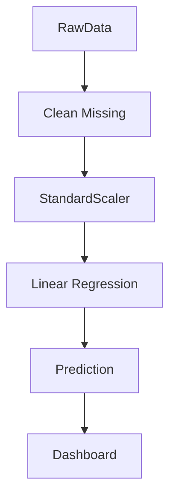

# Supervised Learning: Linear & Logistic Regression

## 📜 Story Mode: The Extrapolation

> **Mission Date**: 2042.10.01
> **Location**: Deep Space Outpost "Vector Prime"
> **Officer**: Lead Engineer Kael
>
> **The Problem**: The Life Support System has a leak.
> Oxygen levels are dropping.
>
> Hour 1: 98%
> Hour 2: 96%
> Hour 3: 94%
>
> The Captain screams: "When do we die?"
>
> I need to draw a line through these points and extend it into the future.
> If I assume the trend is a straight line (**Linear**), we have 49 hours.
>
> But then, the Engine Temperature is also rising.
> The Captain asks: "Will the reactor meltdown? Yes or No?"
> I can't answer "75%". I need a binary probability.
> I need to squash the temperature reading into a probability between 0 and 1.
>
> *"Computer! Fit a Linear Regressor to the Oxygen. Fit a Logistic Regressor to the Reactor. Give me the Time-to-Death."*

---

## 1. Problem Setup & Motivation

### The 6 Engineering Questions
1.  **WHAT**:
    *   **Linear Regression**: Predicting a continuous number ($y \in \mathbb{R}$). Line of Best Fit.
    *   **Logistic Regression**: Predicting a class probability ($y \in [0, 1]$). The S-Curve.
2.  **WHY**: These are the "Hello World" of Machine Learning. They are interpretable, fast, and the building blocks of Deep Learning (A Neuron is just Logistic Regression).
3.  **WHEN**: When you need **Explainability**. "Why was the loan rejected?" $\to$ "Because Income weighted -0.5".
4.  **WHERE**: Finance (Risk scoring), Medicine (Survival analysis), Pricing models.
5.  **WHO**: Actuaries, Data Analysts.
6.  **HOW**: Minimal Mean Squared Error (Linear) or Maximum Likelihood (Logistic).

> [!NOTE]
> **🛑 Pause & Explain (In Simple Words)**
>
> **The Ruler and the Coin.**
>
> - **Linear Regression**: You hold a ruler up to a scatter plot. You tilt it until it touches the most points. You use it to predict value. ($y = mx + b$).
> - **Logistic Regression**: You flip a weighted coin. If Temperature is high, the coin is weighted 99% Heads (Meltdown). If Low, 1% Heads. The "S-Curve" describes how the weight changes.

---

## 2. Mathematical Problem Formulation

### Linear Regression
$$ \hat{y} = w_0 + w_1 x_1 + \dots + w_n x_n = \mathbf{w}^T \mathbf{x} + b $$
**Loss**: Mean Squared Error (MSE).
$$ J(w) = \frac{1}{N} \sum (y_i - \hat{y}_i)^2 $$

### Logistic Regression
$$ z = \mathbf{w}^T \mathbf{x} + b $$
$$ \hat{y} = \sigma(z) = \frac{1}{1 + e^{-z}} $$
**Loss**: Binary Cross Entropy (Log Loss).
$$ J(w) = - \sum [ y \log(\hat{y}) + (1-y) \log(1-\hat{y}) ] $$

---

## 3. Step-by-Step Derivation

### The Normal Equation (Closed Form Solution for Linear)
We want to minimize $||Xw - y||^2$.
Take derivative w.r.t $w$ and set to 0.
$$ 2X^T(Xw - y) = 0 $$
$$ X^T X w = X^T y $$
$$ w = (X^T X)^{-1} X^T y $$
**Implication**: We can solve Linear Regression using simple Matrix Algebra! No Loop required.
**Caveat**: Inverting a matrix is $O(N^3)$. If $N > 10,000$, use Gradient Descent instead.

### The Odds Ratio (Logistic)
why Sigmoid?
It comes from the "Log Odds".
$$ \log \left( \frac{p}{1-p} \right) = \mathbf{w}^T \mathbf{x} $$
If we solve for $p$, we get the Sigmoid function.
This means Logistic Regression assumes the **Log-Odds** are linear.

---

## 4. Algorithm Construction

### Map to Memory (Weights as Feature Importance)
The weights $\mathbf{w}$ tell you exactly how important each input is.
Model: Credit Score Prediction.
$w_{income} = +50$. (High income = Good).
$w_{debt} = -20$. (High debt = Bad).
$w_{shoe\_size} = 0.01$. (Irrelevant).
**L1 Regularization** (Lasso) will force $w_{shoe\_size} \to 0$, effectively removing the feature.

### Algorithm: SGD for Regression
Since Linear Regression is Convex (a Bowl), SGD is guaranteed to find the global minimum.
There are no local minima in Linear Regression.

---

## 5. Optimization & Convergence Intuition

### The Decision Boundary
In Logistic Regression, the boundary is where $P(y=1) = 0.5$.
This happens when $z = \mathbf{w}^T \mathbf{x} + b = 0$.
This equation defines a **Hyperplane** (a straight line in 2D).
**Limitation**: Logistic Regression can ONLY separate data with a straight line.
If your data is a circle (Donut), Logistic Regression fails (Accuracy ~50%).
**Fix**: Feature Engineering ($x_1^2 + x_2^2$) or Neural Networks.

---

## 6. Worked Examples

### Example 1: Predicting House Prices (Linear)
**Feature**: Square Footage.
**Model**: Price = $200 \times \text{SqFt} + 50,000$.
**Interpretation**:
*   Base price (Intercept): $50k.
*   Cost per SqFt (Slope): $200.
**Outlier**: A burnt-down mansion sells for $0. The model predicts $2M.
This huge error pulls the line down. (MSE is sensitive to outliers).

### Example 2: Spam Detection (Logistic)
**Features**: Count of word "Free", "Drug", "Win".
**Model**: $P(\text{Spam}) = \sigma(2 \times \text{Free} + 5 \times \text{Drug})$.
**Input**: "Win Free Drugs".
**Score**: $z = 2(1) + 5(1) + \dots = 7$.
**Prob**: $\sigma(7) \approx 0.999$. (Definitely Spam).

---

## 7. Production-Grade Code

### Scikit-Learn vs PyTorch

```python
import numpy as np
import matplotlib.pyplot as plt
from sklearn.linear_model import LinearRegression, LogisticRegression

# 1. The Classical Way (Sklearn)
# Best for Small Data (CPU)
X = np.array([[1], [2], [3], [4]]) # Hours
y = np.array([98, 96, 94, 92])     # Oxygen %

lin_reg = LinearRegression()
lin_reg.fit(X, y)

print(f"Slope: {lin_reg.coef_[0]}") # -2.0
print(f"Intercept: {lin_reg.intercept_}") # 100.0

# Prediction for Hour 50
pred_50 = lin_reg.predict([[50]])
print(f"Oxygen at Hour 50: {pred_50[0]}%") # 0.0% (We die)

# 2. The Deep Learning Way (PyTorch)
# Best for Big Data (GPU)
import torch
import torch.nn as nn

class LogisticModel(nn.Module):
    def __init__(self):
        super().__init__()
        self.linear = nn.Linear(1, 1) # wx + b
    
    def forward(self, x):
        return torch.sigmoid(self.linear(x)) # Squash to [0,1]

model = LogisticModel()
# ... Training loop with BCELoss ...
```

> [!TIP]
> **👁️ Visualizing the Fit: Linear vs Logistic**
> Run this script to compare how a Line fits continuous data vs how an S-Curve fits binary data.
>
> ```python
> import numpy as np
> import matplotlib.pyplot as plt
>
> def plot_regression_types():
>     # 1. Generate Data
>     np.random.seed(42)
>     x = np.linspace(0, 10, 50)
>     # Linear Data (y = 2x + noise)
>     y_lin = 2 * x + np.random.normal(0, 2, 50)
>     # Logistic Data (Prob = Sigmoid(x-5))
>     p = 1 / (1 + np.exp(-(x - 5) * 2))
>     y_log = np.random.binomial(1, p)
>     
>     fig, axes = plt.subplots(1, 2, figsize=(12, 5))
>     
>     # Linear Regression Plot
>     axes[0].scatter(x, y_lin, color='blue', alpha=0.6, label='Data')
>     # Line of best fit using numpy polyfit
>     m, b = np.polyfit(x, y_lin, 1)
>     axes[0].plot(x, m*x + b, color='red', linewidth=2, label=f'Fit: y={m:.1f}x+{b:.1f}')
>     axes[0].set_title('Linear Regression (Continuous)')
>     axes[0].legend()
>     axes[0].grid(True, alpha=0.3)
>     
>     # Logistic Regression Plot
>     axes[1].scatter(x, y_log, color='green', alpha=0.6, label='Binary Data')
>     # True Sigmoid
>     sigmoid = 1 / (1 + np.exp(-(x - 5) * 2))
>     axes[1].plot(x, sigmoid, color='orange', linewidth=2, label='Prob (Sigmoid)')
>     axes[1].axhline(0.5, linestyle='--', color='gray', label='Threshold')
>     axes[1].set_title('Logistic Regression (Binary)')
>     axes[1].legend()
>     axes[1].grid(True, alpha=0.3)
>     
>     plt.tight_layout()
>     plt.show()
>
> # Uncomment to run:
> # plot_regression_types()
> ```

> [!CAUTION]
> **🛑 Production Warning**
>
> **Extrapolation Risk**:
> Linear models will predict $-\infty$ if you go far enough.
> Tree models (Random Forest) cannot extrapolate; they predict the "average of the closest training data" (constantly flat outside range).
> Neither is perfect. Know your domain bounds.

---

## 8. System-Level Integration



**Where it lives**:
**StandardScaler**: Linear models **require** features to be on the same scale.
If $x_1$ is Age (0-100) and $x_2$ is Income (0-1,000,000).
The gradient for Income will be huge. SGD will crash.
**Always Normalize `(x - mean) / std` before Linear Regression.**

---

## 9. Evaluation & Failure Analysis

### Failure Mode: Multicollinearity
Feature A: "Height in Feet".
Feature B: "Height in Inches".
They are perfectly correlated.
The Matrix $(X^T X)$ becomes Singular (Non-invertible).
The weights can swing wildly ($w_A = 1000, w_B = -12000$).
**Fix**: Drop correlated features or use PCA.

---

## 10. Ethics, Safety & Risk Analysis

### Proxy Variables (Redlining)
You want to remove "Race" from your loan model to be fair.
But you keep "Zip Code".
Since Zip Code is highly correlated with Race (in the US), the linear model learns Race anyway.
**Analysis**: You must inspect the weights and the correlations of all features.

---

## 11. Advanced Theory & Research Depth

### GLM (Generalized Linear Models)
Linear ($y$) and Logistic (Bernoulli) are just two flavors.
**Poisson Regression**: Predicting counts (How many hits?).
**Gamma Regression**: Predicting wait times.
All follow the family: $g(E[y]) = \mathbf{w}^T \mathbf{x}$.

---

## 12. Career & Mastery Signals

### Interview Pitfall
Q: "Does Logistic Regression output probabilities?"
**Bad Answer**: "Yes."
**Good Answer**: "It outputs a score between 0 and 1. If the data is linearly separable and the objective is log-loss, these approach true probabilities. However, they naturally tend solely to maximize separation, so they may need **Calibration** (Isotonic Regression) to be treated as real-world probabilities."

---

## 13. Assessment & Mastery Checks

**Q1: Convexity**
Is Linear Regression convex?
*   *Answer*: Yes. The Loss surface is a Parabola (Bowl). It has one global minimum.

**Q2: Bias Term**
What happens if you delete the Bias ($b$)?
*   *Answer*: The line is forced to go through the origin $(0,0)$. This is usually terrible fit.

---

## 14. Further Reading & Tooling

*   **Lib**: **Statsmodels** - For detailed statistical reports (P-values, Confidence Intervals).
*   **Concept**: **Regularization Path** - Visualizing how weights shrink with Lasso.

---

## 15. Concept Graph Integration

*   **Previous**: [Evaluation & Tuning](02_core_ml/01_optimization/04_evaluation_tuning.md).
*   **Next**: [KNN & SVM](02_core_ml/02_supervised/02_knn_svm.md) (Geometric Classifiers).
> 
> ### Concept Map
> ```mermaid
> graph LR
>     Sup[Supervised Learning] --> Linear[Linear Models]
>     
>     Linear --> LinReg[Linear Regression]
>     Linear --> LogReg[Logistic Regression]
>     
>     LinReg -- "Predicts" --> Continuous[Number (R)]
>     LogReg -- "Predicts" --> Prob[Probability (0,1)]
>     
>     LinReg --> MSE[MSE Loss]
>     LogReg --> BCE[Log Loss]
>     
>     LinReg -- "Solved by" --> Normal[Normal Equation]
>     LinReg -- "Solved by" --> SGD[Gradient Descent]
>     LogReg -- "Solved by" --> SGD
>     
>     style Sup fill:#f9f,stroke:#333
>     style LinReg fill:#bbf,stroke:#333
>     style LogReg fill:#bfb,stroke:#333
> ```
