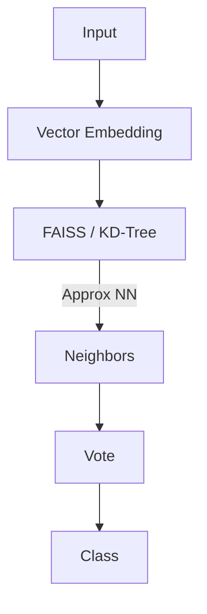

# Supervised Learning: KNN & Support Vector Machines

## 📜 Story Mode: The Boundary

> **Mission Date**: 2042.10.05
> **Location**: Deep Space Outpost "Vector Prime"
> **Officer**: Lead Engineer Kael
>
> **The Problem**: Dealing with "Alien Flora".
> We have found blue plants and red plants. Blue = Safe. Red = Poison.
>
> A new plant appears. It's Purple-ish.
>
> **Strategy 1 (KNN)**: I look at its neighbors. The 3 closest plants are all Red. So this one is probably Red. (Guilt by Association).
>
> **Strategy 2 (SVM)**: I try to build a fence between the Blue field and the Red field.
> But the fields overlap! There is no straight line.
>
> The Captain suggests: "What if we map the garden into 3D space?"
> If we lift the red flowers up, maybe we can slide a sheet of metal (Hyperplane) underneath them.
>
> *"Computer! Calculate the Euclidean Distance for KNN. If that fails, apply a Radial Basis Function Kernel. Warping space-time to build a wall."*

---

## 1. Problem Setup & Motivation

### The 6 Engineering Questions
1.  **WHAT**:
    *   **KNN (k-Nearest Neighbors)**: Classification by majority vote of neighbors.
    *   **SVM (Support Vector Machine)**: Finding the hyperplane that maximizes the margin (gap) between classes.
2.  **WHY**:
    *   **KNN**: Simple, "Lazy Learning" (No training, just memorizing).
    *   **SVM**: Mathematically beautiful, robust to outliers, works in high dimensions.
3.  **WHEN**: Small to Medium datasets. Tabular data. When Neural Nets are overkill.
4.  **WHERE**: Anomaly detection, Bioinformatics (Gene classification), Handwriting recognition (MNIST).
5.  **WHO**: The Researchers of the 1990s (SVM beat Neural Nets for a decade).
6.  **HOW**: `sklearn.neighbors.KNeighborsClassifier`, `sklearn.svm.SVC`.

> [!NOTE]
> **🛑 Pause & Explain (In Simple Words)**
>
> **The Geometry of Logic.**
>
> - **KNN**: "Tell me who your friends are, and I'll tell you who you are." (Local logic).
> - **SVM**: "Stay entirely on your side of the river." (Global logic). The SVM fits the widest possible river between the armies.

---

## 2. Mathematical Problem Formulation

### KNN: The Distance Metric
Given query point $x_q$, find $k$ points with minimal Distance $d(x_q, x_i)$.
*   **Euclidean**: $\sqrt{\sum (x_j - y_j)^2}$. (Standard ruler).
*   **Manhattan**: $\sum |x_j - y_j|$. (Grid movement).
*   **Cosine**: Angle measure (for Text).

### SVM: The Hard Margin
Maximize $\frac{2}{||w||}$ subject to $y_i(w^T x_i + b) \ge 1$.
This is a **Convex Optimization** problem (Quadratic Programming).
Unique global minimum.

---

## 3. Step-by-Step Derivation

### The Kernel Trick (SVM's Superpower)
What if data is not linearly separable? (e.g., Red in center, Blue in ring).
We project data to higher dimension $\phi(x)$.
Compute dot product in high dimension: $K(x, y) = \phi(x)^T \phi(y)$.
**Magic**: We don't need to compute $\phi(x)$ explicitly!
**RBF Kernel**: $K(x, y) = \exp(-\gamma ||x-y||^2)$.
This allows us to draw curves, circles, and complex blobs without ever leaving 2D math.

---

## 4. Algorithm Construction

### Map to Memory (KNN is Expensive)
KNN has **Zero Training Time** ($O(1)$).
But **Inference Time** is $O(N)$ (Compare to everyone).
If $N = 1 Billion$, prediction takes forever.
**Fix**: Use KD-Trees or Ball Trees (Spatial Indexing) to find neighbors in $O(\log N)$.

### Map to Memory (SVM Support Vectors)
SVM only cares about the points *on the edge* of the river (Support Vectors).
It deletes all other points from memory.
This makes the model "Sparse" and efficient.

---

## 5. Optimization & Convergence Intuition

### The "C" Hyperparameter (SVM)
The Margin can be Soft.
We allow some points to cross the river (Errors).
**High C**: Strict. No errors allowed. (Risk: Overfitting, Narrow Margin).
**Low C**: Relaxed. Errors allowed. (Benefit: Wider Margin, Better Generalization).
C controls the Bias-Variance Tradeoff.

---

## 6. Worked Examples

### Example 1: Recommender System (KNN)
**User**: Likes "Star Wars".
**DB**: Find 5 users closest to this User (Distance in Movie-Space).
**Result**: They also liked "Dune".
**Recommend**: "Dune".

### Example 2: Handwriting (SVM)
**Input**: Image of '5'. Flattened vector.
**SVM**: Draws a hyper-boundary between '5's and '6's.
With Polymer Kernel, SVM achieved 99.2% on MNIST in 1998, beating most Neural Nets of the time.

---

## 7. Production-Grade Code

### Comparing KNN and SVM

```python
import time
from sklearn.datasets import make_moons
from sklearn.neighbors import KNeighborsClassifier
from sklearn.svm import SVC
from sklearn.model_selection import train_test_split

# 1. Generate Non-Linear Data (The Moons)
X, y = make_moons(n_samples=1000, noise=0.3)
X_train, X_test, y_train, y_test = train_test_split(X, y)

# 2. KNN (Lazy)
t0 = time.time()
knn = KNeighborsClassifier(n_neighbors=5)
knn.fit(X_train, y_train) # Instant
acc_knn = knn.score(X_test, y_test)
print(f"KNN Acc: {acc_knn:.3f} (Time: {time.time()-t0:.4f}s)")

# 3. SVM (RBF Kernel)
t0 = time.time()
svm = SVC(kernel='rbf', C=1.0)
svm.fit(X_train, y_train) # Slower to train
acc_svm = svm.score(X_test, y_test) # Fast to predict
print(f"SVM Acc: {acc_svm:.3f} (Time: {time.time()-t0:.4f}s)")
```

> [!TIP]
> **👁️ Visualizing the Geometry: Voronoi vs Margins**
> Run this script to see how KNN paints the map vs how SVM draws a line.
>
> ```python
> import numpy as np
> import matplotlib.pyplot as plt
> from sklearn.neighbors import KNeighborsClassifier
> from sklearn.svm import SVC
> from sklearn.datasets import make_blobs
>
> def plot_boundaries():
>     # 1. Generate Data (2 Blobs)
>     X, y = make_blobs(n_samples=50, centers=2, random_state=6, cluster_std=1.2)
>     
>     # 2. Setup Meshgrid for landscape drawing
>     h = 0.05
>     x_min, x_max = X[:, 0].min() - 1, X[:, 0].max() + 1
>     y_min, y_max = X[:, 1].min() - 1, X[:, 1].max() + 1
>     xx, yy = np.meshgrid(np.arange(x_min, x_max, h),
>                          np.arange(y_min, y_max, h))
>     
>     fig, axes = plt.subplots(1, 2, figsize=(12, 5))
>     
>     # Plot 1: KNN (k=1) - The Voronoi Tesselation
>     clf_knn = KNeighborsClassifier(n_neighbors=1)
>     clf_knn.fit(X, y)
>     Z = clf_knn.predict(np.c_[xx.ravel(), yy.ravel()])
>     Z = Z.reshape(xx.shape)
>     
>     axes[0].contourf(xx, yy, Z, alpha=0.3, cmap='bwr')
>     axes[0].scatter(X[:, 0], X[:, 1], c=y, cmap='bwr', edgecolor='k')
>     axes[0].set_title('KNN (k=1)\nJagged, hugs every point')
>     
>     # Plot 2: SVM (Linear) - The Wide Street
>     clf_svm = SVC(kernel='linear', C=1.0)
>     clf_svm.fit(X, y)
>     
>     # Plot Decision Boundary and Margins
>     axes[1].scatter(X[:, 0], X[:, 1], c=y, cmap='bwr', edgecolor='k')
>     
>     # Get grid decision function
>     Z = clf_svm.decision_function(np.c_[xx.ravel(), yy.ravel()])
>     Z = Z.reshape(xx.shape)
>     
>     # Plot margins (levels -1, 0, 1)
>     axes[1].contour(xx, yy, Z, colors='k', levels=[-1, 0, 1], alpha=0.5,
>                    linestyles=['--', '-', '--'])
>     
>     # Highlight Support Vectors
>     axes[1].scatter(clf_svm.support_vectors_[:, 0], clf_svm.support_vectors_[:, 1], s=100,
>                    linewidth=1.5, facecolors='none', edgecolors='k', label='Support Vectors')
>     axes[1].set_title('SVM (Linear)\nMaximized Margin')
>     axes[1].legend()
>     
>     plt.tight_layout()
>     plt.show()
>
> # Uncomment to run:
> # plot_boundaries()
> ```

> [!CAUTION]
> **🛑 Production Warning**
>
> **KNN Curse of Dimensionality**:
> In 1000 dimensions (Text / Image), "Distance" loses meaning. All points are equidistant.
> **Never use standard KNN on raw pixels.** Use embeddings first.

---

## 8. System-Level Integration



**Where it lives**:
**Vector Databases (Pinecone/Milvus)**: They are just massive KNN engines sitting on a server.
**SVMs**: Still used in embedded systems (low power) where Neural Nets are too heavy.

---

## 9. Evaluation & Failure Analysis

### Failure Mode: Imbalanced KNN
If 99 points are 'A' and 1 point is 'B'.
A query near 'B' will still see mostly 'A' neighbors (because 'A' is everywhere).
**Fix**: Distance-Weighted KNN (Closer neighbors get more votes).

---

## 10. Ethics, Safety & Risk Analysis

### The Black Box vs Glass Box
**KNN**: Perfectly explainable. "We denied you because you look like these 3 people who defaulted." (Ethically dubious, but transparent).
**SVM**: Harder to explain (Linear is easy, RBF Kernel is hard).
**Risk**: Guilt by Association (KNN) reinforces systemic bias.

---

## 11. Advanced Theory & Research Depth

### Cover's Theorem
"A complex pattern classification problem, cast in a high-dimensional space non-linearly, is more likely to be linearly separable than in a low-dimensional space."
This is the theoretical justification for the **Kernel Trick** and **Deep Learning Layers**. It explains why we project data to high dimensions.

---

## 12. Career & Mastery Signals

### Interview Pitfall
Q: "Why is Linear SVM better than Logistic Regression?"
**Bad Answer**: "It's more accurate."
**Good Answer**: "It maximizes the margin, which theoretically provides better generalization error bounds. However, Logistic Regression gives probabilities, which SVM does not natively provide."

---

## 13. Assessment & Mastery Checks

**Q1: k in KNN**
What happens if $k=1$?
*   *Answer*: Overfitting. The boundary becomes jagged, hugging every noise point.
What happens if $k=N$?
*   *Answer*: Underfitting. Predicts the majority class always.

**Q2: SVM Support Vectors**
If you remove a non-support vector, does the boundary change?
*   *Answer*: No. The boundary depends ONLY on the support vectors.

---

## 14. Further Reading & Tooling

*   **Lib**: **FAISS** (Facebook AI Similarity Search) - KNN on steroids/GPU.
*   **Paper**: *"Support-Vector Networks"* (Cortes & Vapnik).

---

## 15. Concept Graph Integration

*   **Previous**: [Regression Models](02_core_ml/02_supervised/01_regression.md).
*   **Next**: [Decision Trees](02_core_ml/02_supervised/03_decision_trees.md) (Rule-Based Logic).

### Concept Map
```mermaid
graph LR
    Classifier --> Geometric[Geometric Models]
    Classifier --> Probabilistic[Probabilistic Models]
    
    Geometric --> KNN[KNN]
    Geometric --> SVM[SVM]
    
    KNN -- "Strategy" --> Memorization[Memorize Data]
    SVM -- "Strategy" --> Boundary[Find Boundary]
    
    KNN -- "Parameter" --> k[k Neighbors]
    SVM -- "Parameter" --> C[C (Regularization)]
    SVM -- "Parameter" --> Kernel[Kernel Trick]
    
    Kernel --> Linear
    Kernel --> RBF[RBF (Circles)]
    
    style Geometric fill:#f9f,stroke:#333
    style SVM fill:#bbf,stroke:#333
    style KNN fill:#bfb,stroke:#333
```
