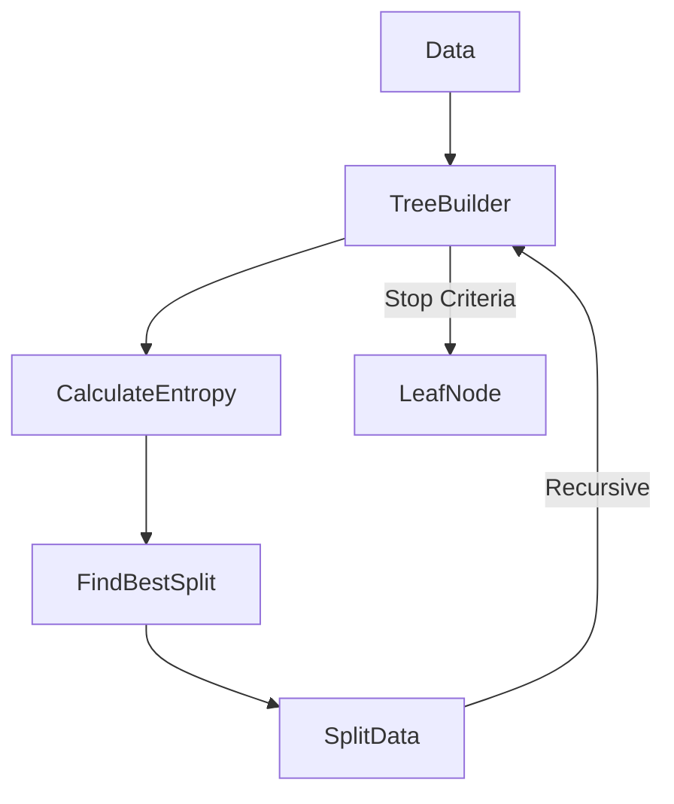

# Supervised Learning: Decision Trees

## 📜 Story Mode: The Flowchart

> **Mission Date**: 2042.10.10
> **Location**: Deep Space Outpost "Vector Prime"
> **Officer**: Lead Engineer Kael
>
> **The Problem**: The Medical Droid is diagnosing alien diseases.
> It says: "Patient has X-7 Virus. Probability 94%."
>
> The Doctor asks: "**Why?**"
> The Deep Learning Model says: "Because $w_{2049} \times 0.32 + b > 0$."
> This is useless. The Doctor cannot trust a Black Box.
>
> We need an Explainable AI. A model that mimics human reasoning.
> "If Fever > 40C AND Skin = Green, THEN Virus = X-7."
>
> I need to build a Tree of logical rules.
>
> *"Computer! Initialize CART Algorithm. Maximize Information Gain. Build a diagnostic flowchart that a human can read."*

---

## 1. Problem Setup & Motivation

### The 6 Engineering Questions
1.  **WHAT**:
    *   **Decision Tree**: A flowchart-like structure where each internal node represents a "Test" on an attribute (e.g. coin flip), each branch represents the outcome of the test, and each leaf node represents a class label.
2.  **WHY**: It is **Interpretable**. You can print the tree and hang it on the wall.
3.  **WHEN**: Medical diagnosis, Law, Credit Approval (Regulatory requirements to explain denials).
4.  **WHERE**: `sklearn.tree.DecisionTreeClassifier`.
5.  **WHO**: Auditors, Doctors, Regulators.
6.  **HOW**: Recursive Partitioning. At each step, split the data to maximize "Purity".

> [!NOTE]
> **🛑 Pause & Explain (In Simple Words)**
>
> **The Game of 20 Questions.**
>
> - **Game**: "I am thinking of an Animal."
> - **Bad Question**: "Is it a Zebra?" (Too specific. Low Information Gain).
> - **Good Question**: "Is it a Mammal?" (Splits the animal kingdom in half. High Information Gain).
>
> A Decision Tree just plays 20 Questions with your data, always asking the *best* question to narrow down the answer fastest.

---

## 2. Mathematical Problem Formulation

### Entropy (The Measure of Chaos)
$$ H(S) = - \sum p_i \log_2 p_i $$
*   If set is 50% A, 50% B: Entropy is **1.0** (Max Chaos).
*   If set is 100% A: Entropy is **0.0** (Pure Order).

### Information Gain (The Metric)
We want to choose a Split (Feature $F$, Threshold $T$) that reduces Entropy the most.
$$ IG(S, F) = H(S) - \sum \frac{|S_v|}{|S|} H(S_v) $$
(Entropy Before - Weighted Average Entropy After).

### Gini Impurity (The Faster Alternative)
$$ Gini = 1 - \sum p_i^2 $$
Similar curve to Entropy, but faster to compute (no Logarithms).
Used by default in CART (Classification and Regression Trees).

---

## 3. Step-by-Step Derivation

### Determining the Best Split
**Data**: [A, A, B, B] (Entropy 1.0).
**Feature X**: [1, 1, 0, 0].
**Split on X > 0.5**:
*   Left Branch (X=1): [A, A] (Entropy 0).
*   Right Branch (X=0): [B, B] (Entropy 0).
**Result**: Perfect Split. Information Gain = 1.0.

**Feature Y**: [1, 0, 1, 0].
**Split on Y > 0.5**:
*   Left Branch (Y=1): [A, B] (Entropy 1.0).
*   Right Branch (Y=0): [A, B] (Entropy 1.0).
**Result**: Useless Split. Information Gain = 0.

---

## 4. Algorithm Construction

### Map to Memory (Recursive Structure)
Trees are Recursive.
`class Node { Feature, Threshold, LeftChild, RightChild }`.
**Depth**: How many questions do we ask?
If Depth is too high (e.g., 50), we memorize every single data point.
**Overfitting**: A tree with Depth $N$ is basically a Hash Map.
**Pruning**: We cut off branches that don't add enough Information Gain.

### Algorithm: Regression Trees
Yes, Trees can predict numbers!
Instead of "Majority Vote" in the leaf, we take the **Average** of the samples.
Loss Function: Minimize Variance (MSE) in each leaf.

---

## 5. Optimization & Convergence Intuition

### Greedy Algorithms
Tree building is **Greedy**.
It creates the best split *now*. It never looks ahead.
Sometimes a bad split now leads to a great split later (XOR Problem).
Decision Trees struggle with **XOR** functions because you need to look at interactions ($X_1$ AND $X_2$) simultaneously, not sequentially.

---

## 6. Worked Examples

### Example 1: The Loan Officer
**Root**: Income > $50k?
*   **No**: Deny.
*   **Yes**: Credit Score > 700?
    *   **No**: Deny.
    *   **Yes**: Approve.
**Explainability**: "You were denied because Income > 50k was True BUT Credit > 700 was False."

### Example 2: The Titanic
**Root**: Gender = Male?
*   **Yes**: Survival Prob 20%.
*   **No**: Survival Prob 75%.
**Next Split**: Age < 10?
In real Titanic data, "Women and Children first" is exactly what the Decision Tree learns.

---

## 7. Production-Grade Code

### Visualizing the Tree

```python
from sklearn.datasets import load_iris
from sklearn.tree import DecisionTreeClassifier, export_text, plot_tree
import matplotlib.pyplot as plt

# 1. Train Tree
iris = load_iris()
clf = DecisionTreeClassifier(max_depth=3, random_state=42)
clf.fit(iris.data, iris.target)

# 2. Text Representation (For Logs)
tree_rules = export_text(clf, feature_names=iris.feature_names)
print(tree_rules)
# |--- petal width (cm) <= 0.80
# |   |--- class 0
# |--- petal width (cm) >  0.80
# |   |--- petal width (cm) <= 1.75
# |   |   |--- class 1

# 3. Graphical Representation (For Humans)
plt.figure(figsize=(10,8))
plot_tree(clf, feature_names=iris.feature_names, filled=True)
plt.show()
```

> [!TIP]
> **👁️ Visualizing the Function: Step-by-Step**
> Run this script to see how a Tree "steps" through the data to fit a curve.
>
> ```python
> import numpy as np
> import matplotlib.pyplot as plt
> from sklearn.tree import DecisionTreeRegressor
>
> def plot_tree_regression():
>     # 1. Generate Data (Sine Wave + Noise)
>     rng = np.random.RandomState(42)
>     X = np.sort(5 * rng.rand(80, 1), axis=0)
>     y = np.sin(X).ravel()
>     y[::5] += 3 * (0.5 - rng.rand(16)) # Add severe noise to some points
>
>     # 2. Fit Regression Trees (Depth 2 vs Depth 5)
>     regr_1 = DecisionTreeRegressor(max_depth=2)
>     regr_2 = DecisionTreeRegressor(max_depth=5)
>     regr_1.fit(X, y)
>     regr_2.fit(X, y)
>
>     # 3. Predict
>     X_test = np.arange(0.0, 5.0, 0.01)[:, np.newaxis]
>     y_1 = regr_1.predict(X_test)
>     y_2 = regr_2.predict(X_test)
>
>     # 4. Plot
>     plt.figure(figsize=(10, 6))
>     plt.scatter(X, y, s=20, edgecolor="black", c="darkorange", label="Data")
>     plt.plot(X_test, y_1, color="cornflowerblue", label="max_depth=2 (Underfit)", linewidth=2)
>     plt.plot(X_test, y_2, color="yellowgreen", label="max_depth=5 (Overfit)", linewidth=2)
>     plt.xlabel("Data")
>     plt.ylabel("Target")
>     plt.title("Decision Tree Regression: The Staircase Effect")
>     plt.legend()
>     plt.grid(True, alpha=0.3)
>     plt.show()
>
> # Uncomment to run:
> # plot_tree_regression()
> ```

> [!CAUTION]
> **🛑 Production Warning**
>
> **Sensitivity**: Trees are very unstable.
> Changing ONE data point can completely change the structure of the tree.
> **Never** rely on a single Decision Tree for robustness.
> Always use a **Random Forest** (Ensemble of Trees) in production for stability.

---

## 8. System-Level Integration



**Where it lives**:
**XGBoost / LightGBM**: These libraries train thousands of tiny trees.
They are the industry standard for Tabular Data (Rows/Columns), beating Deep Learning in most Kaggle competitions.

---

## 9. Evaluation & Failure Analysis

### Failure Mode: Bias towards High Cardinality
If Feature A has 2 values (T/F) and Feature B has 1000 values (User ID).
The Tree will pick Feature B because it can split the data perfectly (1 user per leaf).
Information Gain is biased towards features with many levels.
**Fix**: Use Gini Impurity, or limit the number of bins.

---

## 10. Ethics, Safety & Risk Analysis

### Hidden Bias in Rules
"If ZipCode > 90000, Deny Loan."
This looks like a neutral math rule.
But if ZipCode > 90000 corresponds to a minority neighborhood, the Tree has codified racism into an `if` statement.
Auditing Trees requires checking if the "Rules" align with Fair Lending laws.

---

## 11. Advanced Theory & Research Depth

### C4.5 algorithm
The classic algorithm handling Continuous data and Missing values.
Modern `sklearn` uses CART (Classification And Regression Trees).
Key difference: C4.5 produces n-ary splits. CART produces binary splits. Binary splits are faster to compute.

---

## 12. Career & Mastery Signals

### Interview Pitfall
Q: "Why do we Prune trees?"
**Bad Answer**: "To make them smaller."
**Good Answer**: "To preventing Overfitting. A fully grown tree fits the training noise perfectly (Variance). Pruning removes the statistically insignificant branches, improving Generalization (Bias-Variance tradeoff)."

---

## 13. Assessment & Mastery Checks

**Q1: Entropy vs Gini**
Which one is slower?
*   *Answer*: Entropy is slower because it calculates `log2(p)`. Gini only uses multiplication.

**Q2: XOR Problem**
Can a Decision Tree solve XOR?
*   *Answer*: Yes, but it requires multiple splits. It effectively draws a checkerboard. It requires Deep trees to approximate complex boundaries.

---

## 14. Further Reading & Tooling

*   **Lib**: **dtreeviz** - Beautiful visualizations for Decision Trees.
*   **Concept**: **Cost-Complexity Pruning** - The math behind cutting branches.

---

## 15. Concept Graph Integration

*   **Previous**: [KNN & SVM](02_core_ml/02_supervised/02_knn_svm.md).
> *   **Next**: [Unsupervised Learning](02_core_ml/03_unsupervised/01_clustering.md) (Finding Patterns).
> 
> ### Concept Map
> ```mermaid
> graph TD
>     Tree[Decision Tree] --> Split[Recursive Split]
>     Tree --> Leaf[Leaf Node]
>     
>     Split --> Metric{Metric}
>     Metric --> Entropy[Entropy (Info Gain)]
>     Metric --> Gini[Gini Impurity]
>     Metric --> MSE[MSE (Regression)]
>     
>     Tree -- "Constraint" --> MaxDepth[Max Depth]
>     Tree -- "Constraint" --> MinSamples[Min Samples Split]
>     
>     MaxDepth -- "Too High" --> Overfitting
>     MaxDepth -- "Too Low" --> Underfitting
>     
>     Overfitting -- "Solution" --> Pruning
>     Overfitting -- "Solution" --> RandomForest[Random Forest]
>     
>     style Tree fill:#f9f,stroke:#333
>     style Entropy fill:#bfb,stroke:#333
>     style Gini fill:#bfb,stroke:#333
> ```
