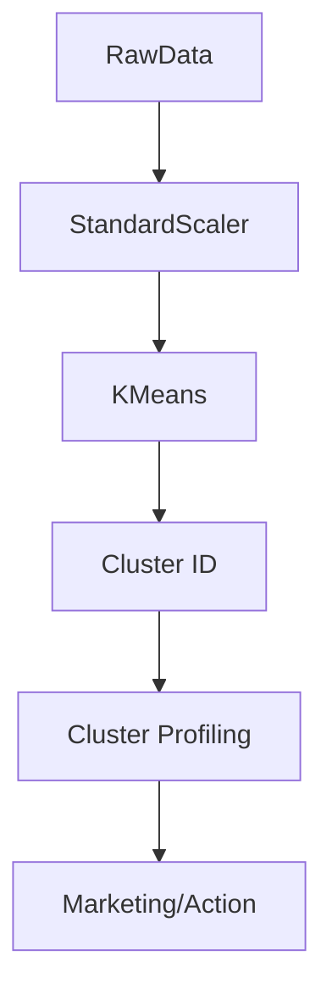

# Unsupervised Learning: Clustering (K-Means & Hierarchical)

## 📜 Story Mode: The Archipelago

> **Mission Date**: 2042.10.15
> **Location**: Deep Space Outpost "Vector Prime"
> **Officer**: Lead Engineer Kael
>
> **The Problem**: We are scanning the Andromeda Galaxy.
> We have 1 Trillion stars.
> We have **NO LABELS**. No "Safe" or "Dangerous" tags.
>
> To navigate, I need to group them.
> "These stars look similar (Blue Giants)."
> "Those stars look similar (Red Dwarfs)."
>
> I see clusters of data points huddled together in the void.
> I need to place a Navigation Buoy (Centroid) in the middle of each cluster.
>
> *"Computer! Run K-Means with k=5. Find the centers of gravity. Map the Archipelago."*

---

## 1. Problem Setup & Motivation

### The 6 Engineering Questions
1.  **WHAT**:
    *   **Clustering**: Grouping data points so that points in the same group are more similar to each other than to those in other groups.
    *   **Unsupervised**: The data has no Labels ($y$). We only have $X$.
2.  **WHY**: To find hidden structures. To compress data (1 million points $\to$ 5 clusters).
3.  **WHEN**: Exploratory Data Analysis (EDA), Customer Segmentation, Anomaly Detection (Points far from any cluster).
4.  **WHERE**: `sklearn.cluster.KMeans`.
5.  **WHO**: Data Scientists start here when they get a new mess of data.
6.  **HOW**: Iteratively minimizing the Variance within clusters (Inertia).

> [!NOTE]
> **🛑 Pause & Explain (In Simple Words)**
>
> **The Lunch Tables.**
>
> - **K-Means**: You walk into a cafeteria. You see 3 tables. You sit at the one where people look most like you (Jocks, Nerds, Goths). Then the "Average Jock" moves slightly to the center of the table. You repeat until everyone is seated comfortably.
> - **Hierarchical**: Everyone sits alone. Then the two closest people hold hands. Then pairs hold hands. Eventually, the whole room is one giant conga line. You cut the line to form groups.

---

## 2. Mathematical Problem Formulation

### K-Means Objective (Inertia)
Minimize the Sum of Squared Distances between points and their assigned Centroid $\mu$.
$$ J = \sum_{j=1}^k \sum_{x \in S_j} ||x - \mu_j||^2 $$
*   Input: $k$ (Number of clusters).
*   Process: Expectation-Maximization (EM).
    1.  **E-Step**: Assign points to nearest $\mu$.
    2.  **M-Step**: Move $\mu$ to the mean of assigned points.

### Hierarchical Clustering (Linkage)
Distance between Cluster A and Cluster B:
*   **Single Linkage**: Min dist (Closest friends). (Creates Chains).
*   **Complete Linkage**: Max dist (Farthest enemies). (Creates Blobs).
*   **Ward's Method**: Minimize Variance increase. (Best for K-Means consistency).

---

## 3. Step-by-Step Derivation

### The K-Means Convergence
Does K-Means always stop? Yes.
1.  Assignment Step decreases $J$ (because we pick the *closest* centroid).
2.  Update Step decreases $J$ (because the Mean allows minimizes squared error).
Since $J \ge 0$ and decreases every step, it must converge.
**Caveat**: It might converge to a **Local Minimum**.
**Fix**: Run it 10 times with random starts (`n_init=10`).

---

## 4. Algorithm Construction

### Map to Memory (The Vector Quantization trick)
K-Means is a Compression algorithm.
**Original Image**: $1000 \times 1000$ pixels. Each pixel = 3 bytes (RGB). Total = 3MB.
**K-Means**: Learn $k=16$ colors (Centroids).
Replace every pixel with the ID of its Cluster (0-15). (4 bits).
**Compressed**: $1000 \times 1000 \times 0.5$ bytes + 16 Colors. Size ~0.5MB.
This is how GIF/PNG palettes work.

### Algorithm: K-Means++ (Smart Initialization)
Random initialization is bad. If two centroids start close together, they fight.
**K-Means++**:
1.  Pick 1st centroid randomly.
2.  Pick next centroid with probability proportional to $D(x)^2$ (Distance to nearest centroid).
3.  This forces centroids to be spread out.

---

## 5. Optimization & Convergence Intuition

### The Elbow Method (Choosing k)
How many clusters?
Plot Inertia ($J$) vs $k$.
As $k$ increases, Inertia decreases.
At $k=N$, Inertia is 0 (Every point is its own cluster).
**The Elbow**: The point where adding a new cluster gives diminishing returns.
Usually shaped like an arm.

---

## 6. Worked Examples

### Example 1: Customer Segmentation
**Data**: [Age, Spending Score].
**Result k=3**:
1.  **Students**: Low Age, Low Spend.
2.  **Professional**: High Age, High Spend.
3.  **Impulse**: Low Age, High Spend.
**Action**: Target "Impulse" group with Instagram Ads. Target "Professional" with Email.

### Example 2: The Donut Problem (Failure)
Data: A small ring inside a big ring.
**K-Means**: Splits it like a pie chart (Left vs Right). Fails.
**Why**: K-Means assumes blobs are *Spherical* and *Linearly Separable*.
**Fix**: Spectral Clustering or DBScan.

---

## 7. Production-Grade Code

### Clustering with Sklearn

```python
import numpy as np
import matplotlib.pyplot as plt
from sklearn.cluster import KMeans
from sklearn.datasets import make_blobs

# 1. Generate Data
X, y_true = make_blobs(n_samples=300, centers=4, cluster_std=0.60)

# 2. Run K-Means
kmeans = KMeans(n_clusters=4, init='k-means++', n_init=10)
y_kmeans = kmeans.fit_predict(X)

# 3. Visualize
plt.scatter(X[:, 0], X[:, 1], c=y_kmeans, s=50, cmap='viridis')

# Plot Centers
centers = kmeans.cluster_centers_
plt.scatter(centers[:, 0], centers[:, 1], c='red', s=200, alpha=0.5)
plt.title("K-Means Clustering")
plt.show()
```

> [!TIP]
> **👁️ Visualizing the Elbow: How many clusters?**
> Run this script to generate the classic "Elbow Plot" to determine the optimal $k$.
>
> ```python
> import numpy as np
> import matplotlib.pyplot as plt
> from sklearn.cluster import KMeans
> from sklearn.datasets import make_blobs
>
> def plot_elbow_method():
>     # 1. Generate Data (4 distinct blobs)
>     X, _ = make_blobs(n_samples=500, centers=4, cluster_std=0.60, random_state=0)
>     
>     # 2. Compute Inertia for k=1 to 10
>     inertias = []
>     K_range = range(1, 10)
>     
>     for k in K_range:
>         # n_init='auto' suppresses warning in newer sklearn
>         model = KMeans(n_clusters=k, n_init='auto', random_state=42)
>         model.fit(X)
>         inertias.append(model.inertia_)
>         
>     # 3. Plot
>     plt.figure(figsize=(8, 5))
>     plt.plot(K_range, inertias, 'bo-', linewidth=2, markersize=8)
>     plt.xlabel('Number of Clusters (k)')
>     plt.ylabel('Inertia (Sum of Squared Distances)')
>     plt.title('The Elbow Method\nOptimal k is where the slope flattens (k=4)')
>     plt.grid(True, alpha=0.3)
>     
>     # Highlight the Elbow
>     plt.annotate('Elbow Point', xy=(4, inertias[3]), xytext=(5, inertias[3]+500),
>                  arrowprops=dict(facecolor='black', shrink=0.05))
>     
>     plt.show()
>
> # Uncomment to run:
> # plot_elbow_method()
> ```

> [!CAUTION]
> **🛑 Production Warning**
>
> **Scale Sensitivity**:
> K-Means uses Euclidean Distance.
> Feature A: Age (0-100). Feature B: Salary (0-100,000).
> Distance is dominated by Salary. Age is ignored.
> **Mandatory**: Use `StandardScaler` before Clustering.

---

## 8. System-Level Integration



**Where it lives**:
**Faiss (Again)**: Faiss uses K-Means to build the "Inverted File Index" (IVF).
It clusters vectors into 1000 buckets.
Query only searches the nearest 3 buckets.
Speedup: 1000x.

---

## 9. Evaluation & Failure Analysis

### Silhouette Score
How well separated are the clusters?
$$ s = \frac{b - a}{\max(a, b)} $$
*   $a$: Mean distance to own cluster.
*   $b$: Mean distance to nearest neighbor cluster.
*   Score +1: Perfect.
*   Score 0: Overlapping.
*   Score -1: Wrong assignment.

---

## 10. Ethics, Safety & Risk Analysis

### Gerrymandering
Clustering algorithms map geography to groups.
Malicious actors use clustering to "Pack and Crack" voting districts.
**Fair Clustering**: Constraint-based clustering that ensures demographic balance within clusters.

---

## 11. Advanced Theory & Research Depth

### Gaussian Mixture Models (GMM)
K-Means is a "Hard" assignment (0 or 1).
K-Means implies Circular clusters.
**GMM**: "Soft" assignment (Probability).
GMM allows Elliptical clusters (Covariance Matrix).
K-Means is a special case of GMM where Covariance is Identity.

---

## 12. Career & Mastery Signals

### Interview Pitfall
Q: "Is K-Means deterministic?"
**Bad Answer**: "Yes."
**Good Answer**: "No. It depends on the random initialization of centroids. The convergence to a specific local minimum is not guaranteed unless you seed the random number generator."

---

## 13. Assessment & Mastery Checks

**Q1: Outliers**
Does K-Means handle outliers well?
*   *Answer*: No. Since it minimizes Squared Error, one outlier pulls the centroid far away. Use K-Medians or DBSCAN for robustness.

**Q2: Dimensionality**
Does K-Means work in 1000 dimensions?
*   *Answer*: Poorly. ("Curse of Dimensionality"). Distances become meaningless. Run PCA first.

---

## 14. Further Reading & Tooling

*   **Lib**: **HDBSCAN** - The best hierarchical density-based clustering tool.
*   **Concept**: **Voronoi Diagrams** - The geometry of K-Means.

---

## 15. Concept Graph Integration

*   **Previous**: [Decision Trees](02_core_ml/02_supervised/03_decision_trees.md).
*   **Next**: [PCA / Reduction](02_core_ml/03_unsupervised/02_pca.md) (Compressing Space).
> 
> ### Concept Map
> ```mermaid
> graph LR
>     Unsup[Unsupervised Learning] --> Clustering
>     Unsup --> DimRed[Dim Reduction]
>     
>     Clustering --> KMeans[K-Means]
>     Clustering --> Hierarchical[Hierarchical]
>     Clustering --> DBSCAN[DBSCAN]
>     
>     KMeans -- "Metric" --> Inertia[Squared Error]
>     Hierarchical -- "Metric" --> Linkage[Linkage Distance]
>     DBSCAN -- "Metric" --> Density[Point Density]
>     
>     KMeans -- "Requires" --> k[Choose k]
>     DBSCAN -- "Requires" --> eps[Epsilon Step]
>     
>     k -- "Found by" --> Elbow[Elbow Method]
>     k -- "Found by" --> Silhouette[Silhouette Score]
>     
>     style Unsup fill:#f9f,stroke:#333
>     style KMeans fill:#bbf,stroke:#333
>     style Elbow fill:#fe9,stroke:#333
> ```
