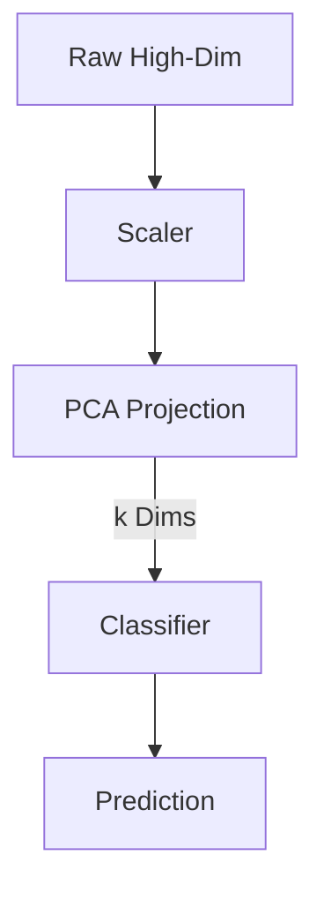

# Unsupervised Learning: Dimensionality Reduction (PCA & Manifolds)

## 📜 Story Mode: The Projection

> **Mission Date**: 2042.10.20
> **Location**: Deep Space Outpost "Vector Prime"
> **Officer**: Lead Engineer Kael
>
> **The Problem**: The Telemetry Sensor sends 10,000 metrics per second.
> Temperature, Pressure, Voltage, Fan Speed, Vibration...
>
> The Dashboard is a mess. I can't look at 10,000 graphs.
>
> However, most of these are redundant.
> When Temperature goes Up, Pressure goes Up. They are correlated.
>
> I suspect the ship's state is actually simple. It's either "Running", "Idle", or "Exploding".
> I need to compress these 10,000 noisy dimensions into just 2 dimensions (X and Y) so I can plot them on a screen.
>
> *"Computer! Run Principal Component Analysis. Find the Axis of Maximum Variance. Project the hyper-cube onto a flat plane."*

---

## 1. Problem Setup & Motivation

### The 6 Engineering Questions
1.  **WHAT**:
    *   **Dimensionality Reduction**: Reducing the number of random variables ($N \to k$) while preserving Information.
    *   **PCA (Principal Component Analysis)**: Linear projection onto the axes of maximum variance.
    *   **t-SNE / UMAP**: Non-linear manifold learning for visualization.
2.  **WHY**:
    *   **Visualization**: We can only see 2D/3D.
    *   **Curse of Dimensionality**: Distance metrics fail in high dims.
    *   **Compression**: Save 99% Memory.
3.  **WHEN**: Before Clustering (to fix distances), Before Regression (to fix multicollinearity).
4.  **WHERE**: `sklearn.decomposition.PCA`.
5.  **WHO**: Statisticians (Pearson, 1901).
6.  **HOW**: Eigendecomposition of the Covariance Matrix.

> [!NOTE]
> **🛑 Pause & Explain (In Simple Words)**
>
> **The Shadow on the Wall.**
>
> - **3D Object**: You hand me a Teapot.
> - **2D Projection**: I shine a flashlight on it. The shadow falls on the wall.
> - **Bad Angle**: If I shine from the top, the shadow looks like a circle. (Lost information about the spout).
> - **Good Angle (PCA)**: I rotate the teapot until the shadow is as "wide" as possible. This preserves the most shape (Variance).

---

## 2. Mathematical Problem Formulation

### Maximizing Variance
We want a vector $u$ (Unit vector) such that the projection of data $X$ onto $u$ has max variance.
$$ \text{Var}(X u) = u^T \Sigma u $$
Subject to $u^T u = 1$.
Using Lagrange Multipliers, the solution is:
$$ \Sigma u = \lambda u $$
**The Principal Components are the Eigenvectors of the Covariance Matrix!**

### Explained Variance Ratio
How much info did we keep?
$$ \text{Ratio} = \frac{\lambda_1 + \dots + \lambda_k}{\sum \lambda_i} $$
Typical Goal: Keep 95% of Variance.

---

## 3. Step-by-Step Derivation

### Computing PCA
1.  **Center the Data**: Subtract Mean ($\mu$).
2.  **Compute Covariance**: $\Sigma = \frac{1}{N} X^T X$.
3.  **Eigenvalues**: Solve $|\Sigma - \lambda I| = 0$.
4.  **Sort**: Order $\lambda_1 > \lambda_2 \dots$.
5.  **Project**: $X_{new} = X \cdot [u_1, \dots, u_k]$.

---

## 4. Algorithm Construction

### Map to Memory (SVD is better)
Computing Covariance $X^T X$ is $O(Features^2)$. If Features=1M, this crashes RAM.
**Solution**: Use **SVD** directly on $X$.
$X = U S V^T$.
The Eigenvectors are the columns of $V$.
SVD is numerically more stable and efficient. Sklearn uses SVD.

### Algorithm: t-SNE (The Non-Linear approach)
PCA fails on the "Swiss Roll" (Data rolled up like a cake).
PCA squashes the roll flat (merging layers).
**t-SNE (t-Distributed Stochastic Neighbor Embedding)**:
1.  Calculate distances in High Dim (Probability $P$).
2.  Place points randomly in 2D.
3.  Calculate distances in Low Dim (Probability $Q$).
4.  Minimize KL Divergence $KL(P||Q)$ using Gradient Descent.
Result: It "unrolls" the paper.

---

## 5. Optimization & Convergence Intuition

### Dimensionality Curse
In D=1000, points are sparse.
Noise accumulates.
PCA removes "Small Eigenvalues" (Noise directions), effectively denoising the dataset.
**Autoencoders**: A Neural Network version of PCA. Non-linear compression.

---

## 6. Worked Examples

### Example 1: Eigenfaces
**Data**: Images of faces (64x64 = 4096 pixels).
**PCA**: Find top 100 components.
**PC1**: "General Face shape".
**PC2**: "Lighting angle".
**PC3**: "Gender features".
We can reconstruct any face using just 100 numbers (Weights of Eigenfaces).

### Example 2: Word Embeddings (PCA visualization)
**Data**: Word2Vec (300 dim).
**PCA to 2D**:
"King" and "Queen" appear close.
"Man" and "Woman" define a direction vector.
Allows we to verify semantic relationships visually.

---

## 7. Production-Grade Code

### PCA Pipeline

```python
import numpy as np
import matplotlib.pyplot as plt
from sklearn.decomposition import PCA
from sklearn.preprocessing import StandardScaler
from sklearn.datasets import load_digits

# 1. Load Data
digits = load_digits()
X = digits.data
y = digits.target

# 2. Scale (CRITICAL for PCA)
scaler = StandardScaler()
X_scaled = scaler.fit_transform(X)

# 3. PCA
pca = PCA(n_components=2) # Compress to 2D
X_pca = pca.fit_transform(X_scaled)

# 4. Plot
plt.figure(figsize=(8,6))
scatter = plt.scatter(X_pca[:, 0], X_pca[:, 1], c=y, cmap='tab10', alpha=0.6)
plt.colorbar(scatter)
plt.xlabel('Principal Component 1')
plt.ylabel('Principal Component 2')
plt.title(f'PCA of Digits (Explained Var: {sum(pca.explained_variance_ratio_):.2f})')
plt.show()
```

> [!TIP]
> **👁️ Visualizing the Geometry: Vectors of Variance**
> Run this script to see the "Shadow on the Wall" effect. Two arrows (Eigenvectors) define the shape of the data.
>
> ```python
> import numpy as np
> import matplotlib.pyplot as plt
> from sklearn.decomposition import PCA
>
> def plot_pca_geometry():
>     # 1. Generate Correlated Data (Elongated Blob)
>     rng = np.random.RandomState(1)
>     X = np.dot(rng.rand(2, 2), rng.randn(2, 200)).T
>     
>     # 2. Fit PCA
>     pca = PCA(n_components=2)
>     pca.fit(X)
>     
>     def draw_vector(v0, v1, ax=None):
>         ax = ax or plt.gca()
>         arrowprops=dict(arrowstyle='->',
>                         linewidth=2,
>                         shrinkA=0, shrinkB=0, color='black')
>         ax.annotate('', xy=v1, xytext=v0, arrowprops=arrowprops)
>
>     # 3. Plot Data and Eigenvectors
>     plt.figure(figsize=(8, 8))
>     plt.scatter(X[:, 0], X[:, 1], alpha=0.2, color='blue', label='Data')
>     
>     for length, vector in zip(pca.explained_variance_, pca.components_):
>         v = vector * 3 * np.sqrt(length)
>         draw_vector(pca.mean_, pca.mean_ + v)
>         
>     plt.axis('equal')
>     plt.title('PCA Geometry: Principal Components (Arrows)\nPC1 (Long) captures max variance.')
>     plt.legend()
>     plt.grid(True, alpha=0.3)
>     plt.show()
>
> # Uncomment to run:
> # plot_pca_geometry()
> ```

> [!CAUTION]
> **🛑 Production Warning**
>
> **Interpretation Loss**:
> After PCA, input features are gone.
> You don't have "Age" and "Salary" anymore.
> You have "PC1" (which is 0.7*Age - 0.2*Salary).
> If business requires "Why did you reject?", PCA makes it hard to answer.

---

## 8. System-Level Integration



**Where it lives**:
**Preprocessing**: Nearly every Computer Vision pipeline before 2012 used PCA (Whitening) to decorate pixels.
**Finance**: Yield Curve decomposition (Level, Slope, Curvature are PC1, PC2, PC3).

---

## 9. Evaluation & Failure Analysis

### Failure Mode: The Outlier Explosion
Since PCA minimizes Squared Error (Variance).
A single outlier (Value = 1,000,000) creates massive variance.
PC1 will align with the Outlier.
**Fix**: RobustPCA (uses L1 Norm).

---

## 10. Ethics, Safety & Risk Analysis

### Erasure of Minorities
PCA keeps the "Majority" Variance.
If a minority group has unique features but distinct from the majority, steps of PCA might treats those features as "Noise" and delete them.
This leads to model collapse on minority groups.

---

## 11. Advanced Theory & Research Depth

### UMAP (Uniform Manifold Approximation and Projection)
The modern successor to t-SNE.
*   Faster (Scales to millions of points).
*   Preserves Global Structure better than t-SNE.
*   Based on Riemannian Geometry and Algebraic Topology.

---

## 12. Career & Mastery Signals

### Interview Pitfall
Q: "Does PCA require standardized data?"
**Bad Answer**: "No, it works anyway."
**Good Answer**: "Yes. PCA seeks lines of maximum variance. If one variable is in 'Meters' (Range 0-1) and another in 'Millimeters' (Range 0-1000), PCA will focus entirely on the millimeters, ignoring the actual signal. Standardization ($Z$-score) makes variance comparable."

---

## 13. Assessment & Mastery Checks

**Q1: Scree Plot**
What is it?
*   *Answer*: A plot of Eigenvalues vs Component Index. Used to find the "Knee" where adding more components adds little info.

**Q2: Lossy vs Lossless**
Is PCA lossless?
*   *Answer*: Only if $k = D$ (Keep all components). If $k < D$, it is Lossy.

---

## 14. Further Reading & Tooling

*   **Lib**: **UMAP-learn** - The state-of-the-art for visualization.
*   **Paper**: *"Visualizing Data using t-SNE"* (Van der Maaten & Hinton).

---

## 15. Concept Graph Integration

*   **Previous**: [Clustering](02_core_ml/03_unsupervised/01_clustering.md).
> *   **Next**: [Random Forests](02_core_ml/04_ensembles/01_random_forest.md) (The Ensemble).
> 
> ### Concept Map
> ```mermaid
> graph LR
>     DimRed[Dim Reduction] --> Linear
>     DimRed --> Manifold[Manifold Learning]
>     
>     Linear --> PCA[PCA]
>     Linear --> SVD[SVD]
>     
>     Manifold --> tSNE[t-SNE]
>     Manifold --> UMAP[UMAP]
>     Manifold --> Isomap[Isomap]
>     
>     PCA -- "Metric" --> Variance[Max Variance]
>     tSNE -- "Metric" --> KL[KL Divergence]
>     
>     PCA -- "Uses" --> Eigen[Eigenvectors]
>     PCA -- "Weakness" --> Linearity[Only Linear]
>     
>     style DimRed fill:#f9f,stroke:#333
>     style PCA fill:#bbf,stroke:#333
>     style tSNE fill:#bfb,stroke:#333
> ```
