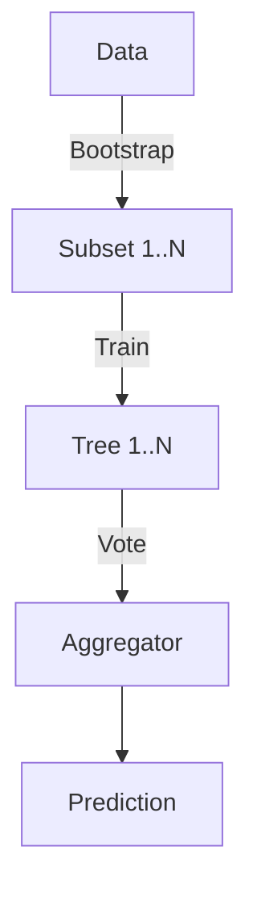

# Ensemble Methods: Random Forests & Bagging

## 📜 Story Mode: The Council

> **Mission Date**: 2042.10.25
> **Location**: Deep Space Outpost "Vector Prime"
> **Officer**: Lead Engineer Kael
>
> **The Problem**: I built a Decision Tree to detect hull breaches.
> It works... sometimes.
> But it's jittery. If the sensor noise shifts by 1%, the whole tree changes structure.
> It has **High Variance**. It "Overfits" the noise.
>
> I don't trust *one* sensor. I trust the consensus.
>
> I will build 100 Trees.
> I will train them on random subsets of the data (Bootstrapping).
> I will force them to look at different features (Random Subspace).
>
> One tree says "Breach". 99 trees say "Safe".
> The Council has spoken. We are Safe.
>
> *"Computer! Initiate Protocol 'Random Forest'. Spawn 100 estimators. Aggregate the votes. Reduce Variance by factor of N."*

---

## 1. Problem Setup & Motivation

### The 6 Engineering Questions
1.  **WHAT**:
    *   **Ensemble**: Combining multiple models to improve performance.
    *   **Bagging (Bootstrap Aggregating)**: Training parallel models on random subsets of data.
    *   **Random Forest**: Bagging applied to Decision Trees + Feature Randomness.
2.  **WHY**:
    *   **Stability**: Decreases Variance (Overfitting).
    *   **Accuracy**: Often beats any single model.
    *   **Parallelism**: Can train on 100 CPUs at once.
3.  **WHEN**: Tabular Data (Excel/SQL). The "Default Option" for most classification tasks.
4.  **WHERE**: `sklearn.ensemble.RandomForestClassifier`.
5.  **WHO**: Breiman (2001).
6.  **HOW**: `clf = RandomForestClassifier(n_estimators=100)`.

> [!NOTE]
> **🛑 Pause & Explain (In Simple Words)**
>
> **The Wisdom of Crowds.**
>
> - **Decision Tree**: An Expert. Smart, but opinionated and prone to bias.
> - **Random Forest**: A Parliament of Experts.
> - We give each expert different books to read (Data Subsets).
> - We ask them to vote.
> - The average vote is almost always better than the single expert's vote.

---

## 2. Mathematical Problem Formulation

### Bias-Variance Decomposition
$$ Error = Bias^2 + Variance + Noise $$
*   **Decision Tree**: Low Bias (can fit anything), High Variance (jittery).
*   **Bagging**: Keeps Bias same (Average of unbiased trees is unbiased), Reduces Variance by $1/N$ (if errors are uncorrelated).

### The Decorrelation Trick
If all trees are identical, averaging them does nothing.
$$ Var(\frac{1}{N} \sum X_i) = \rho \sigma^2 + \frac{1-\rho}{N} \sigma^2 $$
If $\rho=1$ (Identical), Variance stays $\sigma^2$.
If $\rho=0$ (Uncorrelated), Variance drops to $\sigma^2/N$.
**Random Forest Innovation**: At every split, only look at a *random subset* of features (e.g., $\sqrt{F}$).
This de-correlates the trees, lowering $\rho$.

---

## 3. Step-by-Step Derivation

### Bootstrapping (Sampling with Replacement)
Data: $[A, B, C, D]$.
Create 3 Datasets of same size:
1.  $[A, A, B, D]$ (Misses C).
2.  $[B, C, D, D]$ (Misses A).
3.  $[A, B, C, A]$ (Misses D).
**Out-of-Bag (OOB) Error**:
For each point (e.g., C), test it ONLY on trees that *never saw C* (Tree 1).
This gives us a "Free" Validation Set without splitting data!

---

## 4. Algorithm Construction

### Map to Memory (Parallelism)
Trees are independent.
We can send Tree 1 to GPU 0, Tree 2 to GPU 1...
**Training**: $O(N \log N \times \text{Trees})$ (Parallelizable).
**Inference**: $O(\text{Depth} \times \text{Trees})$ (Sequential sum).
Random Forests are slow at inference time compared to Linear Models.

---

## 5. Optimization & Convergence Intuition

### No Overfitting?
Ideally, adding more trees *never* causes overfitting. It only stabilizes the result.
(In reality, if the data is very noisy, it might stabilize on the noise, but usually it's safe to set trees=1000).

---

## 6. Worked Examples

### Example 1: Medical Diagnosis
**Tree 1**: Focuses on Age. Says "Sick".
**Tree 2**: Focuses on Blood Pressure. Says "Healthy".
**Tree 3**: Focuses on Genes. Says "Healthy".
**Majority Vote**: "Healthy".
**Insight**: Maybe Age alone was a misleading feature. The Forest corrected it.

---

## 7. Production-Grade Code

### Random Forest vs Single Tree

```python
from sklearn.ensemble import RandomForestClassifier
from sklearn.tree import DecisionTreeClassifier
from sklearn.datasets import make_moons
from sklearn.model_selection import cross_val_score

# 1. Complex Data
X, y = make_moons(n_samples=500, noise=0.30, random_state=42)

# 2. Single Tree (Overfits)
tree = DecisionTreeClassifier(random_state=42)
acc_tree = cross_val_score(tree, X, y, cv=5).mean()

# 3. Random Forest (Robust)
forest = RandomForestClassifier(n_estimators=100, random_state=42)
acc_forest = cross_val_score(forest, X, y, cv=5).mean()

print(f"Tree Accuracy: {acc_tree:.3f}")   # ~0.85
print(f"Forest Accuracy: {acc_forest:.3f}") # ~0.91 (Better)
```

> [!TIP]
> **👁️ Visualizing the Wisdom: Feature Importance**
> Run this script to see what the Council of Trees thinks matters.
>
> ```python
> import numpy as np
> import matplotlib.pyplot as plt
> from sklearn.ensemble import RandomForestClassifier
> from sklearn.datasets import load_wine
>
> def plot_feature_importance():
>     # 1. Load Data
>     data = load_wine()
>     X, y = data.data, data.target
>     feature_names = data.feature_names
>
>     # 2. Train Forest
>     forest = RandomForestClassifier(n_estimators=100, random_state=42)
>     forest.fit(X, y)
>
>     # 3. Get Importance
>     importances = forest.feature_importances_
>     std = np.std([tree.feature_importances_ for tree in forest.estimators_], axis=0) # Variance across trees
>     indices = np.argsort(importances)[::-1]
>
>     # 4. Plot
>     plt.figure(figsize=(10, 6))
>     plt.title("Feature Importance (The Council's Vote)")
>     plt.bar(range(X.shape[1]), importances[indices],
>             color="r", yerr=std[indices], align="center", alpha=0.7)
>     plt.xticks(range(X.shape[1]), [feature_names[i] for i in indices], rotation=45, ha='right')
>     plt.xlim([-1, X.shape[1]])
>     plt.ylabel('Importance Score')
>     plt.tight_layout()
>     plt.show()
>
> # Uncomment to run:
> # plot_feature_importance()
> ```

> [!CAUTION]
> **🛑 Production Warning**
>
> **Model Size**:
> A Forest with 1000 Deep Trees can be **Gigabytes** in size.
> If deploying to a mobile phone (Android/iOS), this is too big.
> **Fix**: Limit `max_depth` or use Gradient Boosting (which uses smaller trees).

---

## 8. System-Level Integration



**Where it lives**:
**Kinect (Xbox)**: Used Random Forests to track human body parts from depth data (in 2010). Extreme speed requirement required highly optimized Forests.

---

## 9. Evaluation & Failure Analysis

### Feature Importance
Random Forests provide "Feature Importance" for free.
(How much did Feature X reduce Entropy on average?)
**Risk**: It prefers High Cardinality features (like UserID).
**Fix**: Permutation Importance (Shuffle a column and see how much Accuracy drops).

---

## 10. Ethics, Safety & Risk Analysis

### Fairness by Averaging?
Does averaging 100 Biased trees make an Unbiased Forest?
**No**.
If the data is biased, the forest converges to the *Biased* Mean.
It is a "Stable Bias".

---

## 11. Advanced Theory & Research Depth

### Extremely Randomized Trees (ExtraTrees)
Standard RF: Search for *best* split among random features.
ExtraTrees: Pick a split *randomly* for each feature, then choose best.
Faster training, slightly higher bias, lower variance.

---

## 12. Career & Mastery Signals

### Interview Pitfall
Q: "Can Random Forest be trained in parallel?"
**Good Answer**: "Yes, because trees are independent (Bagging)."
Q: "Can Gradient Boosting be trained in parallel?"
**Good Answer**: "No (mostly), because Tree 2 needs the errors of Tree 1. It is sequential."

---

## 13. Assessment & Mastery Checks

**Q1: OOB Score**
What is it?
*   *Answer*: performance metric calculated using the rows left out during bootstrapping. Acts as internal Cross-Validation.

**Q2: Randomness**
Where are the two sources of randomness?
*   *Answer*: 1. Bagging (Data rows). 2. Feature Subsampling (Columns).

---

## 14. Further Reading & Tooling

*   **Paper**: *"Random Forests"* (Lei Breiman, 2001).
*   **Lib**: **cuML** (RAPIDS) - Run Random Forests on GPU (100x faster).

---

## 15. Concept Graph Integration

*   **Previous**: [Dimensionality Reduction](02_core_ml/03_unsupervised/02_pca.md).
> *   **Next**: [Gradient Boosting](02_core_ml/04_ensembles/02_boosting.md) (Sequential Correction).
>
> ### Concept Map
> ```mermaid
> graph TD
>     Ensemble[Ensemble Methods] --> Bagging
>     Ensemble --> Boosting
>     Ensemble --> Stacking
>
>     Bagging --> RF[Random Forest]
>     RF -- "Strategy" --> Parallel[Parallel Trees]
>     RF -- "Randomness" --> Bootstrapping[Row Sampling]
>     RF -- "Randomness" --> Features[Col Sampling]
>
>     RF -- "Result" --> LowVar[Lower Variance]
>     RF -- "Result" --> FeatureImp[Feature Importance]
>
>     style Ensemble fill:#f9f,stroke:#333
>     style RF fill:#bbf,stroke:#333
>     style LowVar fill:#bfb,stroke:#333
> ```
