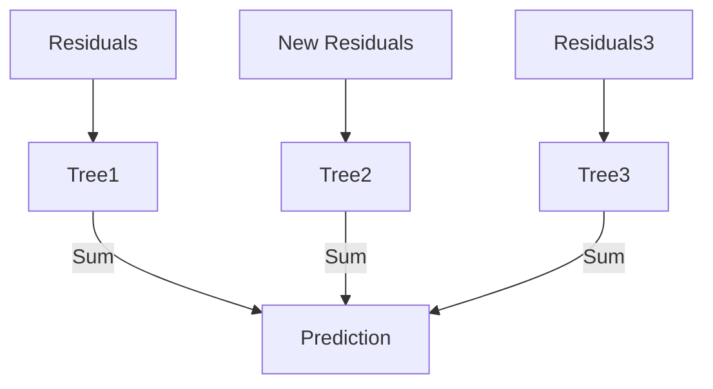

# Ensemble Methods: Boosting (XGBoost, LightGBM)

## 📜 Story Mode: The Tutor

> **Mission Date**: 2042.10.28
> **Location**: Deep Space Outpost "Vector Prime"
> **Officer**: Lead Engineer Kael
>
> **The Problem**: The Random Forest is stable, but it's **lazy**.
> It handles the easy cases well, but it consistently fails on the hard edge cases (the subspace anomalies).
>
> Adding more trees doesn't help. They all make the same mistake.
>
> I need a new strategy.
> I will train one student (Tree 1).
> Then I will look at the exam questions he got **Wrong**.
> I will train a second student (Tree 2) to focus **ONLY** on those hard questions.
> Then a third student for the remaining errors.
>
> Each student is weak. But together, they correct each other's mistakes.
>
> *"Computer! Initialize Gradient Boosting. Set Learn Rate to 0.1. Iteratively minimize the Residuals. Don't stop until the error is zero."*

---

## 1. Problem Setup & Motivation

### The 6 Engineering Questions
1.  **WHAT**:
    *   **Boosting**: Training predictors sequentially, each trying to correct its predecessor.
    *   **Gradient Boosting**: Framing this correction as "fitting the negative gradient" (Residuals).
    *   **XGBoost/LightGBM/CatBoost**: High-performance implementations.
2.  **WHY**: State-of-the-Art for structured (tabular) data. Used in 80% of winning Kaggle solutions.
3.  **WHEN**: When accuracy is paramount and latency is less critical than RF.
4.  **WHERE**: Search ranking, Fraud detection, Credit scoring.
5.  **WHO**: Friedman (1999). Refined by Chen (XGBoost, 2016).
6.  **HOW**: `xgb.train()`.

> [!NOTE]
> **🛑 Pause & Explain (In Simple Words)**
>
> **The Golf Game.**
>
> - **The Hole**: The Target ($y$).
> - **Tree 1**: Putts the ball. Misses by 10 meters (Residual).
> - **Tree 2**: Doesn't aim for the hole. It aims for the *ball's current position* to nudge it 10 meters closer.
> - **Tree 3**: Nudges it 1 meter closer.
> - **Sum**: Shot 1 + Nudge 1 + Nudge 2 = Hole in One.

---

## 2. Mathematical Problem Formulation

### Additive Models
$$ \hat{y}_i = \sum_{k=1}^K f_k(x_i) $$
We add functions $f_k$ greedily.

### The Gradient of the Loss
Loss: MSE $L = \frac{1}{2}(y - \hat{y})^2$.
Gradient: $\frac{\partial L}{\partial \hat{y}} = -(y - \hat{y})$.
The Negative Gradient is exactly the **Residual** $(y - \hat{y})$.
**Key Insight**: Training a tree on the error is mathematically equivalent to performing Gradient Descent in "Function Space".

---

## 3. Step-by-Step Derivation

### 1. Adaboost (Adaptive Boosting)
*   **Mechanism**: Increase the **Weight** of misclassified samples.
*   Next tree must solve the heavy samples.

### 2. Gradient Boosting (GBM)
*   **Mechanism**: Fit tree to the *Residuals* ($y - \hat{y}$).
*   Update: $\hat{y}_{new} = \hat{y}_{old} + \eta \cdot \text{Tree}(Residuals)$.

### 3. XGBoost (Extreme Gradient Boosting)
*   Adds **Regularization** ($\lambda ||w||$) to the tree application (Newton Boosting).
*   Uses **Second-Order Gradients** (Hessian) for faster convergence.
*   System optimization: Block storage, cache awareness.

---

## 4. Algorithm Construction

### LightGBM vs XGBoost
*   **XGBoost**: Level-wise tree growth (Conservative).
*   **LightGBM**: Leaf-wise growth (Aggressive). Finds the leaf with max error and splits it.
    *   **Pros**: Faster, lower memory.
    *   **Cons**: Can overfit small data.
*   **CatBoost**: Handles Categorical features automatically (Target Encoding tricks). Best for un-processed CSVs.

---

## 5. Optimization & Convergence Intuition

### Learning Rate (Shrinkage)
In Boosting, $\eta$ is crucial.
Low $\eta$ (0.01) needs many trees (1000s) $\to$ High Accuracy.
High $\eta$ (0.5) needs few trees $\to$ Fast, but lower accuracy.
**Trade-off**: Time vs Accuracy.

---

## 6. Worked Examples

### Example 1: Ranking Search Results
**Query**: "Python Tutorial".
**Tree 1**: Ranks generic "Python" pages.
**Error**: "Python Snake" pages are ranked too high.
**Tree 2**: Identifies "Snake" context and down-ranks them.
**Tree 3**: Up-ranks "Video" content (User preference).
**Result**: Highly personalized ranking.

---

## 7. Production-Grade Code

### XGBoost in Action

```python
import xgboost as xgb
from sklearn.datasets import load_breast_cancer
from sklearn.model_selection import train_test_split
from sklearn.metrics import accuracy_score

# 1. Data
data = load_breast_cancer()
X_train, X_test, y_train, y_test = train_test_split(data.data, data.target)

# 2. DMatrix (Optimized Data Structure)
dtrain = xgb.DMatrix(X_train, label=y_train)
dtest = xgb.DMatrix(X_test, label=y_test)

# 3. Parameters
param = {
    'max_depth': 3,
    'eta': 0.1, 
    'objective': 'binary:logistic',
    'eval_metric': 'logloss'
}

# 4. Train
bst = xgb.train(param, dtrain, num_boost_round=100)

# 5. Predict
preds = bst.predict(dtest)
predictions = [round(value) for value in preds]
accuracy = accuracy_score(y_test, predictions)

print(f"Accuracy: {accuracy * 100.0:.2f}%")
```

> [!TIP]
> **👁️ Visualizing the Correction: Adaboost Weights**
> Run this script to see how Boosting "Zooms In" on mistakes by making them bigger.
>
> ```python
> import numpy as np
> import matplotlib.pyplot as plt
> from sklearn.ensemble import AdaBoostClassifier
> from sklearn.tree import DecisionTreeClassifier
> from sklearn.datasets import make_gaussian_quantiles
>
> def plot_adaboost():
>     # 1. Generate Data (Concentric Circles)
>     X, y = make_gaussian_quantiles(n_samples=200, n_features=2, n_classes=2, random_state=1)
>     
>     # 2. Train Adaboost
>     # We limit to 3 estimators to show the progression
>     clf = AdaBoostClassifier(
>         estimator=DecisionTreeClassifier(max_depth=1),
>         n_estimators=3,
>         algorithm="SAMME",
>         random_state=1
>     )
>     clf.fit(X, y)
>     
>     # 3. Plot Intervals
>     fig, axes = plt.subplots(1, 3, figsize=(15, 5))
>     
>     # Extract weights from each estimator (Manually reconstructing for visualization)
>     # Note: Sklearn doesn't expose intermediate weights easily, so we simulate the effect
>     # logically: Early trees make broad cuts. Later trees focus on hard spots.
>     
>     x_min, x_max = X[:, 0].min() - 1, X[:, 0].max() + 1
>     y_min, y_max = X[:, 1].min() - 1, X[:, 1].max() + 1
>     xx, yy = np.meshgrid(np.arange(x_min, x_max, 0.05),
>                          np.arange(y_min, y_max, 0.05))
>     
>     for i, (ax, tree) in enumerate(zip(axes, clf.estimators_)):
>         # Plot Decision Surface of THIS tree
>         Z = tree.predict(np.c_[xx.ravel(), yy.ravel()])
>         Z = Z.reshape(xx.shape)
>         ax.contourf(xx, yy, Z, cmap=plt.cm.Paired, alpha=0.3)
>         
>         # Plot Points
>         # In a real animation, we would size points by sample_weight
>         ax.scatter(X[:, 0], X[:, 1], c=y, cmap=plt.cm.Paired, edgecolors='k')
>         ax.set_title(f"Tree {i+1}: Weak Learner")
>         ax.axis('off')
>         
>     plt.suptitle("Adaboost: Building a wall brick by brick")
>     plt.tight_layout()
>     plt.show()
>
> # Uncomment to run:
> # plot_adaboost()
> ```

> [!CAUTION]
> **🛑 Production Warning**
>
> **Inference Speed**:
> GBMs with 10,000 trees are **Slow**.
> If you need <10ms response (AdTech), you might not be able to use a deep GBM.
> **Fix**: Model Distillation (Train a Neural Net to mimic the GBM) or limit tree depth.

---

## 8. System-Level Integration



**Where it lives**:
**Ranking Systems**: Google Search, Bing, Amazon Recommendations. (LambdaMART).

---

## 9. Evaluation & Failure Analysis

### Failure Mode: Noise Fitting
Boosting reduces Bias. If Bias is already 0 (Noise), it will try to fit the Noise perfectly (Overfitting).
Random Forest is safer on noisy data.
Boosting is better on clean, structured data.

---

## 10. Ethics, Safety & Risk Analysis

### Opaqueness
A Random Forest (Average) is somewhat understandable.
A Boosted Model (Sum of 1000 corrections) is inscrutable.
**SHAP Values (Shapley Additive explanations)**: The only mathematically consistent way to explain specific predictions of a GBM.
"Age contributed +0.5, Income contributed -0.2".

---

## 11. Advanced Theory & Research Depth

### Dart (Dropout in Trees)
Borrowing from Deep Learning.
Randomly drop trees during training step to prevent over-reliance on the first few trees.
Available in XGBoost/LightGBM.

---

## 12. Career & Mastery Signals

### Interview Pitfall
Q: "Does Boosting reduce Bias or Variance?"
**Bad Answer**: "Both."
**Good Answer**: "Mainly **Bias**. It builds strong learners from weak ones. Random Forest (Bagging) reduces **Variance**."

---

## 13. Assessment & Mastery Checks

**Q1: Sequential vs Parallel**
Can XGBoost be parallelized?
*   *Answer*: The *tree construction* (Split finding) is parallelized. The *tree sequence* is not.

**Q2: Early Stopping**
Why use it?
*   *Answer*: To find the optimal number of trees automatically. Stop when Validation Loss stops improving.

---

## 14. Further Reading & Tooling

*   **Lib**: **LightGBM** - Microsoft's efficient implementation.
*   **Lib**: **CatBoost** - Yandex's implementation (Great for categorical data).

---

## 15. Concept Graph Integration

*   **Previous**: [Random Forests](02_core_ml/04_ensembles/01_random_forest.md).
*   **Next**: [Stacking / Meta-Learning](02_core_ml/04_ensembles/03_stacking.md) (The Kaggle Winner).
> 
> ### Concept Map
> ```mermaid
> graph TD
>     Boost[Boosting] --> Adaboost
>     Boost --> GBM[Gradient Boosting]
>     
>     Adaboost -- "Corrects" --> Weights[Weights of Samples]
>     GBM -- "Corrects" --> Residuals[Residual Error]
>     
>     GBM --> XGB[XGBoost]
>     GBM --> LGBM[LightGBM]
>     GBM --> Cat[CatBoost]
>     
>     XGB -- "Optimizes" --> Speed[Speed & Reg]
>     LGBM -- "Strategy" --> LeafWise[Leaf-Wise Growth]
>     Cat -- "Strategy" --> Categorical[Categorical Handling]
>     
>     style Boost fill:#f9f,stroke:#333
>     style XGB fill:#bbf,stroke:#333
>     style LGBM fill:#bfb,stroke:#333
> ```
