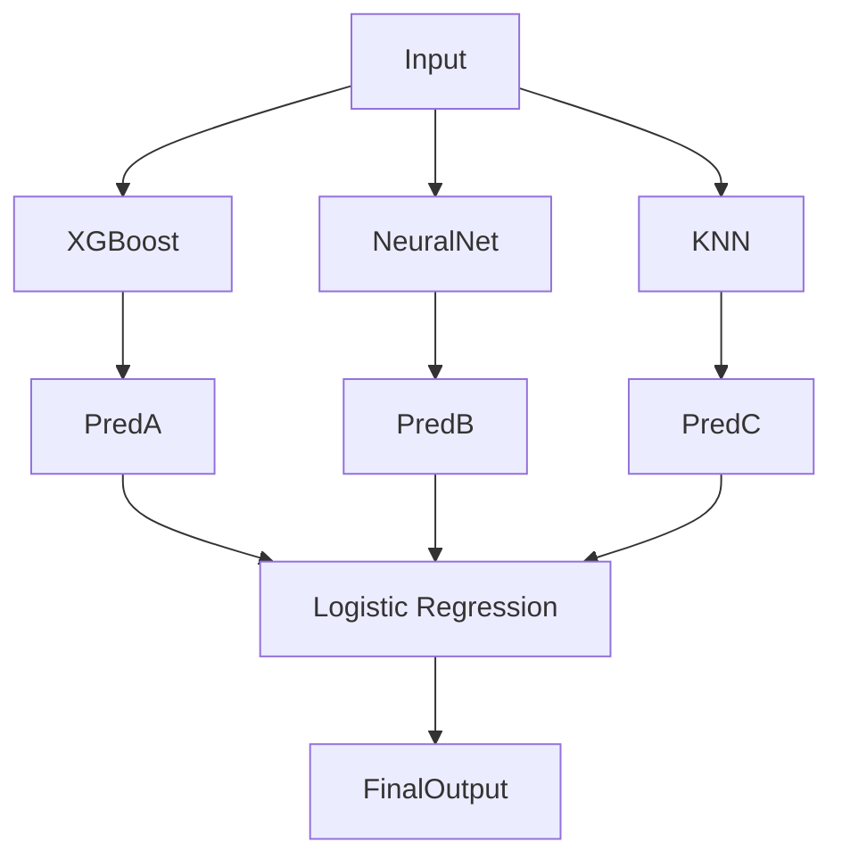

# Ensemble Methods: Stacking & Meta-Learning

## 📜 Story Mode: The Hierarchy

> **Mission Date**: 2042.11.01
> **Location**: Deep Space Outpost "Vector Prime"
> **Officer**: Lead Engineer Kael
>
> **The Problem**: We are predicting Solar Flares.
> The **XGBoost** model is great at historical trends. (88% acc).
> The **CNN** (Neural Net) is great at analyzing the Sun's image. (87% acc).
> The **Scientist** (Linear Regression) is great at physics rules. (70% acc).
>
> They interpret the data differently. They make *different* mistakes.
>
> I shouldn't just average them.
> I need a **Manager**.
>
> I will train a new model (The Meta-Learner).
> Input: [XGBoost Prediction, CNN Prediction, Scientist Prediction].
> Output: Truth.
>
> The Meta-Learner learns: "Trust the CNN when sunspots are visible. Trust XGBoost during the solar minimum."
>
> *"Computer! Stack the models. Level 0: XGB, CNN, LR. Level 1: Logistic Regression. Ensemble the Ensembles."*

---

## 1. Problem Setup & Motivation

### The 6 Engineering Questions
1.  **WHAT**:
    *   **Stacking (Stacked Generalization)**: Training a "Meta-Model" to combine predictions from "Base Models".
    *   **Blending**: A simpler version of Stacking using hold-out sets (no Cross-Validation).
2.  **WHY**: To squeeze the last 1% of accuracy. Standard practice in winning Kaggle competitions (Top 1%).
3.  **WHEN**: When High Accuracy > Complexity/Latency.
4.  **WHERE**: Finance (Hedge Funds), High-Stakes medical diagnostics.
5.  **WHO**: Wolpert (1992).
6.  **HOW**: `sklearn.ensemble.StackingClassifier`.

> [!NOTE]
> **🛑 Pause & Explain (In Simple Words)**
>
> **The Team of Specialists.**
>
> - **Base Models**: The Eye Doctor, The Heart Doctor, The Bone Doctor.
> - **Meta Model**: The Head Diagnostician (House M.D.).
> - He doesn't look at the patient directly. He looks at the reports from the specialists and makes the final call. He knows the Eye Doctor is usually overly pessimistic, so he adjusts for that.

---

## 2. Mathematical Problem Formulation

### Level 0 (Base Learners)
Input $X$. Output predictions $P_1, P_2, \dots, P_k$.
Models: $M_1(X), \dots, M_k(X)$.

### Level 1 (Meta Learner)
Input: Vector $[P_1, P_2, \dots, P_k]$.
Output: $y$.
Model: $M_{meta}([M_1(X), \dots, M_k(X)])$.
Usually, the Meta-Learner is simple (Linear Regression or Shallow Tree) to avoid overfitting the predictions.

---

## 3. Step-by-Step Derivation

### The Leakage Problem
If we train Base Models on $X_{train}$ and predict on $X_{train}$.
Then train Meta Model on those predictions.
**Disaster**: The Base Models have *memorized* $X_{train}$. Their predictions are artificially perfect. The Meta Model learns: "Just trust Model A".
On Test data, Model A acts normally, and the Meta Model crashes.

### The Cross-Validation Fix
1.  Split Train into 5 Folds.
2.  Train Base Model on 4 Folds. Predict on 5th (Hold-out).
3.  Repeat for all folds.
4.  Now we have "Out-of-Sample" predictions for the entire Train set.
5.  Train Meta Model on these Clean Predictions.

---

## 4. Algorithm Construction

### Map to Memory (The Cost)
Stacking is expensive.
Training Time = $\sum \text{BaseTimes} + \text{MetaTime}$.
Inference Time = $\sum \text{BaseTimes} + \text{MetaTime}$.
You must run ALL base models to get a single prediction.
**Latency**: Not suitable for ultra-low latency real-time apps.

---

## 5. Optimization & Convergence Intuition

### Diversity is Key
Stacking 5 XGBoost models with slightly different parameters is useless. (They make same errors).
Winning Formula:
1.  **Gradient Boosting** (Structured patterns).
2.  **Neural Network** (Unstructured/Smooth patterns).
3.  **KNN** (Local patterns).
4.  **Linear Model** (Global trend).
Maximal Diversity = Maximal Gain.

---

## 6. Worked Examples

### Example 1: The Netflix Prize
The winning solution (BellKor's Pragmatic Chaos) was a blend of hundreds of models.
SVD, RBMs, KNNs, Time-decay models.
Combined using Gradient Boosted Decision Trees.
Improvement: 10.06% over baseline.

---

## 7. Production-Grade Code

### Stacking in Scikit-Learn

```python
from sklearn.ensemble import StackingClassifier, RandomForestClassifier
from sklearn.linear_model import LogisticRegression
from sklearn.neighbors import KNeighborsClassifier
from sklearn.svm import SVC
from sklearn.datasets import load_iris
from sklearn.model_selection import train_test_split

# 1. Data
X, y = load_iris(return_X_y=True)
X_train, X_test, y_train, y_test = train_test_split(X, y)

# 2. Define Base Learners (Diverse)
estimators = [
    ('rf', RandomForestClassifier(n_estimators=10)),
    ('svr', SVC(probability=True)), # Must output probabilities
    ('knn', KNeighborsClassifier(n_neighbors=5))
]

# 3. Define Meta Learner
clf = StackingClassifier(
    estimators=estimators,
    final_estimator=LogisticRegression()
)

# 4. Train
clf.fit(X_train, y_train)

# 5. Score
print(f"Accuracy: {clf.score(X_test, y_test):.3f}")
```

> [!TIP]
> **👁️ Visualizing Diversity: Why Stacking Works**
> Run this script to check if your models are "Different Enough". If they lie on the diagonal, Stacking won't help.
>
> ```python
> import numpy as np
> import matplotlib.pyplot as plt
> 
> def plot_model_correlation():
>     # 1. Simulate Predictions
>     np.random.seed(42)
>     y_true = np.random.rand(100) # True values
>     
>     # Model A: Good but noisy
>     pred_a = y_true + np.random.normal(0, 0.05, 100)
>     
>     # Model B: Correlated with A (Stacking useless here)
>     pred_b_corr = pred_a + np.random.normal(0, 0.01, 100)
>     
>     # Model C: Divergent (e.g., Random Forest vs Neural Net)
>     # It makes DIFFERENT mistakes (e.g., systematically higher)
>     pred_c_div = y_true + np.random.normal(0.05, 0.05, 100) 
>     
>     # 2. Plot Correlations
>     fig, axes = plt.subplots(1, 2, figsize=(12, 5))
>     
>     # Correlated Plot
>     axes[0].scatter(pred_a, pred_b_corr, color='red', alpha=0.5)
>     axes[0].plot([0, 1], [0, 1], 'k--')
>     axes[0].set_title("High Correlation (Bad for Stacking)\nModels make same mistakes")
>     axes[0].set_xlabel("Model A Prediction")
>     axes[0].set_ylabel("Model B Prediction")
>     
>     # Divergent Plot
>     axes[1].scatter(pred_a, pred_c_div, color='green', alpha=0.5)
>     axes[1].plot([0, 1], [0, 1], 'k--')
>     axes[1].set_title("Low Correlation (Good for Stacking)\nModels disagree -> Meta-Learner wins")
>     axes[1].set_xlabel("Model A Prediction")
>     axes[1].set_ylabel("Model C Prediction")
>     
>     plt.show()
>
> # Uncomment to run:
> # plot_model_correlation()
> ```

> [!CAUTION]
> **🛑 Production Warning**
>
> **Maintenance Hell**:
> A Stacked model depends on 3+ sub-models.
> If *any* library upgrades (RandomForest changes default param), the whole stack might drift.
> Debugging a stack is a nightmare. "Why is potential fraud flagged?" -> "Because Model 3 said 0.6 and Model 1 said 0.4...".
> **Rule**: Keep production models simple unless the ROI is massive.

---

## 8. System-Level Integration



**Where it lives**:
**Kaggle**: Every competition leaderboard top 10 is Stacking.
**AutoML (H2O, AutoGluon)**: These tools automatically stack models for you.

---

## 9. Evaluation & Failure Analysis

### Failure Mode: Overfitting Level 1
The Meta-Learner has very few data points (Predictions) and matches them to Labels.
It is extremely easy to overfit.
**Fix**: Keep Meta-Learner extremely simple (Linear/Logistic) or highly regularized.

---

## 10. Ethics, Safety & Risk Analysis

### The "Black Box" Squared
If Neural Nets are Black Boxes.
Stacking is a "Black Box of Black Boxes".
Explainability is virtually zero.
It should not be used for Life/Death decisions (Sentencing, Healthcare) unless coupled with rigorous independent validation.

---

## 11. Advanced Theory & Research Depth

### Feature Weighted Linear Stacking
Instead of a single weight for Model A.
$$ y = w(x) \cdot M_A(x) + (1-w(x)) \cdot M_B(x) $$
The weight itself is a function of input $x$.
"If IsImage, trust CNN. If IsTable, trust XGBoost".

---

## 12. Career & Mastery Signals

### Interview Pitfall
Q: "When does Stacking fail?"
**Bad Answer**: "When models are weak."
**Good Answer**: "When models are **Correlated**. If all base models make the same errors, the meta-learner cannot fix them. Stacking requires uncorrelated errors."

---

## 13. Assessment & Mastery Checks

**Q1: Blending vs Stacking**
Difference?
*   *Answer*: Blending uses a simple Hold-Out set (wasteful of data). Stacking uses Cross-Validation predictions (uses all data).

**Q2: Level 2 Stacking**
Can you stack the stack?
*   *Answer*: Yes. (7-layer stacks exist). But returns diminish rapidly and complexity explodes.

---

## 14. Further Reading & Tooling

*   **Lib**: **ML-Ensemble (mlens)** - Advanced stacking library.
*   **Article**: *"Kaggle Ensembling Guide"* (MLWave).

---

## 15. Concept Graph Integration

*   **Previous**: [Boosting](02_core_ml/04_ensembles/02_boosting.md).
> *   **Next**: [Anomaly Detection](02_core_ml/05_advanced/01_anomaly.md) (Finding the weird ones).
> 
> ### Concept Map
> ```mermaid
> graph TD
>     Stacking --> Level0[Level 0: Base Models]
>     Stacking --> Level1[Level 1: Meta Model]
>     
>     Level0 --> KNN
>     Level0 --> SVM
>     Level0 --> RF[Random Forest]
>     
>     KNN -- "Preds" --> FeatureMatrix[New X Matrix]
>     SVM -- "Preds" --> FeatureMatrix
>     RF -- "Preds" --> FeatureMatrix
>     
>     FeatureMatrix --> Level1
>     Level1 --> FinalPred
>     
>     Stacking -- "Requires" --> CV[Cross-Validation]
>     CV -- "Prevents" --> Leakage[Data Leakage]
>     
>     Stacking -- "Works if" --> Diversity[Uncorrelated Errors]
>     
>     style Stacking fill:#f9f,stroke:#333
>     style Level1 fill:#bbf,stroke:#333
>     style Leakage fill:#faa,stroke:#333
> ```
