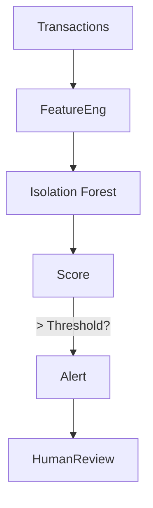
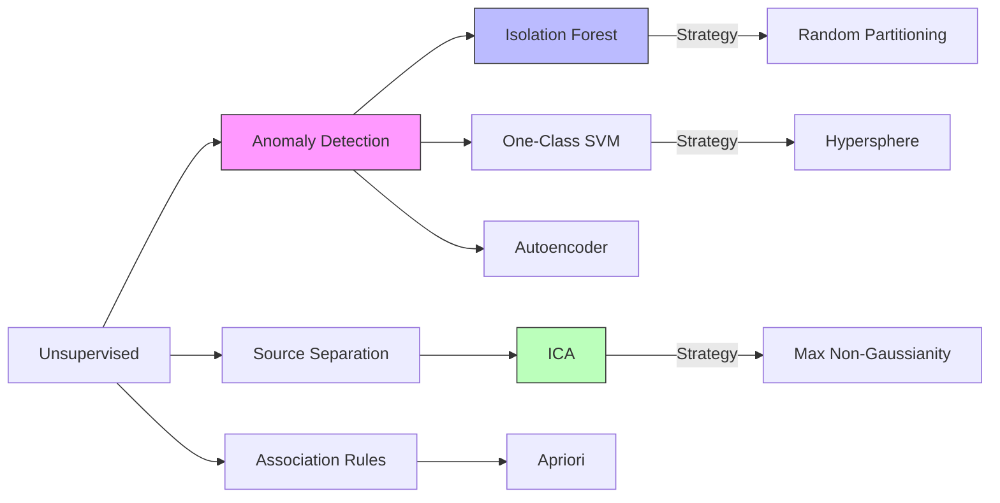

# Advanced Core ML: Anomaly Detection & Unsupervised Extras

## 📜 Story Mode: The Glitch

> **Mission Date**: 2042.11.05
> **Location**: Deep Space Outpost "Vector Prime"
> **Officer**: Lead Engineer Kael
>
> **The Problem**: The ship's Hyperdrive is humming.
> 99.9% of the telemetry is "Normal".
> But sometimes, there is a weird vibration *underneath* the hum.
>
> If I train a Classifier (Normal vs Broken), it fails.
> Because I have 0 examples of "Broken". I don't know what broken looks like until we explode.
>
> I need **Anomaly Detection**. I need a system that learns "Normal" and screams when it sees "Not Normal".
>
> Also, the vibration is mixed with the engine noise. Two signals, one microphone.
> I need **ICA (Independent Component Analysis)** to un-mix the sounds.
>
> *"Computer! Train Isolation Forest on the logs. Run ICA on the audio stream. Isolate the Glitch."*

---

## 1. Problem Setup & Motivation

### The 6 Engineering Questions
1.  **WHAT**:
    *   **Anomaly Detection**: Identifying rare events different from the majority.
    *   **ICA (Independent Component Analysis)**: Separating a multivariate signal into additive subcomponents.
    *   **Association Rules**: Finding "If A, Then B" patterns (Market Basket Analysis).
2.  **WHY**:
    *   **Anomaly**: Fraud detection, Intrusion detection.
    *   **ICA**: Audio processing (Cocktail Party Problem), EEG signal analysis.
    *   **Association**: Recommender systems ("People who bought Diapers also bought Beer").
3.  **WHEN**: When you lack labels for the "Bad" class, or need to un-mix signals.
4.  **WHERE**: `sklearn.ensemble.IsolationForest`, `sklearn.decomposition.FastICA`, `mlxtend.frequent_patterns`.
5.  **WHO**: Fraud analysts, Audio engineers.
6.  **HOW**: Learning the density of the "Normal" class.

> [!NOTE]
> **🛑 Pause & Explain (In Simple Words)**
>
> **The Cocktail Party Problem.**
>
> - **Scenario**: You are at a party. Two people are talking at once. You record them with two microphones.
> - **PCA**: Finds the loudest voice.
> - **ICA**: Separates the voices into two distinct audio tracks. It assumes the voices are statistically independent (Non-Gaussian).

---

## 2. Mathematical Problem Formulation

### Isolation Forest
Most algorithms try to profile "Normal".
Isolation Forest tries to isolate "Abnormal".
*   Randomly select a feature.
*   Randomly select a split value.
*   Anomalies are "few and different", so they are isolated very quickly (Short path length in the tree).
*   Normal points are crowded, so they require many cuts to isolate (Deep path length).
Score $s(x) = 2^{- E(h(x)) / c(n)}$. High score = Anomaly.

### Association Rules (Apriori)
*   **Support**: How often does $A$ appear? $P(A)$.
*   **Confidence**: If $A$, how often $B$? $P(B|A)$.
*   **Lift**: Is $A$ actually helpful in predicting $B$? $P(B|A) / P(B)$.
    *   Lift = 1: Independent (Useless).
    *   Lift > 1: Associated.

---

## 3. Step-by-Step Derivation

### ICA: Maximizing Non-Gaussianity
Central Limit Theorem: Sum of independent variables tends to be Gaussian.
Therefore, the *mixed* signal is more Gaussian than the *source* signals.
ICA reverses this: It finds a projection matrix $W$ that makes the signals **Least Gaussian** (Max Kurtosis or Negentropy).

---

## 4. Algorithm Construction

### Map to Memory (Apriori Explosion)
Counting item pairs is expensive.
Items: 10,000. Pairs: 50 Million.
**Apriori Principle**: If an itemset is frequent, then all of its subsets must be frequent.
If "Beer" is rare, then "Beer + Diapers" is definitely rare. We don't need to count it.
This prunes the search space exponentially.

---

## 5. Optimization & Convergence Intuition

### One-Class SVM
Alternative to Isolation Forest.
Uses the Kernel trick to draw a tight hypersphere around the "Normal" data.
Anything outside the sphere is an anomaly.
**Pro**: Works well for complex boundaries.
**Con**: Slow ($O(N^2)$). Isolation Forest is $O(N)$.

---

## 6. Worked Examples

### Example 1: Credit Card Fraud
**Data**: 284,807 transactions. 492 Frauds (0.17%).
**Method**: Isolation Forest.
**Result**: It flags the top 1% most "weird" transactions. Captures 80% of frauds.
**Why not Classifiers?**: Because fraudsters change tactics. Anomaly detection catches *new* tactics.

### Example 2: Market Basket
**Data**: Supermarket receipts.
**Rule**: `{Bread, Milk} -> {Eggs}`. (Confidence 0.8).
**Action**: Put Eggs next to Bread/Milk? No. Put them far away to force the customer to walk through the store (Impulse buys).

---

## 7. Production-Grade Code

### Isolation Forest and ICA

```python
import numpy as np
from sklearn.ensemble import IsolationForest
from sklearn.decomposition import FastICA
import matplotlib.pyplot as plt

# --- 1. Anomaly Detection ---
# Generate data: 100 normal, 20 outliers
X = 0.3 * np.random.randn(100, 2)
X_outliers = np.random.uniform(low=-4, high=4, size=(20, 2))
X_train = np.r_[X, X_outliers]

# Train
clf = IsolationForest(contamination=0.1)
y_pred = clf.fit_predict(X_train) # 1 = Normal, -1 = Anomaly

print(f"Detected {list(y_pred).count(-1)} Anomalies")

# --- 2. ICA (Blind Source Separation) ---
# Generate sources
time = np.linspace(0, 8, 8000)
s1 = np.sin(2 * time)  # Signal
s2 = np.sign(np.sin(3 * time))  # Square wave
S = np.c_[s1, s2]

# Mix data
A = np.array([[1, 1], [0.5, 2]])  # Mixing matrix
X = np.dot(S, A.T)  # Observed signal

# Unmix
ica = FastICA(n_components=2)
S_ = ica.fit_transform(X)  # Reconstructed sources

# Verify Shape
print(f"Original Shape: {S.shape}, Recovered Shape: {S_.shape}")
```

> [!TIP]
> **👁️ Visualizing the Outliers**
> Run this script to see how Isolation Forest draws a circle around the "Normal" data.
>
> ```python
> import numpy as np
> import matplotlib.pyplot as plt
> from sklearn.ensemble import IsolationForest
>
> def plot_anomaly_detection():
>     # 1. Generate Data (Cluster + Outliers)
>     rng = np.random.RandomState(42)
>     X = 0.3 * rng.randn(100, 2)
>     X_train = np.r_[X + 2, X - 2] # Two blobs
>     X_outliers = rng.uniform(low=-4, high=4, size=(20, 2))
>     
>     # 2. Fit Model
>     clf = IsolationForest(contamination=0.1, random_state=42)
>     clf.fit(X_train)
>     y_pred_train = clf.predict(X_train)
>     y_pred_outliers = clf.predict(X_outliers)
>     
>     # 3. Plot
>     plt.figure(figsize=(8, 6))
>     
>     # Plot Contour
>     xx, yy = np.meshgrid(np.linspace(-5, 5, 50), np.linspace(-5, 5, 50))
>     Z = clf.decision_function(np.c_[xx.ravel(), yy.ravel()])
>     Z = Z.reshape(xx.shape)
>     plt.contourf(xx, yy, Z, cmap=plt.cm.Blues_r, alpha=0.4)
>     
>     # Plot Points
>     b1 = plt.scatter(X_train[:, 0], X_train[:, 1], c='white', s=20, edgecolor='k')
>     b2 = plt.scatter(X_outliers[:, 0], X_outliers[:, 1], c='red', s=20, edgecolor='k')
>     
>     plt.title("Isolation Forest Anomaly Detection")
>     plt.legend([b1, b2], ["Normal", "Anomaly"])
>     plt.axis('tight')
>     plt.show()
>
> # Uncomment to run:
> # plot_anomaly_detection()
> ```

> [!CAUTION]
> **🛑 Production Warning**
>
> **Contamination Parameter**:
> Isolation Forest needs you to guess `contamination` (e.g. 0.01).
> If you guess wrong, you either miss fraud or block legitimate users.
> **Fix**: Monitor the "False Positive Rate" in production and adjust `contamination` dynamically.

---

## 8. System-Level Integration



**Where it lives**:
**Cybersecurity (SIEM)**: Splunk/Datadog use anomaly detection to spot weird API calls or massive data exfiltration.

---

## 9. Evaluation & Failure Analysis

### Failure Mode: The Curse of Irrelevance
In high dimensions, *every* point is far from every other point.
Isolation Forest loses effectiveness.
**Fix**: Use an Autoencoder (Neural Net). Train it to compress/decompress "Normal" data.
If Reconstruction Error is high $\to$ Anomaly.

---

## 10. Ethics, Safety & Risk Analysis

### Anomaly = Minority?
If you train on "Average behavior", then "Cultural Differences" look like anomalies.
An Anomaly Detector might flag a user who tips unusually high, or buys obscure ingredients.
**Risk**: Automated account bans based on "Weirdness" can discriminate against non-standard users.

---

## 11. Advanced Theory & Research Depth

### Local Outlier Factor (LOF)
Looks at the *density* of neighbors.
A point is an outlier if its density is much lower than its neighbors' density.
Better for clusters of different densities than K-Means or Isolation Forest.

---

## 12. Career & Mastery Signals

### Interview Pitfall
Q: "How do you evaluate Anomaly Detection without labels?"
**Bad Answer**: "You can't."
**Good Answer**: "It's hard. But you can use qualitative checks (show top 50 anomalies to an expert), or inject synthetic anomalies (perturb normal data) and measure recall on those."

---

## 13. Assessment & Mastery Checks

**Q1: ICA vs PCA**
Main difference?
*   *Answer*: PCA assumes Gaussian data/orthogonal axes (Correlations). ICA assumes Non-Gaussian data/independent axes (Independence).

**Q2: Lift**
If Lift(A->B) = 1.0, what does it mean?
*   *Answer*: A and B are independent. Buying A doesn't change probability of Buying B.

---

## 14. Further Reading & Tooling

*   **Lib**: **PyOD** (Python Outlier Detection) - Comprehensive toolkit.
*   **Concept**: **Autoencoder-based Anomaly Detection**.

---

## 15. Concept Graph Integration

*   **Previous**: [Stacking](02_core_ml/04_ensembles/03_stacking.md).
*   **Next**: [Statistical Learning Theory](02_core_ml/05_advanced/02_theory.md) (The Why).

### Concept Map

