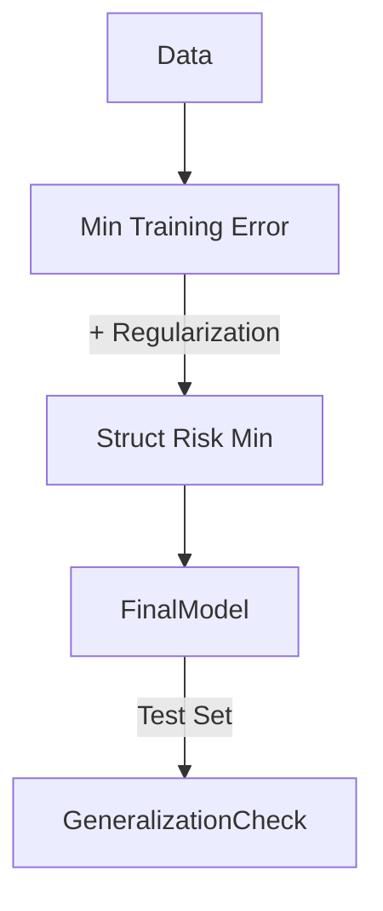

# Advanced Core ML: Statistical Learning Theory

## 📜 Story Mode: The Bound

> **Mission Date**: 2042.11.10
> **Location**: Deep Space Outpost "Vector Prime"
> **Officer**: Science Officer Kael
>
> **The Problem**: The General demands a guarantee.
> "You trained the Shield AI on 1 million simulations. It works 99% of the time."
> "But will it work on the *Real* battlefield? What is the guarantee?"
>
> I can't just say "It works on the test set."
> I need a Mathematical Proof.
> I need to prove that the gap between "Training Error" and "True Error" is bounded.
>
> I need to calculate the **Capacity** of the model.
> If the model is too simple, it fails (Bias).
> If it's too complex (infinite memory), it memorizes the Sims and fails reality (Variance).
>
> *"Computer! Calculate the Vapnik-Chervonenkis Dimension of the Neural Net. Compute the Generalization Bound. What is the worst-case error probability?"*

---

## 1. Problem Setup & Motivation

### The 6 Engineering Questions
1.  **WHAT**:
    *   **Statistical Learning Theory**: The mathematical framework for ML.
    *   **ERM (Empirical Risk Minimization)**: Minimizing error on training data.
    *   **VC Dimension**: A measure of a model's complexity (capacity).
2.  **WHY**: To understand *why* models generalize to unseen data. To avoid Overfitting theoretically.
3.  **WHEN**: Research papers, Safety-Current systems, Debugging overfitting.
4.  **WHERE**: Academia, High-Assurance AI.
5.  **WHO**: Vapnik & Chervonenkis (1960s).
6.  **HOW**: `Complexity = Parameters / Data`.

> [!NOTE]
> **🛑 Pause & Explain (In Simple Words)**
>
> **The Student and the Exams.**
>
> - **Training**: Homework.
> - **Test**: Final Exam.
> - **ERM**: Doing homework until you get 100%.
> - **Generalization**: Will you pass the Exam?
> - If you memorized the answers (High VC Dimension), you fail the Exam.
> - If you understood the concepts (Appropriate VC Dim), you pass.
> - Theory tells us: "If you do N homework problems and your Brain Size is K, your Exam score will be at least X."

---

## 2. Mathematical Problem Formulation

### Risk
1.  **True Risk ($R$)**: Error on the entire universe of data. (Unknowable).
2.  **Empirical Risk ($R_{emp}$)**: Error on the training set. (Knowable).
3.  **Generalization Gap**: $|R - R_{emp}|$.

### Vapnik-Chervonenkis (VC) Inequality
With probability $1-\delta$:
$$ R(h) \le R_{emp}(h) + \sqrt{\frac{h_{VC}(\log(2N/h_{VC}) + 1) + \log(4/\delta)}{N}} $$
*   $N$: Number of Data Points.
*   $h_{VC}$: VC Dimension (Complexity of Model).
*   **Insight**: To minimize True Risk, you must minimize Training Error AND Model Complexity (Structural Risk Minimization).

---

## 3. Step-by-Step Derivation

### What is VC Dimension?
It is the size of the largest set of points that the model can **Shatter**.
*   **Shatter**: Can the model classify the points correctly for *every possible labeling* (2^N labelings)?
*   **Example (2D Linear Classifier)**:
    *   3 points? Yes. (Can separate any triangle configuration).
    *   4 points? No. (XOR config is impossible for a line).
    *   So $VC_{dim}$(Line) = 3.

---

## 4. Algorithm Construction

### Map to Memory (The Parameter Count Myth)
Often, Parameter Count $\approx$ VC Dimension.
But not always.
Sine Wave: $y = \sin(\alpha x)$.
1 Parameter ($\alpha$).
But it has **Infinite** VC Dimension (It can shatter infinite points by oscillating fast enough).
This is why simple models can sometimes overfit!

---

## 5. Optimization & Convergence Intuition

### Structural Risk Minimization (SRM)
Instead of just minimizing Loss (ERM):
$$ \text{Minimize } Loss + \lambda \cdot Complexity $$
This is the theoretical justification for **Regularization** ($L1/L2$).
We are penalizing the VC Dimension.

---

## 6. Worked Examples

### Example 1: The Polynomial
**Model**: $y = w_0 + w_1 x + \dots + w_d x^d$.
**VC Dim**: $d+1$.
If $N=10$ data points.
Risk Bound roughly $\sqrt{(d+1)/10}$.
If $d=9$ (9th degree poly), Bound is huge ($\sim 1$). Error is unpredictable.
If $d=1$ (Line), Bound is small. Error is predictable.

---

## 7. Production-Grade Code

### Visualizing Bias-Variance

```python
import numpy as np
import matplotlib.pyplot as plt
from sklearn.pipeline import Pipeline
from sklearn.preprocessing import PolynomialFeatures
from sklearn.linear_model import LinearRegression
from sklearn.model_selection import cross_val_score

def true_fun(X):
    return np.cos(1.5 * np.pi * X)

np.random.seed(0)
n_samples = 30
X = np.sort(np.random.rand(n_samples))
y = true_fun(X) + np.random.randn(n_samples) * 0.1

degrees = [1, 4, 15]

plt.figure(figsize=(14, 5))
for i, degree in enumerate(degrees):
    ax = plt.subplot(1, 3, i + 1)
    
    polynomial_features = PolynomialFeatures(degree=degree, include_bias=False)
    linear_regression = LinearRegression()
    pipeline = Pipeline([("pf", polynomial_features), ("lr", linear_regression)])
    pipeline.fit(X[:, np.newaxis], y)

    # Evaluate
    scores = cross_val_score(pipeline, X[:, np.newaxis], y, scoring="neg_mean_squared_error", cv=10)
    
    X_test = np.linspace(0, 1, 100)
    plt.plot(X_test, pipeline.predict(X_test[:, np.newaxis]), label="Model")
    plt.plot(X_test, true_fun(X_test), label="True function")
    plt.scatter(X, y, edgecolor='b', s=20, label="Samples")
    plt.title(f"Degree {degree}\nMSE = {-scores.mean():.2e}")
    plt.legend(loc="best")

plt.show()
```

> [!TIP]
> **👁️ Visualizing the Tradeoff: The U-Curve**
> Run this script to generate the Holy Grail of ML Theory: The Bias-Variance Decomposition.
>
> ```python
> import numpy as np
> import matplotlib.pyplot as plt
>
> def plot_bias_variance_tradeoff():
>     # Complexity (e.g., Polynomial Degree)
>     complexity = np.linspace(1, 10, 100)
>     
>     # Theoretical Curves
>     bias_sq = (10 - complexity)**2 / 20  # Bias decreases
>     variance = np.exp(0.5 * complexity) / 10 # Variance increases exponentially
>     irreducible_error = np.ones_like(complexity) * 2
>     
>     total_error = bias_sq + variance + irreducible_error
>     
>     # Plot
>     plt.figure(figsize=(8, 6))
>     plt.plot(complexity, bias_sq, label='Bias^2 (Underfitting)', color='blue', linestyle='--')
>     plt.plot(complexity, variance, label='Variance (Overfitting)', color='red', linestyle='--')
>     plt.plot(complexity, irreducible_error, label='Noise (Bayes Error)', color='gray', linestyle=':')
>     plt.plot(complexity, total_error, label='Total Error', color='green', linewidth=3)
>     
>     plt.xlabel('Model Complexity')
>     plt.ylabel('Error')
>     plt.title('The Bias-Variance Tradeoff')
>     plt.legend()
>     plt.ylim(0, 15)
>     plt.grid(True, alpha=0.3)
>     
>     # Annotate Optimal Point
>     optimal_idx = np.argmin(total_error)
>     plt.annotate('Sweet Spot', 
>                  xy=(complexity[optimal_idx], total_error[optimal_idx]), 
>                  xytext=(complexity[optimal_idx], total_error[optimal_idx]+5),
>                  arrowprops=dict(facecolor='black', shrink=0.05))
>     
>     plt.show()
>
> # Uncomment to run:
> # plot_bias_variance_tradeoff()
> ```

> [!CAUTION]
> **🛑 Production Warning**
>
> **Deep Learning Paradox**:
> Modern Neural Nets have $Parameters >> Data$.
> Theory says they should fail (Infinite Variance).
> But they work.
> **Double Descent**: Risk goes down, then up (Overfitting), then DOWN again (Interpolation regime).
> Standard Statistical Learning Theory is currently being rewritten to explain this.

---

## 8. System-Level Integration



**Where it lives**:
**Safety-Critical AI (Self-Driving)**: We need theoretical bounds on error. Pure Deep Learning is often rejected because we can't prove the bound.

---

## 9. Evaluation & Failure Analysis

### Failure Mode: Data Leakage
Theory assumes Training Data and Test Data are **I.I.D.** (Independent and Identically Distributed).
In Real Life, distribution shifts (Time Series).
If `Distribution(Train) != Distribution(Test)`, all bounds are void.
**Fix**: Drift Detection.

---

## 10. Ethics, Safety & Risk Analysis

### The Right to Explanation
Complex models (High VC) are harder to explain.
Simpler models (Low VC) are interpretable but biased.
**Trade-off**: Do you want a fair, simple judge? Or a brilliant, mysterious judge?

---

## 11. Advanced Theory & Research Depth

### PAC Learning (Probably Approximately Correct)
Valiant (1984).
A Problem is "Learnable" if:
For any $\epsilon, \delta$, there exists an algorithm that produces error $<\epsilon$ with probability $1-\delta$, using polynomial samples.
Conclusion: Some problems are mathematically unlearnable.

---

## 12. Career & Mastery Signals

### Interview Pitfall
Q: "What is Occam's Razor in ML?"
**Bad Answer**: "Simpler is better."
**Good Answer**: "Among competing hypotheses that fit the data equally well, the one with the lowest capacity (VC Dimension) is most likely to generalize."

---

## 13. Assessment & Mastery Checks

**Q1: VC Dim of Linear**
What is VC dim of Hyperplane in a d-dimensional space?
*   *Answer*: $d + 1$.

**Q2: Consistency**
If we have infinite data, does Empirical Risk converge to True Risk?
*   *Answer*: Yes, if the VC dimension is finite. (Law of Large Numbers).

---

## 14. Further Reading & Tooling

*   **Book**: *"The Nature of Statistical Learning Theory"* (Vapnik).
*   **Paper**: *"Understanding Deep Learning requires rethinking generalization"* (Zhang et al.).

---

## 15. Concept Graph Integration

*   **Previous**: [Unsupervised Extras](02_core_ml/05_advanced/01_anomaly.md).
> *   **Next**: [Bayesian Methods](02_core_ml/05_advanced/03_bayesian.md) (Probabilistic ML).
> 
> ### Concept Map
> ```mermaid
> graph TD
>     Theory[Statistical Learning Theory] --> ErrorDecomp
>     Theory --> Bounds
>     
>     ErrorDecomp --> Bias[Bias^2]
>     ErrorDecomp --> Variance
>     ErrorDecomp --> Noise[Irreducible Error]
>     
>     Bounds --> VC[VC Dimension]
>     Bounds --> Rademacher[Rademacher Complexity]
>     
>     Bias -- "Caused by" --> Simplicity[Too Simple]
>     Variance -- "Caused by" --> Complexity[Too Complex]
>     
>     VC -- "Predicts" --> Gap[Generalization Gap]
>     Gap -- "Fixed by" --> Regularization
>     
>     style Theory fill:#f9f,stroke:#333
>     style VC fill:#bbf,stroke:#333
>     style Gap fill:#bfb,stroke:#333
> ```
