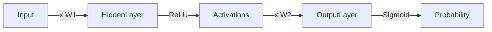
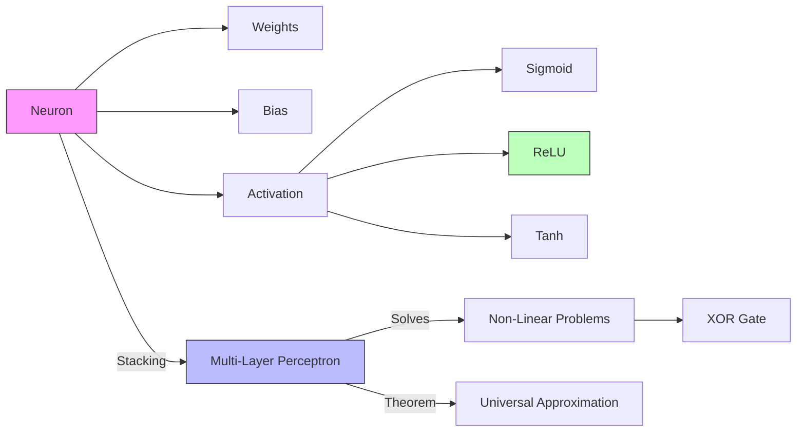

# Neural Networks: The Anatomy (Perceptrons & MLPs)

## 📜 Story Mode: The Spark

> **Mission Date**: 2043.01.01
> **Location**: Deep Space Outpost "Vector Prime"
> **Officer**: Lead Engineer Kael
>
> **The Problem**: Our logic is brittle.
> The "IF-THEN" rules of the old AI failed when the sensor lens got dirty.
> The Linear Regression failed when the trajectory curved.
>
> I need a machine that mimics the pilot's brain.
> I see how the pilot learns. He doesn't solve equations.
> He has billions of tiny cells. Each cell does something stupidly simple:
> *If the input is loud enough, FIRE. If not, stay quiet.*
>
> But when you connect billions of them... you get Instinct.
>
> *"Computer! clear the memory. I want to build a single synthetic neuron. Weights, Bias, Activation. Let's see if it can learn 'OR'. If it works, we connect a billion of them."*

---

## 1. Problem Setup & Motivation

### The 6 Engineering Questions
1.  **WHAT**:
    *   **Perceptron**: A single mathematical neuron ($y = \sigma(Wx + b)$).
    *   **MLP (Multi-Layer Perceptron)**: Stacking neurons in layers to learn non-linear functions.
    *   **Activation Function**: The non-linear switch (ReLU, Sigmoid).
2.  **WHY**: Linear models cannot solve non-linear problems (like XOR). NNs can approximate *any* function.
3.  **WHEN**: Unstructured data (Images, Audio, Text), or complex non-linear tabular patterns.
4.  **WHERE**: `torch.nn.Linear`, `tensorflow.keras.layers.Dense`.
5.  **WHO**: Rosenblatt (1957), Hinton (1986).
6.  **HOW**: Forward Pass (Compute) -> Loss -> Backward Pass (Learn).

> [!NOTE]
> **🛑 Pause & Explain (In Simple Words)**
>
> **The Dimmer Switch.**
>
> - **Input**: Wires carrying electricity (Data).
> - **Weights**: A knob on each wire. Turn it up (High Weight) to let more current through. Turn it down (Negative Weight) to inhibit it.
> - **Sum**: All wires meet at the switch.
> - **Activation (Bias)**: Is the total current enough to flip the switch?
> - **Output**: Light On (1) or Off (0).
> - **Learning**: Fiddling with the knobs until the light turns on exactly when we want it to.

---

## 2. Mathematical Problem Formulation

### The Neuron
$$ z = \sum_{i=1}^n w_i x_i + b = W^T x + b $$
$$ y = \sigma(z) $$
*   $W$: Weights (Importance).
*   $b$: Bias (Threshold).
*   $\sigma$: Activation Function.

### The Universal Approximation Theorem
A Feedforward Network with just **one hidden layer** (and enough neurons) can approximate **any** continuous function to arbitrary precision.
*Proof*: It's basically a "Curve Fitter" on steroids.

---

## 3. Step-by-Step Derivation

### Why Non-Linearity? (The XOR Problem)
Imagine a Linear Classifier (A Line).
**OR Gate**:
*   (0,0) -> 0
*   (0,1) -> 1
*   (1,0) -> 1
*   (1,1) -> 1
*   *Can I draw a line to separate 0s from 1s?* **Yes**.

**XOR Gate**:
*   (0,0) -> 0
*   (0,1) -> 1
*   (1,0) -> 1
*   (1,1) -> 0
*   *Can I draw a line?* **No**. You need a Curve (or two lines).
*   **Solution**: Stack neurons. Layer 1 transforms the space so Layer 2 can draw a line.

---

## 4. Algorithm Construction

### Map to Memory (Matrix Multiplication)
We don't loop over neurons.
We do Matrix Math.
$$ Y = \sigma(X \cdot W + B) $$
*   Input $X$: Shape (Batch, In_Features).
*   Weights $W$: Shape (In_Features, Out_Features).
*   Output $Y$: Shape (Batch, Out_Features).
**GPU**: GPUs are literally built just to do this operation ($GEMM$) fast.

---

## 5. Optimization & Convergence Intuition

### Activation Functions
1.  **Step Function**: (Old). Not differentiable. Can't use Gradient Descent.
2.  **Sigmoid**: $\frac{1}{1+e^{-z}}$. Squashes between 0 and 1. Good for probability. **Problem**: Vanishing Gradient (flat at edges).
3.  **ReLU (Rectified Linear Unit)**: $\max(0, z)$.
    *   If input > 0, pass it.
    *   If input <= 0, silence it.
    *   **Why it wins**: Non-linear, but gradient is exactly 1 (doesn't vanish). Fast.

---

## 6. Worked Examples

### Example 1: Predicting House Price
*   **Inputs**: Size, Rooms, Location.
*   **Hidden Layer**: Learns concepts like "Large Family Home" or "Luxury Bachelor Pad".
*   **Output**: Price.

### Example 2: MNIST (Digit Recognition)
*   **Inputs**: 784 pixels (28x28).
*   **Hidden**: Detects edges, loops.
*   **Output**: 10 probabilities (Digits 0-9).

---

## 7. Production-Grade Code

### The Ship's Code (Polyglot: Pure Python + Libraries)

```python
import numpy as np
import torch
import torch.nn as nn
import tensorflow as tf

# LEVEL 0: Pure Python (The Perceptron)
# Understanding the "Knobs" and "Switch"
class Perceptron:
    def __init__(self, num_inputs=2):
        # Initialize random weights and bias
        self.weights = [0.5, -0.5] # List for manual math
        self.bias = 0.1
        
    def activate(self, x):
        return 1 if x > 0 else 0 # Step function
        
    def forward(self, inputs):
        # Dot Product: Sum(w * x) + b
        weighted_sum = sum(w*x for w,x in zip(self.weights, inputs)) + self.bias
        return self.activate(weighted_sum)

# LEVEL 1: PyTorch (Multi-Layer Perceptron)
class TorchMLP(nn.Module):
    def __init__(self):
        super().__init__()
        # 2 Inputs -> 4 Hidden Neurons -> 1 Output
        self.net = nn.Sequential(
            nn.Linear(2, 4),
            nn.ReLU(),       # Non-linearity
            nn.Linear(4, 1),
            nn.Sigmoid()     # Probability
        )
    def forward(self, x):
        return self.net(x)

# LEVEL 2: TensorFlow (Keras Functional API)
def tf_mlp_demo():
    inputs = tf.keras.Input(shape=(2,))
    x = tf.keras.layers.Dense(4, activation='relu')(inputs)
    outputs = tf.keras.layers.Dense(1, activation='sigmoid')(x)
    model = tf.keras.Model(inputs=inputs, outputs=outputs)
    return model
```

> [!TIP]
> **👁️ Visualizing the Impossible: The XOR Problem**
> Run this script to see why a single line (Perceptron) fails at XOR, but a curve (MLP) succeeds.
>
> ```python
> import numpy as np
> import matplotlib.pyplot as plt
> from sklearn.neural_network import MLPClassifier
> from sklearn.linear_model import Perceptron
>
> def plot_xor_problem():
>     # 1. XOR Data
>     X = np.array([[0,0], [0,1], [1,0], [1,1]])
>     y = np.array([0, 1, 1, 0]) # The XOR Logic
>
>     # 2. Train Models
>     # Linear Perceptron
>     clf_linear = Perceptron(tol=1e-3, random_state=0)
>     clf_linear.fit(X, y)
>     
>     # Non-Linear MLP (2 Hidden Neurons)
>     # Note: We need max_iter=2000 for convergence on small data
>     clf_mlp = MLPClassifier(hidden_layer_sizes=(4,), activation='relu', max_iter=2000, random_state=1)
>     clf_mlp.fit(X, y)
>
>     # 3. Visualization Grid
>     xx, yy = np.meshgrid(np.linspace(-0.5, 1.5, 100), np.linspace(-0.5, 1.5, 100))
>     
>     fig, ax = plt.subplots(1, 2, figsize=(12, 5))
>     
>     # Plot Linear
>     Z = clf_linear.predict(np.c_[xx.ravel(), yy.ravel()])
>     Z = Z.reshape(xx.shape)
>     ax[0].contourf(xx, yy, Z, cmap="RdBu", alpha=0.3)
>     ax[0].scatter(X[:,0], X[:,1], c=y, s=100, edgecolors='k', cmap="RdBu")
>     ax[0].set_title("Perceptron (Linear)\nCannot Separate red/blue")
>     
>     # Plot MLP
>     Z = clf_mlp.predict(np.c_[xx.ravel(), yy.ravel()])
>     Z = Z.reshape(xx.shape)
>     ax[1].contourf(xx, yy, Z, cmap="RdBu", alpha=0.3)
>     ax[1].scatter(X[:,0], X[:,1], c=y, s=100, edgecolors='k', cmap="RdBu")
>     ax[1].set_title("MLP (Non-Linear)\nLearns the specific regions")
>     
>     plt.show()
>
> # Uncomment to run:
> # plot_xor_problem()
> ```

> [!CAUTION]
> **🛑 Production Warning**
>
> **Dead ReLUs**:
> If learning rate is too high, a ReLU neuron might get pushed to a region where input is always < 0.
> Gradient becomes 0. The neuron dies and never learns again.
> **Fix**: Use LeakyReLU or lower learning rate.

---

## 8. System-Level Integration



**Where it lives**:
**Everywhere**: This MLP block is the sub-atom of Transformers (ChatGPT), CNNs, and ResNets.
The "Feed Forward Network" inside a Transformer *is* this MLP.

---

## 9. Evaluation & Failure Analysis

### Failure Mode: Over-Parameterization
If you use 1 Million neurons for 10 data points.
Loss will be 0.00000.
Test Error will be huge.
**Solution**: Dropout (Randomly kill neurons during training to force redundancy).

---

## 10. Ethics, Safety & Risk Analysis

### The Black Box
We know the weights. We know the math.
But we don't know *what concepts* the hidden layer learned.
"Why did it deny the loan?"
"Because Neuron 432 fired."
"What does Neuron 432 represent?"
"We don't know."
**Research**: Mechanistic Interpretability attempts to reverse-engineer these neurons.

---

## 11. Advanced Theory & Research Depth

### Kolmogorov-Arnold Representation Theorem
Every multivariate continuous function can be represented as a superposition of continuous functions of one variable.
This is the theoretical parent of the Neural Net approximation capability.

---

## 12. Career & Mastery Signals

### Interview Pitfall
Q: "Why do we need non-linear activation functions?"
**Bad Answer**: "To make it learn better."
**Good Answer**: "Because without them, a stack of Linear Layers collapses into a single Linear Layer ($W_2(W_1 x) = W_{combined} x$). Non-linearity is what allows the network to learn complex mappings."

---

## 13. Assessment & Mastery Checks

**Q1: Bias**
What happens if we remove the Bias term $b$?
*   *Answer*: The separating hyperplane is forced to pass through the origin (0,0). This severely limits the model's flexibility.

**Q2: Output Layer**
Which activation for Multi-Class Classification?
*   *Answer*: Softmax. (Ensures probabilities sum to 1).

---

## 14. Further Reading & Tooling

*   **Interactive**: **TensorFlow Playground** (Visualize neurons firing).
*   **Book**: *"Deep Learning"* (Goodfellow, Bengio, Courville).

---

## 15. Concept Graph Integration

*   **Previous**: [Evaluation & Tuning](02_core_ml/01_optimization/04_evaluation_tuning.md).
*   **Next**: [Training Neural Nets](03_neural_networks/01_foundations/02_training.md) (Backprop & Optimization).

### Concept Map

