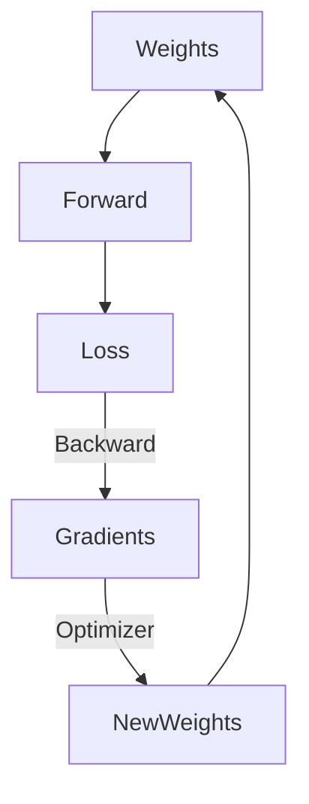
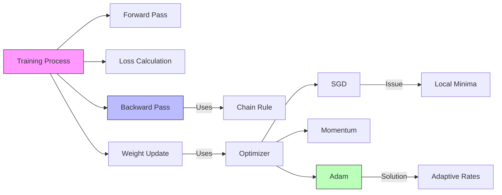

# Neural Networks: Training (Backprop & Optimizers)

## 📜 Story Mode: The Descent

> **Mission Date**: 2043.01.05
> **Location**: Deep Space Outpost "Vector Prime"
> **Officer**: Lead Engineer Kael
>
> **The Problem**: I built the brain (The Perceptron). But it's an idiot.
> It has 1 Billion knobs (Weights). They are all set to random positions.
> The output is garbage.
>
> I need to turn the knobs to make the error go down.
> But I can't check 1 Billion knobs one by one. The universe would end before I finished.
>
> I need a map.
> I need to know: "If I turn Knob #482 to the right, does the Error go Up or Down?"
> I need the **Gradient**.
> And I need an algorithm to slide down the hill of error effectively.
>
> *"Computer! Enable Backpropagation. Calculate partial derivatives for every weight. Engage the Adam Optimizer. Update Rate: 0.001."*

---

## 1. Problem Setup & Motivation

### The 6 Engineering Questions
1.  **WHAT**:
    *   **Backpropagation**: An efficient algorithm to compute gradients of the Loss w.r.t. Weights using the Chain Rule.
    *   **Optimizer**: The rule for updating weights using the gradient (SGD, Adam).
    *   **Initialization**: How we set the starting weights.
2.  **WHY**: Without efficient gradient calculation, training deep nets is impossible.
3.  **WHEN**: Training any Differentiable Loop (Neural Nets).
4.  **WHERE**: `loss.backward()`, `optim.step()`.
5.  **WHO**: Rumelhart/Hinton (Backprop), Kingma/Ba (Adam).
6.  **HOW**: $W_{new} = W_{old} - \eta \cdot \nabla L$.

> [!NOTE]
> **🛑 Pause & Explain (In Simple Words)**
>
> **The Blame Game.**
>
> - **Forward Pass**: The signal goes Input -> Hidden -> Output -> Error.
> - **The Error**: "We predicted 0.8, but truth is 1.0. Error is 0.2."
> - **Backprop (The Blame)**:
> - Output Neuron says: "I was too low because Hidden Node A was too low."
> - Hidden Node A says: "I was too low because Weight W1 was too small."
> - We trace the blame backwards from the crime scene (Loss) to the source (Weights).
> - We punish the weights proportionate to their contribution to the error.

---

## 2. Mathematical Problem Formulation

### The Chain Rule (Review)
$$ \frac{\partial L}{\partial w} = \frac{\partial L}{\partial y} \cdot \frac{\partial y}{\partial h} \cdot \frac{\partial h}{\partial w} $$
In a Computer, this is a graph traversal.
We compute local derivatives at each node and multiply them as we go back.

### The Update Rule (SGD)
$$ W_{t+1} = W_t - \eta \nabla_W L $$
*   $\eta$: Learning Rate. (Step Size).

---

## 3. Step-by-Step Derivation

### Vanishing Gradient Problem
If we use Sigmoid activation $\sigma(z) = \frac{1}{1+e^{-z}}$.
The derivative $\sigma'(z)$ is max 0.25 (at z=0) and near 0 at edges.
In a 10-layer network: Gradient $\approx 0.25^{10} \approx 0.0000009$.
The first layer stops learning.
**Solution**: Use ReLU (Gradient is 1). Use Xavier/He Initialization.

---

## 4. Algorithm Construction

### Map to Memory (Computational Graph)
PyTorch builds a Dynamic Computational Graph.
*   `x = torch.tensor([1.0], requires_grad=True)`
*   `y = x * 2` (Graph: Mul Node)
*   `z = y ** 2` (Graph: Pow Node)
*   `z.backward()` -> Walks the graph in reverse.
This is "Autograd".

---

## 5. Optimization & Convergence Intuition

### Evolution of Optimizers
1.  **SGD**: Walk down the slope. (Problem: Gets stuck in ravines).
2.  **Momentum**: Walk down like a heavy ball. If you hit a bump, momentum carries you over.
3.  **RMSProp**: Adaptive Learning Rate. Slow down on steep slopes, speed up on flat plains.
4.  **Adam (Adaptive Moment Estimation)**: Combine Momentum + RMSProp. The default choice.

---

## 6. Worked Examples

### Example 1: The Ravine
Imagine a loss landscape like a taco shell. Steep on sides, flat along the bottom.
**SGD**: Bounces wildly back and forth on the steep sides. Slow progress.
**Adam**: Dampens the side-to-side oscillation (using Momentum) and accelerates along the bottom.

---

## 7. Production-Grade Code

### The Ship's Code (Polyglot: Pure Python + Libraries)

```python
import numpy as np
import torch
import torch.nn as nn
import tensorflow as tf

# LEVEL 0: Pure Python (Manual Backprop)
# Function: f(x) = x^2. Target = 0.
def backprop_pure(x, lr=0.1):
    # Forward
    y = x ** 2
    
    # Backward (Chain Rule)
    # dy/dx = 2*x
    grad = 2 * x
    
    # Update
    x_new = x - lr * grad
    return x_new

# LEVEL 1: PyTorch (Training Loop)
def torch_train_step(model, optimizer, criterion, x, y):
    optimizer.zero_grad()        # 1. Reset Gradients
    y_pred = model(x)            # 2. Forward
    loss = criterion(y_pred, y)  # 3. Loss
    loss.backward()              # 4. Backprop
    optimizer.step()             # 5. Update
    return loss.item()

# LEVEL 2: TensorFlow (GradientTape)
def tf_train_step(model, optimizer, loss_fn, x, y):
    with tf.GradientTape() as tape:
        y_pred = model(x, training=True)
        loss = loss_fn(y, y_pred)
        
    # Manual Gradient Calculation defined by Tape
    grads = tape.gradient(loss, model.trainable_variables)
    optimizer.apply_gradients(zip(grads, model.trainable_variables))
    optimizer.apply_gradients(zip(grads, model.trainable_variables))
    return loss
```

> [!TIP]
> **👁️ Visualizing the Descent: The Loss Landscape**
> Run this script to see an Optimizer surfing down a convex function.
>
> ```python
> import numpy as np
> import matplotlib.pyplot as plt
> from matplotlib import cm
>
> def plot_optimization_path():
>     # 1. Define Loss Function (Bowl shape)
>     def loss_fn(x, y):
>         return x**2 + 2*y**2
>
>     # 2. Simulate Gradient Descent Path
>     path_x, path_y, path_z = [], [], []
>     x, y = 8.0, 8.0 # Start high
>     lr = 0.1
>     
>     for _ in range(20):
>         path_x.append(x); path_y.append(y); path_z.append(loss_fn(x,y))
>         # Gradients
>         grad_x = 2*x
>         grad_y = 4*y
>         # Update
>         x -= lr * grad_x
>         y -= lr * grad_y
>     
>     # 3. Plot Surface
>     X_grid = np.arange(-10, 10, 0.5)
>     Y_grid = np.arange(-10, 10, 0.5)
>     X_grid, Y_grid = np.meshgrid(X_grid, Y_grid)
>     Z_grid = loss_fn(X_grid, Y_grid)
>     
>     fig = plt.figure(figsize=(10, 7))
>     ax = fig.add_subplot(111, projection='3d')
>     
>     # Wireframe
>     ax.plot_surface(X_grid, Y_grid, Z_grid, cmap=cm.coolwarm, alpha=0.6)
>     
>     # Path
>     ax.plot(path_x, path_y, path_z, color='red', marker='o', linewidth=2, label='SGD Path')
>     
>     ax.set_title("Gradient Descent on Loss Surface")
>     ax.set_xlabel("Weight 1")
>     ax.set_ylabel("Weight 2")
>     ax.set_zlabel("Loss")
>     ax.legend()
>     plt.show()
>
> # Uncomment to run:
> # plot_optimization_path()
> ```

> [!CAUTION]
> **🛑 Production Warning**
>
> **`optimizer.zero_grad()`**:
> PyTorch *accumulates* gradients by default (for RNNs).
> If you forget `zero_grad()`, your gradients sum up across batches.
> The step size becomes huge. The model explodes.
> **Always** call it before backward.

---

## 8. System-Level Integration



**Where it lives**:
**Training Cluster**: Thousands of GPUs in sync.
**Gradient Accumulation**: If batch size is too big for GPU RAM, run 4 small batches, sum gradients, then update.

---

## 9. Evaluation & Failure Analysis

### Failure Mode: Exploding Gradients
If weights are large ($>1$), gradients multiply ($2 \cdot 2 \cdot 2 \dots$).
Gradient becomes NaN.
**Fix**: Gradient Clipping (`torch.nn.utils.clip_grad_norm_`).

---

## 10. Ethics, Safety & Risk Analysis

### Carbon Footprint
Training GPT-3 took gigawatt-hours of energy.
Inefficient training (bad hyperparameters) wastes massive electricity.
**Refinement**: Use "Pre-trained" models instead of training from scratch (Transfer Learning).

---

## 11. Advanced Theory & Research Depth

### Second Order Optimization
Newton's Method uses the Hessian (Curvature) to jump to the minimum in 1 step.
$$ W_{new} = W - H^{-1} \nabla L $$
**Problem**: Computing Hessian $H$ ($N \times N$) is $O(N^3)$. Too slow for Deep Learning.
We stuck with First Order (Gradient) methods.

---

## 12. Career & Mastery Signals

### Interview Pitfall
Q: "Why Initialize weights to Zero?"
**Bad Answer**: "To start neutral."
**Good Answer**: "NEVER init to zero. If all weights are zero, all neurons compute the same output and get the same gradient. The network essentially stays a single neuron (Symmetry problem). Initialize randomly."

---

## 13. Assessment & Mastery Checks

**Q1: Batch vs Mini-Batch**
Difference?
*   *Answer*: Batch = All data (Precise gradient, slow). Stochastic = 1 data point (Noisy gradient, fast). Mini-Batch = Balance (e.g., 32 samples).

**Q2: Learning Rate Schedule**
Why lower LR over time?
*   *Answer*: Large steps at first to get close. Small steps at end to settle into the precise minimum without overshooting.

---

## 14. Further Reading & Tooling

*   **Paper**: *"Adam: A Method for Stochastic Optimization"* (Kingma & Ba).
*   **Visual**: **Distill.pub** (Momentum visualization).

---

## 15. Concept Graph Integration

*   **Previous**: [The Perceptron](03_neural_networks/01_foundations/01_perceptron.md).
*   **Next**: [Neural Networks / Architectures](03_neural_networks/02_architectures/01_cnn.md) (CNNs, RNNs).
*   **Next**: [Regularization & Norm](03_neural_networks/01_foundations/03_regularization_normalization.md).

### Concept Map

