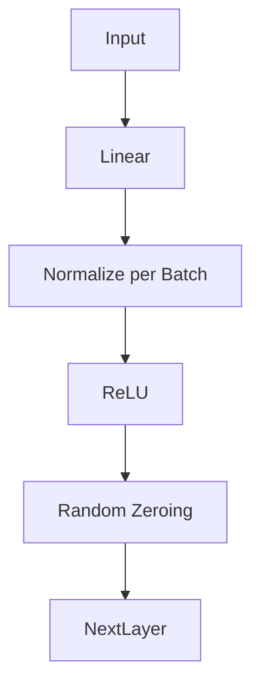
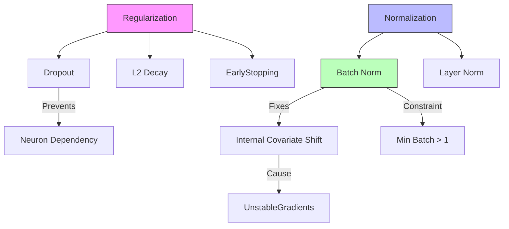

# Neural Networks: Regularization & Normalization (The Deep Dive)

## 📜 Story Mode: The Stabilizer

> **Mission Date**: 2043.01.10
> **Location**: Deep Space Outpost "Vector Prime"
> **Officer**: Lead Engineer Kael
>
> **The Problem**: I stacked 20 layers of neurons. It should be 20x smarter.
> Instead, it's dead.
> The gradients are gone. The weights refuse to move.
>
> It's **Internal Covariate Shift**.
> Layer 10 expects inputs around 5.0.
> But Layer 1 changed slightly, so Layer 10 receives 50.0.
> Layer 10 panics and saturates.
> The whole network is chasing its own tail, trying to adjust to the moving ground beneath it.
>
> I need a Stabilizer.
> I will force every layer to swallow data that is Mean 0 and Variance 1.
> No matter what the previous layer does, I will normalize it.
>
> *"Computer! Install Batch Normalization on every layer. Activate Dropout on the dense layers to prevent memorization. We are going Deep."*

---

## 1. Problem Setup & Motivation

### The 6 Engineering Questions
1.  **WHAT**:
    *   **Batch Normalization (BN)**: Normalizing inputs *per batch* within the network.
    *   **Layer Normalization (LN)**: Normalizing inputs *per sample*. (Better for RNNs/Transformers).
    *   **Dropout**: Randomly zeroing out neurons during training.
2.  **WHY**:
    *   **BN/LN**: Allows faster training limits (higher Learning Rate), smoother landscape.
    *   **Dropout**: Prevents overfitting (Regularization).
3.  **WHEN**:
    *   **BN**: CNNs (Computer Vision).
    *   **LN**: NLP (Transformers).
    *   **Dropout**: Large Dense Layers.
4.  **WHERE**: `nn.BatchNorm2d`, `nn.LayerNorm`, `nn.Dropout`.
5.  **WHO**: Ioffe & Szegedy (2015).
6.  **HOW**: $\hat{x} = \frac{x - \mu}{\sigma}$.

> [!NOTE]
> **🛑 Pause & Explain (In Simple Words)**
>
> **The Classroom.**
>
> - **Without BN**: The teacher (Layer 1) keeps changing the textbook (Distribution) every day. The students (Layer 2) are confused and can't learn.
> - **With BN**: The teacher strictly grades on a curve. The average is always B. The students know what to expect. Learning is stable.
> - **Dropout**: The key students are sick randomly. The class must learn to pass the test without relying on the smart kid (Robustness).

---

## 2. Mathematical Problem Formulation

### Batch Normalization
For a mini-batch $B = \{x_1, \dots, x_m\}$:
1.  Mean: $\mu_B = \frac{1}{m} \sum x_i$
2.  Variance: $\sigma_B^2 = \frac{1}{m} \sum (x_i - \mu_B)^2$
3.  Normalize: $\hat{x}_i = \frac{x_i - \mu_B}{\sqrt{\sigma_B^2 + \epsilon}}$
4.  Scale & Shift: $y_i = \gamma \hat{x}_i + \beta$ (Learnable parameters).

### Dropout
Bernoulli Mask $r \sim \text{Bernoulli}(p)$.
Weights $W' = W \cdot r$.
Scaling check: During testing, we must multiply weights by $p$ to maintain magnitude (or scale up during training).

---

## 3. Step-by-Step Derivation

### Why Mean 0, Var 1?
Sigmoid/Tanh gradients are steepest at 0.
If inputs are at 100, gradient is 0.
BN keeps inputs in the "Goldilocks Zone" where gradients are flowing.
**Impact**: We can use Learning Rates 10x higher.

---

## 4. Algorithm Construction

### Map to Memory (Inference Mode)
BN behaves differently in **Training** vs **Testing**.
*   **Training**: Compute $\mu, \sigma$ from *current batch*.
*   **Testing**: We process 1 image. What is the batch mean? We don't have one!
*   **Solution**: During training, we keep a "Running Average" of $\mu$ and $\sigma$. We use *that* during testing.
*   **Bug Alert**: If you forget `model.eval()`, PyTorch tries to compute batch stats on 1 image -> Crash or Garbage.

---

## 5. Optimization & Convergence Intuition

### AdamW (Adam + Weight Decay)
Standard L2 Regularization adds $\lambda ||w||^2$ to Loss.
In SGD, this is equivalent to decay $w_{new} = w_{old}(1 - \lambda \eta)$.
In Adam, the adaptive learning rate messes this up. L2 doesn't work as expected.
**AdamW** decouples the weight decay from the gradient update.
Always use `optim.AdamW`, not `optim.Adam`.

---

## 6. Worked Examples

### Example 1: ResNet (Deep Vision)
Without BN, ResNet-50 diverges.
With BN, it converges in hours.
BN is part of the "Residual Block": `Conv -> BN -> ReLU -> Conv -> BN -> Add -> ReLU`.

### Example 2: The Dropout Trap
You train with Dropout (0.5). Accuracy 80%.
You deploy. Accuracy 40%.
**Why?** You forgot to scale activations. (Modern frameworks handle this, but old implementations didn't).

---

## 7. Production-Grade Code

### The Ship's Code (Polyglot: Pure Python + Libraries)

```python
import numpy as np
import torch
import torch.nn as nn
import tensorflow as tf

# LEVEL 0: Pure Python (Manual Batch Norm)
def batch_norm_pure(x, gamma=1.0, beta=0.0, eps=1e-5):
    """
    x: Matrix [Batch, Features]
    """
    # 1. Calculate Mean/Var per feature
    mu = np.mean(x, axis=0)
    var = np.var(x, axis=0)
    
    # 2. Normalize
    x_norm = (x - mu) / np.sqrt(var + eps)
    
    # 3. Scale and Shift
    out = gamma * x_norm + beta
    return out

# LEVEL 1: PyTorch (Robust Block)
class RobustBlock(nn.Module):
    def __init__(self, c_in, c_out):
        super().__init__()
        self.net = nn.Sequential(
            nn.Linear(c_in, c_out),
            nn.BatchNorm1d(c_out), # Stabilizer
            nn.ReLU(),
            nn.Dropout(0.5)        # Regularizer
        )

# LEVEL 2: TensorFlow (BN Layer)
def tf_bn_demo():
    # BN automatically handles training vs inference mode in Keras
    layer = tf.keras.layers.BatchNormalization(
        momentum=0.99,
        epsilon=0.001
    )
    return layer
```

> [!TIP]
> **👁️ Visualizing the Effect: The Stabilizer**
> Run this script to see how Batch Norm forces data into a nice bell curve.
>
> ```python
> import numpy as np
> import matplotlib.pyplot as plt
>
> def plot_normalization_effect():
>     # 1. Generate Bad Data (Shifted & Scaled)
>     # Mean = 50, Std = 20
>     np.random.seed(42)
>     raw_data = np.random.normal(50, 20, 1000)
>     
>     # 2. Batch Norm Steps
>     mu = np.mean(raw_data)
>     sigma = np.std(raw_data)
>     norm_data = (raw_data - mu) / sigma # Standardized (Mean 0, Var 1)
>     
>     # 3. Simulate ReLU without Norm vs With Norm
>     # Without Norm: Everything > 0 passes. 
>     # Since Mean=50, almost ALL data is > 0. ReLU is linear. No non-linearity!
>     
>     # 4. Plot
>     fig, axes = plt.subplots(1, 2, figsize=(12, 5))
>     
>     # Histogram of Raw
>     axes[0].hist(raw_data, bins=30, color='orange', alpha=0.7, label='Input Data')
>     axes[0].axvline(0, color='red', linestyle='--', linewidth=2, label='ReLU Threshold (0)')
>     axes[0].set_title("Before BN: Data is Far from 0 \n(Gradient signals lost or exploding)")
>     axes[0].legend()
>     
>     # Histogram of Norm
>     axes[1].hist(norm_data, bins=30, color='green', alpha=0.7, label='Normalized Data')
>     axes[1].axvline(0, color='red', linestyle='--', linewidth=2, label='ReLU Threshold (0)')
>     axes[1].set_title("After BN: Data Centered at 0 \n(Non-linearity active, Gradients stable)")
>     axes[1].legend()
>     
>     plt.show()
>
> # Uncomment to run:
> # plot_normalization_effect()
> ```

> [!CAUTION]
> **🛑 Production Warning**
>
> **Batch Size 1**:
> If you train with Batch Size 1, Batch Norm fails (Variance of 1 point is 0).
> **Layer Norm** works with Batch Size 1.
> This is why RNNs/Transformers primarily use Layer Norm.

---

## 8. System-Level Integration



**Where it lives**:
**Effs**: Removing BN can speed up *inference* slightly. We can "fuse" BN into the Conv layer weights after training ($W_{new} = W \cdot \gamma / \sigma$).

---

## 9. Evaluation & Failure Analysis

### Failure Mode: Distrubution Shift
BN learns the training statistics $\mu_{train}$.
If Test Data is totally different (e.g. Night images vs Day images), $\mu_{test}$ will be wrong.
BN can hurt performance here.
**Fix**: Adaptive Batch Norm (Re-calculate stats on test data).

---

## 10. Ethics, Safety & Risk Analysis

### Reproducibility
Dropout is random.
Initialization is random.
CUDA operations are sometimes non-deterministic.
Deep Learning is hard to reproduce exactly.
**Risk**: In finance/audit, "Randomness" is a liability. You must fix seeds (`torch.manual_seed(42)`).

---

## 11. Advanced Theory & Research Depth

### SELU (Scaled Exponential Linear Unit)
A magic activation function that self-normalizes.
If used correctly, it replaces Batch Norm!
The network weights automatically converge to Mean 0, Var 1.
(Paper: *"Self-Normalizing Neural Networks"*).

---

## 12. Career & Mastery Signals

### Interview Pitfall
Q: "Does Dropout work at test time?"
**Bad Answer**: "Yes."
**Good Answer**: "No. At test time, we want the full power of the network (Ensemble Average). We disable Dropout and scale the weights."

---

## 13. Assessment & Mastery Checks

**Q1: BN vs LN**
Which dimension does BN normalize?
*   *Answer*: The Batch Dimension $(N, C, H, W) \to$ Avg over $(N, H, W)$.
*   LN normalizes the Feature Dimension $\to$ Avg over $(C, H, W)$.

**Q2: Dropout placement**
Before or After Activation?
*   *Answer*: Usually After (ReLU $\to$ Dropout). But historically was Before. Debate exists, but standard is After.

---

## 14. Further Reading & Tooling

*   **Paper**: *"Batch Normalization: Accelerating Deep Network Training"* (Ioffe & Szegedy).
*   **Paper**: *"Dropout: A Simple Way to Prevent Neural Networks from Overfitting"* (Srivastava et al.).

---

## 15. Concept Graph Integration

*   **Previous**: [Training Neural Nets](03_neural_networks/01_foundations/02_training.md).
*   **Next**: [Architectures / CNNs](03_neural_networks/02_architectures/01_cnn.md).

### Concept Map

