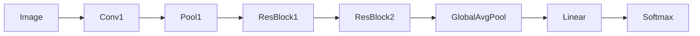
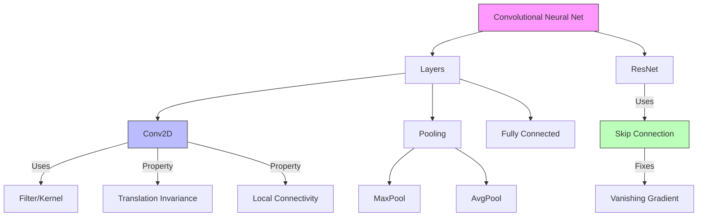

# Deep Learning Architectures: CNNs (Convolutional Neural Networks)

## 📜 Story Mode: The Retina

> **Mission Date**: 2043.02.01
> **Location**: Deep Space Outpost "Vector Prime"
> **Officer**: Lead Engineer Kael
>
> **The Problem**: The MLP is overwhelmed.
> I fed it a 4K image of the asteroid belt.
> Input Size: 3840 * 2160 * 3 = 24 Million pixels.
> Layer 1 Weights: 24 Million * 1000 Neurons = **24 Billion Parameters**.
> Expected RAM: 100 GB.
> Result: Out of Memory.
>
> The MLP is inefficient. It tries to learn a unique weight for every single pixel.
> But a "Corner" in the top-left is the same as a "Corner" in the bottom-right.
> I need a **Scanner**.
> I need a small filter (3x3) that slides over the image, looking for edges.
> I will share the weights across the entire image (Translation Invariance).
>
> *"Computer! Reroute the visual feed. Initialize Convolutional Layers. Kernels: 3x3. Stride: 1. Max Pooling: On. Let's build a visual cortex."*

---

## 1. Problem Setup & Motivation

### The 6 Engineering Questions
1.  **WHAT**:
    *   **CNN**: A network preserving spatial structure using Convolutions.
    *   **Conv2D**: Sliding a small window (Kernel) over the image to detect features.
    *   **Pooling**: Downsampling to reduce size and increase field of view.
2.  **WHY**:
    *   **Parameter Efficiency**: Weights are shared.
    *   **Translation Invariance**: A cat is a cat, whether centered or shifted left.
3.  **WHEN**: Images, Audio Spectrograms, Medical Scans, Grid Data.
4.  **WHERE**: `nn.Conv2d`, `nn.MaxPool2d`.
5.  **WHO**: LeCun (1989), Krizhevsky (AlexNet, 2012).
6.  **HOW**: `Output = (Input - Kernel + 2*Pad) / Stride + 1`.

> [!NOTE]
> **🛑 Pause & Explain (In Simple Words)**
>
> **The Cookie Cutter.**
>
> - **MLP**: Trying to bake a giant cookie by shaping every crumb individually.
> - **CNN**: Using a small "Star Shape" cutter (Kernel).
> - You stamp it in the top left. Then move right. Stamp again.
> - You produce a "Map" of where the stars are.
> - Then you use a "Circle Cutter" on that map.
> - Eventually, you find the pattern: "Two Stars + One Circle = Smiley Face".

---

## 2. Mathematical Problem Formulation

### The Convolution Operation
$$ (I * K)(i, j) = \sum_m \sum_n I(i+m, j+n) K(m, n) $$
*   $I$: Image.
*   $K$: Kernel (Filter).
*   It is a dot product of the filter with a local patch of the image.

### Dimensions
Input: $(C_{in}, H, W)$.
Output: $(C_{out}, H_{out}, W_{out})$.
$$ H_{out} = \lfloor \frac{H_{in} + 2P - K}{S} + 1 \rfloor $$
*   $P$: Padding.
*   $K$: Kernel Size.
*   $S$: Stride.

---

## 3. Step-by-Step Derivation

### The Receptive Field
Why do we stack layers?
*   **Layer 1**: Sees 3x3 pixels. Detects Edges.
*   **Layer 2**: Sees 3x3 of Layer 1 $\approx$ 5x5 of pixels. Detects Shapes.
*   **Layer 3**: Sees 7x7. Detects Objects.
*   **Pooling**: Aggressively doubles the receptive field by shrinking the map.
By Layer 50 (ResNet), one neuron sees the *entire* image.

---

## 4. Algorithm Construction

### Map to Memory (The Channel Explosion)
Image: 3 Channels (RGB).
Layer 1: 64 Channels (Filters).
Layer 2: 128 Channels.
Layer 3: 256 Channels.
As spatial size ($H, W$) decreases, Depth ($C$) increases.
We trade Resolution for Semantic Richness.

---

## 5. Optimization & Convergence Intuition

### Residual Connections (ResNet)
Deep CNNs (20+ layers) stop learning because gradients vanish.
**Solution**: Skip Connections.
$$ y = F(x) + x $$
The gradient can flow through the identity path ($+x$) unhindered.
This allowed networks to go from 20 layers to 1000 layers.

---

## 6. Worked Examples

### Example 1: Edge Detection Kernel
Filter:
$$
\begin{bmatrix}
-1 & -1 & -1 \\
-1 & 8 & -1 \\
-1 & -1 & -1
\end{bmatrix}
$$
If the patch is flat (all white), Sum = 0.
If the patch has a dot or edge, Sum is High.
The CNN *learns* these numbers automatically.

---

## 7. Production-Grade Code

### The Ship's Code (Polyglot: Pure Python + Libraries)

```python
import numpy as np
import torch
import torch.nn as nn
import tensorflow as tf

# LEVEL 0: Pure Python (Manual 2D Convolution)
def conv2d_pure(image, kernel):
    """
    image: 2D matrix (H, W)
    kernel: 2D matrix (K, K)
    """
    H, W = len(image), len(image[0])
    K = len(kernel)
    H_out = H - K + 1
    W_out = W - K + 1
    
    output = np.zeros((H_out, W_out))
    
    for i in range(H_out):
        for j in range(W_out):
            # Extract patch
            patch = [row[j:j+K] for row in image[i:i+K]]
            # Dot product sum
            output[i][j] = sum(sum(p*k for p,k in zip(r_p, r_k)) 
                               for r_p, r_k in zip(patch, kernel))
                               
    return output

# LEVEL 1: PyTorch (ResNet Block)
class ResidualBlock(nn.Module):
    def __init__(self, in_channels, out_channels, stride=1):
        super().__init__()
        self.conv1 = nn.Conv2d(in_channels, out_channels, kernel_size=3, padding=1, stride=stride)
        self.bn1 = nn.BatchNorm2d(out_channels)
        self.relu = nn.ReLU()
        self.conv2 = nn.Conv2d(out_channels, out_channels, kernel_size=3, padding=1)
        self.bn2 = nn.BatchNorm2d(out_channels)
        
        # Shortcut handling
        self.shortcut = nn.Sequential()
        if stride != 1 or in_channels != out_channels:
            self.shortcut = nn.Sequential(
                nn.Conv2d(in_channels, out_channels, kernel_size=1, stride=stride),
                nn.BatchNorm2d(out_channels)
            )
            
    def forward(self, x):
        identity = self.shortcut(x)
        out = self.conv1(x)
        out = self.bn1(out)
        out = self.relu(out)
        out = self.conv2(out)
        out = self.bn2(out)
        out += identity # The Magic Addition
        out = self.relu(out)
        return out

# LEVEL 2: TensorFlow (Functional API)
def tf_resnet_block(x, filters, kernel_size=3, stride=1):
    shortcut = x
    # 1. Conv + BN + ReLU
    x = tf.keras.layers.Conv2D(filters, kernel_size, strides=stride, padding='same')(x)
    x = tf.keras.layers.BatchNormalization()(x)
    x = tf.keras.layers.Activation('relu')(x)
    
    # 2. Conv + BN
    x = tf.keras.layers.Conv2D(filters, kernel_size, strides=1, padding='same')(x)
    x = tf.keras.layers.BatchNormalization()(x)
    
    # 3. Add Shortcut
    if stride != 1 or shortcut.shape[-1] != filters:
         shortcut = tf.keras.layers.Conv2D(filters, 1, strides=stride)(shortcut)
         
    x = tf.keras.layers.Add()([x, shortcut])
    x = tf.keras.layers.Activation('relu')(x)
    return x
```

> [!TIP]
> **👁️ Visualizing the Operation: The Feature Map**
> Run this script to see what a Convolution actually *does* to an image.
>
> ```python
> import numpy as np
> import matplotlib.pyplot as plt
> from scipy.signal import convolve2d
> from sklearn.datasets import load_sample_image
>
> def plot_convolution_demo():
>     # 1. Load an Image (China Palace)
>     try:
>         china = load_sample_image("china.jpg") / 255.0
>     except:
>         # Fallback noise if sklearn data not found
>         china = np.random.rand(400, 600, 3)
>         
>     image = china[:, :, 1] # Use Green Channel (Grayscale-ish)
>
>     # 2. Define Filters
>     # Vertical Edge Detector
>     kernel_v = np.array([[1, 0, -1],
>                          [1, 0, -1],
>                          [1, 0, -1]])
>     
>     # Horizontal Edge Detector
>     kernel_h = np.array([[1, 1, 1],
>                          [0, 0, 0],
>                          [-1, -1, -1]])
>     
>     # 3. Apply Convolution
>     # 'valid' means no padding
>     output_v = convolve2d(image, kernel_v, mode='valid')
>     output_h = convolve2d(image, kernel_h, mode='valid')
>     
>     # 4. Plot
>     fig, axes = plt.subplots(1, 3, figsize=(15, 5))
>     
>     axes[0].imshow(image, cmap='gray')
>     axes[0].set_title("Original Image")
>     axes[0].axis('off')
>     
>     axes[1].imshow(np.abs(output_v), cmap='gray')
>     axes[1].set_title("Vertical Edges Detected")
>     axes[1].axis('off')
>     
>     axes[2].imshow(np.abs(output_h), cmap='gray')
>     axes[2].set_title("Horizontal Edges Detected")
>     axes[2].axis('off')
>     
>     plt.show()
>
> # Uncomment to run:
> # plot_convolution_demo()
> ```

> [!CAUTION]
> **🛑 Production Warning**
>
> **Input Size**:
> CNNs don't care about image height/width *until* the final Fully Connected layer.
> If you change input from 224x224 to 512x512, the Conv layers work, but the final Flatten->Linear will define a mismatch and crash.
> **Fix**: Use `nn.AdaptiveAvgPool2d((1,1))` before the final classification to force output to always be fixed size (1x1).

---

## 8. System-Level Integration



**Where it lives**:
**Self-Driving**: Tesla Autopilot uses "HydraNets" (Massive CNN backbones) to detect lanes, cars, and stop signs simultaneously.

---

## 9. Evaluation & Failure Analysis

### Failure Mode: Adversarial Attacks
CNNs are texture-biased, not shape-biased.
If you add invisible noise to a Panda image, the CNN thinks it's a Gibbon with 99% confidence.
**Fix**: Adversarial Training (Train on attacked images).

---

## 10. Ethics, Safety & Risk Analysis

### Facial Recognition
CNNs are the engine of Surveillance State.
They can be biased against demographics not present in the training set (e.g., darker skin tones).
**Audit**: Always test False Negative Rates across race/gender subgroups.

---

## 11. Advanced Theory & Research Depth

### Inductive Bias
MLP has weak inductive bias (assumes nothing).
CNN has strong inductive bias (assumes **Locality** and **Translation Invariance**).
Because it assumes more, it learns faster with less data *for images*.
But for random noise or permutations, CNNs fail where MLPs might succeed.

---

## 12. Career & Mastery Signals

### Interview Pitfall
Q: "Why use Max Pooling vs Average Pooling?"
**Bad Answer**: "Max is better."
**Good Answer**: "**Max Pooling** captures the most prominent features (edges, textures). **Average Pooling** smooths the image. Modern nets mostly use Max Pooling for features, but Average Pooling for the final aggregation."

---

## 13. Assessment & Mastery Checks

**Q1: Stride**
If Input=10x10, Kernel=3x3, Stride=2, Pad=0. What is Output?
*   *Answer*: $(10 - 3)/2 + 1 = 3.5 \to 4$? Formula: $\lfloor \frac{10-3}{2} \rfloor + 1 = 3 + 1 = 4$. Output is 4x4.

**Q2: 1x1 Convolution**
Why use a kernel of size 1x1?
*   *Answer*: To change the number of channels (Dimensionality Reduction) without changing the spatial size. Cheaply adds non-linearity.

---

## 14. Further Reading & Tooling

*   **Architecture**: **EfficientNet** (The current standard for speed/acc).
*   **Lib**: **Torchvision** (Pre-trained Resnets).

---

## 15. Concept Graph Integration

*   **Previous**: [Regularization](03_neural_networks/01_foundations/03_regularization_normalization.md).
*   **Next**: [RNNs & Sequences](03_neural_networks/02_architectures/02_rnn.md) (Time & Sequence).

### Concept Map

