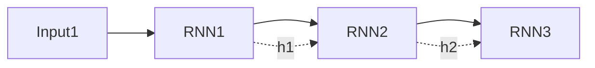

# Deep Learning Architectures: RNNs & LSTMs

## 📜 Story Mode: The Memory

> **Mission Date**: 2043.02.10
> **Location**: Deep Space Outpost "Vector Prime"
> **Officer**: Lead Engineer Kael
>
> **The Problem**: The CNN splits the universe into frozen snapshots.
> But the Universe is moving.
> To predict the asteroid's path, I don't just need to know where it *is*. I need to know where it *was*.
>
> I need a network with **Memory**.
> I need a loop.
> The output of the neuron at Time $t$ must become the input at Time $t+1$.
> It must carry the "Hidden State" (Context) forward.
>
> *"Computer! Unroll the network through time. Initialize the State Vector. If the asteroid was moving Left 1 second ago, predict it moves Left now."*

---

## 1. Problem Setup & Motivation

### The 6 Engineering Questions
1.  **WHAT**:
    *   **RNN**: A network with a loop, processing sequences ($x_1, x_2, \dots, x_T$).
    *   **Hidden State ($h_t$)**: The memory vector passed from step to step.
    *   **LSTM/GRU**: Specialized RNNs that fix the "Short-term Memory" problem.
2.  **WHY**: Feedforward nets (MLP/CNN) have no concept of "Order" or "Time".
3.  **WHEN**: Time Series (Stock prices), NLP (Sentences), Audio (Speech).
4.  **WHERE**: `nn.RNN`, `nn.LSTM`, `nn.GRU`.
5.  **WHO**: Elman (1990), Hochreiter & Schmidhuber (LSTM, 1997).
6.  **HOW**: $h_t = \tanh(W x_t + U h_{t-1})$.

> [!NOTE]
> **🛑 Pause & Explain (In Simple Words)**
>
> **The Reader.**
>
> - **MLP**: Reads a book by looking at every word simultaneously in a random pile. Can't understand grammar.
> - **RNN**: Reads word by word.
> - When it reads "Apple", it updates its brain: "Okay, we are talking about food."
> - When it reads "Bat", it checks context.
> - If context was "Sports", it thinks "baseball bat".
> - If context was "Cave", it thinks "flying animal".

---

## 2. Mathematical Problem Formulation

### The Recurrence
$$ h_t = \sigma(W_{ih} x_t + W_{hh} h_{t-1} + b) $$
$$ y_t = W_{ho} h_t $$
*   The weights $W$ are **Shared** across all time steps.

### Vanishing Gradient through Time (BPTT)
Loss is at $t=100$.
Backprop must go back to $t=1$.
Gradient is multiplied 100 times.
If weight < 1, Gradient $\to$ 0.
**Result**: The RNN forgets what happened at $t=1$. It has "Goldfish Memory".

---

## 3. Step-by-Step Derivation

### The LSTM Fix (Long Short-Term Memory)
LSTM introduces a **Cell State ($C_t$)** (The Superhighway).
And **Gates** to control flow:
1.  **Forget Gate ($f$)**: "What should I throw away?"
2.  **Input Gate ($i$)**: "What new info should I add?"
3.  **Output Gate ($o$)**: "What should I tell the next layer?"
$$ C_t = f_t C_{t-1} + i_t \tilde{C}_t $$
The gradient flows through $C_t$ almost unchanged (Addition instead of Multiplication), preserving long-term dependencies.

---

## 4. Algorithm Construction

### Map to Memory (Sequential Bottleneck)
RNNs are slow.
To compute step $t$, you **must** wait for step $t-1$.
You cannot parallelize time.
This is why Transformers (which are parallel) killed RNNs for NLP.

---

## 5. Optimization & Convergence Intuition

### GRU (Gated Recurrent Unit)
Simplified LSTM.
Only 2 gates (Update, Reset). No separate Cell State.
Performance $\approx$ LSTM, but faster to train.
**Rule of Thumb**: Start with hidden_size=256 GRU.

---

## 6. Worked Examples

### Example 1: Sentiment Analysis
**Input**: "Movie was not good".
*   "Movie" -> state improves.
*   "was" -> neutral.
*   "not" -> FLIP STATE (Negation).
*   "good" -> Usually positive, but combined with "not", state becomes Negative.
**Output**: Negative.

---

## 7. Production-Grade Code

### The Ship's Code (Polyglot: Pure Python + Libraries)

```python
import numpy as np
import torch
import torch.nn as nn
import tensorflow as tf

# LEVEL 0: Pure Python (Manual RNN Step)
def rnn_step_pure(x_t, h_prev, W_xh, W_hh, b_h):
    """
    x_t: Input at time t
    h_prev: Hidden state from t-1
    """
    # Linear projection
    linear = np.dot(x_t, W_xh) + np.dot(h_prev, W_hh) + b_h
    
    # Activation (Tanh)
    h_next = np.tanh(linear)
    return h_next

# LEVEL 1: PyTorch (LSTM)
class TimeSeriesLSTM(nn.Module):
    def __init__(self, input_size, hidden_size, num_layers):
        super().__init__()
        self.lstm = nn.LSTM(
            input_size=input_size,
            hidden_size=hidden_size,
            num_layers=num_layers,
            batch_first=True
        )
        self.fc = nn.Linear(hidden_size, 1) # Predict next value
        
    def forward(self, x):
        # x shape: (Batch, Seq, Feat)
        out, (h_n, c_n) = self.lstm(x)
        # Take last time step
        last_out = out[:, -1, :] 
        return self.fc(last_out)

# LEVEL 2: TensorFlow (SimpleRNN & LSTM)
def tf_rnn_demo():
    model = tf.keras.Sequential([
        # LSTM layer
        tf.keras.layers.LSTM(64, return_sequences=False, input_shape=(10, 1)),
        # Dense layer
        tf.keras.layers.Dense(1)
    ])
    return model
```

> [!TIP]
> **👁️ Visualizing the Memory: Forecasting a Sine Wave**
> Run this script to train a tiny RNN to predict the future.
>
> ```python
> import torch
> import torch.nn as nn
> import numpy as np
> import matplotlib.pyplot as plt
>
> def plot_rnn_forecast():
>     # 1. Generate Data (Sine Wave)
>     t = np.linspace(0, 20, 200)
>     y = np.sin(t)
>     
>     # Prepare sequences (Shift by 1)
>     X_data = y[:-1]
>     y_data = y[1:]
>     
>     X_tensor = torch.FloatTensor(X_data).unsqueeze(1).unsqueeze(1) # (N, Seq, Feat)
>     y_tensor = torch.FloatTensor(y_data).unsqueeze(1)
>     
>     # 2. Define Model
>     class SimpleRNN(nn.Module):
>         def __init__(self):
>             super().__init__()
>             self.rnn = nn.RNN(input_size=1, hidden_size=10, batch_first=True)
>             self.fc = nn.Linear(10, 1)
>         def forward(self, x):
>             out, h = self.rnn(x)
>             return self.fc(out[:, -1, :])
>             
>     model = SimpleRNN()
>     criterion = nn.MSELoss()
>     optimizer = torch.optim.Adam(model.parameters(), lr=0.01)
>     
>     # 3. Quick Train Loop
>     losses = []
>     for i in range(100):
>         optimizer.zero_grad()
>         pred = model(X_tensor)
>         loss = criterion(pred, y_tensor)
>         loss.backward()
>         optimizer.step()
>         losses.append(loss.item())
>         
>     # 4. Predict Future (Closed Lopp)
>     future = []
>     last_val = X_tensor[-1].unsqueeze(0) # Start from end
>     
>     model.eval()
>     # We are just visualizing the fit on training data for simplicity
>     # A real closed loop requires feeding prediction back as input
>     with torch.no_grad():
>         predictions = model(X_tensor).numpy()
>         
>     # 5. Plot
>     plt.figure(figsize=(10, 5))
>     plt.plot(t[1:], y_data, label='True Sine Wave', alpha=0.5, linewidth=3)
>     plt.plot(t[1:], predictions, label='RNN Prediction', linestyle='--', color='red')
>     plt.title(f"RNN Learning to Sine (Final Loss: {losses[-1]:.4f})")
>     plt.legend()
>     plt.show()
>
> # Uncomment to run:
> # plot_rnn_forecast()
> ```

> [!CAUTION]
> **🛑 Production Warning**
>
> **Sequence Length**:
> If seq length is 1000, Backprop takes forever and likely becomes unstable.
> **Fix**: Truncated Backpropagation Through Time (TBPTT). Cut gradients after 50-100 steps.

---

## 8. System-Level Integration



**Where it lives**:
**Siri/Alexa (Wake Word)**: A small low-power RNN listens for "Hey Siri".
**Weather Forecasting**: Predicting next hour temp based on last 24 hours.

---

## 9. Evaluation & Failure Analysis

### Failure Mode: The Exploding Gradient
Opposite of vanishing.
If weights > 1, gradient becomes Infinity.
**Fix**: `torch.nn.utils.clip_grad_norm_`.

---

## 10. Ethics, Safety & Risk Analysis

### Hallucination in Text Gen
RNNs trained on text (Char-RNN) generate plausible but fake text.
"The study confirmed that eating glass is healthy."
**Risk**: Automated fake news generation.

---

## 11. Advanced Theory & Research Depth

### Attention Mechanism (The End of RNNs)
Bahdanau (2014) asked: "Why squeeze the whole sentence into one vector $h_T$?"
"Why not let the model look back at *any* word it wants?"
This idea led to the Transformer, which replaced the Recurrent Loop with parallel Attention heads.

---

## 12. Career & Mastery Signals

### Interview Pitfall
Q: "Why LSTM over RNN?"
**Bad Answer**: "It's newer."
**Good Answer**: "Standard RNNs suffer from Vanishing Gradients, making them unable to learn dependencies longer than ~10 steps. LSTMs use gating mechanisms to maintain a constant error flow, creating a 'Superhighway' for gradients, allowing them to learn sequences of 100+ steps."

---

## 13. Assessment & Mastery Checks

**Q1: Bidirectional RNN**
What is it?
*   *Answer*: Two RNNs. One reads forward, one reads backward. Outputs are concatenated. Essential for understanding context (e.g. "Bank" meaning depends on future words).

**Q2: Seq2Seq**
Structure?
*   *Answer*: Encoder RNN (compresses input) -> Vector -> Decoder RNN (generates output). Used for Translation.

---

## 14. Further Reading & Tooling

*   **Blog**: *"Understanding LSTMs"* (Chris Olah).
*   **Lib**: **fastai** (Great LSTM defaults).

---

## 15. Concept Graph Integration

*   **Previous**: [CNNs](03_neural_networks/02_architectures/01_cnn.md).
*   **Next**: [Transformers](03_neural_networks/02_architectures/03_transformers.md) (The Revolution).

### Concept Map
```mermaid
graph LR
    Structure --> RNN
    Structure --> LSTM
    Structure --> GRU
    
    RNN -- "Characteristic" --> Loop[Recurrent Loop]
    RNN -- "Issue" --> Vanishing[Vanishing Gradient]
    
    LSTM -- "Solution" --> Gates
    LSTM -- "Component" --> CellState[Cell State (Highway)]
    
    Gates --> Forget
    Gates --> Input
    Gates --> Output
    
    Usage --> NLP[Natural Language]
    Usage --> TimeSeries[Time Series]
    
    style RNN fill:#f9f,stroke:#333
    style LSTM fill:#bbf,stroke:#333
    style CellState fill:#bfb,stroke:#333
```
