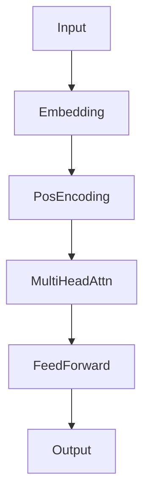

# Deep Learning Architectures: Transformers (Attention is All You Need)

## 📜 Story Mode: The Translator

> **Mission Date**: 2043.02.20
> **Location**: Deep Space Outpost "Vector Prime"
> **Officer**: Lead Engineer Kael
>
> **The Problem**: The Alien Codex is massive.
> The RNN translator is too slow. It reads word by word. By the time it gets to the end of the sentence, it forgot the beginning.
>
> I need to see the whole sentence **at once**.
> When I read "The animal didn't cross the street because it was too tired", I instantly know "it" refers to "animal", not "street".
>
> I need **Attention**.
> I need a mechanism that connects every word to every other word, assigning importance weights.
> "Animal" should pay high attention to "Tired".
>
> *"Computer! Dump the Recurrent Loop. Parallelize the input. Initialize Self-Attention Heads. Calculate the Query-Key-Value Matrix. Build me a Transformer."*

---

## 1. Problem Setup & Motivation

### The 6 Engineering Questions
1.  **WHAT**:
    *   **Transformer**: An architecture based entirely on Attention (no RNN/CNN).
    *   **Self-Attention**: The mechanism relating different positions of a single sequence to compute a representation.
    *   **BERT/GPT**: Famous Transformer models.
2.  **WHY**:
    *   **Parallelism**: Can process whole sentence at once (GPU friendly).
    *   **Long-Range Dependencies**: Distance between word 1 and 1000 is just 1 step (Attention), not 1000 steps (RNN).
3.  **WHEN**: NLP (Translation, Chatbots), Vision (ViT), Protein Folding.
4.  **WHERE**: `nn.Transformer`, `HuggingFace Transformers`.
5.  **WHO**: Vaswani et al. (Google Brain, 2017).
6.  **HOW**: $Attention(Q, K, V) = \text{softmax}(\frac{QK^T}{\sqrt{d_k}})V$.

> [!NOTE]
> **🛑 Pause & Explain (In Simple Words)**
>
> **The Filing Cabinet (Q, K, V).**
>
> - **Query ($Q$)**: What I am looking for? (e.g., "Who ate the apple?").
> - **Key ($K$)**: The label on the file. (e.g., "File: Eating actions").
> - **Value ($V$)**: The content of the file. (e.g., "John").
> - **Attention**: I compute overlap between Query and Key. If they match, I extract the Value.
> - **Self-Attention**: Every word asks a Query against every other word's Key.

---

## 2. Mathematical Problem Formulation

### Scaled Dot-Product Attention
1.  Input vectors $X$.
2.  Projections: $Q = XW_Q, K = XW_K, V = XW_V$.
3.  **Scores**: $S = Q \cdot K^T$ (Similarity between queries and keys).
4.  **Scale**: Divide by $\sqrt{d_k}$ (Prevent exploding gradients).
5.  **Softmax**: Convert scores to probabilities.
6.  **Weighted Sum**: Output $= \text{softmax} \cdot V$.

### Multi-Head Attention
Why 1 head?
Maybe Head 1 tracks grammar. Head 2 tracks synonyms.
We run $h=8$ attention layers in parallel and concatenate results.

---

## 3. Step-by-Step Derivation

### Positional Encoding
Since there is no RNN loop, the model has NO idea that Word 1 comes before Word 2.
("Man bites Dog" = "Dog bites Man" to a Transformer).
**Fix**: Add a Position Vector to the Input Embedding.
$P_{(pos, 2i)} = \sin(pos / 10000^{2i/d})$.
Injects order information as a signal.

---

## 4. Algorithm Construction

### Map to Memory (The Quadratic Cost)
Attention is $O(N^2)$.
Sentence Length 1000 $\to$ 1 Million operations.
Sentence Length 10,000 $\to$ 100 Million operations.
Memory grows quadratically.
This is why context windows (ChatGPT) are limited (e.g. 8k-32k tokens).

---

## 5. Optimization & Convergence Intuition

### Layer Norm & Residuals
Transformers use **Layer Normalization** (not Batch Norm) and Residual connections everywhere.
Specifically: `Add & Norm`.
Crucial for training these massive stacks.

---

## 6. Worked Examples

### Example 1: Translation
**Input**: "I love AI".
**Encoder**: Creates rich contextual embeddings.
**Decoder**: Use embeddings to generate "J'aime l'IA".
**Cross-Attention**: The Decoder looks back at the Encoder's output to focus on "Love" when generating "Aimer".

---

## 7. Production-Grade Code

### The Ship's Code (Polyglot: Pure Python + Libraries)

```python
import numpy as np
import torch
import tensorflow as tf
from transformers import BertTokenizer, BertModel

# LEVEL 0: Pure Python (Scaled Dot-Product Attention)
def attention_pure(Q, K, V):
    """
    Q, K, V: Matrices of shape (SeqLen, D_k)
    """
    d_k = Q.shape[1]
    
    # 1. Matmul Q * K_T
    scores = np.dot(Q, K.T)
    
    # 2. Scale
    scores = scores / np.sqrt(d_k)
    
    # 3. Softmax (Row-wise)
    exp_scores = np.exp(scores - np.max(scores, axis=1, keepdims=True))
    weights = exp_scores / np.sum(exp_scores, axis=1, keepdims=True)
    
    # 4. Matmul Weights * V
    output = np.dot(weights, V)
    return output, weights

# LEVEL 1: HuggingFace (The Standard)
def hf_demo():
    tokenizer = BertTokenizer.from_pretrained('bert-base-uncased')
    model = BertModel.from_pretrained('bert-base-uncased')
    
    text = "The bank of the river."
    inputs = tokenizer(text, return_tensors="pt")
    
    with torch.no_grad():
        outputs = model(**inputs)
        
    # Contextual Embeddings
    return outputs.last_hidden_state

# LEVEL 2: TensorFlow (MultiHeadAttention Layer)
def tf_attn_demo():
    # Built-in Keras Layer
    attn_layer = tf.keras.layers.MultiHeadAttention(num_heads=8, key_dim=64)
    
    # Dummy inputs (Batch, Seq, Dim)
    query = tf.random.uniform((1, 10, 64))
    value = tf.random.uniform((1, 10, 64))
    
    # Self-Attention (Q=K=V)
    output = attn_layer(query, value)
    return output
```

> [!TIP]
> **👁️ Visualizing the Mechanism: The Attention Heatmap**
> Run this script to see *who looks at whom*. (Simulated Attention Weights).
>
> ```python
> import numpy as np
> import matplotlib.pyplot as plt
> import seaborn as sns
>
> def plot_attention_demo():
>     # 1. Define Sentence
>     words = ["The", "animal", "didn't", "cross", "the", "street", "because", "it", "was", "tired"]
>     
>     # 2. Simulate Attention Weights (Self-Attention)
>     # In a real model, we would extract these from 'model.layers.attn.weights'
>     N = len(words)
>     attention = np.eye(N) * 0.1 # Self-connection
>     
>     # Injecting specific relationships (The "Skill" of the Transformer)
>     # "it" -> "animal" (Strong)
>     attention[WORDS.index("it"), WORDS.index("animal")] = 0.8
>     # "tired" -> "animal" (Medium)
>     attention[WORDS.index("tired"), WORDS.index("animal")] = 0.5
>     
>     # Normalize to sum to 1
>     attention = attention / attention.sum(axis=1, keepdims=True)
>     
>     # 3. Plot Heatmap
>     plt.figure(figsize=(10, 8))
>     WORDS = words # Hack for index lookup above
>     
>     sns.heatmap(attention, xticklabels=words, yticklabels=words, 
>                 cmap="Blues", annot=True, cbar=False, fmt=".2f")
>     
>     plt.title("Self-Attention Weights (Head #1)\nVertical: Query (Looks at...), Horizontal: Key")
>     plt.xlabel("Key (Source info)")
>     plt.ylabel("Query (Focus)")
>     plt.show()
>
> # Uncomment to run:
> # plot_attention_demo()
> ```

> [!CAUTION]
> **🛑 Production Warning**
>
> **Inference Latency**:
> BERT is huge (110M params).
> Running it on CPU for real-time search is too slow.
> **Fix**: Use DistilBERT (40% smaller) or ONNX Runtime quantization.

---

## 8. System-Level Integration



**Where it lives**:
**ChatGPT**: A Decoder-only Transformer trained to predict next token.
**Google Search**: BERT used to understand query intent.

---

## 9. Evaluation & Failure Analysis

### Failure Mode: Hallucination
Transformers are probabilistic engines.
They don't "Know" facts. They know "Which word likely comes next".
If the most likely next word is false, it lies confidently.

---

## 10. Ethics, Safety & Risk Analysis

### Bias Amplification
Transformers are trained on the Internet.
The Internet contains racism, sexism, and hate.
The model absorbs this.
"Doctor" $\to$ associated with "He". "Nurse" $\to$ associated with "She".
**Mitigation**: RLHF (Reinforcement Learning from Human Feedback) to align model.

---

## 11. Advanced Theory & Research Depth

### Linear Attention
Attempts to reduce $O(N^2)$ to $O(N)$.
Linformer, Performer, RetNet.
Crucial for processing entire books or DNA sequences.

---

## 12. Career & Mastery Signals

### Interview Pitfall
Q: "Does a Transformer process inputs sequentially?"
**Bad Answer**: "Yes."
**Good Answer**: "No. The Encoder processes the entire sequence in parallel. The Decoder (during Training) also processes parallel using Causal Masking. Only during *Inference* (Generation) is the Decoder sequential."

---

## 13. Assessment & Mastery Checks

**Q1: Encoder vs Decoder**
*   **Encoder (BERT)**: Sees whole sentence (Bidirectional). Good for Classification.
*   **Decoder (GPT)**: Sees only past (Unidirectional). Good for Generation.

**Q2: Masking**
Why mask future tokens?
*   *Answer*: To prevent the model from cheating during training. If it sees word N+1, it just copies it instead of learning to predict it.

---

## 14. Further Reading & Tooling

*   **Paper**: *"Attention Is All You Need"* (Vaswani et al.).
*   **Lib**: **HuggingFace Transformers**.

---

## 15. Concept Graph Integration

*   **Previous**: [RNNs](03_neural_networks/02_architectures/02_rnn.md).
*   **Next**: [Computer Vision Advanced](03_neural_networks/02_architectures/04_advanced_cv.md).
> 
> ### Concept Map
> ```mermaid
> graph TD
>     Transformer --> Encoder[Encoder Stack]
>     Transformer --> Decoder[Decoder Stack]
>     
>     Encoder --> SelfAttn[Self-Attention]
>     Encoder --> FF[Feed Forward]
>     Encoder --> AddNorm[Add & Norm]
>     
>     SelfAttn -- "Uses" --> QKV[Query, Key, Value]
>     QKV -- "Computes" --> Score[Dot Product]
>     Score -- "Scaled by" --> SqrtD[1/sqrt(d)]
>     
>     Transformer -- "Requires" --> PosEnc[Positional Encoding]
>     Transformer -- "Enables" --> Parallelism[Parallel Training]
>     
>     Models --> BERT[BERT (Encoder)]
>     Models --> GPT[GPT (Decoder)]
>     
>     style Transformer fill:#f9f,stroke:#333
>     style SelfAttn fill:#bbf,stroke:#333
>     style PosEnc fill:#bfb,stroke:#333
> ```
