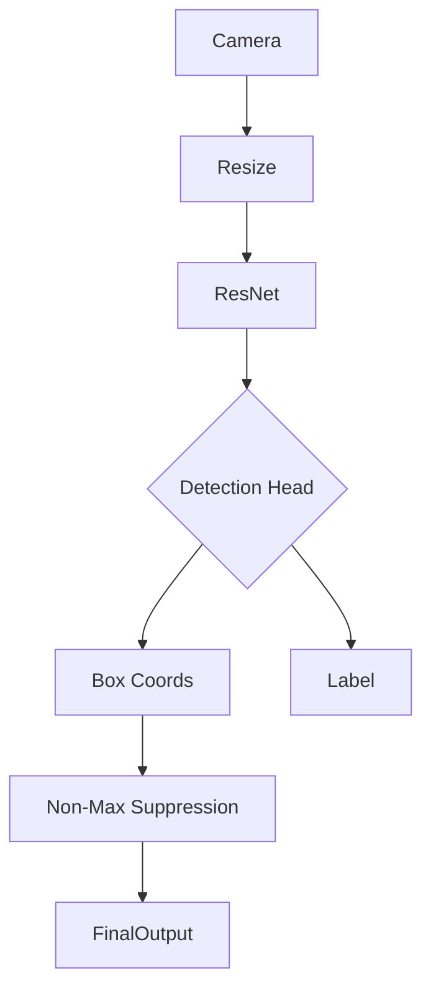

# Deep Learning: Advanced Computer Vision (Detection & Segmentation)

## 📜 Story Mode: The Scanner

> **Mission Date**: 2043.03.01
> **Location**: Deep Space Outpost "Vector Prime"
> **Officer**: Lead Engineer Kael
>
> **The Problem**: The CNN (ResNet) is great. It looks at a picture of a ship and says "Ship".
> But the General screams: "WHERE is the ship? And is it 100 meters long or 500 meters?"
>
> Classification ("What") is not enough.
> I need Detection ("Where"). I need a bounding box.
> Even better, I need Segmentation ("Which pixels"). I need to know exactly which hull plates are damaged.
>
> I can't just output one probability.
> I need to output Coordinates $(x, y, w, h)$.
> I need to output a Mask (Height x Width).
>
> *"Computer! Upgrade the Vision Stack. Deploy YOLO for threat tracking. Deploy U-Net for hull damage assessment. We need pixel-perfect precision."*

---

## 1. Problem Setup & Motivation

### The 6 Engineering Questions
1.  **WHAT**:
    *   **Object Detection**: Drawing Bounding Boxes around objects (YOLO, Faster R-CNN).
    *   **Semantic Segmentation**: Classifying every single pixel (U-Net, DeepLab).
    *   **Instance Segmentation**: Distinguishing between *this* chair and *that* chair (Mask R-CNN).
2.  **WHY**: Self-driving cars need to know *where* the pedestrian is, not just that a pedestrian exists.
3.  **WHEN**: Robotics, Medical Imaging (finding tumors), Autonomous Navigation.
4.  **WHERE**: `torchvision.models.detection`, `segmentation_models_pytorch`.
5.  **WHO**: Redmon (YOLO, 2015), Ronneberger (U-Net, 2015).
6.  **HOW**:
    *   **Detection**: Regression of coordinates $(x, y, w, h)$.
    *   **Segmentation**: Encoder-Decoder structure that outputs a Mask.

> [!NOTE]
> **🛑 Pause & Explain (In Simple Words)**
>
> **The Paint by Numbers.**
>
> - **Classification**: "This is a picture of a Beach."
> - **Detection**: "There is a Ball at [10, 10] and a Dog at [50, 50]." (Drawing Boxes).
> - **Segmentation**: "Pixels 1-100 are Sand. Pixels 101-200 are Water. Pixels 201-300 are Sky." (Coloring the lines).

---

## 2. Mathematical Problem Formulation

### Intersection over Union (IoU)
How do we measure if a box is "correct"?
$$ \text{IoU} = \frac{\text{Area of Overlap}}{\text{Area of Union}} $$
*   IoU = 1.0: Perfect match.
*   IoU > 0.5: Generally considered a "True Positive".

### The YOLO Loss Function
It's a monster. It combines:
1.  **Box Loss**: MSE of $(x, y, w, h)$. (Are we in the right place?)
2.  **Objectness Loss**: Binary Cross Entropy. (Is there something here?)
3.  **Class Loss**: Cross Entropy. (Is it a Dog or a Cat?)

---

## 3. Step-by-Step Derivation

### U-Net (The Encoder-Decoder)
1.  **Encoder (Downsampling)**: Standard CNN (ResNet). Compresses Image -> Features.
    *   Image (256x256) $\to$ Features (16x16).
2.  **Decoder (Upsampling)**: Transposed Convolutions or Bilinear Interpolation.
    *   Features (16x16) $\to$ Mask (256x256).
3.  **Skip Connections**: The Decoder needs "High Res" info from the Encoder to draw sharp edges. We concatenate Encoder layers to Decoder layers.

---

## 4. Algorithm Construction

### Map to Memory (The Anchor Box)
How does YOLO find a box?
It splits the image into a Grid (e.g., 7x7).
Each grid cell predicts: "If the center of an object is inside me, I am responsible for it."
It predicts 2 boxes (Tall, Wide).
7x7 cells * 2 boxes = 98 predictions.
Then **Non-Maximum Suppression (NMS)** removes overlapping duplicates.

---

## 5. Optimization & Convergence Intuition

### Data Augmentation (Crucial)
For detection, if you Flip the image, you must Flip the coordinates of the Box too!
Libraries like `Albumentations` handle this automatically.
If you use standard `torchvision.transforms`, you might break your labels (Image flips, Box stays).

---

## 6. Worked Examples

### Example 1: Finding Tumors (U-Net)
**Input**: MRI Scan.
**Output**: A mask where 1=Tumor, 0=Healthy.
**Metric**: Dice Coefficient ($2 \times \text{Overlap} / \text{Total Pixels}$). Accuracy is bad (because 99% of pixels are healthy, so empty mask = 99% acc).

---

## 7. Production-Grade Code

### 1. Scratch Implementation: IoU

```python
import numpy as np

def calculate_iou(boxA, boxB):
    # box: [x1, y1, x2, y2]
    
    # 1. Coordinate of Intersection
    xA = max(boxA[0], boxB[0])
    yA = max(boxA[1], boxB[1])
    xB = min(boxA[2], boxB[2])
    yB = min(boxA[3], boxB[3])

    # 2. Area of Intersection (clip to 0 if no overlap)
    interArea = max(0, xB - xA) * max(0, yB - yA)

    # 3. Area of both boxes
    boxAArea = (boxA[2] - boxA[0]) * (boxA[3] - boxA[1])
    boxBArea = (boxB[2] - boxB[0]) * (boxB[3] - boxB[1])

    # 4. IoU
    iou = interArea / float(boxAArea + boxBArea - interArea)
    return iou

# Test
b1 = [0, 0, 10, 10] # Area 100
b2 = [5, 0, 15, 10] # Area 100, Overlap 50
print(f"IoU: {calculate_iou(b1, b2)}") # Should be 50 / 150 = 0.33
```

### The Ship's Code (Polyglot: Pure Python + Libraries)

```python
import numpy as np
import torch
import torch.nn as nn
import tensorflow as tf

# LEVEL 0: Pure Python (Non-Max Suppression)
# The Filter for detecting duplicates
def nms_pure(boxes, scores, threshold=0.5):
    """
    boxes: [[x1, y1, x2, y2], ...]
    scores: [0.9, 0.75, ...]
    """
    if len(boxes) == 0: return []
    
    # Sort by score
    indices = np.argsort(scores)[::-1]
    keep = []
    
    while len(indices) > 0:
        current = indices[0]
        keep.append(current)
        
        # Compare current box with all others
        rest_indices = indices[1:]
        ious = np.array([calculate_iou(boxes[current], boxes[i]) for i in rest_indices])
        
        # Keep boxes with LOW IoU (not overlapping)
        # i.e., different objects
        indices = rest_indices[ious < threshold]
        
    return keep # Indices of boxes to keep

# LEVEL 1: PyTorch (U-Net Architecture)
class UNet(nn.Module):
    def __init__(self):
        super().__init__()
        # Encoder
        self.enc1 = self.conv_block(3, 64)
        self.pool = nn.MaxPool2d(2)
        # Bottleneck
        self.bottleneck = self.conv_block(64, 128)
        # Decoder
        self.upconv = nn.ConvTranspose2d(128, 64, 2, 2)
        self.dec1 = self.conv_block(128, 64) # 64+64 input from concat
        self.final = nn.Conv2d(64, 1, 1)
        
    def conv_block(self, in_c, out_c):
        return nn.Sequential(
            nn.Conv2d(in_c, out_c, 3, padding=1),
            nn.ReLU()
        )
        
    def forward(self, x):
        e1 = self.enc1(x)
        b = self.bottleneck(self.pool(e1))
        d1 = self.upconv(b)
        d1 = torch.cat((d1, e1), dim=1) # Skip Connection
        return torch.sigmoid(self.final(self.dec1(d1)))

# LEVEL 2: TensorFlow (U-Net Sketch)
def tf_unet_demo():
    inputs = tf.keras.Input(shape=(128, 128, 3))
    
    # Encoder
    c1 = tf.keras.layers.Conv2D(64, 3, padding='same', activation='relu')(inputs)
    p1 = tf.keras.layers.MaxPooling2D()(c1)
    
    # Bottleneck
    b = tf.keras.layers.Conv2D(128, 3, padding='same', activation='relu')(p1)
    
    # Decoder
    u1 = tf.keras.layers.Conv2DTranspose(64, 2, strides=2, padding='same')(b)
    u1 = tf.keras.layers.Concatenate()([u1, c1]) # Skip
    c2 = tf.keras.layers.Conv2D(64, 3, padding='same', activation='relu')(u1)
    
    outputs = tf.keras.layers.Conv2D(1, 1, activation='sigmoid')(c2)
    return tf.keras.Model(inputs, outputs)
```

> [!TIP]
> **👁️ Visualizing the Metric: Intersection over Union (IoU)**
> Run this script to see visually what it means to overlap.
>
> ```python
> import matplotlib.pyplot as plt
> import matplotlib.patches as patches
>
> def plot_iou_demo():
>     # Define two boxes [x, y, w, h]
>     # Ground Truth (Green)
>     gt_box = [10, 10, 50, 50] 
>     # Prediction (Red) - Shifted right and down
>     pred_box = [30, 30, 50, 50]
>     
>     # Convert to x1,y1,x2,y2 for math
>     boxA = [gt_box[0], gt_box[1], gt_box[0]+gt_box[2], gt_box[1]+gt_box[3]]
>     boxB = [pred_box[0], pred_box[1], pred_box[0]+pred_box[2], pred_box[1]+pred_box[3]]
>     
>     # Calculate Overlap
>     xA = max(boxA[0], boxB[0])
>     yA = max(boxA[1], boxB[1])
>     xB = min(boxA[2], boxB[2])
>     yB = min(boxA[3], boxB[3])
>     
>     interArea = max(0, xB - xA) * max(0, yB - yA)
>     boxAArea = gt_box[2] * gt_box[3]
>     boxBArea = pred_box[2] * pred_box[3]
>     iou = interArea / float(boxAArea + boxBArea - interArea)
>     
>     # Plot
>     fig, ax = plt.subplots(figsize=(6, 6))
>     
>     # Add Rectangles
>     rect_gt = patches.Rectangle((gt_box[0], gt_box[1]), gt_box[2], gt_box[3], 
>                                 linewidth=2, edgecolor='g', facecolor='none', label='Ground Truth')
>     rect_pred = patches.Rectangle((pred_box[0], pred_box[1]), pred_box[2], pred_box[3], 
>                                   linewidth=2, edgecolor='r', facecolor='none', label='Prediction')
>     
>     # Add Intersection
>     if interArea > 0:
>         rect_inter = patches.Rectangle((xA, yA), xB-xA, yB-yA, 
>                                        linewidth=0, facecolor='yellow', alpha=0.5, label='Intersection')
>         ax.add_patch(rect_inter)
>         
>     ax.add_patch(rect_gt)
>     ax.add_patch(rect_pred)
>     
>     ax.set_xlim(0, 100)
>     ax.set_ylim(0, 100)
>     ax.legend()
>     ax.set_title(f"IoU Visualization\nIoU = {iou:.2f}")
>     plt.show()
>
> # Uncomment to run:
> # plot_iou_demo()
> ```

> [!CAUTION]
> **🛑 Production Warning**
>
> **Training Speed**:
> Object Detection training allows complex data loading (parsing XML/JSON annotations, resizing boxes).
> The **CPU** usually becomes the bottleneck, not the GPU.
> **Fix**: Use `num_workers=4` in DataLoader and pre-cache images.

---

## 8. System-Level Integration



**Where it lives**:
**Amazon Go**: Tracking customers and products using overlapping bounding boxes.
**Zoom Background**: Real-time segmentation to separate Person from Background.

---

## 9. Evaluation & Failure Analysis

### mAP (Mean Average Precision)
The gold standard metric.
1.  Calculate Precision/Recall at varying IoU thresholds (0.5, 0.75).
2.  Average them.
It's complicated but fair. "High mAP" means "I find most objects AND my boxes are tight."

---

## 10. Ethics, Safety & Risk Analysis

### Military Use
Object Detection is the core technology of autonomous drones/weapons.
**YOLO** author (Joseph Redmon) quit CV research because of ethical concerns regarding military application.
**Dual Use**: The same tech that finds cancer finds targets.

---

## 11. Advanced Theory & Research Depth

### Foundation Models (SAM)
**Segment Anything Model** (Meta).
A promptable segmentation model.
You click a pixel, it masks the whole object.
Trained on 1 Billion masks.
It is the "GPT" of Segmentation.

---

## 12. Career & Mastery Signals

### Interview Pitfall
Q: "What is the difference between One-Stage and Two-Stage Detectors?"
**Bad Answer**: "One is faster."
**Good Answer**: "**Two-Stage (R-CNN)** generates Region Proposals first, then classifies them. Accurate but slow. **One-Stage (YOLO)** does it all in a single pass. Faster but historically less accurate (though modern YOLOv8 is very accurate)."

---

## 13. Assessment & Mastery Checks

**Q1: Anchor Box**
What is it?
*   *Answer*: A pre-defined box shape (e.g., tall/narrow for humans, wide for cars). The model predicts *offsets* from this anchor, rather than raw coordinates, which stabilizes training.

**Q2: Semantic vs Instance**
Two cars parked next to each other.
*   **Semantic**: Returns one blob called "Car".
*   **Instance**: Returns "Car 1" and "Car 2" separately.

---

## 14. Further Reading & Tooling

*   **Lib**: **Ultralytics YOLO** (The industry standard).
*   **Lib**: **Detectron2** (Facebook's research library).

---

## 15. Concept Graph Integration

*   **Previous**: [Transformers](03_neural_networks/02_architectures/03_transformers.md).
*   **Next**: [Graph Neural Networks](03_neural_networks/04_advanced_paradigms/01_gnn.md).

### Concept Map
```mermaid
graph TD
    CV[Advanced CV] --> Detection
    CV --> Segmentation
    
    Detection -- "Output" --> BBox[Bounding Box]
    Segmentation -- "Output" --> Mask[Pixel Mask]
    
    Detection --> TwoStage[Two-Stage (R-CNN)]
    Detection --> OneStage[One-Stage (YOLO)]
    
    Segmentation --> Semantic[Semantic (U-Net)]
    Segmentation --> Instance[Instance (Mask R-CNN)]
    
    Performance -- "Metric" --> IoU[Intersection over Union]
    Performance -- "Metric" --> mAP[Mean Avg Precision]
    
    OneStage -- "Grid Idea" --> ResponsibleCell
    TwoStage -- "Idea" --> Proposals
    
    style CV fill:#f9f,stroke:#333
    style Detection fill:#bbf,stroke:#333
    style Segmentation fill:#bfb,stroke:#333
```
```
