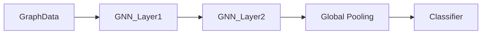

# Advanced Paradigms: GNNs & Self-Supervised Learning

## 📜 Story Mode: The Network

> **Mission Date**: 2043.03.15
> **Location**: Deep Space Outpost "Vector Prime"
> **Officer**: Lead Engineer Kael
>
> **The Problem**: We have a map of the Starlink Communication Network.
> 10,000 Satellites (Nodes) connected by Lasers (Edges).
>
> I need to predict which satellite will fail.
> A CNN doesn't work. Satellites aren't pixels in a grid. They are a **Graph**.
> If Satellite A gets hot, Satellite B (connected to it) gets hot too.
>
> **Problem 2**: We have data for 10,000 systems, but labels for only 50 failures.
> I can't train a Supervisor on 50 examples.
> I need the network to teach *itself* using the Unlabeled data.
>
> *"Computer! Initiate Graph Convolution. Propagate messages along the edges. Then run Self-Supervised Pre-training. Mask 50% of the nodes and force the AI to reconstruct them."*

---

## 1. Problem Setup & Motivation

### The 6 Engineering Questions
1.  **WHAT**:
    *   **GNN (Graph Neural Network)**: Deep Learning on Non-Euclidean data (Graphs).
    *   **SSL (Self-Supervised Learning)**: Creating labels from the data itself (e.g., "Predict the next word", "Predict the missing part of image").
2.  **WHY**:
    *   **GNN**: Molecules, Social Networks, Maps don't fit into Tables or Images.
    *   **SSL**: Labeling data is expensive. Unlabeled data is free/infinite.
3.  **WHEN**: Drug Discovery (GNN), Training Foundation Models (SSL).
4.  **WHERE**: `PyTorch Geometric` (PyG), `Lightly` (SSL).
5.  **WHO**: Kipf & Welling (GCN, 2016), LeCun (SSL).
6.  **HOW**: Message Passing implies Neighbor Aggregation.

> [!NOTE]
> **🛑 Pause & Explain (In Simple Words)**
>
> **The Rumor Mill (GNN).**
>
> - **Node**: A Person.
> - **Edge**: Friendship.
> - **Feature**: Your opinion.
> - **GCN Layer**: You ask all your friends for their opinion. You average them. You update your own opinion.
> - After 3 layers, you know the "General Vibe" of your extended neighborhood.

---

## 2. Mathematical Problem Formulation

### Graph Convolution (Message Passing)
For Node $v$, gather features $h_u$ from neighbors $N(v)$.
$$ h_v^{(k+1)} = \sigma(W \cdot \text{AGG}(\{h_u^{(k)} : u \in N(v)\} \cup \{h_v^{(k)}\})) $$
*   **AGG**: Sum, Mean, or Max.
*   This is generalization of CNN (where neighbors are fixed grid pixels).

### Contrastive Learning (SSL)
Take Image X.
Create 2 augmentations: $X_1$ (Crop), $X_2$ (Color Jitter).
The Model must output vectors $z_1, z_2$ such that $\text{sim}(z_1, z_2)$ is High.
And $\text{sim}(z_1, z_{random})$ is Low.
This forces the model to learn "Concept of Cat" invariant to rotation/color.

---

## 3. Step-by-Step Derivation

### Why SSL works? (The Jigsaw Puzzle)
If I give you a Jigsaw puzzle, you have to look at the shapes and textures to solve it.
You learn "Edges usually continue lines".
You learn "Blue implies Sky".
You learn the *structure* of the data without anyone telling you "This is a Sky".
This Pre-trained brain is then very easy to fine-tune for "Sky Classification".

---

## 4. Algorithm Construction

### Map to Memory (Sparse Matrices)
Graphs are Sparse. Adjacency Matrix of Facebook is $10^9 \times 10^9$ (Impossible to store).
We store strictly the Edge Index (List of pairs).
`edge_index = [[0, 1, 1, 2], [1, 0, 2, 1]]`.
GNN libraries are optimized for this Sparse Scatter-Gather operation.

---

## 5. Optimization & Convergence Intuition

### Oversmoothing in GNNs
If you stack too many GNN layers (e.g. 50), every node aggregates info from the whole graph.
Eventually, all nodes become identical (Average of everyone).
**Fix**: Skip Connections, DropEdge, or just keep GNNs shallow (2-5 layers).

---

## 6. Worked Examples

### Example 1: Molecule Toxicity (GNN)
**Node**: Atom (C, H, O).
**Edge**: Bond (Single, Double).
**Task**: Predict if molecule kills bacteria.
**Result**: AI discovers new antibiotics (Halicin) by seeing structural patterns humans missed.

### Example 2: Masked Autoencoder (MAE)
Take an image. Black out 75% of patches.
Ask AI to paint them back.
To succeed, it must "understand" that a Dog has a Tail.
It learns high-level semantics.

---

## 7. Production-Grade Code

### The Ship's Code (Polyglot: Pure Python + Libraries)

```python
import numpy as np
import torch
import torch.nn.functional as F
from torch_geometric.nn import GCNConv
from torch_geometric.data import Data
import tensorflow as tf

# LEVEL 0: Pure Python (Manual Message Passing)
def graph_conv_pure(node_features, edge_list):
    """
    node_features: List of vectors [[1.0], [2.0], ...]
    edge_list: Pairs [[0,1], [1,2], ...]
    """
    num_nodes = len(node_features)
    output = np.zeros_like(node_features)
    
    # 1. Aggregate Neighbors
    for target, source in edge_list:
        # Message: Source Feature -> Target
        output[target] += node_features[source]
        # Undirected? Add reverse too
        output[source] += node_features[target]
        
    # 2. Add Self-Loop (Skip Connection)
    output += node_features
    
    # 3. Normalize (Mean) - Simplified
    # In reality, divide by degree
    return output

# LEVEL 1: PyTorch Geometric (GCN)
class GCN(torch.nn.Module):
    def __init__(self, num_features, num_classes):
        super().__init__()
        self.conv1 = GCNConv(num_features, 16)
        self.conv2 = GCNConv(16, num_classes)

    def forward(self, data):
        x, edge_index = data.x, data.edge_index

        x = self.conv1(x, edge_index)
        x = F.relu(x)
        x = F.dropout(x, training=self.training)
        x = self.conv2(x, edge_index)

        return F.log_softmax(x, dim=1)

# LEVEL 2: TensorFlow (Spectral Conv Sketch)
class GraphConvLayer(tf.keras.layers.Layer):
    def __init__(self, units):
        super().__init__()
        self.units = units
        
    def build(self, input_shape):
        self.w = self.add_weight(shape=(input_shape[-1], self.units),
                                 initializer='random_normal')
                                 
    def call(self, inputs, adj_matrix):
        # 1. Support = X * W
        support = tf.matmul(inputs, self.w)
        # 2. Output = Adj * Support
        output = tf.matmul(adj_matrix, support)
        return tf.nn.relu(output)
```

> [!CAUTION]
> **🛑 Production Warning**
>
> **Inductive vs Transductive**:
> Standard GCN assumes fixed graph. (Transductive).
> If a New User joins the network, you have to retrain.
> **Fix**: Use **GraphSAGE** (Sample and Aggregate). It learns a function to aggregate neighbors, so it handles invisible nodes.

> [!CAUTION]
> **🛑 Production Warning**
>
> **Inductive vs Transductive**:
> Standard GCN assumes fixed graph. (Transductive).
> If a New User joins the network, you have to retrain.
> **Fix**: Use **GraphSAGE** (Sample and Aggregate). It learns a function to aggregate neighbors, so it handles invisible nodes.

---

## 8. System-Level Integration



**Where it lives**:
**Pinterest**: Uses GraphSAGE to recommend pins ("Users who pinned this also pinned that").
**Google Maps**: ETA prediction using GNNs on road segments.

---

## 9. Evaluation & Failure Analysis

### Failure Mode: Homophily Assumption
GCNs assume connected nodes are similar (Friends agree).
In "Heterophilic" graphs (e.g. Dating apps, Predator-Prey), connected nodes are *different*.
Standard GCNs fail here.
**Fix**: Specialized architectures (MixHop).

---

## 10. Ethics, Safety & Risk Analysis

### Social Contagion
GNNs on Social Networks optimize for "Virality".
They learn that maximizing engagement means connecting Angry people with controversial content.
This promotes polarization.

---

## 11. Advanced Theory & Research Depth

### Geometric Deep Learning
The unifying theory (Bronstein).
CNN = GNN on a Grid Graph.
Transformer = GNN on a Fully Connected Graph.
RNN = GNN on a Line Graph.
All of DL is just GNNs with different symmetries.

---

## 12. Career & Mastery Signals

### Interview Pitfall
Q: "Why not just use an Adjacency Matrix as input to an MLP?"
**Bad Answer**: "It's too big."
**Good Answer**: "It defines no permutation invariance. If I re-order nodes 1 and 2, the MLP treats it as a totally different graph. GNNs are permutation invariant."

---

## 13. Assessment & Mastery Checks

**Q1: SimCLR**
How does it define positive pairs?
*   *Answer*: Two augmented views of the *same* image.

**Q2: Message Passing**
Can GNN distinguish all graphs?
*   *Answer*: No. It's limited to the power of the Weisfeiler-Lehman (WL) Isomorphism test. It can't distinguish certain symmetric structures.

---

## 14. Further Reading & Tooling

*   **Lib**: **PyTorch Geometric** (The standard).
*   **Course**: **CS224W** (Stanford Graph ML).

---

## 15. Concept Graph Integration

*   **Previous**: [Advanced CV](03_neural_networks/02_architectures/04_advanced_cv.md).
*   **Next**: [Scaling](03_neural_networks/05_scaling/01_distributed.md).
