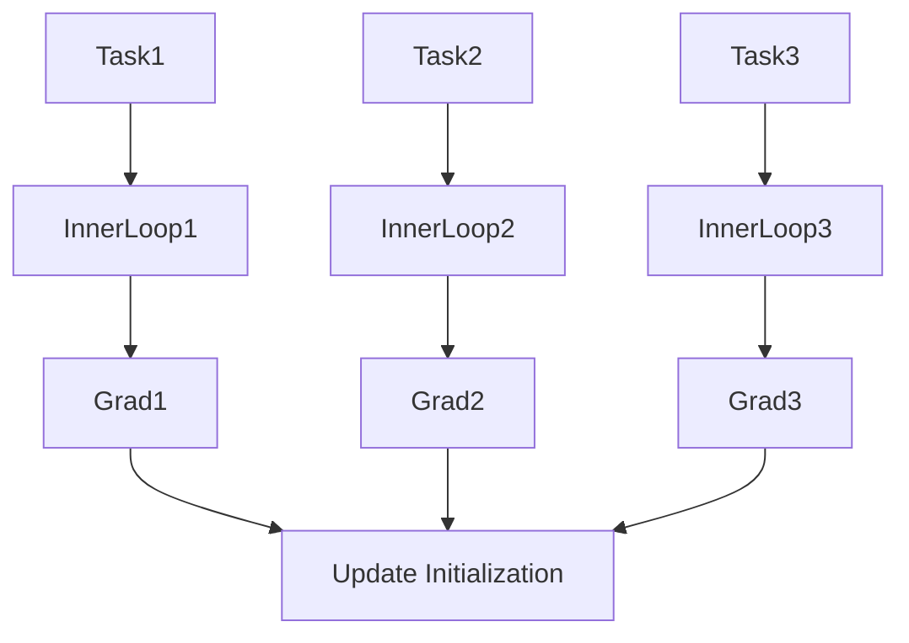

# Advanced Paradigms: Meta-Learning (Learning to Learn)

## 📜 Story Mode: The Student

> **Mission Date**: 2043.05.01
> **Location**: Deep Space Outpost "Vector Prime"
> **Officer**: Lead Engineer Kael
>
> **The Problem**: I see a new type of alien glyph. I've never seen it before.
> I only have **one image** of it.
>
> The Deep Learning model (ResNet) needs 1,000 images to learn a new class.
> If I retrain it on this 1 image, it overfits immediately.
>
> But the Pilot (Human) looked at it once and said: "Okay, I got it. It looks like a twisted star."
> Humans are **Few-Shot Learners**. We use our past experience of "Learning" to learn new things instantly.
>
> I need a model that doesn't just learn *concepts*.
> I need a model that learns *how to update its own weights efficiently*.
>
> *"Computer! Initiate Meta-Training. Task: Identify new glyphs from single examples. Algorithm: MAML. Teach the AI to be a quick study."*

---

## 1. Problem Setup & Motivation

### The 6 Engineering Questions
1.  **WHAT**:
    *   **Meta-Learning**: Training a model on a variety of tasks so it can adapt to a new task with little data.
    *   **Few-Shot Learning**: Learning from $K$ examples (e.g., 1-Shot, 5-Shot).
    *   **MAML**: A specific algorithm that finds a set of "Good Initial Weights".
2.  **WHY**: In the real world (Robotics, Rare Diseases), we don't have Big Data. We have Small Data.
3.  **WHEN**: Cold-start problems, Personalization (FaceID works with 1 scan).
4.  **WHERE**: `learn2learn` library, `torchmeta`.
5.  **WHO**: Finn et al. (MAML, 2017).
6.  **HOW**: Bi-Level Optimization (Inner Loop updates weights, Outer Loop updates initialization).

> [!NOTE]
> **🛑 Pause & Explain (In Simple Words)**
>
> **The Backpack.**
>
> - **Standard Learning**: You go on a hike (Task A). You pack specifically for that hike.
> - **Meta-Learning**: You prepare a "Go-Bag".
> - It contains things that are useful for *any* hike.
> - When a new hike starts, you only need to add 1 or 2 specific items (1-Shot) to be ready.
> - MAML optimizes the contents of the Go-Bag.

---

## 2. Mathematical Problem Formulation

### N-Way K-Shot
*   **Support Set**: $K$ labeled images for each of $N$ classes. (The "Study Material").
*   **Query Set**: Unseen images to test on. (The "Exam").
*   **MAML Objective**:
    Find params $\theta$ such that after 1 gradient step on Task $i$, the loss on Task $i$ is minimized.
    $$ \min_\theta \sum_i \mathcal{L}_{task_i}( \theta - \alpha \nabla_\theta \mathcal{L}_{task_i}(\theta) ) $$

---

## 3. Step-by-Step Derivation

### Prototypical Networks (Metric Learning)
Instead of updating weights, just learn a metric space.
1.  Embed all 5 examples of "Dog" into the space.
2.  Take the mean $\to$ **Prototype** vector for Dog.
3.  Given a query, find which Prototype is closest.
Siamese Networks are a simple form of this.

---

## 4. Algorithm Construction

### Map to Memory (Second Order Derivatives)
MAML requires computing the gradient *of the gradient*.
We differentiate through the inner update step.
This is expensive (Hessian-Vector products).
**Reptile**: A First-Order approximation of MAML that is much faster and almost as good.

---

## 5. Optimization & Convergence Intuition

### The Pre-Training Fallacy
"Why not just pre-train on everything?"
Pre-training fixes the features.
Meta-learning fixes the *plasticity*.
A Meta-Learned model adapts *faster* than a merely Pre-trained model.

---

## 6. Worked Examples

### Example 1: Omniglot (The MNIST of Meta-Learning)
Dataset of 1623 handwritten characters from 50 alphabets.
Task: See a new character once, draw it.
MAML solves this with >99% accuracy.

---

## 7. Production-Grade Code

### The Ship's Code (Polyglot: Pure Python + Libraries)

```python
import numpy as np
import torch
import torch.nn as nn
import torch.nn.functional as F
import tensorflow as tf

# LEVEL 0: Pure Python (Prototype Calculation)
def prototype_pure(support_set):
    """
    support_set: {Class_A: [[1,1], [1,2]], Class_B: [[5,5], [5,6]]}
    """
    prototypes = {}
    for class_id, vectors in support_set.items():
        # Mean Vector
        proto = np.mean(vectors, axis=0) 
        prototypes[class_id] = proto
        
    return prototypes

def classify_pure(query, prototypes):
    # Nearest Neighbor to Prototype
    best_class = None
    min_dist = float('inf')
    
    for class_id, proto in prototypes.items():
        dist = np.linalg.norm(query - proto)
        if dist < min_dist:
            min_dist = dist
            best_class = class_id
            
    return best_class

# LEVEL 1: PyTorch (Prototypical Net)
def euclidean_dist(x, y):
    n, m, d = x.size(0), y.size(0), x.size(1)
    x = x.unsqueeze(1).expand(n, m, d)
    y = y.unsqueeze(0).expand(n, m, d)
    return torch.pow(x - y, 2).sum(2)

class ProtoNet(nn.Module):
    def __init__(self, input_dim, hidden_dim):
        super().__init__()
        self.encoder = nn.Sequential(
            nn.Linear(input_dim, hidden_dim),
            nn.ReLU(),
            nn.Linear(hidden_dim, hidden_dim)
        )
        
    def forward(self, support, query):
        z_support = self.encoder(support) # (N*K, H)
        z_query = self.encoder(query)     # (Q, H)
        
        # Calculate Prototypes (Assuming 5 classes, 1 shot)
        # Reshape -> Mean across 'shot' dimension
        prototypes = z_support.view(5, 1, -1).mean(1)
        
        dists = euclidean_dist(z_query, prototypes)
        return F.log_softmax(-dists, dim=1)

# LEVEL 2: TensorFlow (Few-Shot Data Generator)
def tf_few_shot_gen(dataset, n_way=5, k_shot=1):
    # Pseudo-code for complex data pipeline
    # 1. Sample N classes
    # 2. Sample K images from each
    # 3. Batch them
    ds = tf.data.Dataset.from_generator(
        lambda: generator_logic(dataset, n_way, k_shot),
        output_signature=(tf.TensorSpec(shape=(n_way*k_shot, 28, 28, 1)), tf.TensorSpec(shape=(n_way*k_shot,)))
    )
    return ds
```

> [!CAUTION]
> **🛑 Production Warning**
>
> **Class Imbalance**:
> Few-Shot learning is incredibly sensitive to outliers.
> If your 1 Shot is a blurry image of a dog, the Prototype will be garbage.
> **Fix**: Use "3-Shot" or "5-Shot" whenever possible to average out noise.

> [!CAUTION]
> **🛑 Production Warning**
>
> **Class Imbalance**:
> Few-Shot learning is incredibly sensitive to outliers.
> If your 1 Shot is a blurry image of a dog, the Prototype will be garbage.
> **Fix**: Use "3-Shot" or "5-Shot" whenever possible to average out noise.

---

## 8. System-Level Integration



**Where it lives**:
**Robotics**: Sim-to-Real transfer. Learn to walk in Sim (Meta-Training), adapt to Real physics in 1 minute (Test Adaptation).

---

## 9. Evaluation & Failure Analysis

### Failure Mode: Memorization
If the tasks are too similar, the model just memorizes the answer instead of learning *how* to learn.
**Fix**: Ensure task diversity in the Meta-Training set.

---

## 10. Ethics, Safety & Risk Analysis

### DeepFakes
Few-Shot learning allows generating a Fake Video of a person from just **1 photo**.
This lowers the barrier to entry for identity theft.

---

## 11. Advanced Theory & Research Depth

### Neural Turing Machines
Adding "External Memory" to a neural net so it can read/write data like a computer.
Often trained via Meta-Learning to learn algorithms (Sorting, Copying).

---

## 12. Career & Mastery Signals

### Interview Pitfall
Q: "Is Fine-Tuning a form of Meta-Learning?"
**Bad Answer**: "Yes."
**Good Answer**: "Strictly speaking, no. Fine-tuning updates weights on a new task. Meta-Learning explicitly optimizes the *initialization* or the *update rule* to maximize fine-tuning performance."

---

## 13. Assessment & Mastery Checks

**Q1: K-Shot N-Way**
If I show you 3 photos each of 10 different bird species, is that 3-Way 10-Shot?
*   *Answer*: No. N-Way = Number of Classes (10). K-Shot = Examples per class (3). So 10-Way 3-Shot.

---

## 14. Further Reading & Tooling

*   **Paper**: *"Model-Agnostic Meta-Learning for Fast Adaptation of Deep Networks"* (Finn et al.).
*   **Lib**: **Learn2Learn**.

---

## 15. Concept Graph Integration

*   **Previous**: [Advanced Paradigms](03_neural_networks/04_advanced_paradigms/01_gnn_ssl.md).
*   **Next**: [Scaling](03_neural_networks/05_scaling/01_distributed.md).
