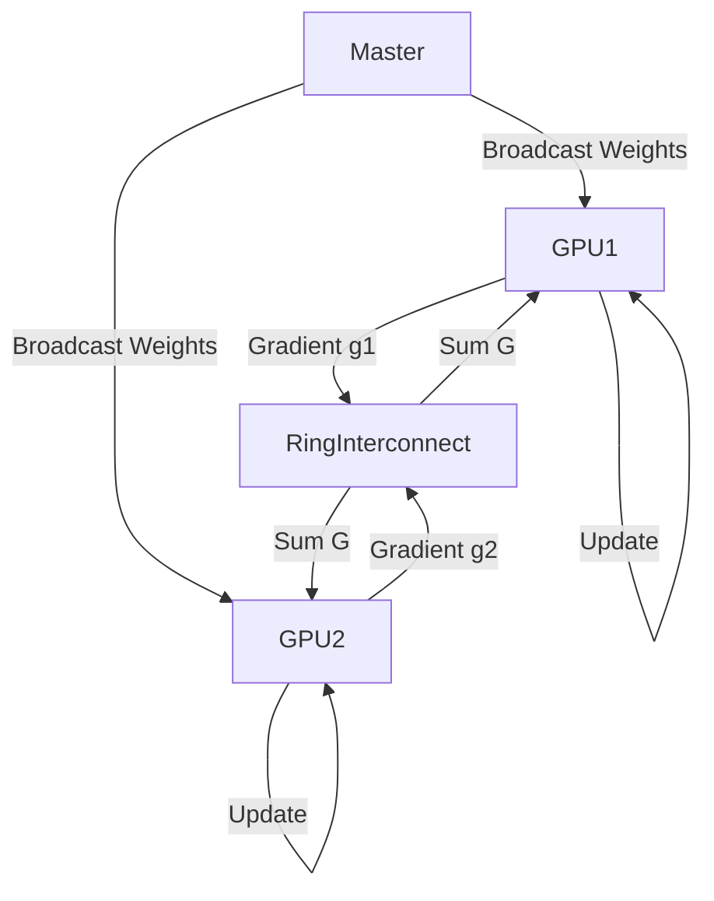

# Scaling & Production: Distributed Training & Quantization

## 📜 Story Mode: The Factory

> **Mission Date**: 2043.04.01
> **Location**: Deep Space Outpost "Vector Prime"
> **Officer**: Lead Engineer Kael
>
> **The Problem**: The model is good, but it takes 1 Year to train on a single GPU.
> The Asteroid is coming in 1 Week.
>
> **Solution 1**: I have 100 GPUs. I need to make them work as a team.
> Each GPU will process a slice of the data.
> Then they will synchronize gradients. "I saw a shift left", "I saw a shift right" -> "Okay, let's move middle".
>
> **Solution 2**: The weights are 32-bit Floats (High Precision).
> Do I really need 7 decimal places? $0.1234567$?
> No. $0.12$ is fine.
> I will chop the bits in half (FP16).
> The model runs 2x faster and uses 50% RAM.
>
> *"Computer! Initiate Distributed Data Parallel. Enable Automatic Mixed Precision. Quantize to INT8 for deployment. Speed is life."*

---

## 1. Problem Setup & Motivation

### The 6 Engineering Questions
1.  **WHAT**:
    *   **Distributed Training**: Using $N$ GPUs to train 1 model.
    *   **Mixed Precision (AMP)**: Using Float16 (Half) instead of Float32 (Full) for math.
    *   **Quantization**: Converting weights to Integers (INT8) for inference.
2.  **WHY**:
    *   **Speed**: Linear scaling (10 GPUs $\approx$ 9x speedup).
    *   **Memory**: Fits larger batch sizes.
3.  **WHEN**: Large Models (LLMs), Large Datasets (ImageNet).
4.  **WHERE**: `torch.nn.parallel.DistributedDataParallel`, `torch.cuda.amp`.
5.  **WHO**: HPC Engineers.
6.  **HOW**: Gradient Synchronization (All-Reduce).

> [!NOTE]
> **🛑 Pause & Explain (In Simple Words)**
>
> **The Choir.**
>
> - **Single GPU**: One singer singing the whole opera via themself. Slow.
> - **Model Parallel**: One singer sings Soprano, one sings Bass. (Hard to coordinate).
> - **Data Parallel (DDP)**: 100 Singers. They all have the same sheet music (Weights).
> - They each sing a *different verse* (Data Batch).
> - At the end of the verse, they look at each other and agree on the tempo change (Average the Gradients).
> - Then they flip the page together.

---

## 2. Mathematical Problem Formulation

### Data Parallelism (DDP)
1.  Copy Model to $k$ GPUs.
2.  Split Batch $B$ into $B_1, \dots, B_k$.
3.  Forward pass on each GPU (independently).
4.  Backward pass (independently) computes $g_1, \dots, g_k$.
5.  **All-Reduce**: Sync gradients. $G = \frac{1}{k} \sum g_i$.
6.  Update Weights same on all GPUs.

### Mixed Precision
Float32 Range: $10^{-38}$ to $10^{38}$.
Float16 Range: $10^{-5}$ to $65504$.
**Danger**: Gradients are often tiny (e.g. $10^{-7}$). In FP16, they become 0 (Underflow).
**Fix**: Gradient Scaling. Multiply Loss by 1000. Compute Grad (now $10^{-4}$). Update. Divide weights by 1000.

---

## 3. Step-by-Step Derivation

### Quantization (INT8)
Weights $w \in [-1.5, 2.3]$.
We map this range to integers $[0, 255]$.
$$ q = \text{round}(w / S + Z) $$
*   $S$: Scale.
*   $Z$: Zero-point.
Inference becomes Matrix Multiplication of Integers (Very fast on CPU/Mobile).

---

## 4. Algorithm Construction

### Map to Memory (The Communication Overhead)
DDP requires syncing gradients every step.
If Network is slow (1Gb Ethernet), spend 50% time waiting.
If Network is fast (NVLink/InfiniBand), efficient scaling.
**Gradient Accumulation**: A poor man's large batch. Run 4 steps without syncing. Then sync.

---

## 5. Optimization & Convergence Intuition

### Larger Batch Size Trap
With 100 GPUs, Batch Size = $32 \times 100 = 3200$.
Large batches converge *worse* (sharp minima).
**Fix**: Linear Learning Rate Scaling using Warmup.
$\eta = \eta_{base} \times k$.

---

## 6. Worked Examples

### Example 1: Training BERT
1 GPU: 2 weeks.
8 GPUs (DDP): 2 days.
8 GPUs + AMP (FP16): 1 day.

---

## 7. Production-Grade Code

### The Ship's Code (Polyglot: Pure Python + Libraries)

```python
import numpy as np
import torch
import torch.nn as nn
import torch.optim as optim
from torch.cuda.amp import GradScaler, autocast
import tensorflow as tf

# LEVEL 0: Pure Python (Quantization Logic)
def quantize_pure(weights, scale, zero_point):
    """
    weights: List of floats [-0.5, 1.2, ...]
    """
    q_weights = []
    for w in weights:
        # q = round(w / S + Z)
        q = round(w / scale + zero_point)
        # Clamp to INT8 range [0, 255]
        q = max(0, min(255, q))
        q_weights.append(int(q))
    return q_weights

# LEVEL 1: PyTorch (Mixed Precision)
def torch_amp_demo():
    # Setup
    device = 'cuda' if torch.cuda.is_available() else 'cpu'
    model = nn.Linear(100, 10).to(device)
    optimizer = optim.Adam(model.parameters(), lr=1e-3)
    scaler = GradScaler() # Mangages the scaling
    
    data = torch.randn(64, 100).to(device)
    target = torch.randn(64, 10).to(device)
    
    # Training Loop
    optimizer.zero_grad()
    
    # 1. Autocast (Runs forward in FP16)
    with autocast():
        output = model(data)
        loss = nn.MSELoss()(output, target)
    
    # 2. Scale Loss (Prevents underflow)
    scaler.scale(loss).backward()
    
    # 3. Step (Unscales and updates)
    scaler.step(optimizer)
    scaler.update()

# LEVEL 2: TensorFlow (Distributed Strategy)
def tf_distributed_demo():
    # MirroredStrategy: Copies model to all GPUs on one machine
    strategy = tf.distribute.MirroredStrategy()
    
    print(f'Number of devices: {strategy.num_replicas_in_sync}')
    
    with strategy.scope():
        # Model creation must happen INSIDE the scope
        model = tf.keras.Sequential([tf.keras.layers.Dense(1, input_shape=(1,))])
        model.compile(loss='mse', optimizer='adam')
        
    return model
```

> [!CAUTION]
> **🛑 Production Warning**
>
> **Deadlock**:
> In Distributed Training, if one GPU crashes, the others wait forever for the "All-Reduce" signal.
> The whole cluster hangs.
> **Fix**: Set timeouts and use a cluster manager (Slurm/Kubernetes) to auto-restart.

> [!CAUTION]
> **🛑 Production Warning**
>
> **Deadlock**:
> In Distributed Training, if one GPU crashes, the others wait forever for the "All-Reduce" signal.
> The whole cluster hangs.
> **Fix**: Set timeouts and use a cluster manager (Slurm/Kubernetes) to auto-restart.

---

## 8. System-Level Integration



**Where it lives**:
**OpenAI**: GPT-4 was trained on ~25,000 GPUs using a mix of Data Parallel and Model Parallel (Sharding layers across GPUs).

---

## 9. Evaluation & Failure Analysis

### Failure Mode: NaN Loss in AMP
If Gradient Scaling is too aggressive, numbers exceed 65504 (Overflow). Result is Infinity/NaN.
The `GradScaler` detects this and skips the step, then reduces the scale factor.

---

## 10. Ethics, Safety & Risk Analysis

### The Resource Moat
Only Big Tech has 10,000 GPUs.
Academia/Startups cannot replicate results.
This centralizes power.
**Counter-movement**: Decentralized training (Training over the internet like Folding@Home), but technically hard.

---

## 11. Advanced Theory & Research Depth

### ZeRO (Zero Redundancy Optimizer)
Standard DDP duplicates the Optimizer States (Momentum) on every GPU. Wasteful.
**ZeRO**: Shards the optimizer states. GPU 1 holds momentum for layer 1. GPU 2 for layer 2.
Allows training models 8x larger on valid hardware. (Used in DeepSpeed).

---

## 12. Career & Mastery Signals

### Interview Pitfall
Q: "Does FP16 reduce accuracy?"
**Bad Answer**: "Yes, lots."
**Good Answer**: "Usually negligible (<1%). The noise in SGD is already larger than the precision loss. We gain speed/memory with almost zero acc drop."

---

## 13. Assessment & Mastery Checks

**Q1: DP vs DDP**
*   **DP `DataParallel`**: Single Process, Multi-Thread. Slow (GIL bottleneck).
*   **DDP `DistributedDataParallel`**: Multi-Process. Fast. Always use DDP.

**Q2: Quantization**
When to use?
*   *Answer*: Deployment (Edge devices). Not Training.

---

## 14. Further Reading & Tooling

*   **Lib**: **DeepSpeed** (Microsoft) - Scaling to Trillion parameters.
*   **Lib**: **Horovod** (Uber) - Easy distributed API.

---

## 15. Concept Graph Integration

*   **Previous**: [Advanced Paradigms](03_neural_networks/04_advanced_paradigms/01_gnn_ssl.md).
*   **Next**: [Project / Multimodal](03_neural_networks/06_project_multimodal/README.md).
