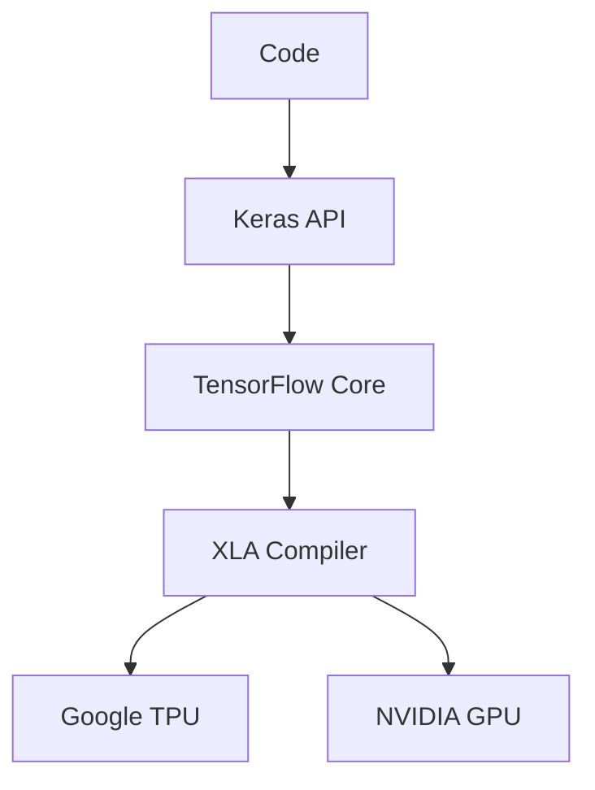

# Frameworks: TensorFlow & Keras (The Multiverse)

## 📜 Story Mode: The Multiverse

> **Mission Date**: 2043.05.10
> **Location**: Deep Space Outpost "Vector Prime"
> **Officer**: Lead Engineer Kael
>
> **The Problem**: We found an ancient AI core. It works, but the code looks alien.
> Instead of `output = model(input)`, it says `sess.run(output, feed_dict={...})`.
> It's **TensorFlow 1.0**. The "Static Graph" era.
>
> To interface with the new Federation ships (running **PyTorch**), we need to understand the old ways.
> We also need to understand the **Keras** abstraction—the high-level interface that makes building ships as easy as snapping Legos together.
>
> I need to be bilingual. To survive in this galaxy, I need to speak both **Torch** and **Tensor**.
>
> *"Computer! Load the TensorFlow container. Enable Eager Execution. Translate the ResNet model from PyTorch `nn.Module` to Keras `Functional API`. We are bridging the gap."*

---

## 1. Problem Setup & Motivation

### The 6 Engineering Questions
1.  **WHAT**:
    *   **TensorFlow (TF)**: Google's ML framework. Production-heavy, TFX ecosystem.
    *   **Keras**: The high-level API for TF. User-friendly.
    *   **PyTorch**: Meta's ML framework. Research-heavy, dynamic graphs.
2.  **WHY**: Industry uses both. Research favors PyTorch. Production sometimes favors TF (TFLite, TFJS).
3.  **WHEN**:
    *   **PyTorch**: Writing new papers, debugging complex loops.
    *   **TF/Keras**: Enterprise deployment, Javascript/Mobile apps.
4.  **WHERE**: `import tensorflow as tf`, `from tensorflow import keras`.
5.  **WHO**: Google Brain (TF), François Chollet (Keras).
6.  **HOW**: `model.fit(x, y)` vs `loss.backward()`.

> [!NOTE]
> **🛑 Pause & Explain (In Simple Words)**
>
> **The Architect vs The Painter.**
>
> - **TensorFlow 1.x (The Architect)**: You draw detailed blueprints (The Graph) first. Then you send them to the construction crew (Session) to build it. You can't change the blueprint while they are building.
> - **PyTorch (The Painter)**: You paint on the canvas directly. If you made a mistake, you paint over it. It's immediate ("Eager").
> - **TensorFlow 2.x**: It tries to be like the Painter (Eager by default) but keeps the Architect's blueprints in the basement (`@tf.function`).

---

## 2. Mathematical Problem Formulation

### Tensors: The Universal Language
Both use Tensors.
*   PyTorch: `torch.randn(3, 3)`
*   TF: `tf.random.normal((3, 3))`
The math is identical. The syntax varies slightly.
Dim 0 is always Batch. Dim 1 is Channels (usually, though TF prefers Channels Last `NHWC`).

---

## 3. Step-by-Step Derivation

### Static vs Dynamic Graphs
*   **Static (TF 1 / Compiled)**: Optimizes the graph *before* running. Can fuse operations (Conv + ReLU). Faster deployment.
*   **Dynamic (PyTorch / Eager)**: Interprets Python line-by-line. Easier debugging. Slower deployment (unless compiled).

---

## 4. Algorithm Construction

### Map to Memory (Channels First vs Last)
*   **PyTorch**: `(N, C, H, W)`. Optimized for NVIDIA CUDA.
*   **TensorFlow**: `(N, H, W, C)`. Optimized for CPU/TPU.
*   **The Pain**: Converting weights requires transposing dimensions `(0, 3, 1, 2)`.

---

## 5. Optimization & Convergence Intuition

### The Keras `.fit()` Loop
Keras abstracts the training loop.
*   **Good**: Less boilerplate code.
*   **Bad**: Harder to implement custom logic (e.g. GANs, RL) where you need to modify gradients mid-step.
*   **Fix**: Override `train_step()` in Keras.

---

## 6. Worked Examples

### Example 1: Defining a Model (Comparison)

**PyTorch**:
```python
class Net(nn.Module):
    def __init__(self):
        super().__init__()
        self.fc = nn.Linear(10, 1)
    def forward(self, x):
        return self.fc(x)
```

**Keras (Functional API)**:
```python
inputs = keras.Input(shape=(10,))
outputs = keras.layers.Dense(1)(inputs)
model = keras.Model(inputs, outputs)
```

**Keras (Sequential)**:
```python
model = keras.Sequential([keras.layers.Dense(1, input_shape=(10,))])
```

---

## 7. Production-Grade Code

### The Ship's Code (Polyglot: Pure Python + Libraries)

```python
import numpy as np
import torch
import tensorflow as tf

# LEVEL 0: Pure Python (The Graph Concept)
# Demonstrating "Lazy Evaluation" (Static Graph)
class GraphNode:
    def __init__(self, operation, inputs):
        self.operation = operation
        self.inputs = inputs
        
def run_graph(node, feed_dict):
    # 1. If leaf (input), return value
    if isinstance(node, str):
        return feed_dict[node]
        
    # 2. Recursively run inputs
    input_vals = [run_graph(i, feed_dict) for i in node.inputs]
    
    # 3. Execute op
    if node.operation == 'add': return input_vals[0] + input_vals[1]
    if node.operation == 'mul': return input_vals[0] * input_vals[1]

# Build Graph: z = (x + y) * 2
x = 'x'
y = 'y'
node_add = GraphNode('add', [x, y])
node_mul = GraphNode('mul', [node_add, GraphNode('const', [2])]) # Pseudo

# Run
# print(run_graph(node_mul, {'x': 3, 'y': 4})) # (3+4)*2 = 14

# LEVEL 1: TensorFlow (Custom Loop - The Modern Way)
def tf_train_step(model, optimizer, x, y):
    with tf.GradientTape() as tape:
        logits = model(x, training=True)
        loss = tf.reduce_mean(tf.square(logits - y))
        
    grads = tape.gradient(loss, model.trainable_weights)
    optimizer.apply_gradients(zip(grads, model.trainable_weights))
    return loss

# LEVEL 2: PyTorch (For Comparison)
def torch_train_step(model, optimizer, x, y):
    optimizer.zero_grad()
    logits = model(x)
    loss = torch.nn.MSELoss()(logits, y)
    loss.backward()
    optimizer.step()
    return loss
```

> [!CAUTION]
> **🛑 Production Warning**
>
> **GPU Memory Handling**:
> TensorFlow tries to grab **100% of GPU RAM** on startup by default.
> If you try to run a PyTorch script alongside it, PyTorch will crash (OOM).
> **Fix**: `tf.config.experimental.set_memory_growth(gpu, True)`.

> [!CAUTION]
> **🛑 Production Warning**
>
> **GPU Memory Handling**:
> TensorFlow tries to grab **100% of GPU RAM** on startup by default.
> If you try to run a PyTorch script alongside it, PyTorch will crash (OOM).
> **Fix**: `tf.config.experimental.set_memory_growth(gpu, True)`.

---

## 8. System-Level Integration



**Where it lives**:
**Google Photos**: Runs on TPUs (Tensor Processing Units) using TensorFlow.
**Android**: TFLite runs optimized .tflite models.

---

## 9. Evaluation & Failure Analysis

### Failure Mode: Version Hell
TF 1.x vs 2.x code is incompatible.
Keras 2 vs Keras 3 (Multi-backend) is different.
**Fix**: Use Docker containers to freeze environments.

---

## 10. Ethics, Safety & Risk Analysis

### Vendor Lock-in
PyTorch is more "Open".
TensorFlow is heavily tied to Google Cloud (GCP) and TPUs.
If you build your stack on THe TF ecosystem (TFX), migrating away from GCP is hard.

---

## 11. Advanced Theory & Research Depth

### XLA (Accelerated Linear Algebra)
A compiler that fuses operations to reduce memory bandwidth.
PyTorch 2.0 (`torch.compile`) now does this too.
The frameworks are converging.

---

## 12. Career & Mastery Signals

### Interview Pitfall
Q: "Which is better?"
**Bad Answer**: "PyTorch because I like it."
**Good Answer**: "PyTorch is superior for R&D and flexibility. TensorFlow/Keras has a mature deployment ecosystem (TFX, TFLite, TFJS). I choose based on whether the goal is a Paper or a Product."

---

## 13. Assessment & Mastery Checks

**Q1: GradientTape**
What is `tf.GradientTape`?
*   *Answer*: It is the TF equivalent of PyTorch's Autograd. It "records" operations so gradients can be computed later. In PyTorch, this recording is on by default (`requires_grad=True`).

**Q2: Channels Last**
Why does TF use `NHWC`?
*   *Answer*: CPUs process memory sequentially. Reading R,G,B for pixel 1 is faster if they are adjacent in memory. `NHWC` keeps them adjacent.

---

## 14. Further Reading & Tooling

*   **Lib**: **JAX** (The new contender from Google - purely functional tensor math).
*   **Book**: *"Deep Learning with Python"* (François Chollet).

---

## 15. Concept Graph Integration

*   **Previous**: [Scaling](03_neural_networks/05_scaling/01_distributed.md).
*   **Next**: [Assessment](03_neural_networks/06_assessment/01_deep_learning_exam.md).
