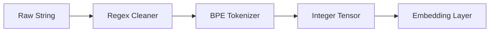

# NLP Foundations: Text Processing & Tokenization

## 📜 Story Mode: The Linguist

> **Mission Date**: 2043.06.01
> **Location**: Deep Space Outpost "Vector Prime"
> **Officer**: Lead Engineer Kael
>
> **The Problem**: We intercepted a message from the Unknown.
> It's not binary. It's text.
> *"Th3 qck brwn fx jmps ovr 13.5 lazy dgs!!"*
>
> The Neural Net crashes. It expects numbers, not strings.
> It doesn't know that "jmps" is the same as "jumps".
> It doesn't know that "dogs" and "dog" are the same animal.
>
> I need to clean this mess.
> I need to **Normalize** (Lower case, remove noise).
> I need to **Tokenize** (Cut it into atoms).
> I need to **Lemmatize** (Find the root).
>
> *"Computer! Import NLTK and SpaCy. Define a Regex to strip special characters. Initialize Byte-Pair Encoding. Let's make this machine read."*

---

## 1. Problem Setup & Motivation

### The 6 Engineering Questions
1.  **WHAT**:
    *   **NLP**: Making computers understand Human Language.
    *   **Tokenization**: Splitting text into chunks (Words, Subwords, Characters).
    *   **Normalization**: Cleaning text (Lowercasing, Stemming).
2.  **WHY**: Models can't process raw strings. We must convert text $\to$ Integers $\to$ Vectors.
3.  **WHEN**: Chatbots, Translation, Search Engines, Spam Filters.
4.  **WHERE**: `nltk`, `spacy`, `huggingface tokenizers`.
5.  **WHO**: Chomsky (Linguistics), Google (BERT Tokenizer).
6.  **HOW**: `text.split(' ')` (Naive) $\to$ `BPE` (Advanced).

> [!NOTE]
> **🛑 Pause & Explain (In Simple Words)**
>
> **The Lego Castle.**
>
> - **Raw Text**: A smashed Lego castle on the floor.
> - **Tokenization**: Sorting the pieces into bins (Red bricks, Blue plates).
> - **The Vocabulary**: The catalog of all unique pieces you found.
> - **Encoding**: Assigning an ID to each piece. "Red Brick 2x4" = ID 1045.
> - Now you can give the model a list of IDs: `[1045, 23, 88]`.

---

## 2. Mathematical Problem Formulation

### Vocabulary Size ($V$)
If we map every unique English word to an ID, $V \approx 1,000,000$.
Embedding Matrix Size: $1M \times 768 \approx 3GB$. Too big!
**Solution: Subword Tokenization (BPE)**.
Split "Walking" $\to$ "Walk" + "##ing".
Vocabulary drops to $\approx 30,000$.

---

## 3. Step-by-Step Derivation

### Byte-Pair Encoding (BPE)
Algorithm to learn the vocabulary:
1.  Start with all characters.
2.  Count frequent pairs. ("e" + "r" = "er").
3.  Merge them into a new token.
4.  Repeat until Vocab size limit reached.
**Result**: Common words are 1 token. Rare words are split.

---

## 4. Algorithm Construction

### Map to Memory (The Integer Sequence)
Input: "The cat sat."
Tokens: `["The", "cat", "sat", "."]`
IDs: `[101, 2304, 5502, 102]`
Tensor: `torch.tensor([101, 2304, 5502, 102])`.
This Tensor is what actually enters the Neural Network.

---

## 5. Optimization & Convergence Intuition

### Regex (Regular Expressions)
The "Dark Art" of NLP.
Fast, rule-based text matching.
`r"\b[A-Za-z0-9._%+-]+@[A-Za-z0-9.-]+\.[A-Z|a-z]{2,}\b"` (Finds Emails).
**Warning**: Bad regex can cause "Catastrophic Backtracking" and freeze the CPU.

---

## 6. Worked Examples

### Example 1: Stemming vs Lemmatization
**Stemming (Porter)**: Chops off ends.
*   "Universities" $\to$ "Univers" (Not a word). Fast.
**Lemmatization (WordNet)**: Uses a dictionary.
*   "Universities" $\to$ "University". Accurate but Slower.

---

## 7. Production-Grade Code

### The Ship's Code (Polyglot: Pure Python + Libraries)

```python
import re
from collections import defaultdict
import torch
from transformers import AutoTokenizer

# LEVEL 0: Pure Python (White-Space Tokenizer & Frequency)
def tokenize_pure(text):
    # 1. Normalize (Generic lowercasing)
    text = text.lower()
    # 2. Split (White Space)
    tokens = text.split()
    # 3. Clean (Remove lingering punctuation like "dogs!!")
    clean_tokens = [re.sub(r'[^a-z0-9]', '', t) for t in tokens]
    return [t for t in clean_tokens if t]

def build_vocab_pure(corpus):
    # Simple frequency count
    vocab = defaultdict(int)
    for text in corpus:
        tokens = tokenize_pure(text)
        for t in tokens:
            vocab[t] += 1
    return dict(vocab)

# LEVEL 1: HuggingFace (Production Helper)
def hf_demo():
    # 1. Load a pre-trained tokenizer (BERT)
    tokenizer = AutoTokenizer.from_pretrained("bert-base-uncased")
    
    # 2. Text
    text = "The quick brown fox jumps."
    
    # 3. Tokenize
    # Return PyTorch Tensors (pt)
    inputs = tokenizer(text, return_tensors="pt", padding=True, truncation=True)
    
    print("Input IDs:", inputs['input_ids'])
    # Output: tensor([[ 101, 1996, 4248, 2829, 4419, 14523, 1012,  102]])
    # 101: [CLS] (Start), 102: [SEP] (End)
    
    return inputs
```

> [!TIP]
> **👁️ Visualizing the Power Law: Zipf's Law**
> Language follows a Power Law. A few words (the, of, and) appear EVERYWHERE. Most words appear once.
>
> ```python
> import matplotlib.pyplot as plt
> import numpy as np
> import re
> from collections import Counter
>
> def plot_zipfs_law():
>     # 1. Simulate a Corpus (or use a real string)
>     # Here is a dummy text generator that mimics power law
>     vocab_size = 1000
>     ranks = np.arange(1, vocab_size + 1)
>     # Zipf: Freq proportional to 1/Rank
>     frequencies = 10000 / ranks 
>     
>     # Add some noise
>     frequencies = frequencies * np.random.normal(1, 0.1, vocab_size)
>     frequencies = np.sort(frequencies)[::-1] # Sort desc
>     
>     # 2. Plot Log-Log
>     plt.figure(figsize=(10, 6))
>     plt.loglog(ranks, frequencies, marker='.', linestyle='none', color='blue', alpha=0.5)
>     
>     # Theoretical Line
>     plt.loglog(ranks, 10000/ranks, 'r--', label='Theoretical Zipf (1/Rank)')
>     
>     plt.title("Zipf's Law: Word Rank vs Frequency (Log-Log Scale)")
>     plt.xlabel("Rank (1 = Most Common Word)")
>     plt.ylabel("Frequency")
>     plt.grid(True, which="both", ls="-", alpha=0.2)
>     plt.legend()
>     plt.show()
>
> # Uncomment to run:
> # plot_zipfs_law()
> ```

> [!CAUTION]
> **🛑 Production Warning**
>
> **The Unknown Token `[UNK]`**:
> If a word isn't in vocabulary, the tokenizer replaces it with `[UNK]`.
> If you have too many UNKs, your model is blind.
> **Fix**: Use Subword Tokenization (BPE/WordPiece) which can virtually represent any string.

---

## 8. System-Level Integration



**Where it lives**:
**Google Search**: Tokenizes your query, corrects spelling (Levenshtein Distance), then embeds.

---

## 9. Evaluation & Failure Analysis

### Failure Mode: Encoding Issues
`UnicodeDecodeError: 'utf-8' codec can't decode...`
The most common error in NLP.
**Fix**: Always force `encoding='utf-8'` when opening files.

---

## 10. Ethics, Safety & Risk Analysis

### Biased Vocabularies
If your tokenizer assumes English characters (ASCII), it will mangle Chinese/Arabic.
Start with a **Multilingual** vocabulary if serving global users.

---

## 11. Advanced Theory & Research Depth

### SentencePiece
A tokenizer that treats the input as a raw stream of bytes (no space splitting).
Used in ALBERT and T5.
Robust to missing spaces ("Thecat" $\to$ "The", "cat").

---

## 12. Career & Mastery Signals

### Interview Pitfall
Q: "Why lower-case everything?"
**Bad Answer**: "To make it cleaner."
**Good Answer**: "To reduce Sparsity. 'Apple' and 'apple' mean the same thing. If we keep both, we split the training data for that concept in half. However, for Named Entity Recognition (NER), casing is a useful signal (Apple Inc. vs apple), so we might keep it."

---

## 13. Assessment & Mastery Checks

**Q1: Stop Words**
What are they?
*   *Answer*: Common words (the, is, at) that carry little meaning. We often remove them to save space in classical BOW models, but **Keep Them** in Transformer models (as they define grammar).

---

## 14. Further Reading & Tooling

*   **Lib**: **SpaCy** (Industrial strength NLP).
*   **Lib**: **HuggingFace Tokenizers** (Rust-backed, blazing fast).

---

## 15. Concept Graph Integration

*   **Previous**: [Deep Learning Exam](03_neural_networks/06_assessment/01_deep_learning_exam.md).
*   **Next**: [Embeddings](04_nlp/02_embeddings.md).

### Concept Map
```mermaid
graph LR
    Text[Raw Text] --> Tokenization
    Tokenization --> Tokens
    Tokens --> IDs[Numerical IDs]
    
    Tokenization --> WordLevel[Word Split]
    Tokenization --> CharLevel[Char Split]
    Tokenization --> Subword[Subword (BPE)]
    
    Subword -- "Solves" --> OOV[Out of Vocabulary]
    Subword -- "Balances" --> VocabSize
    
    Process --> Normalization
    Normalization --> Lowercasing
    Normalization --> Stemming
    Normalization --> Lemmatization
    
    style Text fill:#f9f,stroke:#333
    style Tokenization fill:#bbf,stroke:#333
    style Subword fill:#bfb,stroke:#333
```
