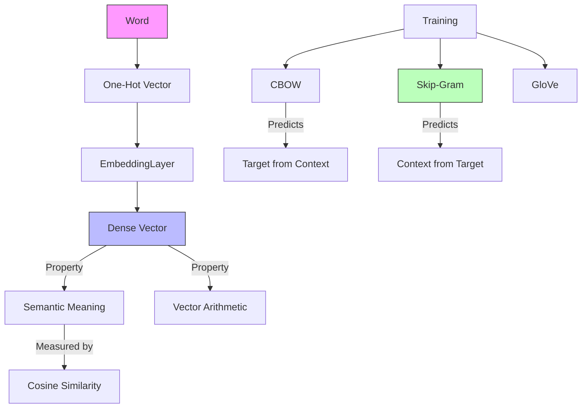

# NLP: Word Embeddings (The Meaning Vector)

## 📜 Story Mode: The Librarian

> **Mission Date**: 2043.06.10
> **Location**: Deep Space Outpost "Vector Prime"
> **Officer**: Lead Engineer Kael
>
> **The Problem**: I have the tokens. `[23, 992, 105]`.
> But to the math model, 23 is "close" to 24.
> In reality, ID 23 is "King" and ID 24 is "Cabbage". They are not close.
>
> One-Hot Encoding (`[0, 0, ..., 1, 0]`) is too sparse.
> I need a densely packed vector where "King" matches "Queen".
>
> I need a **Map of Meaning**.
> If I subtract "Man" from "King" and add "Woman", I should land on "Queen".
>
> *"Computer! Train a Word2Vec model on the Corpus. Dimensions: 300. Window: 5. Map these integers to geometric coordinates."*

---

## 1. Problem Setup & Motivation

### The 6 Engineering Questions
1.  **WHAT**:
    *   **Embedding**: A dense vector (e.g., size 300) representing a word.
    *   **Word2Vec**: Algorithm to learn these vectors by predicting context.
    *   **Context**: "The cat [sat] on the mat".
2.  **WHY**: To capture semantic relationships. Synonyms should have high Cosine Similarity.
3.  **WHEN**: Input to *any* Deep NLP model (RNN, Transformer).
4.  **WHERE**: `nn.Embedding` (PyTorch), `layers.Embedding` (Keras).
5.  **WHO**: Mikolov (Google, 2013).
6.  **HOW**: Learn weights $W$ such that $W_{word} \cdot W_{context}$ is maximized.

> [!NOTE]
> **🛑 Pause & Explain (In Simple Words)**
>
> **The Library Catalog.**
>
> - **One-Hot**: Every book is on a shelf by ID. shelf 1, shelf 2... No relation between them.
> - **Embedding**: We arrange the library by *Genre*.
> - "Harry Potter" is placed next to "Lord of the Rings".
> - "Cookbook" is far away.
> - The XYZ coordinates of the book are its Embedding Vector.

---

## 2. Mathematical Problem Formulation

### Skip-Gram Model
Maximize probability of context words $w_{c}$ given target $w_t$.
$$ P(w_c | w_t) = \frac{\exp(v_c \cdot u_t)}{\sum \exp(v_k \cdot u_t)} $$
*   $u_t$: Vector of target word.
*   $v_c$: Vector of context word.
*   **Metric**: Cosine Similarity $\frac{A \cdot B}{||A|| ||B||}$.

---

## 3. Step-by-Step Derivation

### The Math is the Same
Whether you use PyTorch or Keras, the underlying operation is a **Lookup Table**.
An Embedding Layer is just a matrix of size $(Vocabulary, Dim)$.
The "Forward Pass" is essentially: `Matrix[Input_IDs]`.
It is differentiable, so backprop updates the meaning of the words.

---

## 4. Algorithm Construction

### Map to Memory
Vectors are dense floats.
Vocab: 10,000. Dim: 300.
Memory: $10,000 \times 300 \times 4 \text{ bytes (float32)} \approx 12 \text{ MB}$.
Very cheap compared to Images.

---

## 5. Optimization & Convergence Intuition

### Pre-trained Vectors (GloVe / FastText)
Training embeddings from scratch requires Wikipedia-scale data.
If you have a small dataset, your embeddings will be trash.
**Solution**: Download pre-trained GloVe vectors. Load them into your Embedding Layer. Freeze them.

---

## 6. Worked Examples

### The King - Man + Woman = Queen
Features learned by embeddings:
*   Dim 1: Gender (Positive = Fem, Negative = Masc).
*   Dim 2: Royalty.
*   King: [-1, 1]. Man: [-1, 0]. Woman: [1, 0].
*   King - Man + Woman = [-1 - -1 + 1, 1 - 0 + 0] = [1, 1] = Queen.

---

## 7. Production-Grade Code: The Framework Face-off

Here we implement a simple Sentiment Classifier using Embeddings in **Both** frameworks.

### The Ship's Code (Polyglot: Pure Python + Libraries)

```python
import numpy as np
import torch
import torch.nn as nn
import tensorflow as tf
from tensorflow.keras import layers, models

# LEVEL 0: Pure Python (Manual Embedding Lookup)
def embedding_lookup_pure(input_ids, embedding_matrix):
    """
    input_ids: [1, 3]
    embedding_matrix: [[0.1, 0.2], [0.5, 0.5], [0.9, 0.1], [0.0, 0.0]] (4 words, 2 dim)
    """
    vectors = []
    for idx in input_ids:
        # Just list indexing!
        vectors.append(embedding_matrix[idx])
    return vectors

# LEVEL 1: PyTorch (Standard)
class PyTorchClassifier(nn.Module):
    def __init__(self, vocab_size, embed_dim):
        super().__init__()
        # 1. The Embedding Layer
        self.embedding = nn.Embedding(vocab_size, embed_dim)
        # 2. Average Pooling (Bag of Words)
        self.fc = nn.Linear(embed_dim, 1)
        self.sigmoid = nn.Sigmoid()

    def forward(self, x):
        # x: [Batch, SeqLen] -> [Batch, SeqLen, EmbedDim]
        embeds = self.embedding(x)
        # Combine words: Mean over SeqLen dim
        pooled = embeds.mean(dim=1) 
        return self.sigmoid(self.fc(pooled))

# LEVEL 2: Keras (Standard)
def get_keras_model(vocab_size, embed_dim):
    # 1. Input
    inputs = layers.Input(shape=(None,)) # variable length
    # 2. The Embedding Layer
    # Note: Keras handles masking (padding) automatically if mask_zero=True
    x = layers.Embedding(vocab_size, embed_dim, mask_zero=True)(inputs)
    # 3. Average Pooling
    x = layers.GlobalAveragePooling1D()(x)
    # 4. Output
    outputs = layers.Dense(1, activation='sigmoid')(x)
    return models.Model(inputs, outputs)
```

> *   **Result**: Identical logic.

> [!TIP]
> **👁️ Visualizing Meaning: Vector Arithmetic**
> Run this script to see "King - Man + Woman" geometrically.
>
> ```python
> import matplotlib.pyplot as plt
> import numpy as np
>
> def plot_word_analogies():
>     # 1. Define Dummy Vectors (2D for visualization)
>     # Using manual coordinates to guarantee the visual works
>     vectors = {
>         "Man": np.array([1, 1]),
>         "Woman": np.array([8, 1]),
>         "King": np.array([1, 8]),
>         "Queen": np.array([8, 8]), # Theoretical Target
>     }
>     
>     # 2. Plot Vectors
>     plt.figure(figsize=(8, 8))
>     origin = np.array([0, 0])
>     
>     for word, vec in vectors.items():
>         plt.quiver(*origin, *vec, scale=1, scale_units='xy', angles='xy', color='blue', alpha=0.5)
>         plt.text(vec[0]+0.2, vec[1]+0.2, word, fontsize=12, fontweight='bold')
>         
>     # 3. Illustration of Logic
>     # King - Man = Royal Feature Vector (Vertical, [0, 7])
>     # Woman + Royal Feature = Queen
>     
>     # Draw "Royal" vector shift
>     plt.arrow(vectors["Man"][0], vectors["Man"][1], 
>               vectors["King"][0]-vectors["Man"][0], vectors["King"][1]-vectors["Man"][1], 
>               head_width=0.2, color='green', linestyle='--', label='Royal Axis')
>               
>     plt.arrow(vectors["Woman"][0], vectors["Woman"][1], 
>               vectors["Queen"][0]-vectors["Woman"][0], vectors["Queen"][1]-vectors["Woman"][1], 
>               head_width=0.2, color='green', linestyle='--')
>     
>     # Draw "Gender" vector shift
>     plt.arrow(vectors["Man"][0], vectors["Man"][1], 
>               vectors["Woman"][0]-vectors["Man"][0], vectors["Woman"][1]-vectors["Man"][1], 
>               head_width=0.2, color='orange', linestyle=':', label='Gender Axis')
>
>     plt.xlim(0, 10)
>     plt.ylim(0, 10)
>     plt.grid(True)
>     plt.title("Vector Arithmetic: King - Man + Woman = Queen")
>     plt.legend()
>     plt.show()
>
> # Uncomment to run:
> # plot_word_analogies()
> ```

---

## 8. System-Level Integration


**Where it lives**:
**Spotify**: Songs are treated as "Words". Playlists are "Sentences".
Song2Vec embeds songs. High similarity = Recommended next song.

---

## 9. Evaluation & Failure Analysis

### Failure Mode: Bias
Embeddings learn bias data.
"Man is to Programmer as Woman is to Homemaker."
**Fix**: De-biasing algorithms (projecting away the gender dimension).

---

## 10. Ethics, Safety & Risk Analysis

### Stereotyping
Using off-the-shelf embeddings can bake racism/sexism into your hiring AI.
If the resume keyword "Lacrosse" aligns with "Success" (due to wealthy colleges), it biases the model.

---

## 11. Advanced Theory & Research Depth

### Contextual Embeddings (BERT)
Word2Vec is **Static**. "Bank" (River) and "Bank" (Money) have the same vector.
BERT is **Dynamic**. The vector involves the surrounding words.
Static embeddings are now archaic.

---

## 12. Career & Mastery Signals

### Interview Pitfall
Q: "What is `frozen` embedding?"
**Bad Answer**: "It's cold."
**Good Answer**: "It means we do not update the embedding weights during backpropgation. Useful when we have small data and don't want to destroy the high-quality pre-trained vectors."

---

## 13. Assessment & Mastery Checks

**Q1: One-Hot vs Embedding**
Size diff?
*   One-Hot: $N \times V$. (Sparse).
*   Embedding: $N \times D$. (Dense, $D \ll V$).

---

## 14. Further Reading & Tooling

*   **Lib**: **Gensim** (Best for training Word2Vec).
*   **Projector**: **TensorFlow Projector** (Visualize embeddings in 3D).

---

## 15. Concept Graph Integration

*   **Previous**: [NLP Basics](04_nlp/01_basics.md).
*   **Next**: [Sequence Models](04_nlp/03_rnn_nlp.md).
 
### Concept Map

