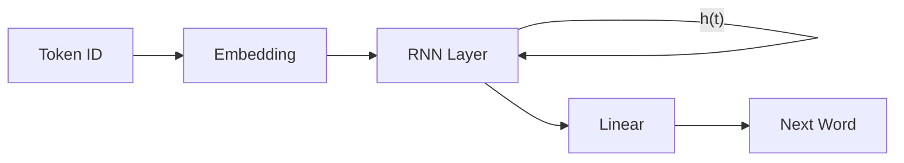

# NLP: Sequence Models & RNNs (The Memory)

## 📜 Story Mode: The Translator

> **Mission Date**: 2043.06.20
> **Location**: Deep Space Outpost "Vector Prime"
> **Officer**: Lead Engineer Kael
>
> **The Problem**: The alien says "The blue ship..." and then stops.
> To predict the next word, I need to remember "blue" and "ship".
> A standard Neural Net is amnesiac. It sees "ship" and forgets "blue".
>
> I need a machine with a **Hidden State**. A memory loop.
> As it reads the sentence, it updates its internal mood.
> Meaning comes not from the word, but from the *sequence*.
>
> *"Computer! clear_state(). Initialize $h_0$. For word in sentence: update $h_t$. Predict."*

---

## 1. Problem Setup & Motivation

### The 6 Engineering Questions
1.  **WHAT**:
    *   **RNN**: A network with a loop. Output depends on Input + Previous State.
    *   **Sequence**: Data where order matters (Time Series, Text, DNA).
2.  **WHY**: Standard networks assume inputs are independent. Text is not.
3.  **WHEN**: Translation, Speech Recognition, Stock Prediction.
4.  **WHERE**: `nn.RNN`, `nn.LSTM`, `nn.GRU`.
5.  **WHO**: Elman (1990), Hochreiter & Schmidhuber (LSTM, 1997).
6.  **HOW**: $h_t = \tanh(W_{hh} h_{t-1} + W_{xh} x_t)$.

> [!NOTE]
> **🛑 Pause & Explain (In Simple Words)**
>
> **The Telephone Game.**
>
> - **Regular Net**: Person A yells to Person B.
> - **RNN**: Person A whispers to B, B adds their own thought and whispers to C.
> - **Hidden State ($h_t$)**: The whisper being passed along.
> - **Long-Term Dependency**: If A said "The cat...", Person Z needs to know it's a "cat" to say "...ate."
> - **Gradient Problem**: By the time the whisper reaches Z, it's distorted (Vanishing Gradient).

---

## 2. Mathematical Problem Formulation

### The Recurrent Formula
$$ h_t = \sigma(W_h h_{t-1} + W_x x_t + b) $$
$$ y_t = W_y h_t $$
*   $x_t$: Input vector at time $t$.
*   $h_{t-1}$: Memory from time $t-1$.
*   $W_h$: Weight matrix determining how memory evolves.
*   **Backprop Through Time (BPTT)**: Unroll the loop and backpropagate gradients through previous time steps.

---

## 3. Step-by-Step Derivation

### Why LSTMs?
Standard RNNs effectively multiply $W$ by itself $T$ times.
If $W < 1$, gradient $\to 0$ (Vanishing).
If $W > 1$, gradient $\to \infty$ (Exploding).
**LSTM (Long Short-Term Memory)** adds a "Conveyor Belt" (Cell State) that lets information flow unmodified.

---

## 4. The Trifecta: Implementation Levels

We will implement a single **RNN Forward Step** at three levels of abstraction.
Task: Compute new state $h_t$ given input $x_t=1.0$ and old state $h_{t-1}=0.5$.

### Level 1: Pure Python (The Logic)
*No libraries. Just lists and floats.*

```python
import math

def rnn_step_pure_python(h_prev, x_t):
    # Weights (Scalars for simplicity)
    W_h = 0.9
    W_x = 1.0
    bias = 0.1
    
    # Linear combination
    activation = (W_h * h_prev) + (W_x * x_t) + bias
    
    # Tanh activation (Math.tanh)
    # Tanh squashes output between -1 and 1
    h_new = math.tanh(activation)
    
    return h_new

print(f"Pure Python New State: {rnn_step_pure_python(0.5, 1.0):.4f}")
```

### Level 2: NumPy (The Math)
*Vectorized Matrix Multiplication.*

```python
import numpy as np

def rnn_step_numpy(h_prev, x_t):
    # Weights (Matrices)
    # Hidden dim: 2, Input dim: 2
    W_h = np.array([[0.9, 0.1], [0.1, 0.9]])
    W_x = np.array([[1.0, 0.0], [0.0, 1.0]])
    bias = np.array([0.1, 0.1])
    
    # h_t = tanh(W_h @ h_{t-1} + W_x @ x_t + b)
    # @ operator is matrix multiplication
    term1 = np.dot(W_h, h_prev)
    term2 = np.dot(W_x, x_t)
    
    h_new = np.tanh(term1 + term2 + bias)
    return h_new

h_prev = np.array([0.5, 0.5])
x_t = np.array([1.0, 1.0])
print(f"NumPy New State: {rnn_step_numpy(h_prev, x_t)}")
```

### Level 3: Frameworks (The Production Power)
*PyTorch vs Keras.*

**PyTorch**:
```python
import torch
import torch.nn as nn

# Input: (Batch, SeqLen, InputDim)
rnn = nn.RNN(input_size=2, hidden_size=2, batch_first=True)

# Fake Input
x = torch.randn(1, 5, 2) # Batch 1, Sequence Length 5, Features 2
h0 = torch.zeros(1, 1, 2) # Initial Hidden State

output, hn = rnn(x, h0)
print(f"PyTorch Output Shape: {output.shape}") # [1, 5, 2]
```

**Keras**:
```python
import tensorflow as tf
from tensorflow.keras import layers

# Input: (Batch, SeqLen, InputDim)
inputs = layers.Input(shape=(5, 2))
# simpleRNN
x = layers.SimpleRNN(2, return_sequences=True)(inputs)

model = tf.keras.Model(inputs, x)
data = tf.random.normal((1, 5, 2))
print(f"Keras Output Shape: {model(data).shape}") # [1, 5, 2]
```

> [!TIP]
> **👁️ Visualizing the Output: Text Generation Probability**
> Run this script to see how the RNN assigns probabilities to the next character.
>
> ```python
> import matplotlib.pyplot as plt
> import numpy as np
>
> def plot_char_probabilities():
>     # 1. Vocabulary
>     vocab = ['h', 'e', 'l', 'o', 'w', 'r', 'd']
>     
>     # 2. Fake Probabilities for input "hell" -> predict "o"
>     # We want "o" to be high.
>     probs = [0.05, 0.05, 0.1, 0.7, 0.05, 0.02, 0.03]
>     
>     # 3. Plot
>     plt.figure(figsize=(8, 5))
>     bars = plt.bar(vocab, probs, color='skyblue', edgecolor='black')
>     
>     # Highlight the winner
>     bars[3].set_color('green') # 'o'
>     
>     plt.title("Next Character Probability Distribution\nInput: 'hell' -> Target: 'o'")
>     plt.xlabel("Vocabulary")
>     plt.ylabel("Probability (Softmax)")
>     plt.ylim(0, 1)
>     
>     # Add value labels
>     for bar, p in zip(bars, probs):
>         plt.text(bar.get_x() + bar.get_width()/2, p + 0.02, 
>                  f"{p:.2f}", ha='center', fontsize=10)
>         
>     plt.show()
>
> # Uncomment to run:
> # plot_char_probabilities()
> ```

---

## 5. Optimization & Convergence Intuition

### Sequence Padding
Batches must be rectangular.
Sentences are different lengths. ("Hi", "Hello World").
We pad "Hi" with zeros: "Hi [PAD]".
**Masking**: We must tell the RNN to **ignore** the pad tokens, otherwise it learns garbage.

---

## 6. System-Level Integration



**Where it lives**:
**Siri (Old Version)**: Used RNNs/LSTMs to process voice commands.
**Google Translate (2016)**: Used Sequence-to-Sequence LSTMs (GNMT).

---

## 7. Evaluation & Failure Analysis

### Failure Mode: Forgetting
In a long paragraph, Vanilla RNNs forget the first sentence.
**Fix**: Use LSTM/GRU. Or better yet... **Attention (Transformers)**.

---

## 8. Ethics, Safety & Risk Analysis

### Hallucination
Generative RNNs can just make stuff up.
If trained on "Reddit", it learns to be toxic.

---

## 9. Advanced Theory & Research Depth

### Bi-Directional RNNs
Read the sentence Left-to-Right `->` AND Right-to-Left `<-`.
Concatenate the states.
Allows understanding "Apple" based on valid context ("Apple... is a fruit" vs "Apple... Inc announced").

---

### 13. Assessment & Mastery Checks

**Q1: State Shape**
If batch=32, hidden=128. What is the shape of $h_t$?
*   *Answer*: $[32, 128]$.

**Q2: Bidirectional RNN**
How many parameters does a Bi-RNN have compared to a standard RNN?
*   *Answer*: 2x. One set of weights for forward, one for backward.

**Q3: Sequence-to-Sequence**
What is the "Bottleneck" in a Seq2Seq model?
*   *Answer*: The final hidden state of the Encoder. It must compress the *entire* input sentence meaning into a single vector. This is why Attention was invented (to bypass the bottleneck).

---

## 11. Further Reading & Tooling

*   **Blog**: Karpathy's "The Unreasonable Effectiveness of Recurrent Neural Networks".

---

## 12. Concept Graph Integration

*   **Previous**: [Embeddings](04_nlp/02_embeddings.md).
> *   **Next**: [Transformers & Attention](04_nlp/04_transformers_attention.md).
> 
> ### Concept Map
> ```mermaid
> graph TD
>     Sequence[Sequence] --> RNN
>     Sequence --> LSTM
>     Sequence --> GRU
>     
>     RNN -- "Hidden State" --> Memory[Memory Vector]
>     RNN -- "Step" --> NextState[h_t = tanh(Wx + Wh)]
>     
>     Issue[Vanishing Gradient] -- "Fix" --> LSTM
>     LSTM -- "Mechanism" --> Gates[Input, Forget, Output]
>     LSTM -- "Highway" --> CellState[Cell State C_t]
>     
>     Usage --> Seq2Seq[Seq2Seq (Translation)]
>     Usage --> TextGen[Text Gen (Next Char)]
>     
>     Seq2Seq -- "Bottleneck" --> ContextVec[Fixed Context Vector]
>     ContextVec -- "Solved by" --> Attention[Attention]
>     
>     style RNN fill:#f9f,stroke:#333
>     style LSTM fill:#bbf,stroke:#333
>     style Attention fill:#bfb,stroke:#333
> ```
```
