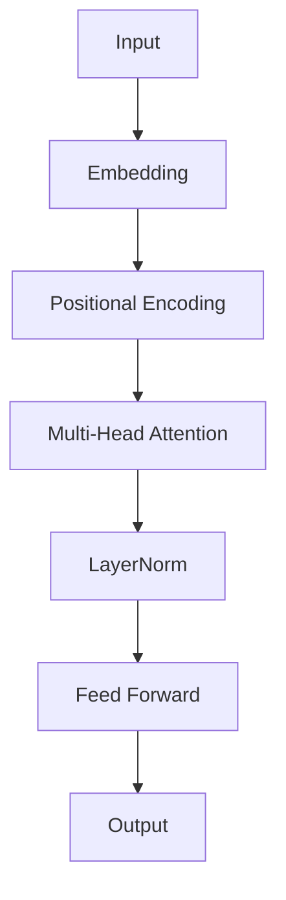

# NLP: Transformers & Attention (The Focus)

## 📜 Story Mode: The Cocktail Party

> **Mission Date**: 2043.07.01
> **Location**: Deep Space Outpost "Vector Prime"
> **Officer**: Lead Engineer Kael
>
> **The Problem**: The RNN is overwhelmed.
> When reading a 100-page manual, by page 100, it forgot page 1.
> It reads sequentially, word by word. It's too slow.
>
> I need a mechanism that can look at the *entire book at once*.
> It needs to "attend" to relevant parts instantly.
> When I say "The **bank** of the river", it should pay attention to "river" to know what "bank" means.
> When I say "The **bank** gave me a loan", it should pay attention to "loan".
>
> I need **Self-Attention**.
> Every word should ask every other word: "Are you relevant to me?"
>
> *"Computer! Stop the sequential loop. Parallelize everything. Calculate the Query-Key compatibility matrix."*

---

## 1. Problem Setup & Motivation

### The 6 Engineering Questions
1.  **WHAT**:
    *   **Attention**: a weighted average of values.
    *   **Transformer**: An architecture based *only* on Attention (no RNNs).
    *   **Q, K, V**: Query (What I look for), Key (What I announce I have), Value (What I actually give).
2.  **WHY**: RNNs cannot handle long sequences (Vanishing Gradient). Attention has $O(1)$ path length between any two words.
3.  **WHEN**: LLMs (ChatGPT), Translation, molecular folding.
4.  **WHERE**: `nn.MultiheadAttention` (PyTorch).
5.  **WHO**: Vaswani et al. (Google, 2017).
6.  **HOW**: $A(Q, K, V) = \text{softmax}(\frac{QK^T}{\sqrt{d_k}})V$.

> [!NOTE]
> **🛑 Pause & Explain (In Simple Words)**
>
> **The Filing Cabinet.**
>
> - **Query ($Q$)**: The sticky note you are holding: "Find Invoice #101".
> - **Key ($K$)**: The labels on the file folders: "Invoices 0-50", "Invoices 50-100", "Invoices 100-150".
> - **Score**: You compare your Note ($Q$) to the Labels ($K$). "100-150" is a high match.
> - **Value ($V$)**: The actual paper inside the folder.
> - **Attention**: You don't just grab one folder. You grab *a blend* of all folders, weighted by how well their label matches your note.

---

## 2. Mathematical Problem Formulation

### Scaled Dot-Product Attention
$$ \text{Attention}(Q, K, V) = \text{softmax}\left(\frac{Q K^T}{\sqrt{d_k}}\right) V $$
1.  **Dot Product** ($QK^T$): Similarity score. High dot product = Vectors align.
2.  **Scale** ($\sqrt{d_k}$): Prevents gradients from exploding when vectors are huge.
3.  **Softmax**: Converts scores to probabilities (Sum to 1).
4.  **Weighted Sum** ($V$): Mix the values based on probability.

---

## 3. The Trifecta: Implementation Levels

We will implement the heart of ChatGPT—**Self-Attention**—at three levels.
Scenario:
*   We have 3 words: "I", "Love", "AI".
*   Each is a vector of size 4.
*   We want to compute the context vector for the word "AI".

### Level 1: Pure Python (The Logic)
*Explicit loops. No Matrix Math.*

```python
import math

def softmax_python(x):
    # Simple softmax for a list
    exp_x = [math.exp(i) for i in x]
    sum_exp_x = sum(exp_x)
    return [i / sum_exp_x for i in exp_x]

def attention_pure_python(query, keys, values):
    # query: list of floats (size D)
    # keys: list of lists (N x D)
    # values: list of lists (N x D)
    
    d_k = len(query)
    scores = []
    
    # 1. Calculate Scores (Dot Product)
    for key in keys:
        dot_product = sum(q * k for q, k in zip(query, key))
        scores.append(dot_product / math.sqrt(d_k))
    
    # 2. Softmax
    weights = softmax_python(scores)
    
    # 3. Weighted Sum
    # Initialize output vector [0, 0, 0, 0]
    output = [0.0] * d_k
    for i in range(len(values)): # For each word
        w = weights[i]
        v = values[i]
        for j in range(d_k): # For each dimension
            output[j] += w * v[j]
            
    return output

# Data
q = [1.0, 0.0, 1.0, 0.0]
k_list = [[1.0, 0.0, 1.0, 0.0], [0.0, 1.0, 0.0, 1.0]]
v_list = [[10.0, 10.0, 10.0, 10.0], [20.0, 20.0, 20.0, 20.0]]

print("Pure Python:", attention_pure_python(q, k_list, v_list))
# Should be close to [10, 10, 10, 10] because Q matches K[0] perfectly.
```

### Level 2: NumPy (The Math)
*Matrix Multiplication.*

```python
import numpy as np

def attention_numpy(Q, K, V):
    # Q: (1, D)
    # K: (N, D)
    # V: (N, D)
    d_k = Q.shape[1]
    
    # 1. Scores: (1, D) @ (D, N) -> (1, N)
    scores = np.matmul(Q, K.T) / np.sqrt(d_k)
    
    # 2. Softmax
    exp_scores = np.exp(scores)
    weights = exp_scores / np.sum(exp_scores, axis=1, keepdims=True)
    
    # 3. Weighted Sum: (1, N) @ (N, D) -> (1, D)
    output = np.matmul(weights, V)
    return output

Q_np = np.array([[1.0, 0.0, 1.0, 0.0]])
K_np = np.array([[1.0, 0.0, 1.0, 0.0], [0.0, 1.0, 0.0, 1.0]])
V_np = np.array([[10.0, 10.0, 10.0, 10.0], [20.0, 20.0, 20.0, 20.0]])

print("NumPy:", attention_numpy(Q_np, K_np, V_np))
```

### Level 3: Frameworks (The Production Power)
*Multi-Head Attention.*

**PyTorch**:
```python
import torch
import torch.nn as nn

# D_model = 4, Heads = 1
mha = nn.MultiheadAttention(embed_dim=4, num_heads=1, batch_first=True)

# Input: (Batch, SeqLen, Dim)
query = torch.tensor([[[1.0, 0.0, 1.0, 0.0]]])
key = torch.tensor([[[1.0, 0.0, 1.0, 0.0], [0.0, 1.0, 0.0, 1.0]]])
value = key # Usually V=K

# Attention!
# Need to set weights to identity manually to check exact math, 
# but here we just show API usage.
output, weights = mha(query, key, value)
print("PyTorch Output Shape:", output.shape)
```

**Keras**:
```python
import tensorflow as tf
from tensorflow.keras import layers

# Input
query_input = layers.Input(shape=(1, 4))
value_input = layers.Input(shape=(2, 4))

# Layer
# key_dim is per head
attn_layer = layers.MultiHeadAttention(num_heads=1, key_dim=4)
output = attn_layer(query_input, value_input) # K is assumed V if not passed

print("Keras Output Shape:", output.shape)
```

> [!TIP]
> **👁️ Visualizing the Mechanism: The Self-Attention Matrix**
> Run this script to see how words "vote" for each other.
>
> ```python
> import numpy as np
> import matplotlib.pyplot as plt
> import seaborn as sns
>
> def plot_self_attention():
>     # 1. Input Sentence
>     tokens = ["I", "love", "neural", "networks"]
>     
>     # 2. Simulate "Query-Key" similarity scores (Pre-Softmax)
>     # If Q matches K, score is high.
>     # "neural" should attend to "networks" (and vice versa)
>     scores = np.array([
>         [10, 2,  1,  1],  # I (looks at I)
>         [2, 10,  1,  1],  # love (looks at love)
>         [1,  1, 10,  8],  # neural (looks at networks)
>         [1,  1,  8, 10]   # networks (looks at neural)
>     ])
>     
>     # 3. Apply Softmax (Row-wise)
>     exp_scores = np.exp(scores)
>     attention_weights = exp_scores / np.sum(exp_scores, axis=1, keepdims=True)
>     
>     # 4. Plot
>     plt.figure(figsize=(8, 6))
>     sns.heatmap(attention_weights, xticklabels=tokens, yticklabels=tokens, 
>                 cmap="Reds", annot=True, fmt=".2f", cbar=True)
>                 
>     plt.title("Self-Attention Weights\n(Rows=Query, Cols=Key)")
>     plt.xlabel("Key (Information Source)")
>     plt.ylabel("Query (Focus)")
>     plt.show()
>
> # Uncomment to run:
> # plot_self_attention()
> ```

---

## 4. System-Level Integration



**Where it lives**:
**ChatGPT**: A stack of 96 of these layers (GPT-3).
**Google Search**: BERT uses this to understand queries bidirectionally.

---

## 5. Evaluation & Failure Analysis

### Failure Mode: Quadratic Complexity ($O(N^2)$)
The `scores` matrix is size $N \times N$.
If Sequence Length $N=100,000$ (a book), $N^2 = 10,000,000,000$.
Memory OOM.
**Fix**: Flash Attention (Optimization), or Linear Attention mechanics.

---

## 6. Advanced Theory & Research Depth

### Multi-Head Attention
Why 1 head? Why not 8?
One head focuses on "Grammar" (Subject-Verb).
Another head focuses on "Context" (Pronoun-Name).
Multi-Head = Multiple independent perspectives.
$$ \text{Concat}(\text{head}_1, \dots, \text{head}_h) W^O $$

---

### 13. Assessment & Mastery Checks

**Q1: Masking**
Why do we mask future tokens in GPT but not BERT?
*   *Answer*: GPT is generative (Decoder). You can't cheat and see the future word you are trying to predict. BERT is understanding the *whole* sentence (Encoder), so it needs to see everything.

**Q2: Positional Encoding**
Can a Transformer learn order without Positional Encodings?
*   *Answer*: No. The self-attention mechanism is permutation invariant. "Dog bites man" and "Man bites dog" look identical to the math without added position signals.

**Q3: Attention Complexity**
What is the time complexity of Self-Attention for a sequence of length $N$?
*   *Answer*: $O(N^2)$. Each word attends to every other word. This is why Transformers struggle with very long documents (e.g., typically limited to 4k tokens).

---

## 8. Concept Graph Integration

*   **Previous**: [Sequence Models](04_nlp/03_rnn_nlp.md).
*   **Next**: [BERT & GPT Architectures](04_nlp/05_transformers_architectures.md).
> 
> ### Concept Map
> ```mermaid
> graph TD
>     Attention[Attention Mechanism] --> Types
>     Types --> SelfAttn[Self-Attention]
>     Types --> CrossAttn[Cross-Attention]
>     Types --> CausalAttn[Masked/Causal Attention]
>     
>     SelfAttn -- "Uses" --> Q[Query]
>     SelfAttn -- "Uses" --> K[Key]
>     SelfAttn -- "Uses" --> V[Value]
>     
>     Formula[Softmax(QK^T / sqrt(d)) V] -- "Computes" --> WeightedSum
>     
>     MultiHead[Multi-Head Attention] -- "Parallelizes" --> SelfAttn
>     MultiHead -- "Learns" --> DiverseFeatures[Diverse Relationships]
>     
>     Usage --> Transformer
>     Usage --> BERT
>     Usage --> GPT
>     
>     style Attention fill:#f9f,stroke:#333
>     style SelfAttn fill:#bbf,stroke:#333
>     style MultiHead fill:#bfb,stroke:#333
> ```
