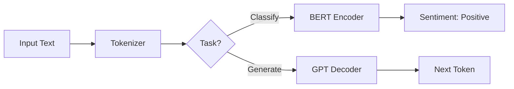

# NLP: BERT vs GPT (The Two Towers)

## 📜 Story Mode: The Historian & The Prophet

> **Mission Date**: 2043.07.15
> **Location**: Deep Space Outpost "Vector Prime"
> **Officer**: Lead Engineer Kael
>
> **The Problem**: We have two different tasks.
> 1.  **Analyze** the alien library (Understand context, find answers).
> 2.  **Talk** to the aliens (Generate replies).
>
> I tried to use one model for both. It failed.
> A model trained to *talk* (predict the next word) is bad at *understanding* the whole book at once.
> A model trained to *read* is bad at writing.
>
> I need two specialists.
> **The Historian (BERT)**: Reads the whole scroll. Can look forward and backward in time. Knows that "Bank" means "River" because it saw "River" 5 words later.
> **The Prophet (GPT)**: Lives in the moment. Can only see the past. Guesses the future.
>
> *"Computer! Deploy the Encoder Tower for analysis. Deploy the Decoder Tower for generation."*

---

## 1. Problem Setup & Motivation

### The 6 Engineering Questions
1.  **WHAT**:
    *   **BERT (Encoder)**: Bidirectional Encoder Representations from Transformers. Masked Language Model (MLM).
    *   **GPT (Decoder)**: Generative Pre-trained Transformer. Causal Language Model (CLM).
2.  **WHY**:
    *   BERT is SOTA for Classification/QA.
    *   GPT is SOTA for Generation.
3.  **WHEN**:
    *   Use BERT to extract entities or classify sentiment.
    *   Use GPT to write emails or code.
4.  **WHERE**: `transformers.BertModel`, `transformers.GPT2Model`.
5.  **WHO**: Google (BERT, 2018), OpenAI (GPT-1, 2018).
6.  **HOW**: BERT masks 15% of words (`[MASK]`). GPT hides the future.

> [!NOTE]
> **🛑 Pause & Explain (In Simple Words)**
>
> **Fill in the Blank.**
>
> - **BERT (The Crossword Puzzle)**:
>   - "The [MASK] sat on the mat."
>   - BERT looks at "The" AND "mat". It guesses "cat" using both clues.
>
> - **GPT (The Autocomplete)**:
>   - "The cat sat on the..."
>   - GPT only sees what happened. It guesses "mat". It doesn't know the sentence ends there yet.

---

## 2. Mathematical Problem Formulation

### Masking Logic
*   **Encoders (BERT)**: No masking (Full Attention). $A_{ij} = \text{Score}(i, j)$.
*   **Decoders (GPT)**: Causal Mask (Upper Triangular is $-\infty$). $A_{ij} = -\infty$ if $j > i$.

---

## 3. The Trifecta: Implementation Levels

We will implement **Causal Masking** (The GPT mechanism) at three levels.
Task: Create a 3x3 mask where a word cannot attend to future words.

### Level 1: Pure Python (The Logic)
*Nested Loops.*

```python
def causal_mask_python(size):
    # Initialize with 0.0 (Allowed)
    # We want to forbid positions where col > row
    mask = []
    for i in range(size):
        row = []
        for j in range(size):
            if j > i:
                row.append(float('-inf')) # Block future
            else:
                row.append(0.0) # Allow past
        mask.append(row)
    return mask

print("Pure Python Mask (3x3):")
for r in causal_mask_python(3): print(r)
```

### Level 2: NumPy (The Math)
*Triangular Matrices.*

```python
import numpy as np

def causal_mask_numpy(size):
    # Create ones
    ones = np.ones((size, size))
    # Keep lower triangle (tri-lower = tril)
    # k=0 means main diagonal included
    lower_tri = np.tril(ones, k=0)
    
    # Where 0, replace with -inf
    # Where 1, replace with 0
    mask = np.where(lower_tri == 1, 0.0, -np.inf)
    return mask

print("NumPy Mask:\n", causal_mask_numpy(3))
```

### Level 3: Frameworks (The Production Power)
*Automatic in `torch.nn.Transformer`.*

**PyTorch**:
```python
import torch

# PyTorch has a helper for this
mask = torch.nn.Transformer.generate_square_subsequent_mask(3)
print("PyTorch Mask:\n", mask)
```

**Keras**:
```python
import tensorflow as tf

def call_gpt_layer(inputs):
    # Keras MultiHeadAttention has 'use_causal_mask=True'
    layer = tf.keras.layers.MultiHeadAttention(num_heads=1, key_dim=2)
    # The mask is applied internally!
    output = layer(inputs, inputs, use_causal_mask=True)
    return output

print("Keras handles it internally via the argument.")
```

> [!TIP]
> **👁️ Visualizing the Constraint: The Causal Mask**
> Run this script to see the difference between what BERT sees and what GPT sees.
>
> ```python
> import numpy as np
> import matplotlib.pyplot as plt
> import seaborn as sns
>
> def plot_masks_demo():
>     size = 10
>     
>     # 1. BERT Mask (Unmasked / Full Attention)
>     # Everyone sees everyone. (Imagine we handle the [MASK] token separately)
>     bert_mask = np.ones((size, size))
>     
>     # 2. GPT Mask (Causal / Look-Ahead Mask)
>     # Lower triangular only.
>     gpt_mask = np.tril(np.ones((size, size)))
>     
>     # 3. Plot
>     fig, axes = plt.subplots(1, 2, figsize=(12, 5))
>     
>     sns.heatmap(bert_mask, ax=axes[0], cmap="Greens", cbar=False, linewidths=0.5, linecolor='gray')
>     axes[0].set_title("BERT (Encoder) Attention\nFull Visibility (Bidirectional)")
>     axes[0].set_ylabel("Query Position")
>     axes[0].set_xlabel("Key Position")
>     
>     sns.heatmap(gpt_mask, ax=axes[1], cmap="Blues", cbar=False, linewidths=0.5, linecolor='gray')
>     axes[1].set_title("GPT (Decoder) Attention\nCausal Mask (No Peeking Forward)")
>     axes[1].set_ylabel("Query Position")
>     axes[1].set_xlabel("Key Position")
>     
>     plt.tight_layout()
>     plt.show()
>
> # Uncomment to run:
> # plot_masks_demo()
> ```

---

## 4. System-Level Integration



**Where it lives**:
**HuggingFace Transformers Library**: The industry standard.
`AutoModelForMaskedLM` (BERT), `AutoModelForCausalLM` (GPT).

---

## 5. Evaluation & Failure Analysis

### Failure Mode: Hallucination (GPT)
GPT is a "Stochastic Parrot". It predicts the *likely* next word, not the *true* one.
BERT is grounded in the full text, so it's less prone to hallucination for extraction tasks.

---

## 6. Advanced Theory & Research Depth

### T5 (Text-to-Text Transfer Transformer)
Why choose? Use Both.
T5 has an Encoder (read prompt) AND a Decoder (generate answer).
Input: "translate English to German: Hello" -> Output: "Hallo".

---

### 13. Assessment & Mastery Checks

**Q1: Bi-directionality**
Why can't GPT be bi-directional?
*   *Answer*: If GPT could see the future word (word $N+1$) while training to predict word $N+1$, the loss would be 0. It would just copy the answer. It learns nothing.

**Q2: Fine-Tuning**
What is the difference between Pre-Training and Fine-Tuning?
*   *Answer*: **Pre-Training** is expensive, unsupervised learning on massive data (Learn English). **Fine-Tuning** is cheap, supervised learning on specific data (Learn to categorize Legal Documents).

**Q3: Token Limit**
Why does BERT have a 512 token limit?
*   *Answer*: Due to the $O(N^2)$ memory cost of self-attention. Increasing 512 to 1024 increases memory usage by 4x. Longformer/BigBird solve this using sparse attention.

---

## 8. Further Reading & Tooling

*   **Paper**: "BERT: Pre-training of Deep Bidirectional Transformers for Language Understanding".
*   **Lib**: **HuggingFace** `transformers`.

---

## 9. Concept Graph Integration

*   **Previous**: [Attention](04_nlp/04_transformers_attention.md).
*   **Next**: [ NLP Project](03_neural_networks/03_project/README.md).

### Concept Map
```mermaid
graph TD
    Architecture --> Encoder[Encoder (BERT)]
    Architecture --> Decoder[Decoder (GPT)]
    Architecture --> EncDec[Encoder-Decoder (T5)]
    
    Encoder -- "Feature" --> Bidirectional[Bidirectional]
    Encoder -- "Task" --> Understanding[Classification/QA]
    Encoder -- "Training" --> MLM[Masked LM]
    
    Decoder -- "Feature" --> Unidirectional[Causal / Left-to-Right]
    Decoder -- "Task" --> Generation[Text Gen]
    Decoder -- "Training" --> CLM[Causal LM]
    
    EncDec -- "Task" --> Seq2Seq[Translation/Summ]
    
    MLM -- "Method" --> RandMask[Mask 15% random tokens]
    CLM -- "Method" --> NextToken[Predict N+1]
    
    style Encoder fill:#f9f,stroke:#333
    style Decoder fill:#bbf,stroke:#333
    style EncDec fill:#bfb,stroke:#333
```
